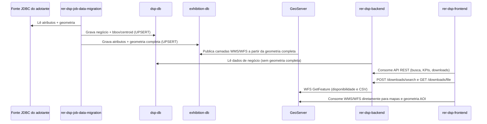

# Fluxo de dados

## Como ocorre o fluxo de dados entre os componentes?

## Explicação passo a passo

1. **Job lê a fonte JDBC do adotante.** O `rer-dsp-job-data-migration` conecta-se ao banco de origem da organização (datasource `source`) e lê atributos e geometrias das tabelas configuradas.
2. **Dual-write nos dois destinos.** Cada execução grava simultaneamente em:
   - `dsp-db` (datasource `target`): dados de negócio, `boundary_box` e `centroid_coordinates` — **sem** a geometria completa.
   - `exhibition-db` (datasource `geo-target`): os mesmos atributos, mas **com** a geometria completa.
3. **GeoServer publica a partir do exhibition-db.** As camadas WMS/WFS expostas pelo GeoServer são geradas exclusivamente a partir de `exhibition-db` — o banco operacional (`dsp-db`) nunca é consultado pelo GeoServer.
4. **Backend serve a API a partir do dsp-db.** O `rer-dsp-backend` lê apenas `dsp-db` para dados de negócio; como esse banco não tem geometria completa, a API nunca expõe polígonos inteiros — apenas bounding box e centroide, além dos atributos operacionais.
5. **Downloads passam pelo backend com proxy WFS.** A tela de Downloads consome `POST /downloads/search` e `GET /downloads/file`. O backend valida o território no `dsp-db`, consulta o GeoServer via WFS (`GetFeature` com filtro CQL territorial) e devolve disponibilidade ou o arquivo CSV ao frontend. O browser **não** baixa arquivos diretamente do GeoServer.
6. **Mapas continuam com consumo direto do GeoServer.** O `rer-dsp-frontend` ainda consome WMS/WFS diretamente para desenhar camadas e carregar geometria de AOI no mapa — integração separada dos downloads de arquivo.

Essa separação é intencional: a API de negócio não transporta geometrias pesadas; a geometria completa fica isolada no GeoServer; downloads reutilizam as mesmas camadas publicadas, com filtro territorial aplicado no backend.

Contrato completo de colunas por banco: [Bancos de dados](databases.md). Dependências detalhadas entre módulos: [Dependências entre módulos](dependencies.md).
