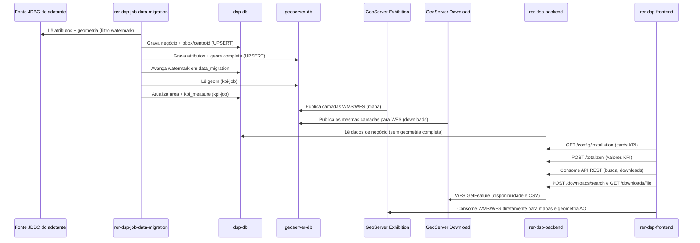

# Fluxo de dados

## Como ocorre o fluxo de dados entre os componentes?

## Explicação passo a passo

1. **Job lê a fonte JDBC do adotante.** O `rer-dsp-job-data-migration` conecta-se ao banco de origem (datasource `source`) e lê atributos e geometrias no recorte do **watermark** (`creation-date-column` + `updated-at-column` opcional) e do `where-clause`.
2. **Dual-write nos dois destinos.** Cada execução com delta grava simultaneamente em:
   - `dsp-db` (datasource `target`): dados de negócio, `boundary_box` e `centroid_coordinates` — **sem** a geometria completa.
   - `geoserver-db` (datasource `geo-target`): os mesmos atributos, mas **com** `geom` completa.
   O watermark só avança em `data_migration.BATCH_JOB_EXECUTION_SYNC_STATE` se o job terminar `COMPLETED`.
3. **Dois GeoServers leem o geoserver-db.** Ambos publicam FeatureTypes a partir do mesmo `dsp-geoserver-db` e do mesmo `mapLayersConfig.json`:
   - **GeoServer Exhibition** — WMS/WFS para navegação no mapa.
   - **GeoServer Download** — WFS usado só pelo backend nas exportações (CSV).
4. **KPI job pós-migração.** O `kpiCalculationJob` lê geometrias no `geoserver-db`, calcula a área de cada AOI (`ST_Area`) e grava em `dsp.area_of_interest.area` no `dsp-db`. Para cada tema configurado, soma áreas por camada e grava em `dsp.kpi_measure` (`area_of_interest_id`, `value`, `kpi_name`). Roda após AOI e camadas (`@Order(3)`).
5. **Backend serve a API a partir do dsp-db.** O `rer-dsp-backend` lê apenas `dsp-db` para dados de negócio; como esse banco não tem geometria completa, a API nunca expõe polígonos inteiros — apenas bounding box e centroide, além dos atributos operacionais. Os cards da Home usam `TotalizerService`: contagem/soma de `area` na AOI e somas em `kpi_measure` por `kpi_name`, conforme `installation-config.json`.
6. **Downloads passam pelo backend.** A tela consome `POST /downloads/search` e `GET /downloads/file`. O backend valida o território no `dsp-db`. Se o object storage estiver ligado e o CSV pré-gerado existir, devolve esses bytes; senão consulta o GeoServer Download via WFS (`DSP_GEOSERVER_WFS_BASE_URL`). O browser **não** baixa arquivos diretamente do GeoServer nem do bucket.
7. **Mapas continuam com consumo direto do GeoServer Exhibition.** O `rer-dsp-frontend` consome WMS/WFS do Exhibition para desenhar camadas e carregar geometria de AOI — integração separada dos downloads de arquivo.

Essa separação isola a carga de exportação (Tomcat/JVM/conexões do GeoServer Download) da navegação no mapa (Exhibition), mantendo a geometria completa em um único PostGIS.

Contrato completo de colunas por banco: [Bancos de dados](databases.md). Dependências detalhadas entre módulos: [Dependências entre módulos](dependencies.md).
