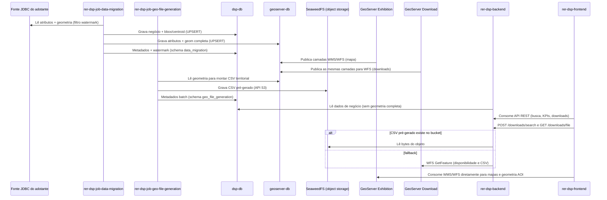

# Fluxo de dados

## Como ocorre o fluxo de dados entre os componentes?

## Explicação passo a passo

1. **Job lê a fonte JDBC do adotante.** O `rer-dsp-job-data-migration` conecta-se ao banco de origem (datasource `source`) e lê atributos e geometrias no recorte do **watermark** (`creation-date-column` + `updated-at-column` opcional) e do `where-clause`.
2. **Dual-write nos dois destinos.** Cada execução com delta grava simultaneamente em:
   - `dsp-db` (datasource `target`): dados de negócio, `boundary_box` e `centroid_coordinates` — **sem** a geometria completa.
   - `geoserver-db` (datasource `geo-target`): os mesmos atributos, mas **com** `geom` completa.
   O watermark só avança em `data_migration.BATCH_JOB_EXECUTION_SYNC_STATE` se o job terminar `COMPLETED`.
3. **Dois GeoServers leem o geoserver-db.** Ambos publicam FeatureTypes a partir do mesmo `dsp-geoserver-db` e do mesmo `mapLayersConfig.json`:
   - **GeoServer Exhibition** — WMS/WFS para navegação no mapa.
   - **GeoServer Download** — WFS usado pelo backend nas exportações quando não há CSV pré-gerado.
4. **Job geo-file e SeaweedFS (adotante real).** O `rer-dsp-job-geo-file-generation` roda em agenda (setup) quando o profile `object-storage` está ativo. Ele **não** lê o watermark diretamente: quem usa o watermark é o job de migração. A cada execução **concluída com sucesso**, a migração compara o que mudou desde o watermark anterior (mesma janela temporal do delta) e liga a flag `requires_s3_file_regeneration` nos territórios de nível 2 e 3 afetados no `dsp-db` — inclusive pais de municípios quando áreas de interesse mudaram. Na primeira carga (sem watermark gravado), todos os territórios relevantes entram como pendentes. O geo-file, na rodada seguinte, lista só territórios com essa flag, lê as feições no `geoserver-db`, gera os CSV por tema/formato configurados e publica no **SeaweedFS** (`dsp-object-storage`, API S3); ao terminar cada território, desliga a flag e grava `last_generated_s3_file_at`. Metadados Spring Batch do geo-file ficam no schema `geo_file_generation` do `dsp-db` (isolados do `data_migration`). Se a migração falhar, as flags **não** são alteradas — evita publicar download com base incompleta. Na demo local sem JDBC, object storage e geo-file costumam ficar desligados; os passos abaixo que citam S3 não se aplicam.
5. **Backend serve a API a partir do dsp-db.** O `rer-dsp-backend` lê apenas `dsp-db` para dados de negócio; como esse banco não tem geometria completa, a API não expõe polígonos inteiros — apenas bounding box e centroide, além dos atributos operacionais. Interações de clique/seleção que usam essas representações leves podem ser um pouco menos precisas que o desenho no mapa (trade-off de performance; ver [Arquitetura — Fluxo de dados](overview.md#fluxo-de-dados)).
6. **Downloads passam pelo backend.** A tela consome `POST /downloads/search` e `GET /downloads/file`. O backend valida o território no `dsp-db`. Se o CSV pré-gerado existir no SeaweedFS, devolve esses bytes; senão consulta o GeoServer Download via WFS (URL interna na rede Docker). O browser **não** baixa arquivos diretamente do GeoServer nem do bucket.
7. **Mapas continuam com consumo direto do GeoServer Exhibition.** O `rer-dsp-frontend` consome WMS/WFS do Exhibition para desenhar camadas e carregar geometria de AOI — integração separada dos downloads de arquivo.

Com object storage, a exportação pesada sai do caminho crítico do GeoServer Download na maior parte dos casos; o WFS do Download permanece como fallback. A geometria completa continua em um único PostGIS (`geoserver-db`).

Contrato completo de colunas por banco: [Bancos de dados](databases.md).
