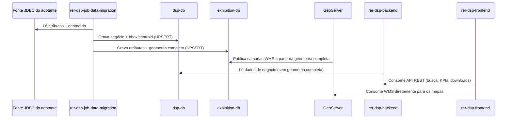

# Fluxo de dados

## Como ocorre o fluxo de dados entre os componentes?

## Explicação passo a passo

1. **Job lê a fonte JDBC do adotante.** O `rer-dsp-job-data-migration` conecta-se ao banco de origem da organização (datasource `source`) e lê atributos e geometrias das tabelas configuradas.
2. **Dual-write nos dois destinos.** Cada execução grava simultaneamente em:
   - `dsp-db` (datasource `target`): dados de negócio, `boundary_box` e `centroid_coordinates` — **sem** a geometria completa.
   - `exhibition-db` (datasource `geo-target`): os mesmos atributos, mas **com** a geometria completa.
3. **GeoServer publica a partir do exhibition-db.** As camadas WMS/WFS expostas pelo GeoServer são geradas exclusivamente a partir de `exhibition-db` — o banco operacional (`dsp-db`) nunca é consultado pelo GeoServer.
4. **Backend serve a API a partir do dsp-db.** O `rer-dsp-backend` lê apenas `dsp-db`; como esse banco não tem geometria completa, a API nunca expõe polígonos inteiros — apenas bounding box e centroide, além dos dados de negócio.
5. **Frontend consome as duas pontas.** O `rer-dsp-frontend` faz requisições REST ao backend (busca por hierarquia territorial, KPIs, downloads) e, separadamente, consome o WMS do GeoServer diretamente para desenhar os mapas — essas duas integrações são independentes uma da outra.

Essa separação é intencional: garante que a API de negócio nunca precise transportar geometrias pesadas, e que a exposição de geometria completa fique isolada na camada de publicação de mapas.

Contrato completo de colunas por banco: [Bancos de dados](databases.md). Dependências detalhadas entre módulos: [Dependências entre módulos](dependencies.md).
