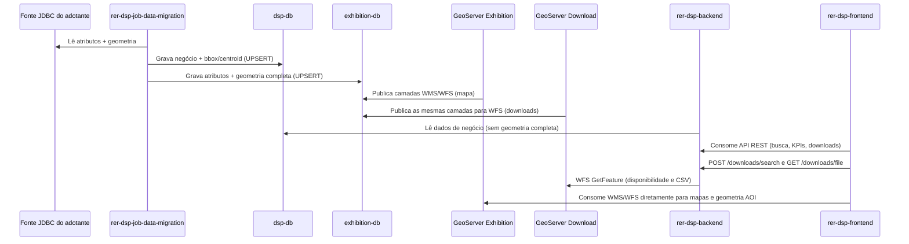

# Fluxo de dados

## Como ocorre o fluxo de dados entre os componentes?

## Explicação passo a passo

1. **Job lê a fonte JDBC do adotante.** O `rer-dsp-job-data-migration` conecta-se ao banco de origem da organização (datasource `source`) e lê atributos e geometrias das tabelas configuradas.
2. **Dual-write nos dois destinos.** Cada execução grava simultaneamente em:
   - `dsp-db` (datasource `target`): dados de negócio, `boundary_box` e `centroid_coordinates` — **sem** a geometria completa.
   - `exhibition-db` (datasource `geo-target`): os mesmos atributos, mas **com** a geometria completa.
3. **Dois GeoServers leem o exhibition-db.** Ambos publicam FeatureTypes a partir do mesmo `dsp-geoserver-exhibition-db` e do mesmo `mapLayersConfig.json`:
   - **GeoServer Exhibition** — WMS/WFS para navegação no mapa.
   - **GeoServer Download** — WFS usado só pelo backend nas exportações (CSV).
4. **Backend serve a API a partir do dsp-db.** O `rer-dsp-backend` lê apenas `dsp-db` para dados de negócio; como esse banco não tem geometria completa, a API nunca expõe polígonos inteiros — apenas bounding box e centroide, além dos atributos operacionais.
5. **Downloads passam pelo backend com proxy WFS no GeoServer Download.** A tela de Downloads consome `POST /downloads/search` e `GET /downloads/file`. O backend valida o território no `dsp-db`, consulta o GeoServer Download via WFS (`DSP_GEOSERVER_WFS_BASE_URL`) e devolve disponibilidade ou o arquivo CSV. O browser **não** baixa arquivos diretamente do GeoServer.
6. **Mapas continuam com consumo direto do GeoServer Exhibition.** O `rer-dsp-frontend` consome WMS/WFS do Exhibition para desenhar camadas e carregar geometria de AOI — integração separada dos downloads de arquivo.

Essa separação isola a carga de exportação (Tomcat/JVM/conexões do GeoServer Download) da navegação no mapa (Exhibition), mantendo a geometria completa em um único PostGIS.

Contrato completo de colunas por banco: [Bancos de dados](databases.md). Dependências detalhadas entre módulos: [Dependências entre módulos](dependencies.md).
