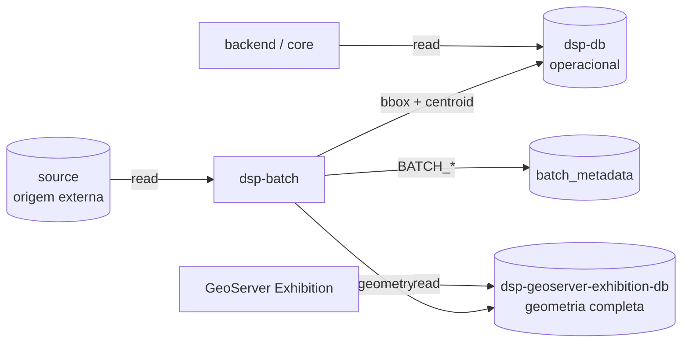
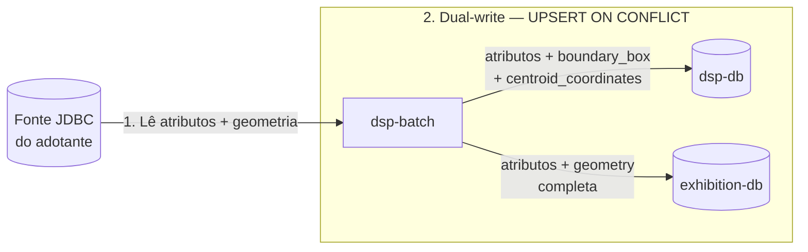

# Bancos de dados — contrato de papéis

Contrato dos **quatro papéis** de datasource no fluxo de migração e consumo do DSP, após a separação geo.

## Sumário

- [Visão geral](#visao-geral)
- [Os quatro papéis](#os-quatro-papeis)
- [Colunas geo por banco](#colunas-geo-por-banco)
- [Quem lê e quem escreve](#quem-le-e-quem-escreve)
- [Dual-write do job](#dual-write-do-job)
- [SRID via YAML](#srid-via-yaml)
- [Prefixos de configuração](#prefixos-de-configuracao)

---

## Visão geral

A geometria completa fica isolada no banco de **exibição** (GeoServer Exhibition). O banco **operacional** (`dsp-db`) guarda atributos de negócio e representações leves (`boundary_box`, `centroid_coordinates`) para consultas da API — sem polígonos completos.

---

## Os quatro papéis

| Papel | Serviço / prefixo | Conteúdo |
|-------|-------------------|----------|
| **source** | Fora do Compose (`spring.datasource.source`) | Banco da organização — fonte da migração |
| **dsp-db** | `dsp-db` · `spring.datasource.target` | Dados de negócio + `boundary_box` + `centroid_coordinates` — **sem** coluna de geometria completa |
| **exhibition-db** | `dsp-geoserver-exhibition-db` · `spring.datasource.geo-target` | Mesmas tabelas `dsp.*` **com** coluna `geometry` completa |
| **batch** | `dsp-job-migration-db` · `spring.datasource.batch` | Metadados Spring Batch (`BATCH_*`) |

Ambos os bancos de destino (`dsp-db` e `exhibition-db`) expõem o schema `dsp` com as mesmas tabelas lógicas (`territory_level_1`, `territory_level_2`, `territory_level_3`, `area_of_interest`), mas com colunas geo distintas conforme a seção abaixo.

---

## Colunas geo por banco

| Coluna | Tipo PostGIS | dsp-db | exhibition-db |
|--------|--------------|--------|---------------|
| Atributos de negócio (`id`, `name`, FKs, datas, etc.) | — | sim | sim |
| `geometry` | `geometry(MultiPolygon)` (sem typmod de SRID no DDL) | **não** | **sim** |
| `boundary_box` | `geometry(Polygon)` | **sim** | **não** |
| `centroid_coordinates` | `geometry(Point)` | **sim** | **não** |

O writer do job deriva `boundary_box` e `centroid_coordinates` a partir da geometria lida na origem e grava só em `dsp-db`. O `exhibition-db` recebe a geometria completa.

---

## Quem lê e quem escreve

| Componente | source | dsp-db | exhibition-db | batch |
|------------|--------|--------|---------------|-------|
| `rer-dsp-job-data-migration` | leitura | escrita (bbox/centroid) | escrita (geometry) | escrita (`BATCH_*`) |
| `rer-dsp-backend` / `rer-dsp-core` | — | leitura/escrita de negócio | — | — |
| GeoServer Exhibition | — | — | leitura | — |
| GeoServer Download | — | conforme instalação | — | — |

O GeoServer Exhibition aponta **somente** para `dsp-geoserver-exhibition-db`.

---

## Dual-write do job

Cada execução do job faz **1 source → 2 targets**:

1. Lê origem (atributos + geometria).
2. Grava em `dsp-db`: atributos + `boundary_box` + `centroid_coordinates`.
3. Grava em `exhibition-db`: atributos + `geometry` completa.

---

## SRID via YAML

O SRID **não** é fixado em código nem no DDL (sem `geometry(MultiPolygon, 4674)`).

| Onde | Como |
|------|------|
| DDL | `geometry` sem typmod de SRID |
| Job | Cada bloco de job informa `srid` no YAML (ex.: `4674`, `4326`) |
| Escrita | O writer aplica o SRID informado ao persistir (`ST_SetSRID`, `ST_GeomFromGeoJSON`, etc.) |
| Validação | Conferir `ST_SRID(...)` contra o `srid` do YAML correspondente |

Instalações distintas podem usar SRIDs diferentes por "layer", desde que o YAML e a origem estejam alinhados.

---

## Prefixos de configuração

| Papel | Prefixo Spring | Exemplo Compose (core) |
|-------|----------------|------------------------|
| source | `spring.datasource.source` | — (externo) |
| dsp-db (target) | `spring.datasource.target` | `dsp-db` |
| exhibition-db (geo-target) | `spring.datasource.geo-target` | `dsp-geoserver-exhibition-db` |
| batch | `spring.datasource.batch` | `dsp-job-migration-db` |

Detalhe operacional: [Job data-migration — Configuração e execução](../modules/job-data-migration/configuration.md) · validação: [Validação pós-migração](../modules/job-data-migration/validation.md) · orquestração dos bancos: [rer-dsp-core](../modules/core.md).
