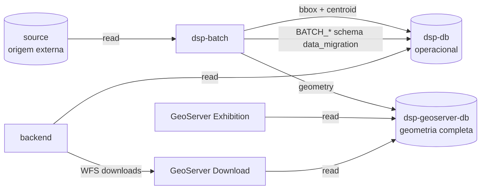
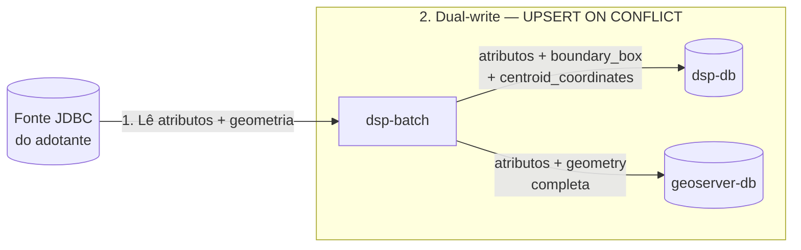

# Bancos de dados — contrato de papéis

Contrato dos papéis de datasource no fluxo de migração, geração de arquivos e consumo do DSP.

## Sumário

- [Visão geral](#visao-geral)
- [Papéis de datasource](#papeis-de-datasource)
- [Colunas geo por banco](#colunas-geo-por-banco)
- [Quem lê e quem escreve](#quem-le-e-quem-escreve)
- [Dual-write do job](#dual-write-do-job)
- [SRID via YAML](#srid-via-yaml)
- [Prefixos de configuração](#prefixos-de-configuracao)

---

## Visão geral

A geometria completa fica isolada no banco dos **GeoServers** (`dsp-geoserver-db`). O banco **operacional** (`dsp-db`) guarda atributos de negócio e representações leves (`boundary_box`, `centroid_coordinates`) para consultas da API — sem polígonos completos.

Dois GeoServers leem esse mesmo geoserver-db: **Exhibition** (mapa) e **Download** (WFS de exportação via backend).

---

## Papéis de datasource

São papéis de **conexão**, não containers extras. No core há dois serviços Postgres (`dsp-db` e `dsp-geoserver-db`). O papel `batch` é um schema de metadados Spring Batch **dentro** do `dsp-db` — um schema por job.

| Papel | Onde (fluxo orquestrado pelo core) | Para que serve |
|-------|-------------------------------------|----------------|
| **source** | Banco do adotante, fora do Compose (`spring.datasource.source`) | Origem da migração — só leitura |
| **dsp-db** | Serviço `dsp-db`, schema `dsp` (`spring.datasource.target`) | Dados de negócio, `boundary_box` e `centroid_coordinates`. Sem geometria completa. É o que o backend consulta |
| **geoserver-db** | Serviço `dsp-geoserver-db`, schema `dsp` (`spring.datasource.geo-target`) | As mesmas entidades territoriais, com a coluna `geometry` completa. É o que os GeoServers leem |
| **batch** (migração) | Schema `data_migration` no `dsp-db` (`spring.datasource.batch` do job de migração) | Histórico Spring Batch da **migração**: tabelas `BATCH_*` e `BATCH_JOB_EXECUTION_SYNC_STATE` (watermark). Não mistura com o schema de negócio `dsp` |
| **batch** (geo-file) | Schema `geo_file_generation` no `dsp-db` (`spring.datasource.batch` do job geo-file) | Histórico Spring Batch do **job geo-file**: tabelas `BATCH_*` (sem `SYNC_STATE`). Isolado da migração |

`dsp-db` e `geoserver-db` repetem as tabelas lógicas (`territory_level_1`, `territory_level_2`, `territory_level_3`, `area_of_interest`). A diferença está nas colunas geo — ver a seção seguinte.

---

## Colunas geo por banco

| Coluna | Tipo PostGIS | dsp-db | geoserver-db |
|--------|--------------|--------|---------------|
| Atributos de negócio (`id`, `name`, FKs, datas, etc.) | — | sim | sim |
| `geometry` | `geometry(MultiPolygon)` (sem typmod de SRID no DDL) | **não** | **sim** |
| `boundary_box` | `geometry(Polygon)` | **sim** | **não** |
| `centroid_coordinates` | `geometry(Point)` | **sim** | **não** |

O writer do job deriva `boundary_box` e `centroid_coordinates` a partir da geometria lida na origem e grava só em `dsp-db`. O `geoserver-db` recebe a geometria completa.

---

## Quem lê e quem escreve

| Componente | source | dsp-db | geoserver-db | batch |
|------------|--------|--------|---------------|-------|
| `rer-dsp-job-data-migration` | leitura | escrita (bbox/centroid) | escrita (geometry) | escrita (`BATCH_*`) |
| `rer-dsp-backend` / `rer-dsp-core` | — | leitura/escrita de negócio | — | — |
| GeoServer Exhibition | — | — | leitura (WMS/WFS mapa) | — |
| GeoServer Download | — | — | leitura (WFS downloads via backend) | — |

Os dois GeoServers apontam **somente** para `dsp-geoserver-db` (mesmo PostGIS; processos isolados).

---

## Dual-write do job

Cada execução do job faz **1 source → 2 targets**:

1. Lê origem (atributos + geometria).
2. Grava em `dsp-db`: atributos + `boundary_box` + `centroid_coordinates`.
3. Grava em `geoserver-db`: atributos + `geometry` completa.

---

## SRID via YAML

O SRID **não** é fixado em código nem no DDL (sem `geometry(MultiPolygon, 4674)`).

| Onde | Como |
|------|------|
| DDL | `geometry` sem typmod de SRID |
| Job | Cada bloco de job informa `srid` no YAML (ex.: `4674`, `4326`) |
| Escrita | O writer aplica o SRID informado ao persistir (`ST_SetSRID`, `ST_GeomFromGeoJSON`, etc.) |
| Validação | Conferir `ST_SRID(...)` contra o `srid` do YAML correspondente |

Instalações distintas podem usar SRIDs diferentes por "layer", desde que o YAML e a origem estejam alinhados.

---

## Prefixos de configuração

| Papel | Prefixo Spring | Exemplo Compose (core) |
|-------|----------------|------------------------|
| source | `spring.datasource.source` | — (externo) |
| dsp-db (target) | `spring.datasource.target` | `dsp-db` |
| geoserver-db (geo-target) | `spring.datasource.geo-target` | `dsp-geoserver-db` |
| batch (migração) | `spring.datasource.batch` | `dsp-db`, schema `data_migration` |
| batch (geo-file) | `spring.datasource.batch` | `dsp-db`, schema `geo_file_generation` |

Detalhe operacional: [Job data-migration — Configuração e execução](../modules/job-data-migration/configuration.md) · validação: [Validação pós-migração](../modules/job-data-migration/validation.md) · orquestração dos bancos: [rer-dsp-core](../modules/core.md).
