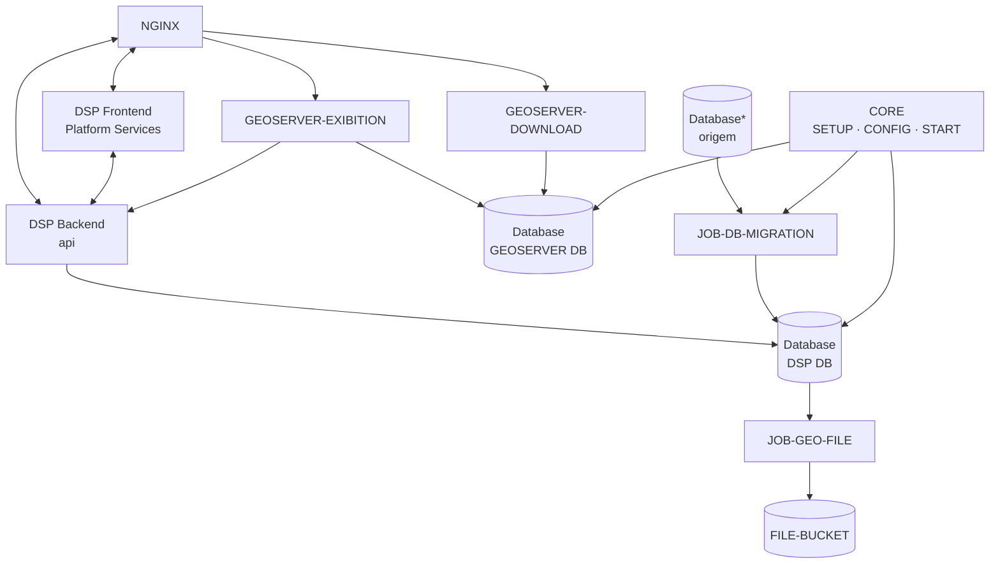
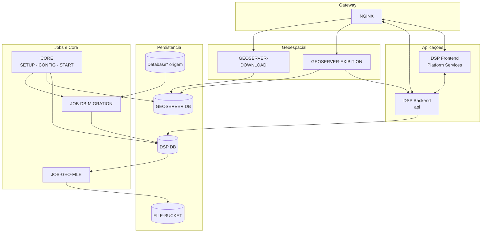
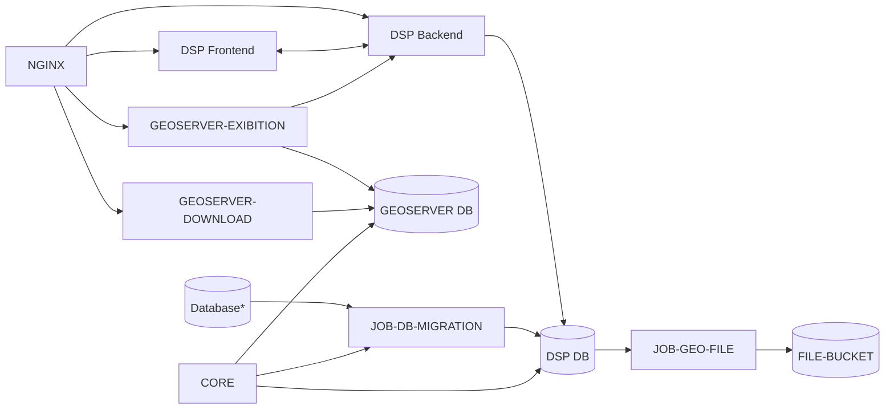
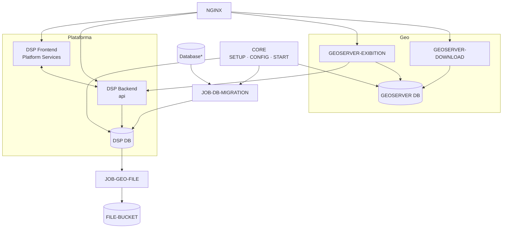
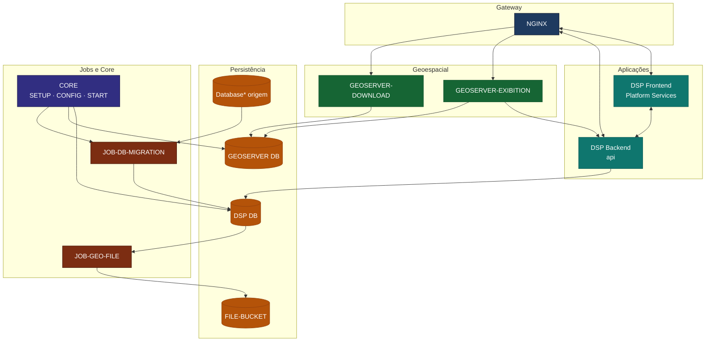
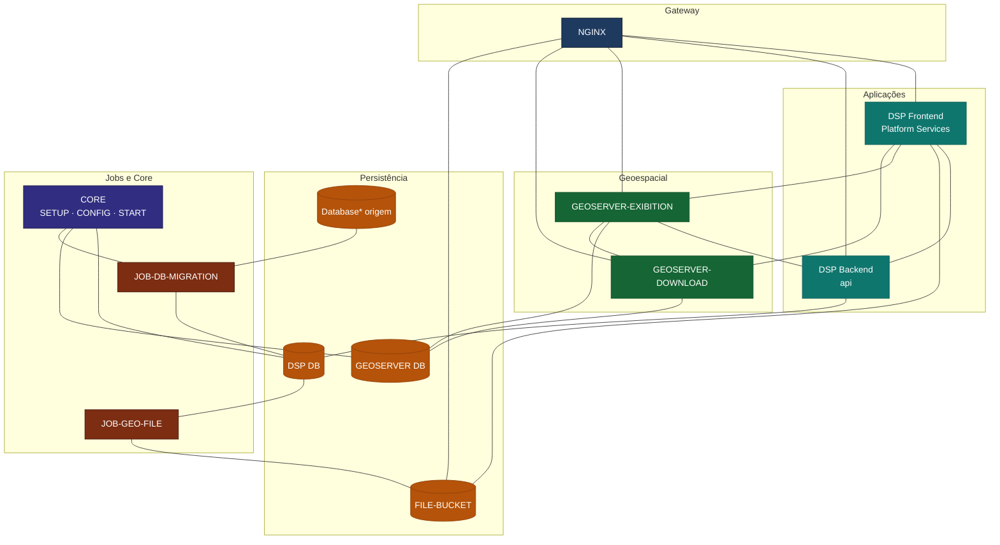
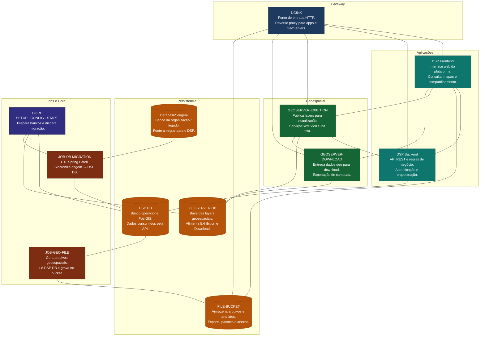
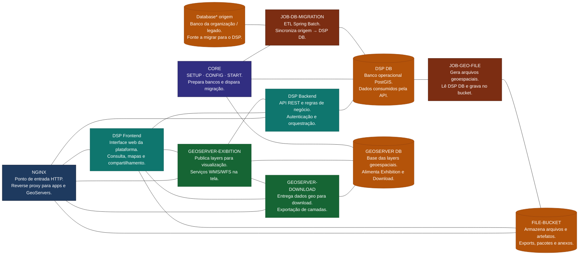

# Opções de diagrama (Mermaid)

Compare as 5 versões e diga o número preferido para usar em [Início → Arquitetura](../index.md#arquitetura).

---

## V1 — Flat (sem grupos)

Simples, tudo no mesmo nível.

---

## V2 — Por camadas (subgraphs)

Agrupa gateway, apps, geo, dados e jobs.

---

## V3 — Fluxo horizontal (LR)

Leitura da esquerda para a direita: entrada → apps → dados → jobs.

---

## V4 — Espelhando o draw.io

Layout próximo ao diagrama original: entrada no topo, apps à esquerda, GeoServers à direita, bancos no meio, jobs e CORE embaixo.

---

## V5 — Com cores (classDef)

Mesmo fluxo da V2, com cores por tipo de componente.

---

## V6 — V5 + mais ligações (só linhas)

Base na V5 com ligações sem seta (`---`). Ligações extras: NGINX — FILE-BUCKET, Frontend — FILE-BUCKET, Frontend — ambos GeoServers, e os dois GeoServers entre si.

---

## V7 — V6 + textos com descrição

Mesmo layout e ligações do V6; cada caixa traz nome e duas linhas explicando o papel.

---

## V8 — Mesmos textos, outra ordem (LR)

Leitura da esquerda para a direita. **Só ligações entre itens** (sem ligar seções).

# ------

