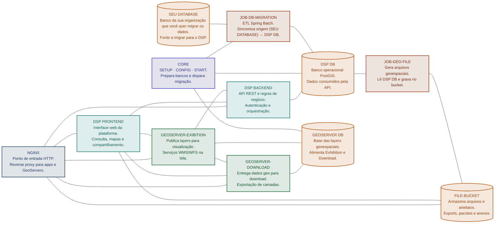
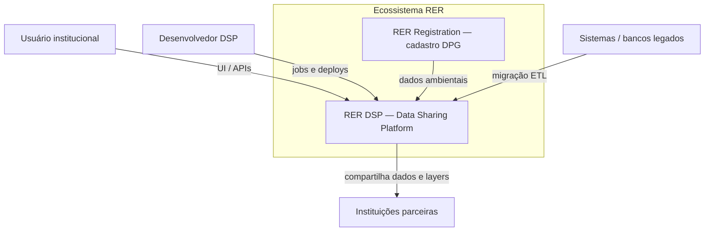
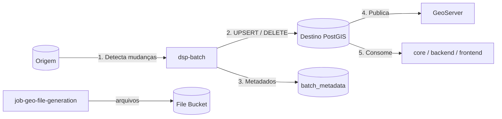
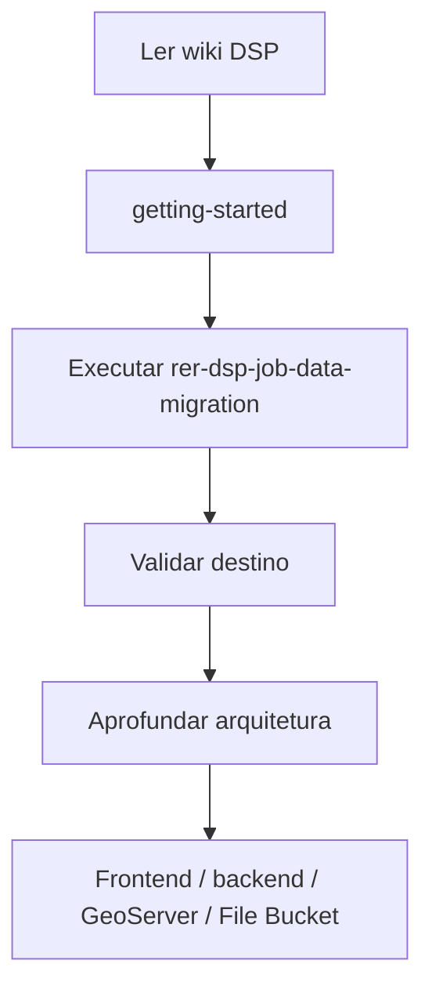

# Arquitetura do RER DSP

Visão da arquitetura multi-camada e multi-repositório da **Data Sharing Platform (DSP)** no ecossistema **RER**.

## Sumário

- [Contexto](#contexto)
- [Diagrama de componentes](#diagrama-de-componentes)
- [Princípios](#principios)
- [Visão de contexto](#visao-de-contexto)
- [Camadas e responsabilidades](#camadas-e-responsabilidades)
- [Fluxo de dados](#fluxo-de-dados)
- [Bancos de dados](#bancos-de-dados)
- [Jobs](#jobs)
- [Relação com o onboarding](#relacao-com-o-onboarding)

---

## Contexto

O DSP não é um único monólito. Ele combina:

- **Aplicações** (frontend, backend, core)
- **Jobs** (migração de dados, geração de arquivos geo)
- **Infraestrutura de dados** (PostgreSQL/PostGIS, File Bucket, GeoServer)

O objetivo é **compartilhar dados ambientais rurais** de forma confiável, com base geoespacial sincronizada a partir de fontes legadas ou de outros módulos do RER.

---

## Diagrama de componentes

---

## Princípios

| Princípio | Descrição |
|-----------|-----------|
| Separação por repositório | Cada capacidade evolui e versiona de forma independente |
| Source of truth documentada | Esta wiki (`rer-dsp-docs`) é a referência transversal |
| Migração primeiro | A base geoespacial no destino vem do job de migração |
| Configuração externa | Mapeamentos de tabela/coluna ficam no YAML, não hardcoded |

---

## Visão de contexto

---

## Camadas e responsabilidades

| Camada | Componentes | Responsabilidade |
|--------|-------------|------------------|
| Apresentação | [rer-dsp-frontend](https://github.com/Rural-Environmental-Registry/rer-dsp-frontend) | Interface web para consulta e compartilhamento |
| API | [rer-dsp-backend](https://github.com/Rural-Environmental-Registry/rer-dsp-backend) | Contratos REST, autenticação de acesso à plataforma |
| Domínio | [rer-dsp-core](https://github.com/Rural-Environmental-Registry/rer-dsp-core) | Regras de negócio lógica de domínio, modelos de dados, regras de negócio e utilitários compartilhados entre os demais componentes. |
| Integração / ETL | [rer-dsp-job-data-migration](https://github.com/Rural-Environmental-Registry/rer-dsp-job-data-migration) | Sync geoespacial source → target, ou seja faz a migração dos dados de um banco para outro. |
| Geração geo | [rer-dsp-job-geo-file-generation](https://github.com/Rural-Environmental-Registry/rer-dsp-job-geo-file-generation) | Produção de arquivos geoespaciais mais pesados para download rápido evitando sobrecarregar o geoserver. |
| Publicação geo | Instâncias GeoServer | Layers WMS/WFS e cache. São 2 GeoServer, um para exibição no frontend e um para download das geometrias. |
| Persistência | PostgreSQL / PostGIS | Dados operacionais e geometrias |
| Objetos | File Bucket | Arquivos gerados pelo [rer-dsp-job-geo-file-generation](https://github.com/Rural-Environmental-Registry/rer-dsp-job-geo-file-generation) |
| Documentação | [rer-dsp-docs](https://github.com/Rural-Environmental-Registry/rer-dsp-docs) (esta wiki) | Onboarding e padrões transversais de todos os repositórios |

## Fluxo de dados

1. **Ingestão / sync** — job de migração atualiza o destino
2. **Publicação** — GeoServer expõe layers a partir do destino
3. **Consumo** — core/backend/frontend e parceiros leem a base DSP
4. **Arquivos** — `job-geo-file-generation` cria os arquivos mais pesados e salva File Bucket.

---

## Bancos de dados

No fluxo do job de migração existem **três** papéis de datasource:

| Papel | Prefixo de config | Conteúdo típico |
|-------|-------------------|-----------------|
| Origem | `spring.datasource.source` | Dados legados / cadastro a migrar |
| Destino | `spring.datasource.target` | Base PostGIS do DSP |
| Metadados | `spring.datasource.batch` | Controle Spring Batch (`BATCH_*`) |

## Jobs

| Job / repositório | Entrada | Saída | Quando usar |
|-------------------|---------|-------|-------------|
| `rer-dsp-job-data-migration` | DB source | DB target + metadados | **Onboarding e sync contínuo da base geo** |
| `rer-dsp-job-geo-file-generation` | DB / arquivos | Arquivos em File Bucket ou filesystem | Geração de pacotes geo |

Detalhe operacional do primeiro: [Migração — visão geral](../migration/overview.md) e [Job data-migration](../migration/rer-dsp-job-data-migration.md).

---

## Relação com o onboarding

