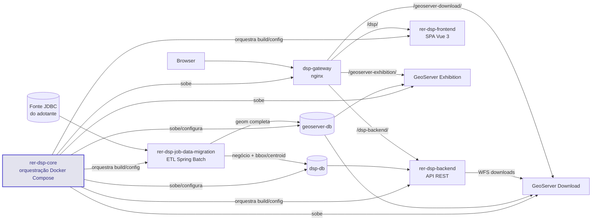
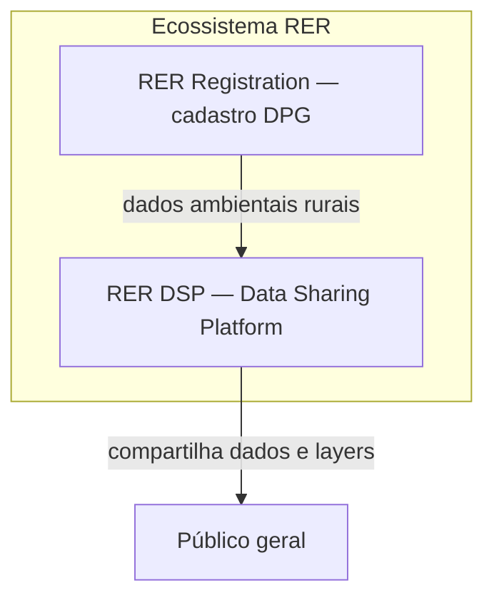
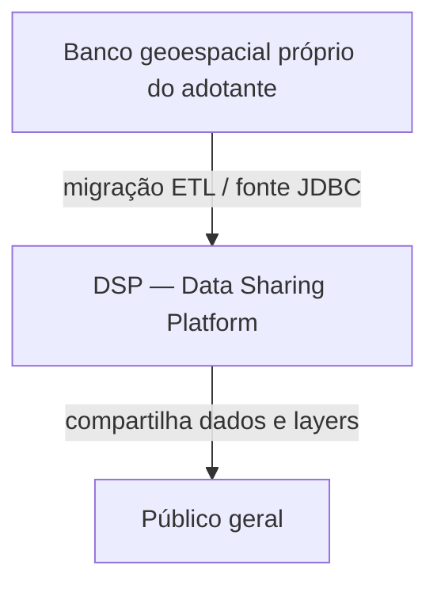
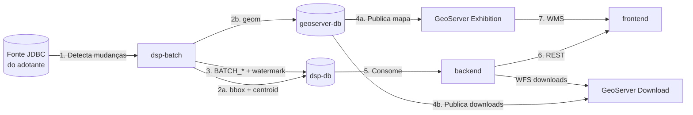

# Arquitetura do RER DSP

Visão da arquitetura multi-camada e multi-repositório da **Data Sharing Platform (DSP)** no ecossistema **RER**.

## Sumário

- [Contexto](#contexto)
- [Diagrama de componentes](#diagrama-de-componentes)
- [Princípios](#principios)
- [Visão de contexto](#visao-de-contexto)
- [Camadas e responsabilidades](#camadas-e-responsabilidades)
- [O core como camada de orquestração](#o-core-como-camada-de-orquestracao)
- [Fluxo de dados](#fluxo-de-dados)
- [Bancos de dados](#bancos-de-dados)

---

## Contexto

O DSP não é um único monólito. Ele combina:

- **Aplicações** (frontend, backend)
- **Orquestração e configuração** (core)
- **Jobs** (migração/sincronização de dados)
- **Infraestrutura de dados** (PostgreSQL/PostGIS, GeoServer)

O objetivo é **compartilhar dados geoespaciais** de forma confiável, com base sincronizada a partir da fonte JDBC do adotante — no ecossistema RER, esses dados são tipicamente ambientais rurais, mas a arquitetura não depende desse domínio específico (veja [O que é o DSP?](../o-que-e-o-dsp.md)).

---

## Diagrama de componentes

```mermaid
flowchart LR
  core["rer-dsp-core<br/>orquestração Docker Compose"]
  job["rer-dsp-job-data-migration<br/>ETL Spring Batch"]
  be["rer-dsp-backend<br/>API REST"]
  fe["rer-dsp-frontend<br/>SPA Vue 3"]
  src[(Fonte JDBC<br/>do adotante)]
  dspdb[(dsp-db)]
  exdb[(geoserver-db)]
  gsEx[GeoServer Exhibition]
  gsDl[GeoServer Download]
  gw["dsp-gateway<br/>nginx"]
  browser[Browser]

  core -->|"sobe/configura"| dspdb
  core -->|"sobe/configura"| exdb
  core -->|"sobe"| gsEx
  core -->|"sobe"| gsDl
  core -->|"sobe"| gw
  core -->|"orquestra build/config"| job
  core -->|"orquestra build/config"| be
  core -->|"orquestra build/config"| fe

  src --> job
  job -->|"negócio + bbox/centroid"| dspdb
  job -->|"geom completa"| exdb
  exdb --> gsEx
  exdb --> gsDl
  dspdb --> be
  be -->|WFS downloads| gsDl

  browser --> gw
  gw -->|/dsp/| fe
  gw -->|/dsp-backend/| be
  gw -->|/geoserver-exhibition/| gsEx
  gw -->|/geoserver-download/| gsDl

  classDef coreCls fill:#312e8122,color:#312e81,stroke:#4338ca,stroke-width:2px
  class core coreCls
```

Todo o tráfego HTTP entra pelo **gateway**. Frontend, backend e os dois GeoServers não publicam porta no host — só os bancos continuam acessíveis diretamente, para inspeção e para a fonte do ETL.

---

## Princípios

| Princípio | Descrição |
|-----------|-----------|
| Separação por repositório | Cada capacidade evolui e versiona de forma independente |
| Source of truth documentada | Esta wiki (`rer-dsp-docs`) é a referência transversal |
| Core como orquestrador | Configuração, schema e subida da stack local partem do `rer-dsp-core` |
| Configuração externa | Mapeamentos de tabela/coluna e labels da UI ficam em arquivo, não hardcoded |

---

## Visão de contexto

O DSP pode ser adotado em dois cenários distintos, dependendo de qual é a fonte JDBC do adotante ([o que é o DSP?](../o-que-e-o-dsp.md)):

### Cenário 1 — DSP dentro do ecossistema RER

A fonte de dados é o próprio **RER Registration** (o módulo de cadastro do RER, também um DPG). Este é o uso original do DSP: compartilhar os dados ambientais rurais já coletados no cadastro do RER com o público geral.

```mermaid
flowchart TB
  publico[Público geral]

  subgraph rer ["Ecossistema RER"]
    reg[RER Registration — cadastro DPG]
    dsp[RER DSP — Data Sharing Platform]
  end
  reg -->|dados ambientais rurais| dsp
  dsp -->|compartilha dados e layers| publico
```

### Cenário 2 — DSP fora do RER, com outra base de dados

A fonte de dados é qualquer sistema/banco geoespacial próprio do adotante — **sem nenhuma dependência do RER Registration**. O DSP é usado de forma genérica, apenas como plataforma de sincronização, publicação e compartilhamento.

```mermaid
flowchart TB
  legado[Banco geoespacial próprio do adotante]
  publico[Público geral]

  dsp[DSP — Data Sharing Platform]

  legado -->|migração ETL / fonte JDBC| dsp
  dsp -->|compartilha dados e layers| publico
```

!!! tip "Mesma arquitetura, fonte diferente"
    Os dois cenários usam exatamente os mesmos módulos e o mesmo mecanismo de sincronização — a única diferença é de onde vem a fonte JDBC configurada em `./config.sh`. Nada no core, backend, frontend ou job de migração assume que a origem é o RER Registration.

---

## Camadas e responsabilidades

| Camada | Componentes | Responsabilidade                                                                      |
|--------|-------------|---------------------------------------------------------------------------------------|
| Orquestração / configuração | [rer-dsp-core](https://github.com/Rural-Environmental-Registry/rer-dsp-core) | Sobe bancos, GeoServers, gateway e os jobs (migração e geo-file); orquestra build/config dos demais módulos via Docker Compose |
| Entrada HTTP | Gateway nginx (`dsp-gateway`, no core) | Porta de entrada única: roteia para frontend, backend e GeoServers; cache opcional |
| Apresentação | [rer-dsp-frontend](https://github.com/Rural-Environmental-Registry/rer-dsp-frontend) | Interface web/mapas para consulta e compartilhamento                                  |
| API | [rer-dsp-backend](https://github.com/Rural-Environmental-Registry/rer-dsp-backend) | Contratos REST, dados de negócio da plataforma                                        |
| Integração / ETL | [rer-dsp-job-data-migration](https://github.com/Rural-Environmental-Registry/rer-dsp-job-data-migration) | Sincroniza atributos e geometria da fonte do adotante para os bancos do DSP           |
| Arquivos de download | [rer-dsp-job-geo-file-generation](https://github.com/Rural-Environmental-Registry/rer-dsp-job-geo-file-generation) | Pré-gera CSV de download no SeaweedFS (`dsp-object-storage`, profile `object-storage`) |
| Publicação geo | GeoServer Exhibition + GeoServer Download | Exhibition: WMS/WFS de mapa; Download: WFS de exportação (mesmo geoserver-db) |
| Persistência | PostgreSQL / PostGIS (2 bancos no Compose) | `dsp-db` (negócio + schemas `data_migration` e `geo_file_generation`) e `dsp-geoserver-db` (geometrias) |
| Documentação | [rer-dsp-docs](https://github.com/Rural-Environmental-Registry/rer-dsp-docs) (esta wiki) | Onboarding e padrões transversais de todos os repositórios                            |

---

## O core como camada de orquestração

O `rer-dsp-core` não contém código de aplicação/domínio — sua responsabilidade é exclusivamente de **orquestração e configuração**:

- Sobe os 2 bancos Postgres/PostGIS, os GeoServers (Exhibition + Download), o gateway nginx e os jobs de migração e geo-file via Docker Compose. Watermark da migração no schema `data_migration` do `dsp-db`.
- Gera, a partir do wizard `./config.sh` (4 estágios + About opcional), o `adopter-config.yaml` e os arquivos operacionais (`installationConfig.json`, `mapLayersConfig.json`, `downloadThemesConfig.json`, `application.yaml`).
- Orquestra o build e a subida do backend, frontend, job de migração e job geo-file.
- Não tem dependência de runtime sobre os demais módulos — precisa deles apenas no momento do build/orquestração.

Detalhe operacional completo: [rer-dsp-core](../modules/core.md).

---

## Fluxo de dados

```mermaid
flowchart LR
  A[(Fonte JDBC<br/>do adotante)] -->|1. Detecta mudanças| B[dsp-batch]
  B -->|2a. bbox + centroid| C[(dsp-db)]
  B -->|2b. geom| E[(geoserver-db)]
  B -->|3. BATCH_* + watermark| C
  E -->|4a. Publica mapa| GEx[GeoServer Exhibition]
  E -->|4b. Publica downloads| GDl[GeoServer Download]
  C -->|5. Consome| F[backend]
  F -->|6. REST| H[frontend]
  F -->|WFS downloads| GDl
  GEx -->|7. WMS| H
```

1. **Ingestão / sync** — job de migração detecta mudanças por watermark e faz dual-write: `dsp-db` (negócio + bbox/centroid) e `geoserver-db` (`geom` completa).
2. **Publicação** — GeoServer Exhibition e GeoServer Download leem **somente** `geoserver-db` (processos isolados).
3. **Consumo via API** — backend lê `dsp-db` (sem polígonos completos) e consulta o **GeoServer Download** via WFS para downloads de arquivo. Essa chamada é interna à rede Docker e não passa pelo gateway.
4. **Consumo via UI** — frontend consome a API do backend (busca, KPIs, downloads) e, para mapas, consome WMS/WFS do **GeoServer Exhibition**. Tudo o que sai do browser passa pelo **gateway**, na mesma origem.

!!! tip "Porque não gravar a geometria completa no `dsp-db`?"
    Em vez de guardar a geometria completa (o polígono inteiro, com todos os seus vértices) no `dsp-db`, o job grava apenas duas versões simplificadas dela:

    - **`boundary_box`** (bbox) — o retângulo envolvente da geometria (menor e maior latitude/longitude).
    - **`centroid_coordinates`** — o ponto central da geometria.

    Essa é uma escolha de **performance**: consultas, filtros e ordenações que usam bbox/centroide (por exemplo, "quais registros estão dentro desta área" ou cálculos de proximidade) são muito mais leves de processar do que operar sobre polígonos completos, especialmente com grande volumetria de dados. A API e a interface (busca, listagem, KPIs) não precisam do desenho exato do polígono para funcionar — só a camada de mapa (`geoserver-db` → GeoServer) precisa da geometria completa, por isso ela fica isolada em um banco separado.

Detalhe passo a passo com diagrama de sequência: [Fluxo de dados](data-flow.md).

---

## Bancos de dados

No fluxo do job existem **quatro** papéis de datasource:

| Papel | Prefixo de config | Conteúdo típico |
|-------|-------------------|-----------------|
| Origem | `spring.datasource.source` | Dados legados / cadastro a migrar |
| Operacional | `spring.datasource.target` → `dsp-db` | Negócio + `boundary_box` + `centroid_coordinates` ([por quê](#fluxo-de-dados)) — **sem** `geometry` completa |
| GeoServers | `spring.datasource.geo-target` → `dsp-geoserver-db` | Mesmas tabelas `dsp.*` **com** `geometry` completa |
| Metadados | `spring.datasource.batch` | Controle Spring Batch (`BATCH_*`) e watermark (`BATCH_JOB_EXECUTION_SYNC_STATE`) |

Contrato completo (colunas, leitores/escritores, SRID via YAML): [Bancos de dados](databases.md).

---
