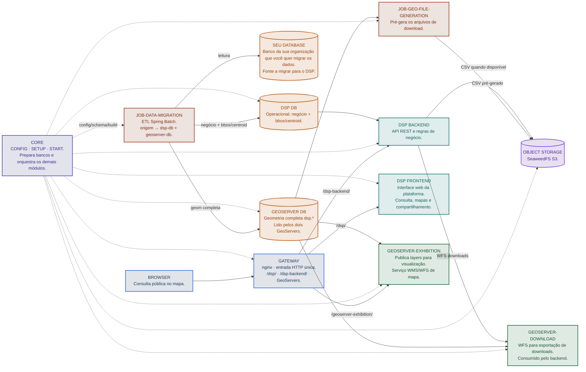
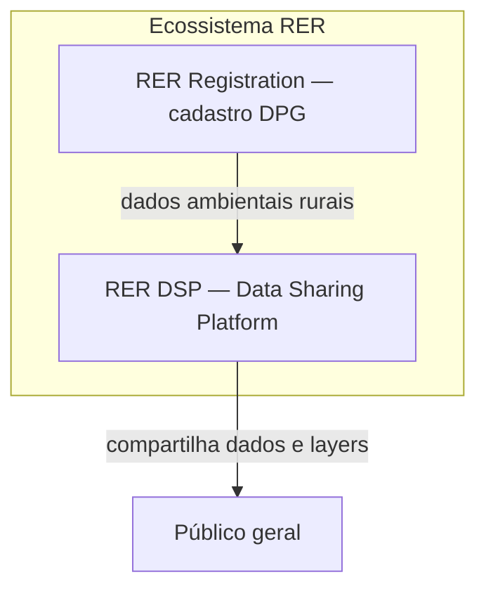
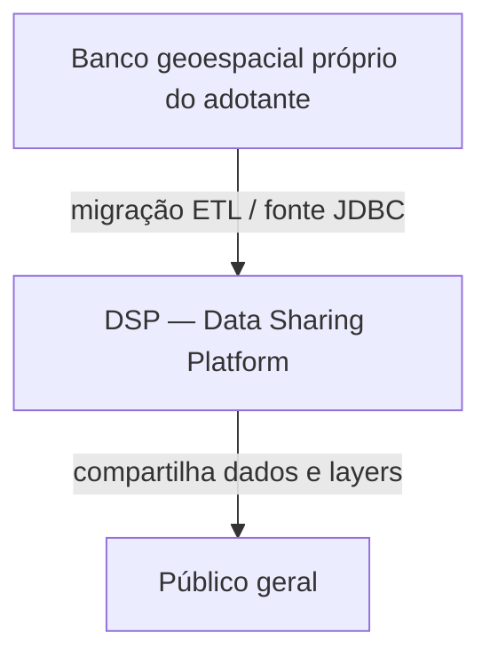
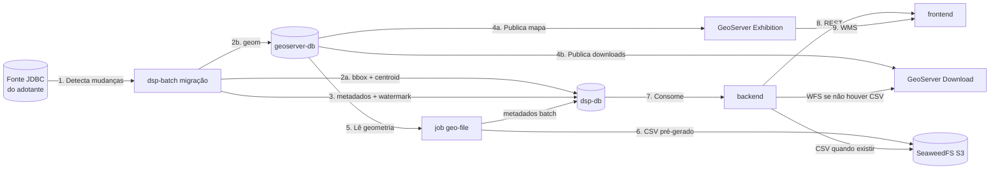

# Arquitetura do [RER](https://www.digitalpublicgoods.net/r/rural-environmental-registry-registration-module) DSP

Visão da arquitetura multi-camada e multi-repositório da **Data Sharing Platform (DSP)** no ecossistema [**RER**](https://www.digitalpublicgoods.net/r/rural-environmental-registry-registration-module).

## Sumário

- [Contexto](#contexto)
- [Diagrama de componentes](#diagrama-de-componentes)
- [Princípios](#principios)
- [Visão de contexto](#visao-de-contexto)
- [Camadas e responsabilidades](#camadas-e-responsabilidades)
- [O core como camada de orquestração](#o-core-como-camada-de-orquestracao)
- [Fluxo de dados](#fluxo-de-dados)
- [Bancos de dados](#bancos-de-dados)

---

## Contexto

O DSP não é um único monólito. Ele combina:

- **Aplicações** (frontend, backend)
- **Orquestração e configuração** (core)
- **Jobs** — migração/sincronização da fonte JDBC (`rer-dsp-job-data-migration`) e pré-geração de CSV de download no object storage SeaweedFS (`rer-dsp-job-geo-file-generation`, profile Compose `object-storage`)
- **Infraestrutura de dados** (PostgreSQL/PostGIS, GeoServer)

O objetivo é **compartilhar dados geoespaciais** de forma confiável, com base sincronizada a partir da fonte JDBC do adotante — no ecossistema [RER](https://www.digitalpublicgoods.net/r/rural-environmental-registry-registration-module), esses dados são tipicamente ambientais rurais, mas a arquitetura não depende desse domínio específico (veja [O que é o DSP?](../what-is-the-dsp.md)).

---

## Diagrama de componentes

```mermaid
flowchart LR
  browser["BROWSER<br/>Consulta pública no mapa."]
  gw["GATEWAY<br/>nginx · entrada HTTP única.<br/>/dsp/ · /dsp-backend/ · GeoServers."]

  srcDb[("SEU DATABASE<br/>Banco da sua organização que você quer migrar os dados.<br/>Fonte a migrar para o DSP.")]
  jobMig["JOB-DATA-MIGRATION<br/>ETL Spring Batch.<br/>origem → dsp-db + geoserver-db."]
  jobGeo["JOB-GEO-FILE-GENERATION<br/>Pré-gera os arquivos de download.<br/>"]
  core["CORE<br/>CONFIG · SETUP · START.<br/>Prepara bancos e orquestra os demais módulos."]

  dspDb[("DSP DB<br/>Operacional: negócio + bbox/centroid.")]
  gsDb[("GEOSERVER DB<br/>Geometria completa dsp.*<br/>Lido pelos dois GeoServers.")]
  objStor[("OBJECT STORAGE<br/>SeaweedFS S3.<br/>")]

  be["DSP BACKEND<br/>API REST e regras de negócio."]
  fe["DSP FRONTEND<br/>Interface web da plataforma.<br/>Consulta, mapas e compartilhamento."]

  gsEx["GEOSERVER-EXHIBITION<br/>Publica layers para visualização.<br/>Serviço WMS/WFS de mapa."]
  gsDl["GEOSERVER-DOWNLOAD<br/>WFS para exportação de downloads.<br/>Consumido pelo backend."]

  browser --> gw
  gw -->|/dsp/| fe
  gw -->|/dsp-backend/| be
  gw -->|/geoserver-exhibition/| gsEx

  jobMig -->|leitura| srcDb
  jobMig -->|"negócio + bbox/centroid"| dspDb
  jobMig -->|"geom completa"| gsDb
  core -.config/schema/build.-> jobMig
  core -.-> jobGeo
  core -.-> dspDb
  core -.-> gsDb
  core -.-> objStor
  core -.-> gw
  core -.-> be
  core -.-> fe
  core -.-> gsEx
  core -.-> gsDl

  dspDb --> be
  gsDb --> gsEx
  gsDb --> gsDl
  gsDb --> jobGeo
  jobGeo -->|"CSV pré-gerado"| objStor
  be -->|WFS downloads| gsDl
  be -->|CSV quando disponível| objStor

  classDef app fill:#0f766e22,color:#115e59,stroke:#0f766e,stroke-width:2px
  classDef geoCls fill:#16653422,color:#14532d,stroke:#166534,stroke-width:2px
  classDef db fill:#b4530922,color:#92400e,stroke:#b45309,stroke-width:2px
  classDef job fill:#7c2d1222,color:#7c2d12,stroke:#9a3412,stroke-width:2px
  classDef coreCls fill:#312e8122,color:#312e81,stroke:#4338ca,stroke-width:2px
  classDef entryCls fill:#1e3a5f22,color:#1e3a5f,stroke:#2563eb,stroke-width:2px
  classDef storageCls fill:#4c1d9522,color:#4c1d95,stroke:#7c3aed,stroke-width:2px

  class fe,be app
  class gsEx,gsDl geoCls
  class dspDb,gsDb,srcDb db
  class jobMig,jobGeo job
  class core coreCls
  class browser,gw entryCls
  class objStor storageCls
```

Todo o tráfego HTTP entra pelo **gateway**. Frontend, backend e os dois GeoServers não publicam porta no host — só os bancos continuam acessíveis diretamente, para inspeção e para a fonte do ETL.

---

## Princípios

| Princípio | Descrição |
|-----------|-----------|
| Separação por repositório | Cada capacidade evolui e versiona de forma independente |
| Source of truth documentada | Esta wiki (`rer-dsp-docs`) é a referência transversal |
| Core como orquestrador | Configuração, schema e subida da stack local partem do `rer-dsp-core` |
| Configuração externa | Mapeamentos de tabela/coluna e labels da UI ficam em arquivo, não hardcoded |

---

## Visão de contexto

O DSP pode ser adotado em dois cenários distintos, dependendo de qual é a fonte JDBC do adotante ([o que é o DSP?](../what-is-the-dsp.md)):

### Cenário 1 — DSP dentro do ecossistema [RER](https://www.digitalpublicgoods.net/r/rural-environmental-registry-registration-module)

A fonte de dados é o próprio [**RER** Registration](https://www.digitalpublicgoods.net/r/rural-environmental-registry-registration-module) (o módulo de cadastro do [RER](https://www.digitalpublicgoods.net/r/rural-environmental-registry-registration-module), também um DPG). Este é o uso original do DSP: compartilhar os dados ambientais rurais já coletados no cadastro do [RER](https://www.digitalpublicgoods.net/r/rural-environmental-registry-registration-module) com o público geral.

```mermaid
flowchart TB
  publico[Público geral]

  subgraph rer ["Ecossistema RER"]
    reg[RER Registration — cadastro DPG]
    dsp[RER DSP — Data Sharing Platform]
  end
  reg -->|dados ambientais rurais| dsp
  dsp -->|compartilha dados e layers| publico
```

### Cenário 2 — DSP fora do [RER](https://www.digitalpublicgoods.net/r/rural-environmental-registry-registration-module), com outra base de dados

A fonte de dados é qualquer sistema/banco geoespacial próprio do adotante — **sem nenhuma dependência do [RER Registration](https://www.digitalpublicgoods.net/r/rural-environmental-registry-registration-module)**. O DSP é usado de forma genérica, apenas como plataforma de sincronização, publicação e compartilhamento.

```mermaid
flowchart TB
  fonte[Banco geoespacial próprio do adotante]
  publico[Público geral]

  dsp[DSP — Data Sharing Platform]

  fonte -->|migração ETL / fonte JDBC| dsp
  dsp -->|compartilha dados e layers| publico
```

!!! tip "Mesma arquitetura, fonte diferente"
    Os dois cenários usam exatamente os mesmos módulos e o mesmo mecanismo de sincronização — a única diferença é de onde vem a fonte JDBC do adotante. Nada no core, backend, frontend ou jobs assume que a origem é o [RER Registration](https://www.digitalpublicgoods.net/r/rural-environmental-registry-registration-module).

---

## Camadas e responsabilidades

| Camada | Componentes | Responsabilidade                                                                      |
|--------|-------------|---------------------------------------------------------------------------------------|
| Orquestração / configuração | [rer-dsp-core](https://github.com/Rural-Environmental-Registry/rer-dsp-core) | Sobe bancos, GeoServers, gateway e os jobs (migração e geo-file); orquestra build/config dos demais módulos via Docker Compose |
| Entrada HTTP | Gateway nginx (`dsp-gateway`, no core) | Porta de entrada única: roteia para frontend, backend e GeoServers; cache opcional |
| Apresentação | [rer-dsp-frontend](https://github.com/Rural-Environmental-Registry/rer-dsp-frontend) | Interface web/mapas para consulta e compartilhamento                                  |
| API | [rer-dsp-backend](https://github.com/Rural-Environmental-Registry/rer-dsp-backend) | Contratos REST, dados de negócio da plataforma                                        |
| Integração / ETL | [rer-dsp-job-data-migration](https://github.com/Rural-Environmental-Registry/rer-dsp-job-data-migration) | Sincroniza atributos e geometria da fonte do adotante para os bancos do DSP           |
| Arquivos de download | [rer-dsp-job-geo-file-generation](../modules/job-geo-file-generation/overview.md) | Lê geometrias no `geoserver-db`, gera CSV territorial e grava no object storage (agenda definida no setup) |
| Object storage | SeaweedFS (`dsp-object-storage`, profile `object-storage`) | API compatível com S3; armazena os CSV pré-gerados que o backend entrega quando existirem (demo local sem JDBC costuma omitir este serviço) |
| Publicação geo | GeoServer Exhibition + GeoServer Download | Exhibition: WMS/WFS de mapa; Download: WFS de exportação (mesmo geoserver-db) |
| Persistência | PostgreSQL / PostGIS (2 bancos no Compose) | `dsp-db` (negócio + um schema Spring Batch por job) e `dsp-geoserver-db` (geometrias) |
| Documentação | [rer-dsp-docs](https://github.com/Rural-Environmental-Registry/rer-dsp-docs) (esta wiki) | Onboarding e padrões transversais de todos os repositórios                            |

---

## O core como camada de orquestração

O `rer-dsp-core` não contém código de aplicação/domínio — sua responsabilidade é exclusivamente de **orquestração e configuração**:

- Sobe os 2 bancos Postgres/PostGIS, os GeoServers (Exhibition + Download), o gateway nginx e os jobs de migração e geo-file via Docker Compose. Watermark da migração no schema `data_migration` do `dsp-db`.
- Gera, a partir do wizard `./config.sh` (6 etapas guiadas por perguntas; About na 6/6, opcional), o `adopter-config.yaml` e os arquivos operacionais (`installationConfig.json`, `mapLayersConfig.json`, `downloadThemesConfig.json`, `application.yaml`).
- Orquestra o build e a subida do backend, frontend, job de migração e job geo-file.
- Não tem dependência de runtime sobre os demais módulos — precisa deles apenas no momento do build/orquestração.

Detalhe operacional completo: [rer-dsp-core](../modules/core.md).

---

## Fluxo de dados

```mermaid
flowchart LR
  A[(Fonte JDBC<br/>do adotante)] -->|1. Detecta mudanças| B[dsp-batch migração]
  B -->|2a. bbox + centroid| C[(dsp-db)]
  B -->|2b. geom| E[(geoserver-db)]
  B -->|3. metadados + watermark| C
  E -->|4a. Publica mapa| GEx[GeoServer Exhibition]
  E -->|4b. Publica downloads| GDl[GeoServer Download]
  E -->|5. Lê geometria| JG[job geo-file]
  JG -->|6. CSV pré-gerado| S3[(SeaweedFS S3)]
  JG -->|metadados batch| C
  C -->|7. Consome| F[backend]
  F -->|8. REST| H[frontend]
  F -->|WFS se não houver CSV| GDl
  F -->|CSV quando existir| S3
  GEx -->|9. WMS| H
```

1. **Ingestão / sync** — job de migração detecta mudanças por watermark e faz dual-write: `dsp-db` (negócio + bbox/centroid) e `geoserver-db` (`geom` completa). Metadados Spring Batch da migração ficam no schema `data_migration` do `dsp-db`.
2. **Pré-geração de downloads** — com object storage ligado (adotante real), o **watermark da migração** define quais regiões mudaram na última sync bem-sucedida; a migração marca esses territórios no `dsp-db` (`requires_s3_file_regeneration`). O job geo-file processa só o pendente: lê geometria no `geoserver-db`, publica CSV no **SeaweedFS** e limpa a flag por território. Metadados batch do geo-file usam o schema `geo_file_generation` no mesmo `dsp-db`.
3. **Publicação** — GeoServer Exhibition e GeoServer Download leem **somente** `geoserver-db` (processos isolados).
4. **Consumo via API** — backend lê `dsp-db` (sem polígonos completos). Nos downloads, prioriza bytes do SeaweedFS quando o arquivo pré-gerado existe; senão consulta o **GeoServer Download** via WFS (rede Docker interna, sem passar pelo gateway).
5. **Consumo via UI** — frontend consome a API do backend (busca, KPIs, downloads) e, para mapas, consome WMS/WFS do **GeoServer Exhibition**. Tudo o que sai do browser passa pelo **gateway**, na mesma origem.

!!! tip "Porque não gravar a geometria completa no `dsp-db`?"
    Em vez de guardar a geometria completa (o polígono inteiro, com todos os seus vértices) no `dsp-db`, o job grava apenas duas versões simplificadas dela:

    - **`boundary_box`** (bbox) — o retângulo envolvente da geometria (menor e maior latitude/longitude).
    - **`centroid_coordinates`** — o ponto central da geometria.

    Essa é uma escolha de **performance**: consultas, filtros e ordenações que usam bbox/centroide (por exemplo, "quais registros estão dentro desta área" ou cálculos de proximidade) são muito mais leves de processar do que operar sobre polígonos completos, especialmente com grande volumetria de dados. O trade-off é que a seleção no mapa e algumas interações que dependem do `dsp-db` ficam um pouco menos precisas: um clique levemente fora do contorno de um imóvel pode ainda assim selecioná-lo, ou em casos raros sobrepor dois imóveis — o desenho exato continua no `geoserver-db` e no GeoServer Exhibition. A API e a interface (busca, listagem, KPIs) não precisam do polígono completo para a maior parte das telas; por isso a geometria integral fica isolada no banco dos GeoServers.

Detalhe passo a passo com diagrama de sequência: [Fluxo de dados](data-flow.md).

---

## Bancos de dados

Dois Postgres no Compose (`dsp-db` operacional + `dsp-geoserver-db` com geometria completa). No `dsp-db`, o schema `dsp` serve a API; `data_migration` e `geo_file_generation` isolam os metadados batch de cada job (watermark só na migração). Downloads territoriais usam flags em `territory_level_2` / `_3` ligadas ao watermark — detalhe em [Bancos de dados](databases.md).

---
