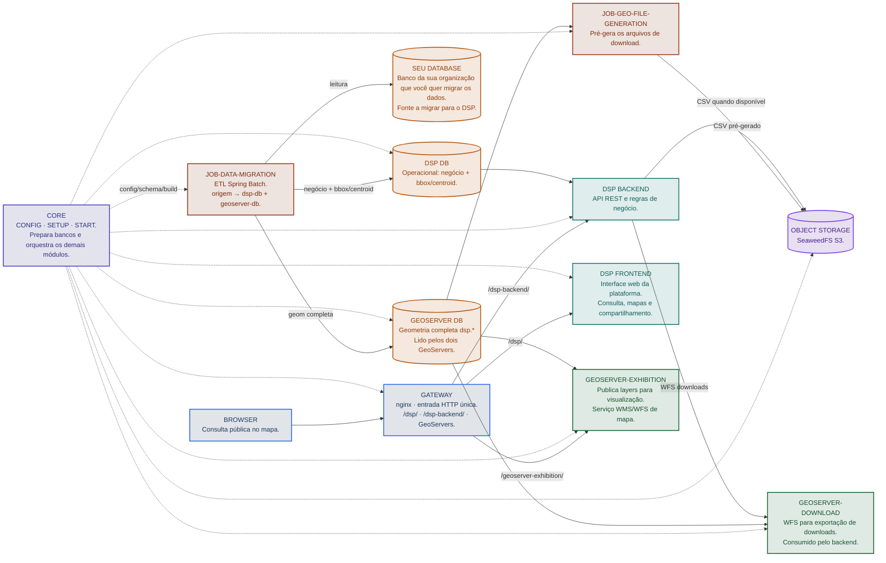

# Módulos do DSP

## Quais módulos existem e qual a responsabilidade de cada um?

O DSP é composto por **6 repositórios** de aplicação/job na organização [Rural-Environmental-Registry](https://github.com/Rural-Environmental-Registry) no GitHub, mais **infraestrutura empacotada no [rer-dsp-core](https://github.com/Rural-Environmental-Registry/rer-dsp-core)** (gateway nginx, dois GeoServers, object storage SeaweedFS e bancos PostgreSQL/PostGIS). Cada repositório abaixo evolui em git separado; o core orquestra build e containers via Docker Compose.

| Módulo | Responsabilidade | Tecnologia principal | Ver mais detalhes |
|--------|------------------|----------------------|-------------------|
| [rer-dsp-core](https://github.com/Rural-Environmental-Registry/rer-dsp-core) | Orquestração e configuração: `./config.sh`, `./setup.sh`, `./start.sh`; sobe bancos, **gateway**, dois **GeoServers** (Exhibition + Download), **object storage** (profile `object-storage`) e orquestra build dos demais módulos | Docker Compose, Python 3 (wizard) | [Ver mais detalhes](modules/core.md) |
| [rer-dsp-backend](https://github.com/Rural-Environmental-Registry/rer-dsp-backend) | API REST — dados de negócio, territórios, downloads (WFS ou CSV pré-gerado no S3) | Java 21 + Spring Boot 3.4.2 + PostGIS | [Ver mais detalhes](modules/backend.md) |
| [rer-dsp-frontend](https://github.com/Rural-Environmental-Registry/rer-dsp-frontend) | Interface web — busca, KPIs, mapa interativo | Vue 3 + Vite + TypeScript | [Ver mais detalhes](modules/frontend.md) |
| [rer-dsp-job-data-migration](https://github.com/Rural-Environmental-Registry/rer-dsp-job-data-migration) | ETL geoespacial — sincroniza a fonte JDBC do adotante com `dsp-db` e `geoserver-db` (dual-write) | Java 21 + Spring Batch | [Ver mais detalhes](modules/job-data-migration/overview.md) |
| [rer-dsp-job-geo-file-generation](https://github.com/Rural-Environmental-Registry/rer-dsp-job-geo-file-generation) | Pré-gera arquivos de download territoriais e publica no object storage; mantém consulta rápida em alto volume (ex.: escala [SICAR](https://www.car.gov.br/)) | Java 21 + Spring Boot / Batch | [Ver mais detalhes](modules/job-geo-file-generation/overview.md) |
| [rer-dsp-docs](https://github.com/Rural-Environmental-Registry/rer-dsp-docs) (este repositório) | Documentação central do ecossistema | Zensical | — |

!!! note "Demo local vs adotante real"
    **Demo local (só para testar)** — No [Começando rápido](guides/quick-start.md) você sobe o DSP com um seed sintético do Brasil: quadrados de exemplo no mapa, filtros, KPIs e navegação no site, sem conectar um banco da sua organização. Para esse objetivo (conhecer a interface e o fluxo de consulta) **não é necessário** subir o job geo-file nem o object storage (S3). Se alguém pedir um download na demo, o backend pode atender via GeoServer Download (WFS), o que é aceitável em volume pequeno e dados fictícios.

    **Adotante real (produção e performance)** — Quando a fonte JDBC traz milhões de registros e territórios grandes (como a [consulta pública do CAR](https://consulta.car.gov.br/)), gerar arquivos de exportação sob demanda no GeoServer e no banco a cada clique sobrecarrega a stack e deixa o download lento. Por isso a instalação completa ativa o profile Compose `object-storage`: após cada migração bem-sucedida, o **watermark** indica quais territórios mudaram e a migração marca no `dsp-db` quais regiões precisam de novo arquivo; o [rer-dsp-job-geo-file-generation](https://github.com/Rural-Environmental-Registry/rer-dsp-job-geo-file-generation) **pré-gera** só esses CSVs e grava no SeaweedFS (`dsp-object-storage`). O backend entrega esses bytes quando existirem, com fallback para WFS. Assim os downloads ficam rápidos e o GeoServer fica reservado sobretudo para mapas (WMS/WFS de visualização), não para exportações em massa repetidas.

    Resumo: teste local = mapa + site com dados de exemplo, sem S3; uso real com alto volume = S3 + pré-geração recomendados. Detalhes: [Arquitetura](architecture/overview.md) e [Instalação completa](guides/full-installation.md).

## Como os módulos se conectam

## Quais tecnologias são utilizadas?

| Camada | Tecnologia |
|--------|------------|
| Orquestração | Git, Docker 24+, Docker Compose v2, Python 3 |
| Entrada HTTP | nginx (`dsp-gateway`, definido no core) |
| Backend | Java 21, Spring Boot 3.4.2, Gradle, JPA/Hibernate + hibernate-spatial, springdoc-openapi |
| Frontend | Vue 3 (Composition API), TypeScript, Vite, Tailwind CSS, [`@rural-environmental-registry/map_component`](https://www.npmjs.com/package/@rural-environmental-registry/map_component) (Leaflet) |
| ETL e geo-file | Java 21, Spring Boot 3.4.2, Spring Batch, Maven |
| Bancos | PostgreSQL + PostGIS |
| Object storage | SeaweedFS (API S3), profile `object-storage` |
| Publicação de mapas | GeoServer 3.0.0 (Exhibition + Download) |
