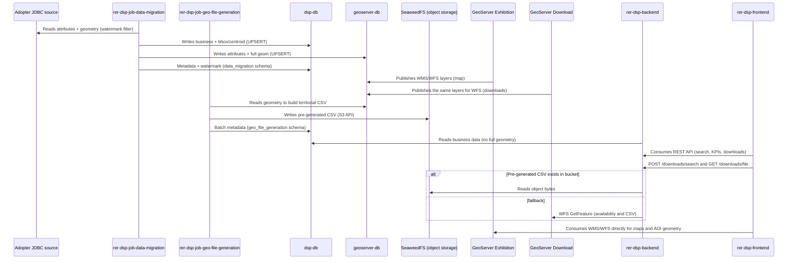

# Data flow

## How does data flow between components?

## Step-by-step explanation

1. **Job reads the adopter JDBC source.** `rer-dsp-job-data-migration` connects to the source database (datasource `source`) and reads attributes and geometries within the **watermark** window (`creation-date-column` + optional `updated-at-column`) and the `where-clause`.
2. **Dual-write to both destinations.** Each delta run writes simultaneously to:
   - `dsp-db` (datasource `target`): business data, `boundary_box`, and `centroid_coordinates` — **without** full geometry.
   - `geoserver-db` (datasource `geo-target`): the same attributes, but **with** full `geom`.
   The watermark advances in `data_migration.BATCH_JOB_EXECUTION_SYNC_STATE` only if the job finishes `COMPLETED`.
3. **Two GeoServers read geoserver-db.** Both publish FeatureTypes from the same `dsp-geoserver-db` and the same `mapLayersConfig.json`:
   - **GeoServer Exhibition** — WMS/WFS for map navigation.
   - **GeoServer Download** — WFS used by the backend for exports when there is no pre-generated CSV.
4. **Geo-file job and SeaweedFS (real adopter).** `rer-dsp-job-geo-file-generation` runs on a schedule (setup) when the `object-storage` profile is active. It does **not** read the watermark directly — the migration job owns the watermark. After each **successful** migration run, migration compares what changed since the previous watermark (same temporal window as the delta) and sets `requires_s3_file_regeneration` on affected level 2 and 3 territories in `dsp-db` — including parent municipalities when areas of interest changed. On first load (no watermark stored yet), all relevant territories are marked pending. On the next geo-file round, it lists only territories with that flag, reads features in `geoserver-db`, generates CSVs per configured theme/format, and publishes to **SeaweedFS** (`dsp-object-storage`, S3 API); when each territory finishes, it clears the flag and sets `last_generated_s3_file_at`. Spring Batch metadata for geo-file lives in the `geo_file_generation` schema on `dsp-db` (isolated from `data_migration`). If migration fails, flags are **not** changed — avoiding publishing downloads from incomplete data. In local demo without JDBC, object storage and geo-file are usually off; steps below that mention S3 do not apply.
5. **Backend serves the API from dsp-db.** `rer-dsp-backend` reads only `dsp-db` for business data; because that database has no full geometry, the API does not expose whole polygons — only bounding box and centroid, plus operational attributes. Click/selection interactions that use these lightweight representations may be slightly less precise than the map drawing (performance trade-off; see [Architecture — Data flow](overview.md#data-flow)).
6. **Downloads go through the backend.** The UI calls `POST /downloads/search` and `GET /downloads/file`. The backend validates the territory in `dsp-db`. If the pre-generated CSV exists in SeaweedFS, it returns those bytes; otherwise it queries GeoServer Download via WFS (internal URL on the Docker network). The browser does **not** download files directly from GeoServer or the bucket.
7. **Maps still consume GeoServer Exhibition directly.** `rer-dsp-frontend` consumes WMS/WFS from Exhibition to draw layers and load AOI geometry — separate from file downloads.

With object storage, heavy export usually leaves the critical path of GeoServer Download; Download WFS remains the fallback. Full geometry stays in a single PostGIS (`geoserver-db`).

Full column contract per database: [Databases](databases.md).
