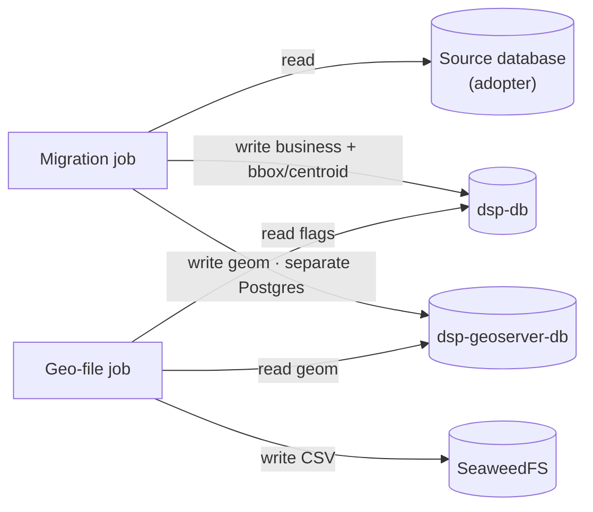
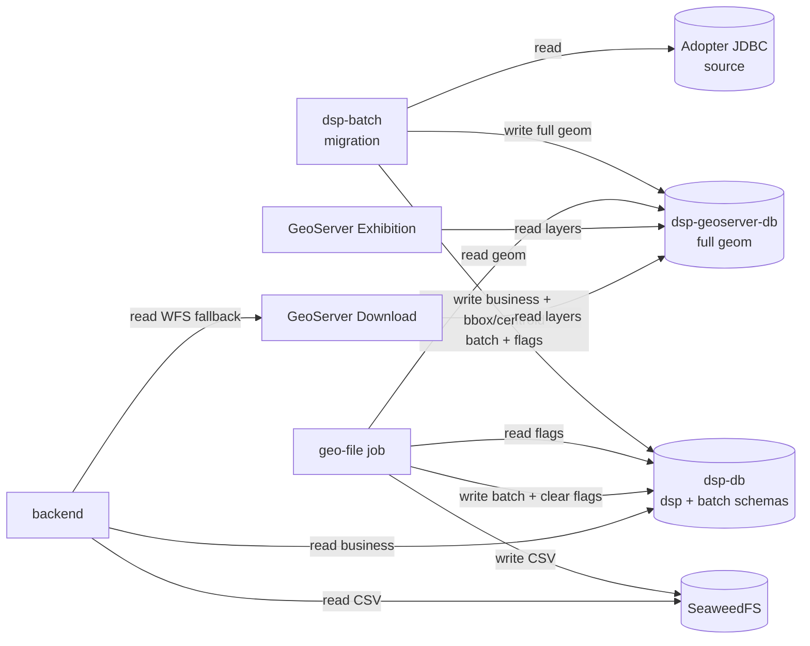
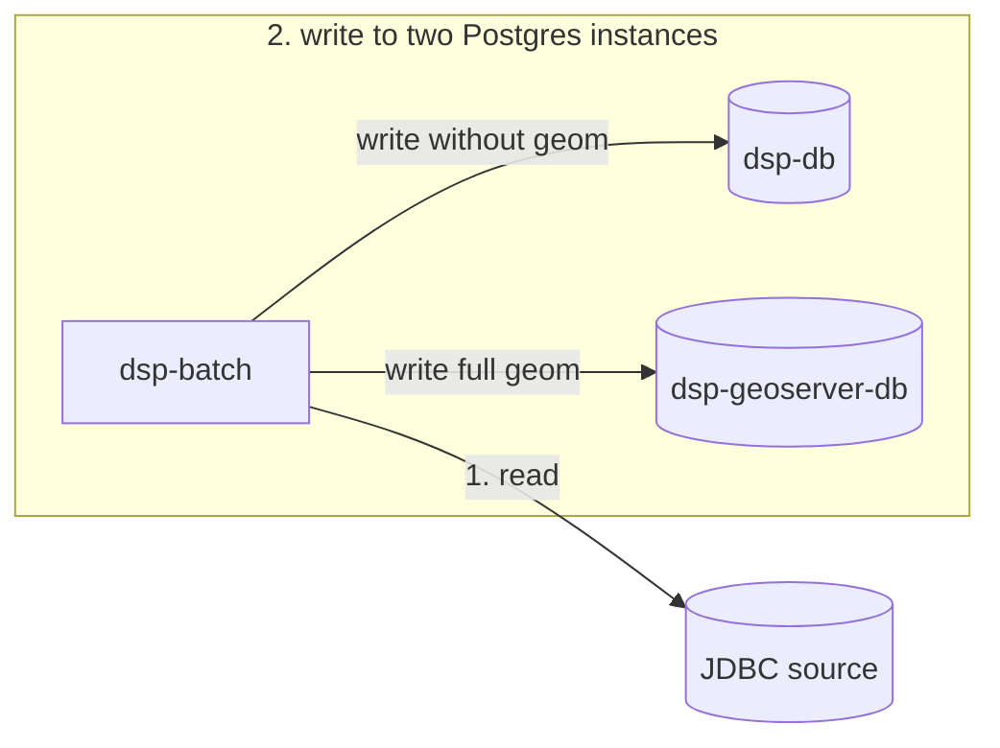

# Databases

Contract for **where** data lives in the DSP — from the adopter source to download files. Step-by-step between components is in [Data flow](data-flow.md); layer view in [Architecture](overview.md).

## Summary

- [All databases and repositories](#all-databases-and-repositories)
- [Compose Postgres detail](#compose-postgres-detail)
- [Diagram](#diagram)
- [Connection roles](#connection-roles)
- [Schema `dsp` — business and lightweight geo](#schema-dsp-business-and-lightweight-geo)
- [Batch schemas on `dsp-db`](#batch-schemas-on-dsp-db)
- [Territorial download pending work](#territorial-download-pending-work)
- [Readers and writers](#readers-and-writers)
- [Migration dual-write](#migration-dual-write)
- [SRID via YAML](#srid-via-yaml)
- [Spring prefixes (jobs)](#spring-prefixes-jobs)

---

## All databases and repositories

In the full DSP flow (real adopter with JDBC source), there are **four** distinct data destinations, plus the origin:

| Repository | Location | Technology | Role |
|-------------|-----------|------------|--------|
| **Source database** | Adopter infrastructure (outside Compose) | PostgreSQL/PostGIS or other JDBC-accessible database | Geospatial data from the organization you want to share on the platform — **read-only** by the migration job |
| **`dsp-db`** | `dsp-db` container in Compose | PostgreSQL + PostGIS | Platform operational data (API, search, KPIs), lightweight geo representations (bbox/centroid), territorial download flags, and job batch schemas |
| **`dsp-geoserver-db`** | **`dsp-geoserver-db`** container in Compose (**separate** Postgres, not `dsp-db`) | PostgreSQL + PostGIS | Same logical entities, but with **full `geom`** — only migration (ETL) and geo readers (GeoServers, geo-file) use this database for whole polygons |
| **Object storage** | `dsp-object-storage` container in Compose (profile `object-storage`) | SeaweedFS (S3-compatible API) | **Pre-generated** territorial download CSV files; the backend reads from here when they exist, instead of building everything via WFS on every request |

Each migration run performs **dual-write**: one operational destination (`dsp-db`, no full polygon) and **another database** (`dsp-geoserver-db`) only for integral geometry.

In the **local demo** ([Quick start](../guides/quick-start.md)) there is no external source database: `setup.sh` applies synthetic seed directly to both Postgres instances. Object storage and the geo-file job are usually off; small downloads may use GeoServer Download only.

---

## Compose Postgres detail

The two SQL databases are **separate Postgres instances** in Compose. They repeat the same logical tables in the `dsp` schema, but migration does **not** write `geom` to `dsp-db` — full geometry goes **only** to `dsp-geoserver-db` (detail in the [next section](#schema-dsp-business-and-lightweight-geo)).

| Compose service | Summary role |
|-----------------|----------------|
| **`dsp-db`** | Everything the API and batch jobs need without full polygon |
| **`dsp-geoserver-db`** | Everything the map and heavy geo export need with full `geom` |

Inside **`dsp-db`** there are **three schemas**:

| Schema | Content |
|--------|----------|
| `dsp` | Business: `territory_level_*`, `area_of_interest`, generic layers, etc. |
| `data_migration` | Migration Spring Batch + **watermark** (`BATCH_*`, `BATCH_JOB_EXECUTION_SYNC_STATE`) |
| `geo_file_generation` | Geo-file Spring Batch (`BATCH_*` — **no** watermark) |

Each batch job uses **its own schema** on the same Postgres so execution history does not mix.

---

## Diagram

Arrows follow **who performs the operation**: `read` and `write` leave the component (job, backend, GeoServer) and point to the database or repository.

---

## Connection roles

These are **datasource roles**, not extra databases. The migration job opens **four** Java connections: `source`, `target`, `geo-target`, and `batch` (the last on the same host as `target`, schema `data_migration`).

| Role | Service / schema | Use |
|-------|------------------|-----|
| **source** | External JDBC | Origin — read-only |
| **target** | `dsp-db` · schema `dsp` | Business + bbox/centroid writes; backend reads |
| **geo-target** | `dsp-geoserver-db` · schema `dsp` | Full `geom` read/write; GeoServers and geo-file |
| **batch** (migration) | `dsp-db` · `data_migration` | Spring Batch execution + watermark |
| **batch** (geo-file) | `dsp-db` · `geo_file_generation` | Geo-file Spring Batch execution |

The geo-file job also uses **target** (territory flags) and **geo-target** (export), with batch in `geo_file_generation`.

Object storage (SeaweedFS) is not Postgres: backend and geo-file access it via S3 API when the `object-storage` profile is active.

---

## Schema `dsp` — business and lightweight geo

The same logical tables exist on **both** Postgres instances (`territory_level_1`, `territory_level_2`, `territory_level_3`, `area_of_interest`, and configured layers). Territory IDs are `VARCHAR(64)`; AOI/layers use `VARCHAR(255)` for `id`.

| Column | PostGIS type | `dsp-db` | `dsp-geoserver-db` |
|--------|--------------|----------|---------------------|
| Attributes (`id`, `name`, FKs, …) | — | yes | yes |
| `created_at` / `updated_at` | `timestamptz` | yes | yes |
| `geom` | `geometry` | **no** | **yes** |
| `boundary_box` | `geometry(Polygon)` | **yes** | **no** |
| `centroid_coordinates` | `geometry(Point)` | **yes** | **no** |

The job derives `boundary_box` and `centroid_coordinates` at the source and writes them only to `dsp-db`. Full geometry goes to `geom` on geoserver-db.

`created_at` on the target is required (watermark base). `updated_at` is populated when the YAML declares `updated-at-column`.

Why not store the whole polygon in `dsp-db`? See the note in [Architecture — Data flow](overview.md#data-flow).

---

## Batch schemas on `dsp-db`

| Schema | Job | What is persisted |
|--------|-----|----------------|
| `data_migration` | `rer-dsp-job-data-migration` | `BATCH_*` history and watermark in `BATCH_JOB_EXECUTION_SYNC_STATE` (advances only after `COMPLETED`) |
| `geo_file_generation` | `rer-dsp-job-geo-file-generation` | `BATCH_*` history from pre-generation runs |

Init SQL for these schemas comes from `rer-dsp-core` (`dsp-db` and job images). Operational detail: [rer-dsp-core](../modules/core.md).

---

## Territorial download pending work

Columns only on `territory_level_2` and `territory_level_3` on **`dsp-db`**:

| Column | Function |
|--------|--------|
| `requires_s3_file_regeneration` | `true` = geo-file must regenerate files for this territory |
| `last_generated_s3_file_at` | Last time all enabled formats were published to the bucket |

Summary flow:

1. Migration processes the delta defined by the **watermark** (creation/update since last success).
2. If the run ends **`COMPLETED`**, it marks territories affected in the same time window (`requires_s3_file_regeneration = true`). On first load, it marks the relevant territorial set.
3. Geo-file, on the schedule configured in setup, processes only pending items, publishes to SeaweedFS, and clears the flag per territory when all formats finish.

If migration **fails**, flags do **not** change. More context: [rer-dsp-job-geo-file-generation](../modules/job-geo-file-generation/overview.md).

---

## Readers and writers

| Component | JDBC source | `dsp-db` | `dsp-geoserver-db` | Other |
|------------|------------|----------|---------------------|--------|
| Migration job | read | write `dsp` + `data_migration` | write `geom` | — |
| Geo-file job | — | **read** flags · **write** `geo_file_generation` and update flags | **read** `geom` | **write** CSV to SeaweedFS |
| Backend | — | **read** / **write** business (`dsp`) | — | **read** S3 · **read** WFS on Download (via API) |
| GeoServer Exhibition | — | — | **read** layers (WMS/WFS) | — |
| GeoServer Download | — | — | **read** layers (WFS) | — |
| Core | — | init SQL | init SQL | starts SeaweedFS with profile `object-storage` |

Both GeoServers use **only** `dsp-geoserver-db` (separate processes, same dataset).

---

## Migration dual-write

Each delta run performs **one read on the origin** and **two writes to different databases** (generic layers may write only to geo-target):

1. Read attributes + geometry from the JDBC source (watermark + `where-clause`).
2. UPSERT on **`dsp-db`**: attributes + `boundary_box` + `centroid_coordinates` — **without** `geom` column.
3. UPSERT on **`dsp-geoserver-db`** (separate Postgres): same attributes + **full `geom`**.

Incremental watermark: [Job overview](../modules/job-data-migration/overview.md#only-what-changed-since-last-time).

---

## SRID via YAML

SRID is not fixed in code. In core administrative unit DDL, `geom` may go without typmod; auto-generated AOI/layers may include SRID in `CREATE TABLE`.

| Step | Behavior |
|-------|----------------|
| YAML | Each block declares `srid` (e.g. `4674`, `4326`) |
| Read | `ST_Transform` to the block SRID before GeoJSON |
| Write | `ST_SetSRID(ST_Force2D(ST_GeomFromGeoJSON(?)), srid)` |

Different layers may use different SRIDs if source and YAML are aligned.

In the Brazilian context, SRID `4674` (SIRGAS 2000) is common for official geospatial data.

---

## Spring prefixes (jobs)

| Role | Property | Typical destination in core |
|-------|-------------|-------------------------|
| source | `spring.datasource.source` | Adopter JDBC (`DSP_SOURCE_*` variables in `.env`) |
| target | `spring.datasource.target` | `dsp-db`, schema `dsp` |
| geo-target | `spring.datasource.geo-target` | `dsp-geoserver-db`, schema `dsp` |
| batch (migration) | `spring.datasource.batch` | `dsp-db`, `currentSchema=data_migration` |
| batch (geo-file) | `spring.datasource.batch` | `dsp-db`, `currentSchema=geo_file_generation` |

Migration job overview: [Overview](../modules/job-data-migration/overview.md). Checks after load: [Post-migration validation](../modules/job-data-migration/post-migration-validation.md).
