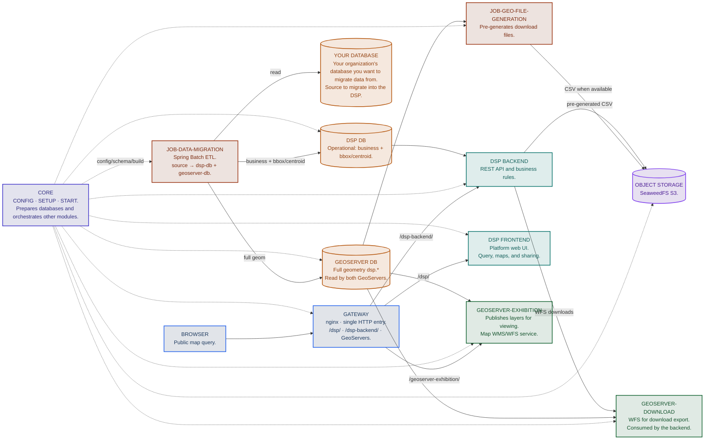
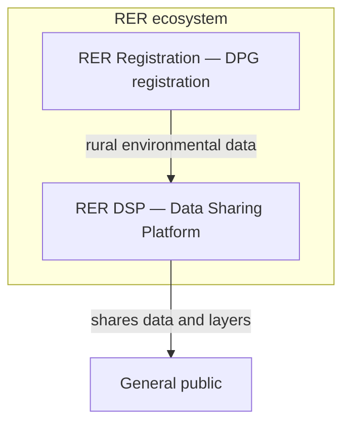
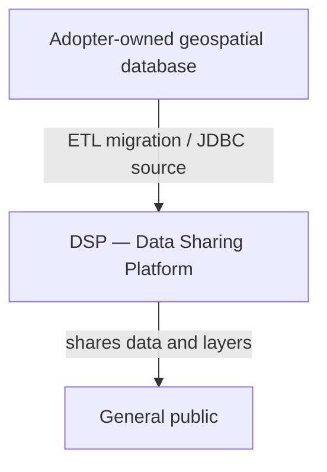
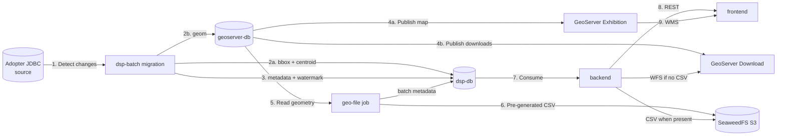

# [RER](https://www.digitalpublicgoods.net/r/rural-environmental-registry-registration-module) DSP architecture

Multi-layer, multi-repository view of the **Data Sharing Platform (DSP)** in the [**RER**](https://www.digitalpublicgoods.net/r/rural-environmental-registry-registration-module) ecosystem.

## Summary

- [Context](#context)
- [Component diagram](#component-diagram)
- [Principles](#principles)
- [Context view](#context-view)
- [Layers and responsibilities](#layers-and-responsibilities)
- [The core as orchestration layer](#the-core-as-orchestration-layer)
- [Data flow](#data-flow)
- [Databases](#databases)

---

## Context

The DSP is not a single monolith. It combines:

- **Applications** (frontend, backend)
- **Orchestration and configuration** (core)
- **Jobs** — migration/sync from the JDBC source (`rer-dsp-job-data-migration`) and pre-generation of download CSV in SeaweedFS object storage (`rer-dsp-job-geo-file-generation`, Compose profile `object-storage`)
- **Data infrastructure** (PostgreSQL/PostGIS, GeoServer)

The goal is to **share geospatial data** reliably, with a synchronized base from the adopter JDBC source — in the [RER](https://www.digitalpublicgoods.net/r/rural-environmental-registry-registration-module) ecosystem, that data is typically rural environmental data, but the architecture does not depend on that specific domain (see [What is the DSP?](../what-is-the-dsp.md)).

---

## Component diagram

All HTTP traffic enters through the **gateway**. Frontend, backend, and both GeoServers do not publish ports on the host — only the databases remain directly accessible, for inspection and for the ETL source.

---

## Principles

| Principle | Description |
|-----------|-------------|
| Separation by repository | Each capability evolves and versions independently |
| Documented source of truth | This wiki (`rer-dsp-docs`) is the cross-cutting reference |
| Core as orchestrator | Configuration, schema, and local stack startup come from `rer-dsp-core` |
| External configuration | Table/column mappings and UI labels live in files, not hardcoded |

---

## Context view

The DSP can be adopted in two distinct scenarios, depending on the adopter JDBC source ([what is the DSP?](../what-is-the-dsp.md)):

### Scenario 1 — DSP within the [RER](https://www.digitalpublicgoods.net/r/rural-environmental-registry-registration-module) ecosystem

The data source is [**RER** Registration](https://www.digitalpublicgoods.net/r/rural-environmental-registry-registration-module) itself (the [RER](https://www.digitalpublicgoods.net/r/rural-environmental-registry-registration-module) registration module, also a DPG). This is the original use of the DSP: sharing rural environmental data already collected in [RER](https://www.digitalpublicgoods.net/r/rural-environmental-registry-registration-module) registration with the general public.

### Scenario 2 — DSP outside [RER](https://www.digitalpublicgoods.net/r/rural-environmental-registry-registration-module), with another database

The data source is any geospatial system/database owned by the adopter — **with no dependency on [RER Registration](https://www.digitalpublicgoods.net/r/rural-environmental-registry-registration-module)**. The DSP is used generically, only as a sync, publication, and sharing platform.

!!! tip "Same architecture, different source"
    Both scenarios use exactly the same modules and the same sync mechanism — the only difference is where the adopter JDBC source comes from. Nothing in the core, backend, frontend, or jobs assumes the origin is [RER Registration](https://www.digitalpublicgoods.net/r/rural-environmental-registry-registration-module).

---

## Layers and responsibilities

| Layer | Components | Responsibility |
|--------|-------------|-----------------------|
| Orchestration / configuration | [rer-dsp-core](https://github.com/Rural-Environmental-Registry/rer-dsp-core) | Starts databases, GeoServers, gateway, and jobs (migration and geo-file); orchestrates build/config of other modules via Docker Compose |
| HTTP entry | Gateway nginx (`dsp-gateway`, in core) | Single entry point: routes to frontend, backend, and GeoServers; optional cache |
| Presentation | [rer-dsp-frontend](https://github.com/Rural-Environmental-Registry/rer-dsp-frontend) | Web/maps UI for query and sharing |
| API | [rer-dsp-backend](https://github.com/Rural-Environmental-Registry/rer-dsp-backend) | REST contracts, platform business data |
| Integration / ETL | [rer-dsp-job-data-migration](https://github.com/Rural-Environmental-Registry/rer-dsp-job-data-migration) | Syncs attributes and geometry from the adopter source to DSP databases |
| Download files | [rer-dsp-job-geo-file-generation](../modules/job-geo-file-generation/overview.md) | Reads geometries in `geoserver-db`, generates territorial CSV, writes to object storage (schedule defined in setup) |
| Object storage | SeaweedFS (`dsp-object-storage`, profile `object-storage`) | S3-compatible API; stores pre-generated CSVs the backend serves when they exist (local demo without JDBC usually omits this service) |
| Geo publication | GeoServer Exhibition + GeoServer Download | Exhibition: map WMS/WFS; Download: export WFS (same geoserver-db) |
| Persistence | PostgreSQL / PostGIS (2 databases in Compose) | `dsp-db` (business + one Spring Batch schema per job) and `dsp-geoserver-db` (geometries) |
| Documentation | [rer-dsp-docs](https://github.com/Rural-Environmental-Registry/rer-dsp-docs) (this wiki) | Onboarding and cross-cutting standards for all repositories |

---

## The core as orchestration layer

`rer-dsp-core` contains no application/domain code — its responsibility is exclusively **orchestration and configuration**:

- Starts the 2 Postgres/PostGIS databases, GeoServers (Exhibition + Download), nginx gateway, and migration and geo-file jobs via Docker Compose. Migration watermark in the `data_migration` schema on `dsp-db`.
- From the `./config.sh` wizard (6 question-driven steps; About on 6/6, optional), generates `adopter-config.yaml` and operational files (`installationConfig.json`, `mapLayersConfig.json`, `downloadThemesConfig.json`, `application.yaml`).
- Orchestrates build and startup of backend, frontend, migration job, and geo-file job.
- Has no runtime dependency on other modules — it needs them only at build/orchestration time.

Full operational detail: [rer-dsp-core](../modules/core.md).

---

## Data flow

1. **Ingestion / sync** — migration job detects changes by watermark and dual-writes: `dsp-db` (business + bbox/centroid) and `geoserver-db` (full `geom`). Migration Spring Batch metadata lives in the `data_migration` schema on `dsp-db`.
2. **Download pre-generation** — with object storage enabled (real adopter), the **migration watermark** defines which regions changed in the last successful sync; migration marks those territories on `dsp-db` (`requires_s3_file_regeneration`). The geo-file job processes only pending items: reads geometry in `geoserver-db`, publishes CSV to **SeaweedFS**, and clears the flag per territory. Geo-file batch metadata uses the `geo_file_generation` schema on the same `dsp-db`.
3. **Publication** — GeoServer Exhibition and GeoServer Download read **only** `geoserver-db` (isolated processes).
4. **Consumption via API** — backend reads `dsp-db` (no full polygons). For downloads, it prefers SeaweedFS bytes when the pre-generated file exists; otherwise queries **GeoServer Download** via WFS (internal Docker network, not through the gateway).
5. **Consumption via UI** — frontend consumes the backend API (search, KPIs, downloads) and, for maps, WMS/WFS from **GeoServer Exhibition**. Everything from the browser goes through the **gateway**, same origin.

!!! tip "Why not store full geometry in `dsp-db`?"
    Instead of storing full geometry (the whole polygon with all vertices) in `dsp-db`, the job stores only two simplified representations:

    - **`boundary_box`** (bbox) — the bounding rectangle of the geometry (minimum and maximum latitude/longitude).
    - **`centroid_coordinates`** — the center point of the geometry.

    This is a **performance** choice: queries, filters, and sorts using bbox/centroid (for example, "which records fall in this area" or proximity calculations) are much lighter to process than operating on full polygons, especially at large data volumes. The trade-off is that map selection and some interactions that depend on `dsp-db` are slightly less precise: a click slightly outside a property outline may still select it, or in rare cases overlap two properties — exact drawing remains in `geoserver-db` and GeoServer Exhibition. The API and UI (search, listing, KPIs) do not need the full polygon for most screens; full geometry stays isolated in the GeoServers database.

Step-by-step detail with sequence diagram: [Data flow](data-flow.md).

---

## Databases

Two Postgres instances in Compose (`dsp-db` operational + `dsp-geoserver-db` with full geometry). On `dsp-db`, the `dsp` schema serves the API; `data_migration` and `geo_file_generation` isolate each job's batch metadata (watermark only on migration). Territorial downloads use flags on `territory_level_2` / `_3` tied to the watermark — detail in [Databases](databases.md).

---
