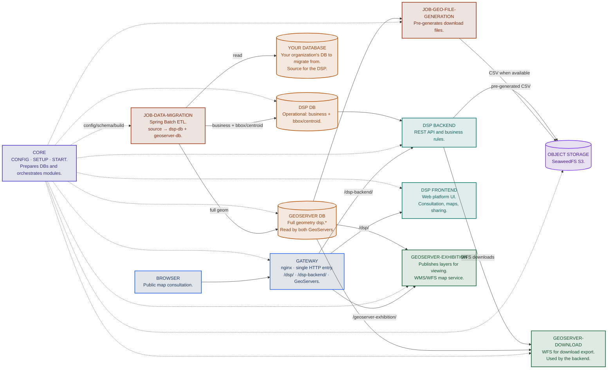

# DSP modules

## Which modules exist and what does each one do?

The DSP is made up of **6 application/job repositories** under [Rural-Environmental-Registry](https://github.com/Rural-Environmental-Registry) on GitHub, plus **infrastructure packaged in [rer-dsp-core](https://github.com/Rural-Environmental-Registry/rer-dsp-core)** (nginx gateway, two GeoServers, SeaweedFS object storage, and PostgreSQL/PostGIS databases). Each repository below evolves in its own git repo; the core orchestrates build and containers via Docker Compose.

| Module | Responsibility | Main technology | More details |
|--------|----------------|-----------------|--------------|
| [rer-dsp-core](https://github.com/Rural-Environmental-Registry/rer-dsp-core) | Orchestration and configuration: `./config.sh`, `./setup.sh`, `./start.sh`; starts databases, **gateway**, two **GeoServers** (Exhibition + Download), **object storage** (profile `object-storage`), and orchestrates builds of the other modules | Docker Compose, Python 3 (wizard) | [More details](modules/core.md) |
| [rer-dsp-backend](https://github.com/Rural-Environmental-Registry/rer-dsp-backend) | REST API—business data, territories, downloads (WFS or CSV pre-generated in S3) | Java 21 + Spring Boot 3.4.2 + PostGIS | [More details](modules/backend.md) |
| [rer-dsp-frontend](https://github.com/Rural-Environmental-Registry/rer-dsp-frontend) | Web UI—search, KPIs, interactive map | Vue 3 + Vite + TypeScript | [More details](modules/frontend.md) |
| [rer-dsp-job-data-migration](https://github.com/Rural-Environmental-Registry/rer-dsp-job-data-migration) | Geospatial ETL—synchronizes the adopter JDBC source with `dsp-db` and `geoserver-db` (dual-write) | Java 21 + Spring Batch | [More details](modules/job-data-migration/overview.md) |
| [rer-dsp-job-geo-file-generation](https://github.com/Rural-Environmental-Registry/rer-dsp-job-geo-file-generation) | Pre-generates territorial download files and publishes to object storage; keeps consultation fast at high volume (e.g. [SICAR](https://www.car.gov.br/) scale) | Java 21 + Spring Boot / Batch | [More details](modules/job-geo-file-generation/overview.md) |
| [rer-dsp-docs](https://github.com/Rural-Environmental-Registry/rer-dsp-docs) (this repository) | Central ecosystem documentation | Zensical | — |

!!! note "Local demo vs real adopter"
    **Local demo (evaluation only)**—In [Quick start](guides/quick-start.md) you run the DSP with a synthetic Brazil seed: sample squares on the map, filters, KPIs, and site navigation, without connecting your organization’s database. For that goal (exploring the UI and consultation flow) you **do not need** the geo-file job or object storage (S3). If someone requests a download in the demo, the backend can use GeoServer Download (WFS), which is acceptable at small volume with fictitious data.

    **Real adopter (production and performance)**—When the JDBC source has millions of records and large territories (like the [Brazilian CAR public consultation](https://consulta.car.gov.br/)), generating export files on demand in GeoServer and the database on every click overloads the stack and slows downloads. That is why the full installation enables the Compose profile `object-storage`: after each successful migration, the **watermark** indicates which territories changed and migration marks in `dsp-db` which regions need a new file; [rer-dsp-job-geo-file-generation](https://github.com/Rural-Environmental-Registry/rer-dsp-job-geo-file-generation) **pre-generates** only those CSVs and stores them in SeaweedFS (`dsp-object-storage`). The backend serves those bytes when available, with fallback to WFS. Downloads stay fast and GeoServer is reserved mainly for maps (WMS/WFS for viewing), not repeated bulk exports.

    Summary: local test = map + site with sample data, no S3; real high-volume use = S3 + pre-generation recommended. Details: [Architecture](architecture/overview.md) and [Full installation](guides/full-installation.md).

## How modules connect

## Which technologies are used?

| Layer | Technology |
|-------|------------|
| Orchestration | Git, Docker 24+, Docker Compose v2, Python 3 |
| HTTP entry | nginx (`dsp-gateway`, defined in core) |
| Backend | Java 21, Spring Boot 3.4.2, Gradle, JPA/Hibernate + hibernate-spatial, springdoc-openapi |
| Frontend | Vue 3 (Composition API), TypeScript, Vite, Tailwind CSS, [`@rural-environmental-registry/map_component`](https://www.npmjs.com/package/@rural-environmental-registry/map_component) (Leaflet) |
| ETL and geo-file | Java 21, Spring Boot 3.4.2, Spring Batch, Maven |
| Databases | PostgreSQL + PostGIS |
| Object storage | SeaweedFS (S3 API), profile `object-storage` |
| Map publication | GeoServer 3.0.0 (Exhibition + Download) |
