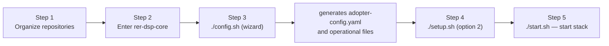

# Full installation

## How do I run a full installation on my own infrastructure?

This guide targets an **infrastructure administrator** responsible for putting the DSP in production, migrating real data from an organization (the "adopter").

## Infrastructure requirements

| Requirement | Detail |
|---------------|---------------------------------------------------------------------------------------------------------------------------------|
| Bash shell | Core scripts are pure `bash` — native on Linux and macOS; on Windows requires WSL2 (no native support via PowerShell/cmd) |
| Git | if sibling repositories are not cloned yet; scripts can clone them automatically |
| Docker | 24+ with Compose v2 |
| Python | Python 3 (used by the `./config.sh` wizard) |
| Main port | Gateway **`8026`** — single HTTP entry (frontend, API, GeoServers). Databases on the host, admin only: `20654` (`dsp-db`), `20656` (`dsp-geoserver-db`); with object storage, `8333` (SeaweedFS) |
| Storage | Persistent volumes for the 2 Postgres/PostGIS databases (`dsp-db`, `dsp-geoserver-db`); Spring Batch metadata in schemas `data_migration` and `geo_file_generation` inside `dsp-db` |

## Installation flow



### Step 1 — Organize repositories

The DSP is split into **sibling repositories** on GitHub. We recommend creating a `rer-dsp` folder and cloning everything **at the same level** — `rer-dsp-core` expects other modules at `../rer-dsp-backend`, `../rer-dsp-frontend`, etc.

#### Option A — simplest flow (recommended)

Create the folder, clone only the core, and enter it. The `./config.sh`, `./setup.sh`, and `./start.sh` scripts detect missing sibling repositories and offer to clone them automatically next to the core:

```bash
mkdir rer-dsp && cd rer-dsp
git clone https://github.com/Rural-Environmental-Registry/rer-dsp-core.git
cd rer-dsp-core
```

After you accept automatic cloning in the scripts, the typical tree looks like this:

```text
rer-dsp/
├── rer-dsp-core/          ← you work here (config.sh, setup.sh, start.sh)
├── rer-dsp-backend/
├── rer-dsp-frontend/
├── rer-dsp-job-data-migration/
└── rer-dsp-job-geo-file-generation/
```

#### Option B — manual clone

Clone all application repositories as sibling folders inside `rer-dsp`:

```bash
mkdir rer-dsp && cd rer-dsp
git clone https://github.com/Rural-Environmental-Registry/rer-dsp-core.git
git clone https://github.com/Rural-Environmental-Registry/rer-dsp-backend.git
git clone https://github.com/Rural-Environmental-Registry/rer-dsp-frontend.git
git clone https://github.com/Rural-Environmental-Registry/rer-dsp-job-data-migration.git
git clone https://github.com/Rural-Environmental-Registry/rer-dsp-job-geo-file-generation.git
```

Result:

```text
rer-dsp/
├── rer-dsp-core/
├── rer-dsp-backend/
├── rer-dsp-frontend/
├── rer-dsp-job-data-migration/
└── rer-dsp-job-geo-file-generation/
```

### Step 2 — Enter the core

If you are not already inside the core:

```bash
cd rer-dsp/rer-dsp-core
```

You do not need to create or copy `.env` manually. The file is generated automatically on first run of `./config.sh` or `./setup.sh`, from `.env.example`, when it does not exist yet.

### Step 3 — `./config.sh`

The person running the script is **guided by questions in the terminal**: at each stage the wizard explains the field, where the value is used, and shows the default or saved value (Enter keeps what is in brackets). This way you can configure **everything the adopter needs** — data source, ETL, text, map, KPIs, and **customize** the UI without editing JSON/YAML by hand.

The flow has **6 guided steps** (the last, About, is optional):

| Step | Content |
|-------|----------|
| **1** | Source database (JDBC) |
| **2** | Tables, columns, SRID, and generic layers |
| **3** | Application text, date formats |
| **4** | UI: hierarchy, screens, map, fixed layer styles |
| **5** | KPIs (colors, area unit, themes 0–4) |
| **6** | Optional About (Markdown tabs) |

`./config.sh` writes the **adopter source of truth** to `config/adopter/adopter-config.yaml` — **this** is the file meant for manual editing or importing ready YAML. On reapply (wizard or option **1 — Reapply**), `./config.sh` **generates operational files** consumed by backend, GeoServers, and jobs. **Do not edit those operational files by hand:** they are overwritten on every `./config.sh`.

**Without the wizard:** copy a ready `adopter-config.yaml` to `config/adopter/` (use `.example` as reference) or edit **only** that YAML. The DSP does **not** read the adopter at runtime — backend, GeoServers, and jobs use generated JSON/YAML.

!!! warning "Manual edits: only `adopter-config.yaml` + reapply"
    Configuration changes must go in `config/adopter/adopter-config.yaml`. Other files in `config/` generated by `./config.sh` **must not** be edited by hand — they will be **replaced** when you run `./config.sh` (option **1 — Reapply** or **2 — Edit**).

    After changing the adopter YAML, run `./config.sh` to regenerate operational files. Then rebuild the stack (`./setup.sh` / `./start.sh`) so Docker images pick up the new files.

!!! tip "Rebuild after configuring"
    Generated files are copied into Docker images at build time. After `./config.sh`, run `./setup.sh` or `./start.sh` so backend, GeoServers, and jobs use the new configuration.

### Step 4 — `./setup.sh`

On **Step 3 — Setup mode**, choose:

- **Option 1 — Demonstration** (see also [Quick start](quick-start.md)):
  - Loads sample data (simplified Brazil map) into local databases.
  - Starts databases, applies seed, and **publishes map layers** on both GeoServers.
  - Does **not** connect to your organization's database and does **not** enable background import jobs.
  - At the end, indicates running `./start.sh` to open the site and API.

- **Option 2 — Real adopter (organization data)**: requires `./config.sh` first. The script checks that import configuration is ready and asks **how source data will change over time** (English text in the terminal: *How will your source data be updated over time?*):

| Script choice | Behavior |
|-------------------|---------------|
| **1 — One-time load** | Imports data **now**, during this `./setup.sh`, from the source database into DSP databases. Publishes map layers when done. The import job **shuts down** afterward — no automatic sync with the source. |
| **2 — Living source** | Performs the **first import** like item 1 and publishes the map. Then asks **how often** to fetch new data from the source (for example daily, every few hours or minutes) and **how often** to generate ready download files, if you use object storage. Keeps jobs running in the background per those schedules. |
| **3 — Deferred first load** | You specify **date and time** of the first import (and time zone). Databases stay empty until then; GeoServers start **without** map layers until the job runs. The import job waits. Then the script asks: **(a)** after that load data **no longer changes** — import once at the scheduled time, publish the map, and may generate ready downloads **once** after that import; **(b)** after the first load the source **keeps changing** — at the chosen time import starts and, from then on, the same schedule type as item 2 (sync and download generation). |

At the end of the real flow, setup **saves chosen schedules** in the `.env` file. Running `./setup.sh` again with option **2** repeats the questions, using what is already saved as default.

- **Option 3 — Stack status / cleanup / exit**:
  - Lists project container status and known URLs.
  - Optionally removes containers, volumes, and images **for this** project (explicit confirmation).
  - Does **not** run seed, migration, or start backend/frontend.

### Step 5 — `./start.sh`

Used **after** `./setup.sh`, with databases, GeoServers, and jobs (when present) **already running**. `./start.sh` starts **only** the site, API, and HTTP entry point — it does **not** import data again or republish layers. Import and demo stay in `./setup.sh` or schedules saved in setup.

At the end, open **http://localhost:8026/dsp/** in the browser (or the URL `./start.sh` shows if you changed port or address in `.env`).

Full detail for each option and sub-flow: [rer-dsp-core](../modules/core.md#the-three-scripts).

## Next steps

| I want to... | Page |
|----------|--------|
| Understand detailed data flow | [Data flow](../architecture/data-flow.md) |
| See all core environment variables | [rer-dsp-core](../modules/core.md) |
