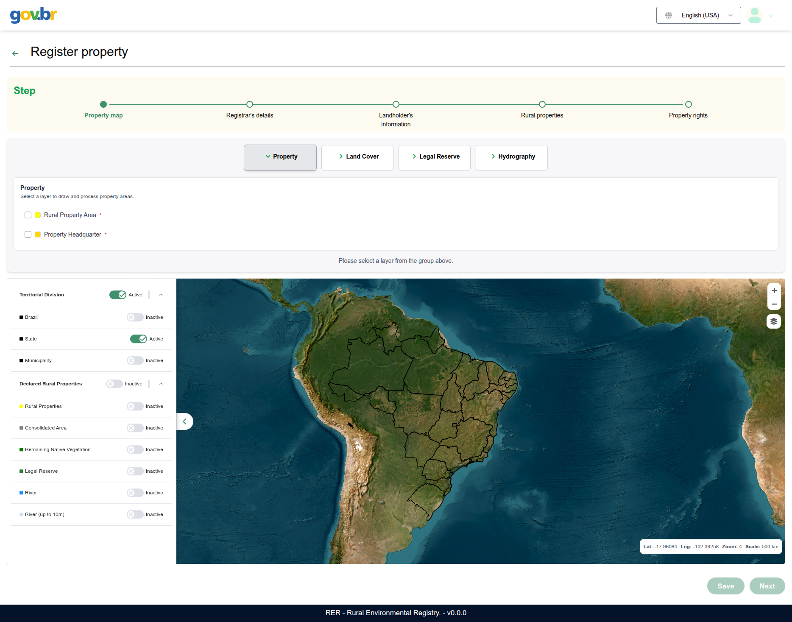
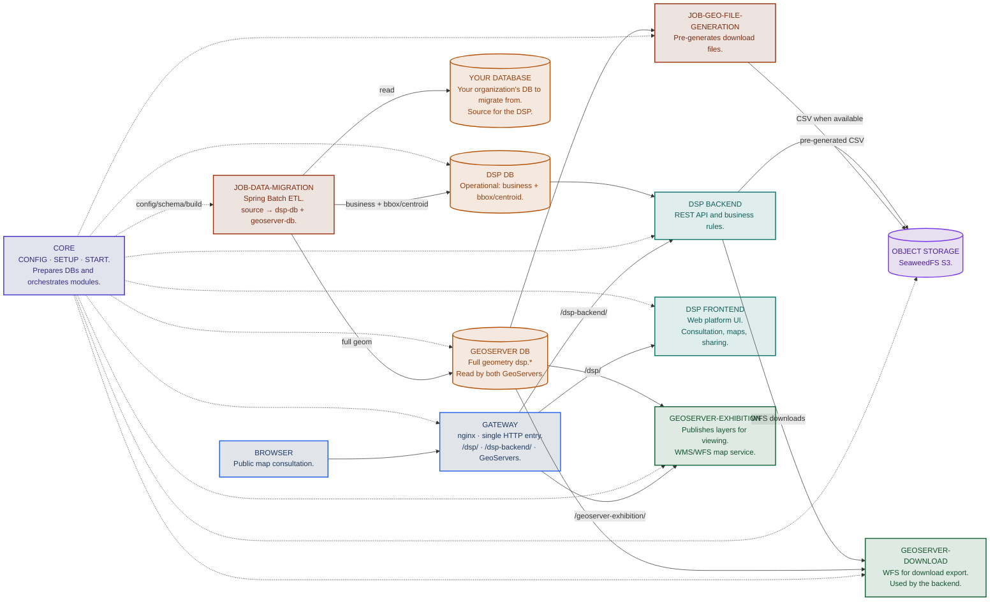

# [RER](https://www.digitalpublicgoods.net/r/rural-environmental-registry-registration-module) DSP — Documentation

Documentation portal for the **Data Sharing Platform (DSP)** in the [**RER**](https://www.digitalpublicgoods.net/r/rural-environmental-registry-registration-module) ecosystem (*Rural Environmental Registry*).

## [RER](https://www.digitalpublicgoods.net/r/rural-environmental-registry-registration-module) and DSP in one sentence each

[**RER**](https://www.digitalpublicgoods.net/r/rural-environmental-registry-registration-module) (*Rural Environmental Registry*) is a digital public good (DPG) for registering geospatial environmental information declared on rural properties. The Rural Environmental Registry (CAR) system, enhanced in partnership with Dataprev, was [launched at COP30 by Brazil’s Ministry of Management and Innovation as the first Brazilian government digital public good](https://www.dataprev.gov.br/noticias/na-cop30-mgi-lanca-car-como-primeiro-bem-publico-digital-do-governo-brasileiro) in the Digital Public Goods Alliance (DPGA) international catalog.

In the **Brazilian context**, the [RER](https://www.digitalpublicgoods.net/r/rural-environmental-registry-registration-module) registration module corresponds to the **Pre-filled Registration Module** of [SICAR](https://www.car.gov.br/): owners and responsible parties register and update rural properties with pre-filled data and integration across public databases.

*Caption: [RER](https://www.digitalpublicgoods.net/r/rural-environmental-registry-registration-module) registration module UI (pre-filled registration), with a map to locate and register the rural property.*

The **DSP** (*Data Sharing Platform*) is the platform that **shares, visualizes, and publishes** that environmental data for the general public. Although it serves [RER](https://www.digitalpublicgoods.net/r/rural-environmental-registry-registration-module), it is not limited to it and can be used in other contexts in a straightforward way. Its architecture combines a REST API, a web frontend, PostgreSQL/PostGIS databases, GeoServer, and data migration and synchronization jobs.

In the **Brazilian context**, the DSP corresponds to the [CAR public consultation](https://consulta.car.gov.br/): a interface where anyone consults declared environmental data on registered rural properties on a map, with filters, indicators, and geographic layers.

*Caption: DSP public consultation home screen—map, territorial hierarchy, and property search (equivalent to CAR public consultation in the Brazilian context).*

## High-level architecture

!!! tip "Where to start"
    The operational entry point is the `rer-dsp-core` repository: use `./config.sh`, `./setup.sh`, and `./start.sh` to bring up the stack with Docker Compose (PostgreSQL/PostGIS databases, nginx gateway, Exhibition and Download GeoServers, backend, frontend, and migration job).

    With a real JDBC source, the core also starts object storage (SeaweedFS) and the geo-file job (pre-generated download CSV), via the Compose profile `object-storage`. In [Quick start](guides/quick-start.md) (demo with synthetic seed) those two services are not included—downloads use GeoServer Download.

## Where to start

| Goal | Page |
|------|------|
| Understand what the DSP is and whether it fits your organization | [What is the DSP](what-is-the-dsp.md) |
| Learn about the 6 modules and how they connect | [DSP modules](dsp-modules.md) |
| Try the DSP: run a local demo in minutes (synthetic seed, evaluation only) | [Quick start](guides/quick-start.md) |
| Install everything on your own infrastructure | [Full installation](guides/full-installation.md) |

## Documentation map

| Section | Content |
|---------|---------|
| [What is the DSP](what-is-the-dsp.md) | Purpose, problem solved, use cases |
| [DSP modules](dsp-modules.md) | Responsibility and technology of each module |
| [Quick start](guides/quick-start.md) | Local demo for testing—synthetic seed, no external database |
| [Installation guides](guides/full-installation.md) | Full installation with a real JDBC source |
| [Architecture](architecture/overview.md) | Layers, data flow, databases |
| [Module reference](modules/core.md) | Technical detail per repository |

---

This documentation (`rer-dsp-docs`) is the **single technical documentation source** for the DSP ecosystem—other repositories do not maintain their own `docs/` folders.
