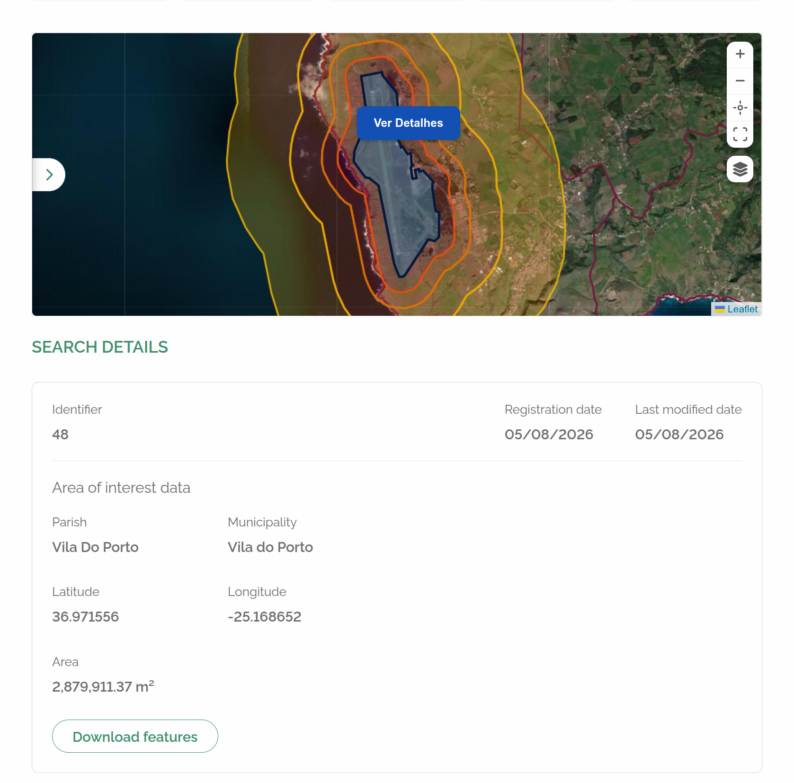

# rer-dsp-backend

This module is part of the [DSP](../index.md) — see the full documentation in [rer-dsp-docs](../index.md). The information below covers this module only.

## Purpose

The `rer-dsp-backend` is the DSP REST API: it exposes business data, territorial hierarchy, downloads, and map configuration to the frontend and other consumers.

## Responsibilities

- Serve business data from the operational database (`dsp-db`) — never full geometry.
- Expose installation configuration (labels, hierarchy, screens, KPIs) via an external file, without changing code.
- Expose map layer configuration (base maps and layers) consumed by the frontend map component.
- Proxy WFS to GeoServer Download for search and CSV file download on the Downloads screen.

## Stack

| Item | Value |
|------|--------|
| Language / runtime | Java 21 |
| Framework | Spring Boot 3.4.2 |
| Build | Gradle |
| ORM | JPA/Hibernate + hibernate-spatial + PostGIS |
| API documentation | springdoc-openapi |
| Boilerplate | Lombok |

## How to run

```bash
./gradlew bootRun
```

Or via Docker, orchestrated by `rer-dsp-core` — which offers two modes: [demo](../guides/quick-start.md) (synthetic seed, no external database) or [full installation](../guides/full-installation.md) (adopter data via JDBC source). In Docker the container does not publish a port on the host: the API is reached through the core gateway at `/dsp-backend`.

## Environment variables

Defined with defaults in `src/main/resources/application.properties`.

| Variable | Purpose |
|----------|--------|
| `SERVER_SERVLET_CONTEXT_PATH` | API context path (default `/dsp-backend`). The gateway uses the same prefix externally, with no rewrite |
| `DSP_CORS_ALLOWED_ORIGINS` | Allowed CORS origins. Through the gateway the frontend calls the API on the same origin; this covers external consumers and local dev |
| `DSP_INSTALLATION_CONFIG_FILE` | Path to the installation configuration JSON |
| `DSP_MAP_LAYERS_FILE` | Path to the map layers JSON |
| `DSP_DOWNLOAD_THEMES_FILE` | Path to the download themes JSON (`downloadThemesConfig.json`) |
| `DSP_ABOUT_CONFIG_FILE` | Path to the About page index JSON (`about-config.json`) |
| `DSP_ABOUT_CONTENT_DIR` | Path to the folder with Markdown files for About page tabs |
| `DSP_GEOSERVER_WFS_BASE_URL` | GeoServer Download WFS base URL for download export |
| `DSP_ABOUT_CONFIG_FILE` / `DSP_ABOUT_CONTENT_DIR` | Custom About page (generated by the core `./config.sh`) |
| `SPRING_DATASOURCE_URL` / `SPRING_DATASOURCE_USERNAME` / `SPRING_DATASOURCE_PASSWORD` | Connection to `dsp-db` |
| `SPRING_JPA_HIBERNATE_DDL_AUTO` | Schema management (keep `none`) |

## REST endpoints

| Endpoint | Description |
|----------|-------------|
| `GET /config/installation` | Installation configuration: hierarchy, screens, KPIs, and `screens.home.detail.fields` |
| `GET /geoServices/getRegions` | List of regions |
| `GET /state/getAll` | List of states |
| `GET /state/getCitiesByUf/{idState}` | Cities by state |
| `GET /state/getUfsByRegion/{region}` | States by region |
| `GET /downloads/themes` | Themes available for download (catalog in `downloadThemesConfig.json`) |
| `GET /config/about` | Configurable About page content: `enabled`, `bannerTitle`, and `tabs[]` (`id`, `label`, `content` as Markdown) |
| `POST /downloads/search` | Search items by hierarchy/theme (level 2 required, level 3 optional) |
| `GET /downloads/file` | CSV file download via WFS proxy |
| `GET /map/getBaseMaps` | Configured base maps |
| `GET /map/getLayers` | Map layers (via `DSP_MAP_LAYERS_FILE`) |
| `POST /totalizer/` | Totalizers |
| `GET /totalizer/getDeatilsByIdentifier/{identifier}` | Detail by identifier |
| `GET /totalizer/getDetailsByCoordinates` | Detail by coordinates |
| `GET /territory/options` | Territory options by hierarchy |
| `GET /territory/boundary-box` | Territory bounding box |

## Installation configuration (labels, screens, KPIs)

Territorial **data** (L1/L2/L3 units) lives in tables `dsp.territory_level_*`. The **display names** for filters ("Level 1", "Region", etc.) come from an external JSON file, with no code changes required.

| Item | Value |
|------|--------|
| Default file | `rer-dsp-backend/src/main/resources/installationConfig.json` |
| Property | `dsp.installation-config.file` |
| Environment variable | `DSP_INSTALLATION_CONFIG_FILE` |

Accepted formats: `classpath:installationConfig.json` (default), `file:/etc/dsp/installationConfig.json`, or an absolute path on disk.

The frontend consumes `GET /config/installation` to build filters, screen titles, and KPI cards. Configuration is loaded once and cached in backend memory — after changing the file, restart the application.

`screens.home.detail.fields` is the exclusive list for the AOI detail panel (order preserved). Each item has `field` (column name in the destination, or `calculated.*` key) and `label`. Empty or missing list: the API returns `[]` and detail returns `attributes: {}` — the current UI stays on the structural DTO. Non-empty list: detail resolves `attributes` with exactly those keys.



*Caption: area-of-interest detail panel when `screens.home.detail.fields` is empty or missing — the UI uses the structural DTO (`latitude`/`longitude`, territory, alteration date) instead of the `attributes` map.*

`field` keys:

- AOI migration columns: `id`, `created_at`, `updated_at`, `area`, and extras from `persist_columns` (e.g. `nome`, `latitude`).
- Calculated in the application (not a column): `calculated.latitude`, `calculated.longitude`, `calculated.territory_level_2_name`, `calculated.territory_level_3_name`.

`GET /totalizer/getDeatilsByIdentifier/{identifier}` and `GET /totalizer/getDetailsByCoordinates` return the structural DTO (compatible with the current front: centroid `latitude`/`longitude`, `territory`, `alterationDate`, etc.) **and** the `attributes` map. Keys in `attributes` match `fields[].field` (not camelCase). Dates in `attributes` use `yyyy-MM-dd`. `otherIds` and download are not included in `attributes`.

The physical last-alteration column in `dsp-db` and WFS is `updated_at`. The structural detail JSON keeps `alterationDate`; in `attributes` the key is `updated_at`.

JSON structure:

```json
{
  "hierarchy": [
    { "key": "level1", "label": "Level 1", "placeholder": "Select level 1", "order": 1 },
    { "key": "level2", "label": "Level 2", "placeholder": "Select level 2", "order": 2 },
    { "key": "level3", "label": "Level 3", "placeholder": "Select level 3", "order": 3 }
  ],
  "screens": {
    "home": { "...": "title, hierarchyKeys, identifier, detail, ..." },
    "downloads": { "...": "title, hierarchyKeys, theme, section titles, ..." }
  },
  "kpis": {
    "maxCards": 5,
    "primaryCode": "AREA_OF_INTEREST",
    "cards": [ { "code": "...", "label": "...", "unitOfMeasurement": "...", "accentColor": "...", "order": 1, "required": true } ]
  },
  "areaOfInterest": {
    "areaUnit": "ha",
    "areaUnitLabel": "ha"
  },
  "formats": {
    "date": "dd/MM/yyyy",
    "dateTime": "dd/MM/yyyy HH:mm:ss"
  },
  "map": {
    "initialView": {
      "mode": "territorial_bbox",
      "latitude": null,
      "longitude": null,
      "zoom": null
    }
  }
}
```

Example with manual mode:

```json
"map": {
  "initialView": {
    "mode": "manual",
    "latitude": 39.5,
    "longitude": -8.0,
    "zoom": 7
  }
}
```

Example with planet mode:

```json
"map": {
  "initialView": {
    "mode": "planet",
    "latitude": null,
    "longitude": null,
    "zoom": null
  }
}
```

| Block | Purpose |
|-------|--------|
| `hierarchy` | Labels and placeholders for levels `level1` / `level2` / `level3` — **keys** are stable (match `GET /territory/options?level=…`); change `label`, not `key` |
| `screens.home` / `screens.downloads` | Which levels each screen uses and field labels. In `screens.home.detail.fields`, the exclusive AOI detail list (`field` + `label`) |
| `kpis` | Home cards (labels, units, colors) |
| `map.initialView` | Map open/reset mode on Home. Required `mode`: `territorial_bbox` (frame via `GET /territory/boundary-box`; if no L1/L2/L3 territorial level is configured in ETL, `./config.sh` writes `planet` explicitly), `manual` (requires `latitude`, `longitude`, `zoom`), or `planet` (always center `[0,0]` zoom `0`) |
| `areaOfInterest` | Property area unit/label — the area itself comes from the source migration; the DSP does not compute or convert units |
| `formats` | Date/time display patterns in the UI |

Between frontend and backend, dates always travel as `yyyy-MM-dd` (date only) or `yyyy-MM-dd'T'HH:mm:ss` (date + time); the UI converts to `formats.date`/`formats.dateTime` for display.

What does **not** go in this file: territorial units (`dsp.territory_level_*` tables + migration job), WMS/GeoServer layers (`GET /map/getBaseMaps` and `GET /map/getLayers`), download catalog (`downloadThemesConfig.json`), and ETL source→destination mapping (migration job `application.yaml`).

## Downloads (GeoServer Download WFS)

The download theme catalog comes from `downloadThemesConfig.json`, generated by the core `./config.sh` from `area_of_interest` and `etl.layers[]`. The backend:

1. Validates territory (level 2 required, level 3 optional) in `dsp-db`.
2. Builds a CQL filter per theme.
3. Queries **GeoServer Download** via WFS (`GetFeature` with `resultType=hits` for search; `outputFormat=csv` for download) at `DSP_GEOSERVER_WFS_BASE_URL`.
4. For themes with features in the extent, reads `updated_at` via WFS (`sortBy`, `count=1`) and fills `lastUpdate` in the response (business date).
5. Reads the `generated-at` metadata on the storage object (`HeadObject` for the theme’s first format) and fills `lastFileGenerated`. The job writes that instant in the same UTC ISO as the CSV (`yyyy-MM-dd'T'HH:mm:ss'Z'`, example `2026-09-10T16:55:19Z`), without fractional seconds — it does not use `Instant.toString()`. Without an object or with storage down, the field is `null`.
6. Returns status or CSV bytes to the frontend — the browser does not access GeoServer for download files.

If `updated_at` is missing in WFS, search still works and `lastUpdate` is `null` (UI shows `—`). Without `generated-at`, `lastFileGenerated` is also `null` (UI shows `—`). Files already in the bucket only get `generated-at` on the next successful generation.

Download CSV uses **UTC** date/time, ISO 8601 text `yyyy-MM-dd'T'HH:mm:ss'Z'` (example `2026-08-18T18:43:48Z`), without fractional seconds. The job writes in that pattern; GeoServer Download uses the same `csvDateFormat` with `TZ=UTC`. The backend only forwards bytes — it does not reconvert dates. Files already in storage only appear in the new format on the next generation.

## About page configuration

Institutional About page content can be configured by the adopter via index file + Markdown, same pattern as installation configuration.

| Item | Value |
|------|--------|
| Property (index) | `dsp.about-config.config-file`, default `file:../rer-dsp-core/config/about/about-config.json` |
| Property (content) | `dsp.about-config.content-dir`, default `file:../rer-dsp-core/config/about/` |
| Environment variables | `DSP_ABOUT_CONFIG_FILE`, `DSP_ABOUT_CONTENT_DIR` |

`AboutConfigService` reads the index JSON (`file:`/`classpath:`/plain path) and, for each tab, reads the corresponding `.md` inside `contentDir`, building the response; the result is cached. If `enabled=false` in the index or the index file is missing, the response has `enabled=false` and empty `tabs` — the application does not fail for that. Malformed JSON or a missing referenced `.md` results in a 500 error (same pattern as `InstallationConfigService`).

`GET /config/about` is exposed by `AboutController`/`AboutApi` and returns `AboutConfigResponse` (`enabled`, `bannerTitle`, `tabs: [{ id, label, content }]`), where `content` is already the Markdown read from the corresponding file. The first tab in the list is the one opened by default in the frontend.

## Integration with other modules

- Depends on **core** for the `dsp` schema in Postgres and for external files `installationConfig.json` and `mapLayersConfig.json`.
- Consumed by **frontend** via REST API (`VITE_DSP_API_URL`).
- Reads **dsp-db** only — never accesses `geoserver-db` directly.
- Queries **GeoServer Download** via HTTP/WFS for file downloads.

See also: [Databases](../architecture/databases.md), [Data flow](../architecture/data-flow.md).
