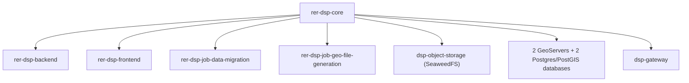
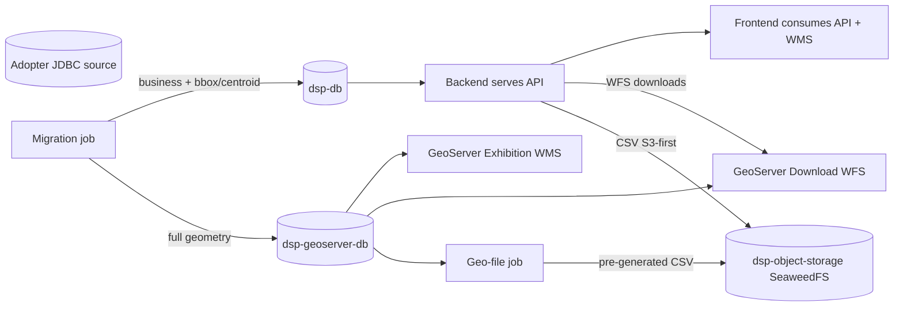
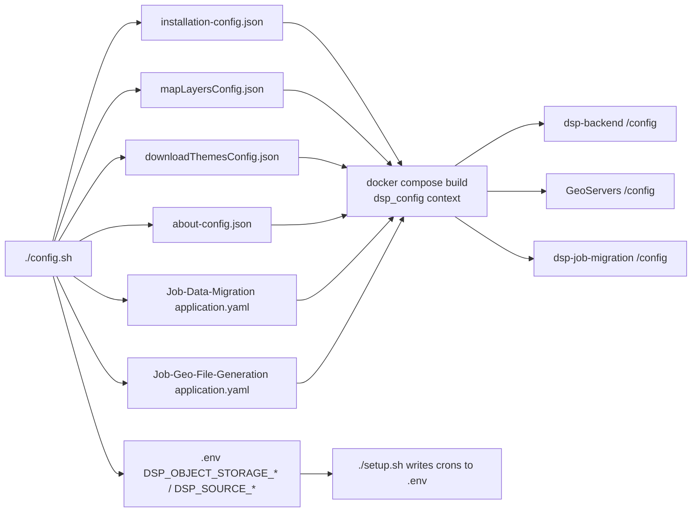

# rer-dsp-core

This module is part of the [DSP](../index.md) — see the full documentation in [rer-dsp-docs](../index.md). The information below covers this module only.

## Purpose

The `rer-dsp-core` is the DSP Docker Compose orchestration hub. It **does not contain application/domain code** — its responsibility is to prepare and start infrastructure (databases, GeoServers, gateway, migration and geo-file jobs) and orchestrate builds of the other modules.



## Responsibilities

- Sample adopter configuration.
- Sample About page content (`config/about/`).
- Database initialization SQL.
- GeoServer Exhibition (map) and GeoServer Download (export WFS).
- nginx gateway (`dsp-gateway`) as the single entry point for the stack.
- SeaweedFS object storage (`dsp-object-storage`, profile `object-storage`) and geo-file job (`dsp-job-geo-file-generation`, same profile) — required for a real adopter; Brazil Demo does not start these services.
- Migration job (`dsp-job-migration`, profile `migration`).
- Three operational scripts: `./config.sh`, `./setup.sh`, `./start.sh`.
- Automatic clone of sibling repositories when missing (with folder structure preview before confirmation). `./config.sh` also clones the job if missing.

## Prerequisites

| Requirement | Detail |
|-------------|--------|
| Bash shell | Scripts (`config.sh`, `setup.sh`, `start.sh`) are plain `bash`. Native on Linux and macOS; on Windows requires WSL2 (no native PowerShell/cmd support). |
| Git | Clone missing sibling repositories (automatic via scripts or manual); only needed if repos do not exist yet |
| Docker 24+ with Compose v2 | Used to start databases, GeoServer, and other modules |
| Python 3 | Used by the `./config.sh` wizard |

## The three scripts

### `./config.sh`

Interactive wizard that writes `config/adopter/adopter-config.yaml` and, on reapply, generates operational files (list below). Entry: `./config.sh` (no arguments).

- `config/installation/installation-config.json` — hierarchy, screens, KPIs, `map.initialView`, AOI detail panel.
- `config/map/mapLayersConfig.json` — WMS groups and layers, SRIDs.
- `config/downloads/downloadThemesConfig.json` — Downloads screen themes.
- `config/about/about-config.json` — About page index (when enabled); Markdown in `config/about/`.
- `config/Job-Data-Migration/application/application.yaml` — datasources and ETL mapping.
- `config/Job-Geo-File-Generation/application/application.yaml` — object storage (SeaweedFS); **no** cron in YAML.
- `.env` — `DSP_SOURCE_*`, `DSP_OBJECT_STORAGE_*`, and other keys the wizard fills.

These operational artifacts **must not be edited manually** — they are derived and **regenerated** on every reapply of `./config.sh`. Always adjust `config/adopter/adopter-config.yaml` (wizard or editor) and then reapply.

Run with no arguments (`./config.sh`). Before the wizard, the script checks sibling repositories (`rer-dsp-backend`, `rer-dsp-frontend`, `rer-dsp-job-data-migration`, `rer-dsp-job-geo-file-generation`) and offers to clone what is missing.

The wizard does **not** ask for batch job schedule nor write `DSP_MIGRATION_CRON` or `DSP_GEO_FILE_GENERATION_CRON`. Reapply (option **1**) does not change crons in `.env`.

**First run** (no `adopter-config.yaml` yet): the script asks how to configure:

| Option | Action |
|--------|--------|
| 1 | **Guided configuration** — step-by-step wizard |
| 2 | **Existing configuration** — place your `adopter-config.yaml` at the indicated path and reapply later (option 1 in the menu below) |

**Later runs** (when YAML already exists):

| Option | Action |
|--------|--------|
| 1 | Reapply existing configuration without going through the wizard again |
| 2 | Edit existing configuration (reopens the wizard prefilled with current values) |
| 3 | Start over from template (`adopter-config.yaml.example`), discarding the current file |

!!! tip "Two ways to configure"
    You can follow the **step-by-step wizard** (recommended — each question explains the field and where the value is used, showing current/default in brackets and keeping it if you press Enter), **or edit directly** `config/adopter/adopter-config.yaml` in a text editor, using `config/adopter/adopter-config.yaml.example` as a structure reference. After editing the adopter, run `./config.sh` and choose **1 — Reapply** to regenerate operational JSON/YAML. Do **not** edit `installation-config.json`, `mapLayersConfig.json`, `downloadThemesConfig.json`, or job `application.yaml` files by hand.

!!! warning "Rebuild after changing configuration"
    Operational files generated in `config/` are **copied into Docker images at build** (`select-runtime-config.sh` + `dsp_config` context). After `./config.sh`, run `./setup.sh` or `./start.sh` to rebuild containers that consume that configuration (backend, GeoServers, migration job).

The wizard is split into **6 stages**. In each, the operator answers guided questions (field and impact explained) until adopter configuration and customization are covered:

| Stage | What is configured | Impact |
|-------|-------------------|--------|
| **1 — Source database** | Source JDBC URL, read user/password (`DSP_SOURCE_DB_USER` / `DSP_SOURCE_DB_PASSWORD`) | Migration job and `.env` |
| **2 — Tables, columns, and layers** | For L1/L2/L3/AOI: table, PK (**one** column; composite not supported), `parent_key` (L2/L3), name, geometry, SRID, `created_at_column` (required), `updated_at_column` (optional), `where_clause`. On AOI: `territory_level_3_column`, `additional_columns`. Generic layers in `etl.layers[]` (ETL + map + downloads in one block) | ETL plan, `mapLayersConfig.json`, and `downloadThemesConfig.json`. Extra layers: [Generic layer migration](job-data-migration/generic-layers.md) |
| **3 — Application** | Area-of-interest KPI label (`area_of_interest`), date and date-time formats | Dashboard, listings, and detail |
| **4 — Interface** | Hierarchy labels, screen titles, AOI detail panel fields, `map.initialView` (`territorial_bbox` / `manual` / `planet`), groups and styles for fixed map layers | Frontend, layer selector, and styles published on GeoServer |
| **5 — KPIs** | Card colors, AOI area unit, count and mapping of theme KPIs (0–4) | KPI cards and job calculations |
| **6 — About** (optional) | Enable About page, banner title, tabs (label + `.md` / `.markdown` file; wizard can copy from any folder to `config/about/`) | `about-config.json` + content in `config/about/` |

In the terminal the wizard shows **5 numbered stages** (1–5) plus the optional **About** block at the end — in documentation, About counts as **stage 6**.

**Object storage (SeaweedFS)** is not asked in the wizard. Credentials and endpoint live in `environment.object_storage` in `adopter-config.yaml` (see `adopter-config.yaml.example`); `./config.sh` copies this to `DSP_OBJECT_STORAGE_*` in `.env` on reapply. The geo-file job **schedule** (`DSP_GEO_FILE_GENERATION_CRON`) comes from `./setup.sh`, not this stage.

`./config.sh` (option **2 — edit**) reopens the same 6-stage wizard with current values filled in.

#### Advanced SQL in `source_table` (fixed levels)

In the wizard, `source_table` must be `schema.table`. For SQL subqueries (JOINs, aliases), edit `adopter-config.yaml` directly with a folded YAML block (`>-`), as in `adopter-config.yaml.example`. Column names below must match `SELECT` aliases. Then `./config.sh` → **Reapply**.

#### Unified generic layers (`etl.layers[]`)

Each item feeds **three destinations** from a single configuration:

| Field in `adopter-config.yaml` | Where used |
|--------------------------------|------------|
| `source_table`, role columns, `where_clause`, `srid` | `application.yaml` → migration job |
| `layer_name`, `display_name`, `group_key`, `active_default`, `color`, `fill_color` | `mapLayersConfig.json` → map and GeoServer |
| (derived from `layer_name` + `display_name`) | `downloadThemesConfig.json` → Downloads screen (`strategy: aoi_linked`) |

The same `source_table` may appear **more than once** if `layer_name` (and thus destination table `dsp.<name>`) differs. When adding another layer with the same source in the wizard, structure fields (PK, FK, geometry, dates, SRID) are **reused** as defaults.

To **not** migrate or display a layer, remove it from `etl.layers[]` and reapply — do not use `enabled: false` in adopter YAML.

In **stage 6/6**, the adopter can decline the About page; then it stays disabled. If enabled, the wizard validates Markdown extension and file existence and generates tab ids (`tab-1`, `tab-2`, …) in `about-config.json`.

!!! tip "Protected contract"
    The generated file contains only adopter-editable fields. Internal DSP contract keys (WMS layer IDs, target table names, KPI codes) stay fixed in core templates and are not exposed in the wizard.

#### About page (`config/about/`)

The `config/about/` folder holds sample About page content for the frontend: `about-config.json.example` (sample index) and demo Markdown (`*.quickstart.md.example`, copied in Demonstration mode). The normal wizard flow is to point to a Markdown file anywhere on the machine, which is copied to `config/about/`.

Adopter YAML (`config/adopter/adopter-config.yaml` / `.yaml.example`) has an `about` section with fields:

| Field | Purpose |
|-------|---------|
| `enabled` | Enables/disables custom About page |
| `banner_title` | Title shown on the page banner |
| `tabs` | List of `{label, file}` — in the wizard, `file` can be from any folder (copied to `config/about/`); on manual YAML edit, only the filename already in `config/about/` (absolute paths or paths outside the folder are rejected on apply) |

`apply_config()` generates `config/about/about-config.json` with automatic ids (`tab-1`, `tab-2`, …) from tab order. The backend reads these files at `/config/about/` **inside the image** (copied at build). Variables: `DSP_ABOUT_CONFIG_FILE` and `DSP_ABOUT_CONTENT_DIR` (`.env.example`).

### `./setup.sh`

Prepares databases, GeoServer, and (real flow) the first migration. Runs with no arguments and shows a menu with **three options**:

| Option | Action |
|--------|--------|
| **1 — Demonstration** | Synthetic Brazil seed, **no** JDBC source or migration job. For exploring the UI or evaluating the stack. |
| **2 — Real adopter (ETL via JDBC)** | Requires `./config.sh` first. Asks **when** and **how** migration should run (submenu below). Writes to `dsp-db` + `dsp-geoserver-db`. |
| **3 — Status / cleanup / exit** | Container status and URLs; optionally removes Docker resources for the project. Does not start or migrate. |

#### Option 2 submenu — migration plan

**1. When should the initial load run?**

| Choice | Effect |
|--------|--------|
| **Run now** | First migration **during** this `./setup.sh` |
| **Schedule for later** | Databases stay empty on setup; first load at `DSP_MIGRATION_SCHEDULED_AT` |

**2. How should migration behave afterward?**

| Choice | Run now | Schedule for later |
|--------|---------|-------------------|
| **One-time** | `once`: migrates on setup and **stops** the job container | `scheduled-once`: waits for date/time, migrates once, publishes GeoServers, and exits |
| **Continuous (periodic re-sync)** | `continuous`: migrates on setup and keeps the container with **supercronic** on `DSP_MIGRATION_CRON` | `continuous` + `DSP_MIGRATION_SCHEDULED_AT`: first load at chosen time, then cron |

In **Continuous** mode, the script asks **How often should the data be synchronized after the initial migration?**: every day at a time; every N hours; or every N minutes (1–59, useful for local testing). The *Schedule for later* time is reused if the choice is “every day”.

Next (still setup step 3, option 2), it asks for the download file **pre-generation cron** — **5-field** Unix expression for `DSP_GEO_FILE_GENERATION_CRON` (default: current `.env` value or `0 2 * * *`). It should sit in a window **after** periodic migration when `DSP_MIGRATION_CRON` exists. The adopter does not type the migration expression manually; for pre-generation, enter the cron directly or accept the default with Enter.

Migration and pre-generation values are written to `.env` at the **end** of setup (step 9), along with `DSP_MIGRATION_*`. Re-running `./setup.sh` (real adopter) repeats the questions, using `.env` as default.

Migration timezone: `DSP_MIGRATION_TZ` in `.env` (see `.env.example`). Pre-generation inherits `DSP_MIGRATION_TZ` when `DSP_GEO_FILE_GENERATION_TZ` is empty.

| Combination | `DSP_MIGRATION_EXECUTION_MODE` | Job container after setup |
|-------------|-------------------------------|---------------------------|
| Run now + One-time | `once` | Stopped |
| Schedule + One-time | `scheduled-once` | Active until load; then exits |
| Run now + Continuous | `continuous` | Active (supercronic) |
| Schedule + Continuous | `continuous` + `DSP_MIGRATION_SCHEDULED_AT` | Active (wait, then supercronic) |

If `config/Job-Data-Migration/application/application.yaml` is still identical to the template (`.example`), `setup.sh` stops with an error — run `./config.sh` or edit the file first.

#### Databases and layer publication

Before migrating, the script **waits for PostgreSQL full initialization** (`pg_isready` + `dsp` and `data_migration` schemas created by init SQL).

| Initial load | GeoServers at end of setup |
|--------------|----------------------------|
| **Run now** (migration on setup) | `populate_geoserver.sh` publishes layers on both GeoServers (REST) |
| **Schedule for later** | GeoServers start **without** layers; `publish_geoservers.sh` in the job entrypoint runs after the **first scheduled load** succeeds |

AOI and generic layers exist on GeoServers only after the job populated `geoserver-db`.

### `./start.sh`

Use **after** `./setup.sh`. It does not run migration, seed, GeoServer populate, or start databases/jobs — it only **rebuilds and starts** `dsp-backend`, `dsp-frontend`, and `dsp-gateway` (with `docker compose … --no-deps`, so infra is not restarted via `depends_on`).

| Script step | What it does |
|-------------|--------------|
| 1 — Prerequisites | Docker; create/validate `.env` |
| 2 — Repositories | Checks `rer-dsp-backend` and `rer-dsp-frontend` (`DSP_BACKEND_PATH` / `DSP_FRONTEND_PATH`, default `../…`) |
| 3 — Config on disk | Requires `installation-config.json`, `mapLayersConfig.json`, and `downloadThemesConfig.json` (valid; typically from `./config.sh` or demo quickstart) |
| 4 — Infrastructure | **Only verifies** expected containers are running (fails with hint if not). Demo: two databases + two GeoServers. Real adopter: same core +, per `.env`, migration job, `dsp-object-storage`, and geo-file job |
| 5 — Site URL | Shows public frontend URL (`dsp_public_base_url` + `VITE_BASE_URL`) |
| 6 — Application | Build/up of backend, frontend, and gateway |
| At end | Stack summary, URLs, and tips (including geo-file when applicable) |

Map layers and first data load remain **`./setup.sh`** responsibility (or the scheduled job afterward). If you ran `docker compose down` without `-v`, `./start.sh` does **not** restart databases or GeoServers — follow the command the script prints on error or run `./setup.sh` again.

## Databases and GeoServer

Only databases publish a port on the host. HTTP services are reachable only through the gateway. The two jobs do not expose HTTP — they start via Compose profile.

| Service | Access | Role |
|---------|--------|------|
| dsp-db | port 20654 | Operational database — business + bbox/centroid. Spring Batch metadata: schema `data_migration` (migration job) and schema `geo_file_generation` (geo-file job) |
| GeoServer DB (dsp-geoserver-db) | port 20656 | Full geometry `dsp.*` |
| Migration job (`dsp-job-migration`) | profile `migration`, no HTTP port | ETL from JDBC source to dsp-db and geoserver-db |
| Object storage (`dsp-object-storage`) | profile `object-storage`, host port `8333` (optional) | SeaweedFS (`weed mini`) — DSP S3 API. Required for real adopter |
| Geo-file job (`dsp-job-geo-file-generation`) | profile `object-storage`, no HTTP port | Pre-generates download CSV in SeaweedFS. Required for real adopter |
| GeoServer Exhibition | via gateway, `/geoserver-exhibition/` | Map WMS/WFS from geoserver-db |
| GeoServer Download | via gateway, `/geoserver-download/` | Download WFS (consumed by backend) |

## Dual-write flow



## Gateway (`dsp-gateway`)

nginx container that is the single entry point for the stack. Frontend, backend, and both GeoServers do not
publish a port on the host — everything enters through `DSP_GATEWAY_HOST_PORT` (default `8026`).

Configuration lives in `config/Gateway/nginx/default.conf.template`, is **copied into the image** on `docker compose build` (`/etc/nginx/templates/`) and processed by `envsubst` when the container starts, substituting only `DSP_*` variables. Volume `dsp_gateway_cache` holds cache only, not templates.

| External route | Internal target |
|----------------|-----------------|
| `/` | redirects to `/dsp/` |
| `/dsp/` | `dsp-frontend:8080` |
| `/dsp-backend/` | `dsp-backend:8080` (follows `DSP_BACKEND_CONTEXT_PATH`) |
| `/geoserver-exhibition/` | `dsp-geoserver-exhibition:8080/geoserver/` |
| `/geoserver-download/` | `dsp-geoserver-download:8080/geoserver/` |
| `/gateway/health` | local nginx response |

Both GeoServers respond at `/geoserver` internally, so each gets its own external
prefix and a `rewrite`. Each also gets `PROXY_BASE_URL` with its public URL so
GetCapabilities and web UI links are correct.

Because the gateway resolves upstreams at runtime via Docker DNS, it starts even if some service
is down — it returns `502` instead of failing on boot. That enables demo mode in
`./setup.sh`, which does not start backend or frontend.

### Cache

Cache is configured but **off** by default. It covers only WMS/WFS endpoints
(`/geoserver-exhibition/<workspace>/wms`, `/wfs` and equivalents under `/geoserver-download/`), which have
no session — GeoServer web UI and REST are excluded so admin login is not broken.

To enable, set `DSP_GATEWAY_CACHE_BYPASS` empty in `.env` and recreate the container:

```bash
# .env
DSP_GATEWAY_CACHE_BYPASS=
DSP_GATEWAY_CACHE_TTL=10m

docker compose --env-file .env up -d --force-recreate dsp-gateway
```

Header `X-Cache-Status` (`HIT`, `MISS`, `BYPASS`) is on every GeoServer response for
checking behavior. To clear cache, remove volume `dsp_gateway_cache`.

## Default URLs

| Service | URL |
|---------|-----|
| Frontend | http://localhost:8026/dsp/ |
| Backend API | http://localhost:8026/dsp-backend |
| GeoServer Exhibition | http://localhost:8026/geoserver-exhibition/web/ |
| GeoServer Download | http://localhost:8026/geoserver-download/web/ |
| Gateway health | http://localhost:8026/gateway/health |

## Relevant environment variables (core `.env`)

`.env` is created automatically on first run of `./config.sh`, `./setup.sh`, or `./start.sh` (from `.env.example`). You do not need to copy it manually.

`./config.sh` writes JDBC, SRID, and `DSP_OBJECT_STORAGE_*` (from `environment` in adopter YAML) to `.env`. Migration and geo-file **schedules** come from `./setup.sh` (real adopter). Understanding the variables below helps customize the installation and troubleshoot.

| Variable | Purpose |
|----------|--------|
| `DSP_SOURCE_JDBC_URL` | Adopter data source JDBC URL (database to migrate) |
| `DSP_SOURCE_DB_USER` / `DSP_SOURCE_DB_PASSWORD` | JDBC source credentials |
| `DSP_MIGRATION_EXECUTION_MODE` | `once`: load on setup and stop job. `continuous`: supercronic on `DSP_MIGRATION_CRON`. `scheduled-once`: one load at `DSP_MIGRATION_SCHEDULED_AT` |
| `DSP_MIGRATION_CRON` | 5-field Unix cron generated by setup (e.g. `0 */6 * * *` or `*/2 * * * *`). Only `continuous` |
| `DSP_MIGRATION_SCHEDULED_AT` | Date/time of first load when setup chooses **Schedule for later** |
| `DSP_MIGRATION_TZ` | IANA timezone for the clock (`.env.example`) |
| `DSP_GEO_FILE_GENERATION_EXECUTION_MODE` | `continuous` (default): supercronic on `DSP_GEO_FILE_GENERATION_CRON`. `once`: one run via `compose run` |
| `DSP_GEO_FILE_GENERATION_CRON` | 5-field Unix cron for geo-file job (e.g. `0 2 * * *`). Set in `./setup.sh` (real adopter), **not** in `./config.sh` |
| `DSP_GEO_FILE_GENERATION_TZ` | Pre-generation timezone; empty inherits `DSP_MIGRATION_TZ` |
| Core 2-database credentials | User/password for dsp-db and dsp-geoserver-db |
| `DSP_GEOSERVER_WFS_BASE_URL` | GeoServer Download WFS URL on Docker network (backend → download) |
| `DSP_PUBLIC_BASE_URL` | Public stack URL (`http://localhost:8026`). Feeds WMS/WFS URLs from `./config.sh` and GeoServers’ `PROXY_BASE_URL` |
| `DSP_GATEWAY_HOST_PORT` | Gateway HTTP port (default `8026`) |
| `DSP_GATEWAY_CACHE_BYPASS` / `DSP_GATEWAY_CACHE_TTL` | Enable/disable nginx cache and TTL |
| `DSP_CORS_ALLOWED_ORIGINS` | Allowed origins for backend CORS |
| `DSP_ABOUT_CONFIG_FILE` / `DSP_ABOUT_CONTENT_DIR` | About index and Markdown folder (default `file:/config/about/…`) |
| `DSP_OBJECT_STORAGE_ENDPOINT` | When set, enables geo-file job (`profile=geo-file`) |
| Frontend build args | `VITE_BASE_URL`, `VITE_DSP_API_URL` — base path and API URL used in image build |
| `DSP_OBJECT_STORAGE_*` / `DSP_OBJECT_STORAGE_HOST_PORT` | SeaweedFS internal endpoint (`http://dsp-object-storage:8333`), bucket, credentials, and host port for diagnostics — derived from `environment.object_storage` on `./config.sh` reapply (not asked in wizard). Brazil Demo leaves endpoint empty |
| `DSP_BACKEND_PATH` / `DSP_FRONTEND_PATH` / `DSP_JOB_MIGRATION_PATH` / `DSP_JOB_GEO_FILE_GENERATION_PATH` | Sibling repository paths used in build orchestration |

See also: [Full installation](../guides/full-installation.md), [Databases](../architecture/databases.md).

## Generated configuration structure

`config/adopter/adopter-config.yaml` is the central file produced by the `./config.sh` wizard. From it are derived operational files consumed by the backend (`installationConfig.json`, `mapLayersConfig.json`, `downloadThemesConfig.json`, `about-config.json`) and the migration job (`application.yaml`), so each module does not need isolated manual configuration.

The `./config.sh` wizard produces a single `adopter-config.yaml` and derives all operational artifacts consumed by other modules. `downloadThemesConfig.json` enters this pipeline as the theme catalog for the Downloads screen and backend WFS proxy. `about-config.json` enters as the content index (banner + tabs) for the frontend About page.



- **`./config.sh`** — adopter entry point; wizard, reapply, or recreate `adopter-config.yaml` and generate operational JSON/YAML listed above.
- **`select-runtime-config.sh`** — on Docker build, picks active file or `.example` and copies to `/config` inside the image.
- **`installation-config.json`** — labels, hierarchy, screens, KPIs, and `screens.home.detail.fields` (`DSP_INSTALLATION_CONFIG_FILE`). That array does **not** go to the job `application.yaml`.
- **`mapLayersConfig.json`** — WMS groups and layers; published on GeoServers by `populate_geoserver.sh`.
- **`downloadThemesConfig.json`** — download themes (AOI + `etl.layers[]`); `wfsBaseUrl` at `${DSP_PUBLIC_BASE_URL}/geoserver-download/dsp/wfs`.
- **`about-config.json`** — About index (`enabled`, `bannerTitle`, `tabs` with ids `tab-1`, `tab-2`, …).
- **`application.yaml`** — ETL plan. Copied to job image at build (with entrypoint and GeoServer publish scripts).
- **`config/Job-Geo-File-Generation/application/application.yaml`** — S3 for pre-generation job (no cron; schedule only in `.env` via `./setup.sh`).
- **Images `dsp-backend`, GeoServers, `dsp-job-migration`, databases, and `dsp-gateway`** — configs and init SQL copied at build via `dsp_config`; volumes hold data only (and gateway cache).
- **Image `dsp-object-storage`** — SeaweedFS (`weed mini`) with credentials in `s3.json` in the image. Volume `dsp_object_storage_data` holds objects; internal volume size and count are computed by `weed mini` from free space on the Docker volume.

See also: [Data flow](../architecture/data-flow.md) (runtime) and [rer-dsp-backend](backend.md) (download environment variables).
