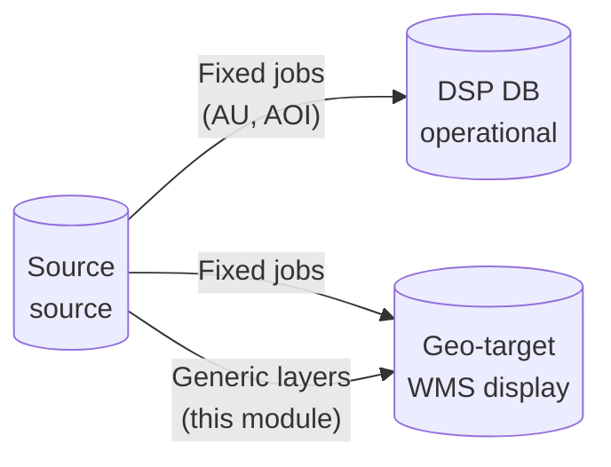
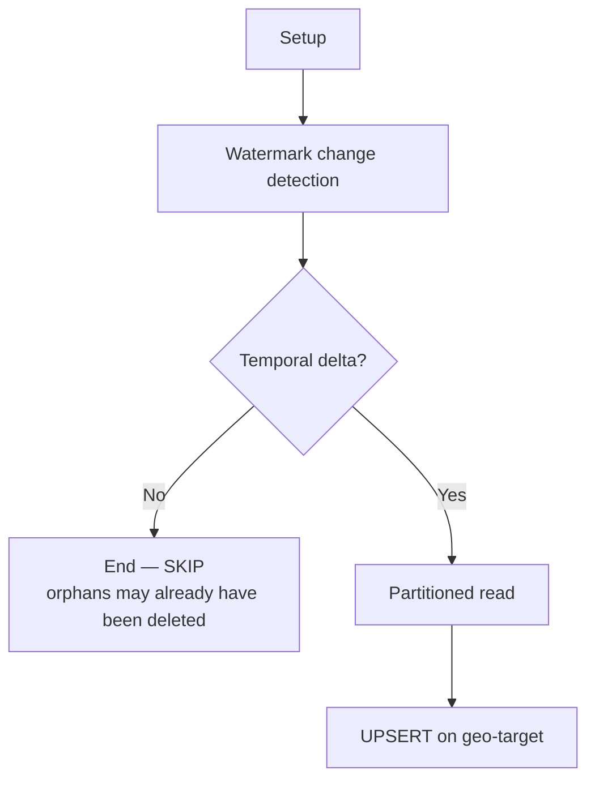

# rer-dsp-job-data-migration — Generic layer migration

Tutorial guide for the **geographic layers** module (`batch.layers`) of the [`rer-dsp-job-data-migration`](overview.md) job. Job overview: [Overview](overview.md).

---

## What this module does

The job reads **extra PostGIS tables** in the source database and replicates their features in the **geo-target** database (display / WMS).

You specify role columns (PK, link to AOI, creation date, geometry). The job discovers the rest of the schema and creates the destination table.

| You specify in YAML | The job discovers |
|---------------------|-------------------|
| Source table name | Other columns and types (via introspection + `additional-columns`) |
| PK, AOI link, creation, geometry | Indexes on destination |
| (Optional) SRID, filters, label, extras | — |

---

## Important concepts

| Term | Meaning | Example |
|------|---------|---------|
| **Layer** | A whole geographic table | `conservation.rivers` |
| **Feature** | One row (record) in the layer | A river segment |
| **Area of interest (AOI)** | Canonical entity in the DSP | `dsp.area_of_interest` |

**Assumption:** each feature belongs to **one** area of interest. The column that links it at the source is declared in YAML; on the destination it always becomes `area_of_interest_id`.

In the core wizard (`adopter-config.yaml`), this field is called `parent_key` and is translated to `area-of-interest-id-column`.

---

## Where data lands



| Destination | Writer | Notes |
|-------------|--------|--------|
| **DSP DB** (`target`) | Fixed jobs (admin units, AOI) | API business data |
| **Geo-target** (`geo-target`) | Fixed jobs **and** generic layers | Geometries for map |

Generic layers **only** write to geo-target. Destination comes from resolved `layer-name` (if omitted, source table name), hyphen → underscore:

```text
geo-target → dsp.<normalized_layer_name>
```

Examples: source `conservation.rivers` without `layer-name` → `dsp.rivers`; `layer-name: tipo-a` → `dsp.tipo_a`. The same `source-table` can appear in more than one entry if destinations differ.

Canonical columns on destination: `id` (`varchar(255)`), `area_of_interest_id` (`varchar(255)`), `created_at` (`timestamptz`), `updated_at` (if present), `label` (if present), `geom`. Only **one** geometry is migrated — the one in `geometry-column`.

---

## Execution order

Layers depend on `area_of_interest_id` pointing to records that already exist in `dsp.area_of_interest`.

```text
1. Admin units (level-1 → level-2 → level-3)
2. Area of interest (area-of-interest)
3. Generic layers (layer-jobs)   ← this module
```

In practice, fixed jobs’ `JobRunner` runs **before** the layer runner (`@Order(1)` and `@Order(2)`).

---

## Prerequisites

- [ ] **Source** database with PostGIS and tables to migrate
- [ ] **Geo-target** database reachable (`spring.datasource.geo-target`)
- [ ] Each source table with **simple PK** (one column)
- [ ] Geometry column specified in YAML
- [ ] AOI link column filled on features
- [ ] `creation-date-column` filled (watermark)
- [ ] **Area of interest** job already run (valid FK values)
- [ ] Spring Batch schema created on `dsp-db` (`data_migration`)

---

## Minimum configuration

### 1. Geo-target datasource

Besides `batch`, `source`, and `target`, configure:

```yaml
spring:
  datasource:
    geo-target:
      url: jdbc:postgresql://localhost:5432/dsp-geoserver-db
      username: dsp_geo
      password: dsp_geo
```

### 2. Declare layers

```yaml
batch:
  layers:
    - source-table: conservation.rivers
      primary-key: feature_id
      area-of-interest-id-column: conservation_unit_id
      creation-date-column: created_at
      geometry-column: geom
      layer-name: rivers
      srid: 4674
```

| Property | Required | Description |
|----------|----------|-------------|
| `source-table` | yes | Source table as `schema.table` (exactly one `.`) |
| `primary-key` | yes | Simple PK at source |
| `area-of-interest-id-column` | yes | Source column identifying the feature’s AOI |
| `creation-date-column` | yes | Creation column — watermark basis |
| `geometry-column` | yes | Which source column becomes `geom` on destination |

### 3. Enable execution

```yaml
execution-jobs:
  layer-jobs: true
```

### 4. Parallelization (optional)

Job name follows `layerMigrationJob_` + layer key (`dsp_<physical_name>`):

```yaml
parallelization:
  jobs:
    layerMigrationJob_dsp_rivers:
      enabled: true
      thread-pool-size: 2
      chunk-size: 100
      page-size: 1000
      queue-capacity: 100
```

If there is no entry for a layer, the job uses defaults.

---

## Optional properties

| Property | Default | When to use |
|----------|---------|-------------|
| `layer-name` | table name | WMS identity (`dsp:<name>`) and physical destination base (`dsp.<name>` with hyphen → `_`) |
| `srid` | discovered at source | Destination SRID. On read, `ST_Transform` reprojects source geometry to this value (same as AU/AOI) |
| `updated-at-column` | — | Incremental by update as well |
| `label-column` | — | Display text (`label` on destination) |
| `additional-columns` | `[]` | Extra columns copied with same name |
| `where-clause` | `1=1` | Feature subset (detection, orphans, and writes) |
| `source-timezone` | `batch.source-timezone` | Temporal columns without offset |
| `enabled` | `true` | Only in **manually edited** `application.yaml`. In wizard/`adopter-config.yaml`, remove the layer from `etl.layers[]` instead of using `enabled` |

If the destination table **already exists**, the job requires `created_at timestamptz` on it (`CREATE TABLE IF NOT EXISTS` does **not** alter an existing table).

---

## What happens on each run

Each layer gets **one independent Spring Batch job**.



### Step 1 — Setup

1. Validates table exists at source
2. Discovers columns, PK, geometry, SRID, and indexes
3. Runs `CREATE SCHEMA IF NOT EXISTS dsp` on geo-target
4. Creates table `dsp.<physical_name>` (if not exists)
5. Creates GIST index on `geom` and index on `area_of_interest_id`

### Step 2 — Change detection

Same engine as admin units and AOI:

- **Delta** — records with creation (or `updated_at`) after watermark stored in `BATCH_JOB_EXECUTION_SYNC_STATE`
- **Orphans** — PK only on geo-target → **DELETE** (scan every 24 h)
- No delta → **SKIP** (even if orphans were deleted)

!!! note "Change detection scope"
    Orphan removal happens **only on geo-target**. DSP DB is not affected by this module.

### Step 3 — Load (UPSERT)

- Reads features from source in pages (partitioning when PK is numeric or numeric VARCHAR)
- Writes to geo-target with `INSERT ... ON CONFLICT DO UPDATE`
- Renames link column: e.g. `conservation_unit_id` → `area_of_interest_id`
- Geometries with Z/M are flattened to 2D (`ST_Force2D`)

---

## Example with multiple layers

```yaml
batch:
  layers:
    - source-table: conservation.rivers
      primary-key: feature_id
      area-of-interest-id-column: conservation_unit_id
      creation-date-column: created_at
      geometry-column: geom
      layer-name: rivers
      srid: 4674

    - source-table: conservation.lakes
      primary-key: feature_id
      area-of-interest-id-column: conservation_unit_id
      creation-date-column: created_at
      geometry-column: geom
      layer-name: lakes
      srid: 4674

execution-jobs:
  admin-unit-level-1-geoserver-job: true
  admin-unit-level-2-geoserver-job: true
  admin-unit-level-3-geoserver-job: true
  area-of-interest-geoserver-job: true
  layer-jobs: true

parallelization:
  jobs:
    layerMigrationJob_dsp_rivers:
      enabled: true
      thread-pool-size: 1
      chunk-size: 100
      page-size: 1000
    layerMigrationJob_dsp_lakes:
      enabled: true
      thread-pool-size: 1
      chunk-size: 100
      page-size: 1000
```

---

## How to run

At the root of the `rer-dsp-job-data-migration` repository:

```bash
# 1. Spring Batch metadata on destination database (once)
psql -h localhost -U postgres -d dsp_db \
  -f src/main/resources/db/batch_metadata/01_spring_batch_schema.sql

# 2. Start the job
./mvnw spring-boot:run
```

To run **only** layers (fixed jobs off):

```bash
./mvnw spring-boot:run -Dspring-boot.run.arguments="\
--execution-jobs.admin-unit-level-1-geoserver-job=false \
--execution-jobs.admin-unit-level-2-geoserver-job=false \
--execution-jobs.admin-unit-level-3-geoserver-job=false \
--execution-jobs.area-of-interest-geoserver-job=false \
--execution-jobs.layer-jobs=true"
```

---

## How to validate

On geo-target, check table was created and populated:

```sql
SELECT COUNT(*) FROM dsp.rivers;

SELECT area_of_interest_id, COUNT(*)
FROM dsp.rivers
GROUP BY area_of_interest_id;

SELECT COUNT(*) FROM dsp.rivers WHERE geom IS NOT NULL;
```

Layer watermark (on `dsp-db`):

```sql
SELECT sync_key, watermark_last_event_at, last_success_at, last_orphan_check_at
FROM data_migration.BATCH_JOB_EXECUTION_SYNC_STATE
WHERE source_table LIKE '%rivers%';
```

Useful logs (package `br.car.dsp_batch`):

- `Introspection completed for ...` — structure discovered
- `Target table ready: dsp.rivers` — DDL applied
- `Upserted N features into geo-target dsp.rivers` — load complete
- `No changes detected` — re-run with no temporal delta (SKIP)

---

## Current limitations

| Situation | Behavior |
|-----------|----------|
| Composite PK | Error — not supported |
| UUID / non-numeric text PK | Single partition (no range parallelism) |
| Table gains new columns later | `CREATE TABLE IF NOT EXISTS` does **not** alter existing table |
| Multiple geometries at source | Only `geometry-column` is migrated; others ignored |
| Source SRID ≠ YAML | `ST_Transform` on read to YAML `srid` (same as AU/AOI) |
| GeoServer / cache | This module does **not** trigger cache refresh |

---

## Common errors

| Message / symptom | Likely cause | What to do |
|-------------------|--------------|------------|
| `area-of-interest-id-column is required` | Incomplete YAML | Specify AOI link column |
| Missing `creation-date-column` | Incomplete YAML | Specify creation column |
| `Source table not found` | Wrong schema/table | Check `source-table` and permissions |
| `has no PRIMARY KEY` | Table without PK | Declare `primary-key` in YAML |
| `SRID not found` | Empty geometry or no SRID | Set `srid` explicitly |
| Job starts but does not migrate layers | `layer-jobs: false` or layer with `enabled: false` in manual YAML | Check flags; in wizard, remove layer from `etl.layers[]` |
| Invalid FK on map | AOI not migrated first | Run area-of-interest job first |
| `ON CONFLICT` fails | Missing PK on destination | Drop destination table and run Setup again |
| Existing destination without `created_at timestamptz` | Old table | Fix column or recreate table |

---

## Difference from fixed jobs

| | Fixed jobs (AU, AOI) | Generic layers |
|--|----------------------|-------------------|
| Configuration | AU: column by column; AOI: canonical roles | Table + PK + AOI + creation + geometry |
| Destination | DSP DB **and** geo-target | **Geo-target only** |
| DDL | AU: core SQL; AOI: automatic | Created automatically |
| Mapping | AU: `column-mapping`; AOI: canonical | Mirrors source (except roles → `id` / `area_of_interest_id` / `geom`) |
| Change detection | Temporal watermark | Temporal watermark |

---

## In the rer-dsp-core wizard

In stage **2/6** (`etl.layers[]` in `adopter-config.yaml`), each layer is configured **once** and feeds migration, map, and downloads:

| Wizard / YAML field | Use |
|---------------------|-----|
| `source_table`, `primary_key`, `parent_key` (FK → AOI), temporal columns, `geometry_column`, `where_clause`, `srid` | Job (`application.yaml`) |
| `layer_name` | Technical WMS id (`dsp:<name>`) and destination table `dsp.<name>` |
| `display_name` | Human label in layer selector and Downloads screen |
| `group_key` | Map group (existing or new) |
| `active_default`, `color`, `fill_color` | Layer on by default and WMS style |

The same `source_table` can repeat with a **different** `layer_name`; the wizard reuses column mapping from the previous layer with the same source.

To turn off a layer in the wizard flow, **remove** it from `etl.layers[]` and reapply `./config.sh` — `enabled` is not accepted in `adopter-config.yaml`.

Full wizard detail: [rer-dsp-core](../core.md#configsh).

---

## Where to go deeper

| Document | Content |
|----------|---------|
| [Overview](overview.md) | Job logic, watermark, execution in core |
| [Overview](overview.md) | Order and watermark |
| [Post-migration validation](post-migration-validation.md) | Post-migration checklist |
