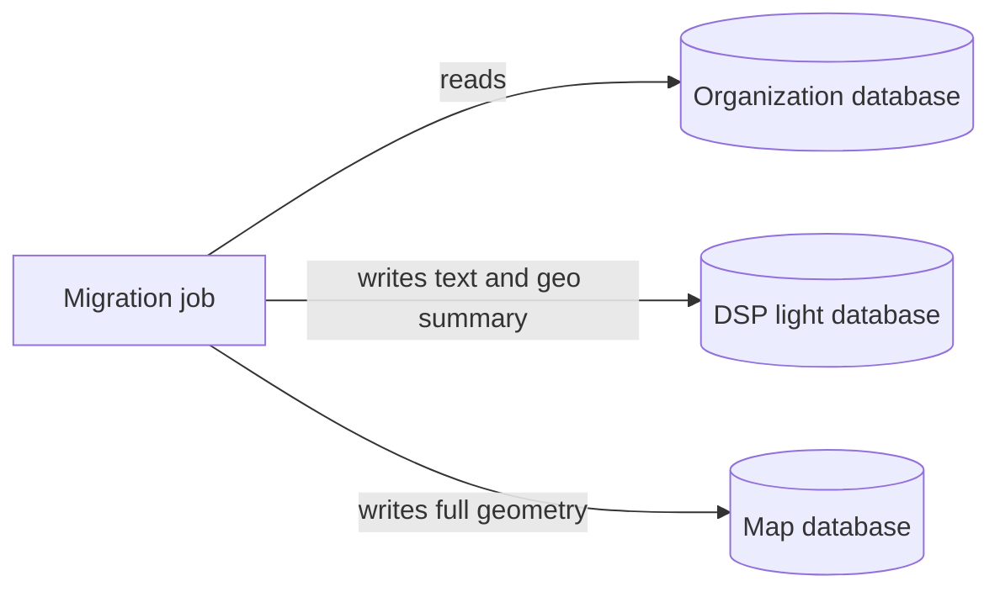
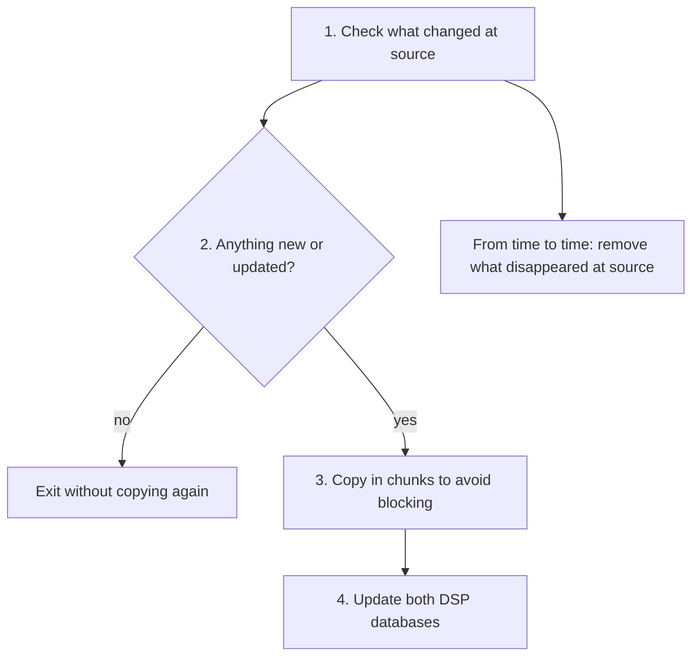

# rer-dsp-job-data-migration — Overview

Job that **copies geographic data from your organization’s database** into the DSP, automatically and repeatably. Orchestration via [rer-dsp-core](../core.md) (`./setup.sh`). Database detail: [Databases](../../architecture/databases.md).

## Summary

- [How it works](#how-it-works)
- [What gets copied](#what-gets-copied)
- [Flow at a glance](#flow-at-a-glance)
- [Copy order](#copy-order)
- [Only what changed since last time](#only-what-changed-since-last-time)
- [What happens on each run](#what-happens-on-each-run)
- [Map and downloads](#map-and-downloads)
- [When the job runs day to day](#when-the-job-runs-day-to-day)
- [Technical detail (quick reference)](#technical-detail-quick-reference)
- [Where to go deeper](#where-to-go-deeper)

---

## How it works

Think of the **organization database** as the working folder where registrations are updated, and the **DSP** needs its **own copy** so the public site stays fast without exposing that database directly on the internet.

The migration job does three main things:

1. **Reads** the source database (read-only — it does not change anything there).
2. **Writes in two places inside the DSP:**
   - A **light** database used by the API and screens (names, dates, a rectangle and a map point per record — not the full polygon).
   - Another database **with full geometry** of properties and territories, used for the map and heavy exports.
3. **On the next run, it does not copy everything again** — only records **new or changed** since the last successful copy (this is the *watermark*, a “bookmark” kept by the job itself).

If a record **disappears** at the source, the job can also **remove** the copy in the DSP (periodic “orphan” sweep).

It is **not** the program that publishes layers on the site map: `./setup.sh` does that after data is already in the databases. It also **does not** generate large download files in S3 storage — it only **flags** which regions need them; the [geo-file job](../job-geo-file-generation/overview.md) generates the files.

---

## What gets copied

| Data type | CAR example | Notes |
|-----------|-------------|--------|
| Three territory levels | State → municipality → … | Hierarchy configured in `./config.sh` |
| Area of interest | Rural property / declared polygon | What citizens search on the map |
| Extra layers (optional) | Other tables with geometry | Map database only — [guide](generic-layers.md) |

Names “level 1, 2, 3” are generic: what each level means depends on the tables you configured, not a fixed code convention.

---

## Flow at a glance



In Compose, the databases are named `dsp-db` (light) and `dsp-geoserver-db` (map).

---

## Copy order

Copy follows **hierarchy**, like assembling a puzzle from the inside out:

```text
level 1 → level 2 → level 3 → properties (area of interest) → extra layers (if any)
```

The parent must exist before the child (for example, municipality before the property inside it). The job does not reorder this.

---

## Only what changed since last time

On the **first load**, records with a filled creation date at the source are included (as configured in `./config.sh`).

On **later loads**, the job compares against the date/time of the **last successfully completed run**:

- Copies what was **created** after that mark.
- If the source has an **update** column, also copies what was **changed** after that mark.

If **nothing changed**, the run finishes quickly (“no work”). The mark only advances when the job finishes **without error** — so the DSP does not “skip” data if something failed midway.

Timezone for source dates: usually `America/Sao_Paulo`, unless configured differently in the YAML.

---

## What happens on each run

In simple terms, the job always repeats the same script:



Technically this is watermark-based detection, skip-or-process decision, paged reads, and writes with “update if exists, else insert” (*UPSERT*).

---

## Map and downloads

| Step | Who |
|------|-----|
| Data in databases | Migration job |
| Layers visible in GeoServer / map | `./setup.sh` (or automatic publish after first scheduled load) |
| Ready CSV files in S3 | [Geo-file job](../job-geo-file-generation/overview.md), on the schedule set in setup |

When a migration **completes successfully**, the job **marks** which states/municipalities (levels 2 and 3) need a **new download file**. If migration **fails**, those marks **do not change** — avoids publishing downloads with incomplete data.

---

## When the job runs day to day

This is defined by **`./setup.sh`**, not the `./config.sh` wizard:

| Setup choice | Practical effect |
|--------------|------------------|
| Single load now, no repeat | Copies once during setup and the job container shuts down |
| Single load at date/time | Waits and copies once; may publish the map afterward |
| Periodic sync | Copies during setup (or at scheduled time) and **copies again** on a schedule (cron in `.env`) |

Each job “run” is a process that **starts, works, and exits**; in continuous mode, a scheduler inside the container triggers those runs.

---

## Technical detail (quick reference)

| Topic | Reference |
|-------|-----------|
| Artifact | Maven `dsp-batch`, Java 21, Spring Batch |
| Connections | `source`, `target` (`dsp-db`), `geo-target` (`dsp-geoserver-db`), `batch` (schema `data_migration`) |
| Incremental engine | `WatermarkChangeDetectionEngine` · table `BATCH_JOB_EXECUTION_SYNC_STATE` |
| Modes in `.env` | `DSP_MIGRATION_EXECUTION_MODE`: `once`, `scheduled-once`, `continuous` |
| Download flags | `requires_s3_file_regeneration` on `territory_level_2` / `_3` |

Running the JAR standalone (without core): Java 21, `./mvnw`, four accessible databases, and `application.yaml` generated by `./config.sh` (`rer-dsp-core` repository).

!!! tip "Layer publication"
    Layer name in the job YAML must match `mapLayersConfig.json`. **Run now** publishes at the end of setup; **Schedule for later** publishes after the first scheduled migration.

---

## Where to go deeper

| Topic | Page |
|-------|------|
| Databases and dual-write | [Databases](../../architecture/databases.md) |
| Generic layers | [Generic layer migration](generic-layers.md) |
| Wizard and `application.yaml` | [rer-dsp-core](../core.md) · `config/Job-Data-Migration/application/` |
| Post-load checklist | [Post-migration validation](post-migration-validation.md) |
| CSV pre-generation | [rer-dsp-job-geo-file-generation](../job-geo-file-generation/overview.md) |
| Component flow | [Data flow](../../architecture/data-flow.md) |
