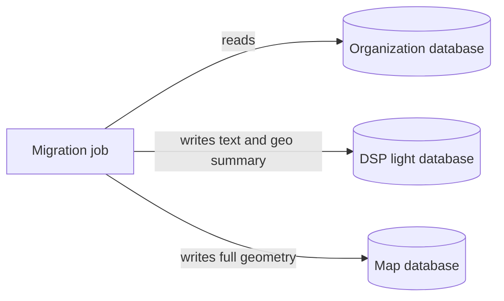
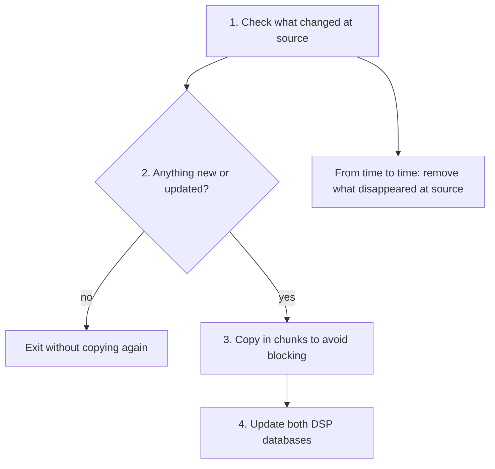
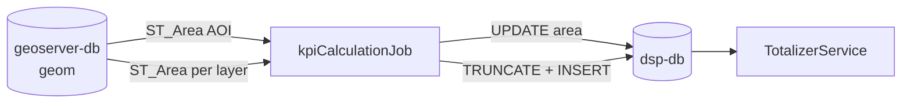

# dsp-job-data-migration — Overview

Job that **copies geographic data from your organization’s database** into the DSP, automatically and repeatably. Orchestration via [dsp-core](../core.md) (`./setup.sh`). Database detail: [Databases](../../architecture/databases.md).

## Summary

- [How it works](#how-it-works)
- [What gets copied](#what-gets-copied)
- [Flow at a glance](#flow-at-a-glance)
- [Copy order](#copy-order)
- [KPI calculation](#kpi-calculation)
- [Only what changed since last time](#only-what-changed-since-last-time)
- [What happens on each run](#what-happens-on-each-run)
- [Map and downloads](#map-and-downloads)
- [When the job runs day to day](#when-the-job-runs-day-to-day)
- [Technical detail (quick reference)](#technical-detail-quick-reference)
- [Where to go deeper](#where-to-go-deeper)

---

## How it works

Think of the **organization database** as the working folder where registrations are updated, and the **DSP** needs its **own copy** so the public site stays fast without exposing that database directly on the internet.

The migration job does four main things:

1. **Reads** the source database (read-only — it does not change anything there).
2. **Writes in two places inside the DSP:**
   - A **light** database used by the API and screens (names, dates, a rectangle and a map point per record — not the full polygon).
   - Another database **with full geometry** of properties and territories, used for the map and heavy exports.
3. **On the next run, it does not copy everything again** — only records **new or changed** since the last successful copy (this is the *watermark*, a “bookmark” kept by the job itself).
4. **After the copy, it calculates Home KPIs.** `kpiCalculationJob` reads geometries in the map database, writes each property’s area to `dsp.area_of_interest.area`, and writes per-theme indicators to `dsp.kpi_measure` — light database only. That area does **not** come from the source.

If a record **disappears** at the source, the job can also **remove** the copy in the DSP (periodic “orphan” sweep).

It is **not** the program that publishes layers on the site map: `./setup.sh` does that after data is already in the databases. It also **does not** generate large download files in S3 storage — it only **flags** which regions need them; the [geo-file job](../job-geo-file-generation/overview.md) generates the files.

---

## What gets copied

| Data type | CAR example | Notes |
|-----------|-------------|--------|
| Three territory levels | State → municipality → … | Hierarchy configured in `./config.sh` |
| Area of interest | Rural property / declared polygon | What citizens search on the map |
| Extra layers (optional) | Other tables with geometry | Map database only — [guide](generic-layers.md) |
| Home KPIs | Property area and themes (0–4) | Calculated after the copy, `dsp-db` only — [detail](#kpi-calculation) |

Names “level 1, 2, 3” are generic: what each level means depends on the tables you configured, not a fixed code convention.

---

## Flow at a glance


```mermaid
flowchart LR
  origem[(Organization database)]
  job[Migration job]
  leve[(DSP light database)]
  mapa[(Map database)]

  job -->|reads| origem
  job -->|writes text and geo summary| leve
  job -->|writes full geometry| mapa
```

In Compose, the databases are named `dsp-db` (light) and `dsp-geoserver-db` (map).

---

## Copy order

Copy follows **hierarchy**, like assembling a puzzle from the inside out:

```text
level 1 → level 2 → level 3 → properties (area of interest) → extra layers (if any) → KPI calculation
```

The parent must exist before the child (for example, municipality before the property inside it). Theme KPIs depend on layer geometries in the map database. `kpiCalculationJob` runs last (`@Order(3)`).

---

## Only what changed since last time

On the **first load**, records with a filled creation date at the source are included (as configured in `./config.sh`).

On **later loads**, the job compares against the date/time of the **last successfully completed run**:

- Copies what was **created** after that mark.
- If the source has an **update** column, also copies what was **changed** after that mark.

If **nothing changed**, the run finishes quickly (“no work”). The mark only advances when the job finishes **without error** — so the DSP does not “skip” data if something failed midway.

Timezone for source dates: usually `America/Sao_Paulo`, unless configured differently in the YAML.

---

## What happens on each run

In simple terms, the job always repeats the same script:


```mermaid
flowchart TD
  A[1. Check what changed at source] --> B{2. Anything new or updated?}
  B -->|no| C[Exit without copying again]
  B -->|yes| D[3. Copy in chunks to avoid blocking]
  D --> E[4. Update both DSP databases]
  A --> F[From time to time: remove what disappeared at source]
```

Technically this is watermark-based detection, skip-or-process decision, paged reads, and writes with “update if exists, else insert” (*UPSERT*).

---

## Map and downloads

| Step | Who |
|------|-----|
| Data in databases | Migration job |
| Layers visible in GeoServer / map | `./setup.sh` (or automatic publish after first scheduled load) |
| Ready CSV files in S3 | [Geo-file job](../job-geo-file-generation/overview.md), on the schedule set in setup |

When a migration **completes successfully**, the job **marks** which states/municipalities (levels 2 and 3) need a **new download file**. If migration **fails**, those marks **do not change** — avoids publishing downloads with incomplete data.

---

## When the job runs day to day

This is defined by **`./setup.sh`**, not the `./config.sh` wizard:

| Setup choice | Practical effect |
|--------------|------------------|
| Single load now, no repeat | Copies once during setup and the job container shuts down |
| Single load at date/time | Waits and copies once; may publish the map afterward |
| Periodic sync | Copies during setup (or at scheduled time) and **copies again** on a schedule (cron in `.env`) |

Each job “run” is a process that **starts, works, and exits**; in continuous mode, a scheduler inside the container triggers those runs.

---

## Technical detail (quick reference)

| Topic | Reference |
|-------|-----------|
| Artifact | Maven `dsp-batch`, Java 21, Spring Batch |
| Connections | `source`, `target` (`dsp-db`), `geo-target` (`dsp-geoserver-db`), `batch` (schema `data_migration`) |
| Incremental engine | `WatermarkChangeDetectionEngine` · table `BATCH_JOB_EXECUTION_SYNC_STATE` |
| Modes in `.env` | `DSP_MIGRATION_EXECUTION_MODE`: `once`, `scheduled-once`, `continuous` |
| Download flags | `requires_s3_file_regeneration` on `territory_level_2` / `_3` |
| KPI calculation | `kpiCalculationJob` · flag `execution-jobs.kpi-job` · [detail](#kpi-calculation) |

Running the JAR standalone (without core): Java 21, `./mvnw`, four accessible databases, and `application.yaml` generated by `./config.sh` (`dsp-core` repository).

!!! tip "Layer publication"
    Layer name in the job YAML must match `mapLayersConfig.json`. **Run now** publishes at the end of setup; **Schedule for later** publishes after the first scheduled migration.

---

## KPI calculation

`kpiCalculationJob` (`@Order(3)`) runs **after** AOI and layer migration. It reads geometries from **geo-target**, writes results to **dsp-db**, and does not change geo-target. The `area` column exists on the AOI DDL in `dsp-db`, but it is **not migrated** from the source: there is no `area_column` or `total-area-column` in the contract. The migration job writes bbox, centroid, and attributes; the KPI job computes `ST_Area(geom::geography)` on geo-target and updates `dsp.area_of_interest.area`. The displayed unit comes from `kpis.area-unit-of-measurement` (wizard, stage 5).


```mermaid
flowchart LR
  geo[(geoserver-db<br/>geom)]
  job[kpiCalculationJob]
  dsp[(dsp-db)]
  api[TotalizerService]

  geo -->|ST_Area AOI| job
  geo -->|ST_Area per layer| job
  job -->|UPDATE area| dsp
  job -->|TRUNCATE + INSERT| dsp
  dsp --> api
```

### Prerequisites

- AOI job finished with valid `geom` on `dsp.area_of_interest` in geo-target.
- For each theme in `kpis.themes[]`, the matching layer already migrated in geo-target (`dsp.<layer_name>`).
- `kpis.theme-count` equal to the number of `kpis.themes[]` entries with `layer-name` set.

### What the job writes

| Destination | Table/column | Behavior |
|-------------|----------------|----------|
| `dsp-db` | `dsp.area_of_interest.area` | `UPDATE` by `id`: `ST_Area(geom::geography)` on geo-target, converted to `area-unit-of-measurement` |
| `dsp-db` | `dsp.kpi_measure` | `TRUNCATE` + `INSERT` per run: one row per AOI and per `kpi_name` |

With `theme-count: 0`, the job still updates AOI `area` and leaves `kpi_measure` empty (after truncate).

### Schema `dsp.kpi_measure`

Created on `dsp-db` if it does not exist yet. It does not exist on geo-target.

| Column | Type | Notes |
|--------|------|--------|
| `id` | `bigserial` | PK |
| `area_of_interest_id` | `varchar(255)` | FK to `dsp.area_of_interest(id)`, **without** `ON DELETE CASCADE` |
| `value` | `numeric(18,3)` | Sum of layer feature areas inside the AOI, in the theme unit |
| `kpi_name` | `varchar(255)` | Layer name (YAML `layer-name` / installation `card.layer`) |

Constraint `UNIQUE (area_of_interest_id, kpi_name)`.

For each theme, the job groups layer features by `area_of_interest_id` on geo-target and sums `ST_Area(geom::geography)` before unit conversion. Theme KPIs are **not** AOI columns (`theme_1`…`theme_4` / `business-only-persist-columns` do not play that role).

### Contract with installation

Three artifacts must stay aligned:

- `adopter-config.yaml`: `installation.kpis.theme_count`, `theme_1`…`theme_4.layer`, `area_of_interest.optional_label`
- `application.yaml`: `kpis` block + `execution-jobs.kpi-job: true` (generated by `./config.sh`)
- `installation-config.json`: `AREA_OF_INTEREST` + `THEME_*` cards with a `layer` field on themes

`./config.sh` always enables L1, L2, L3, area of interest, and `kpi-job`. Outside the core, enable `execution-jobs.kpi-job` and configure the `kpis` block if Home uses theme cards. The backend aggregates values in `POST /totalizer/` — see [dsp-backend](../backend.md#totalizerservice-post-totalizer).

### `kpis` block in `application.yaml`

Generated by `./config.sh` from `installation.kpis` in `adopter-config.yaml`. Example with two themes:

```yaml
kpis:
  theme-count: 2
  area-unit-of-measurement: ha
  themes:
    - slot: 1
      layer-name: rivers
      unit-of-measurement: ha
    - slot: 2
      layer-name: conservation-units
      unit-of-measurement: m²
```

| Property | Required | Description |
|----------|----------|-------------|
| `theme-count` | yes | Number of theme KPIs (0–4; in the wizard, at most the number of layers in `etl.layers[]`) |
| `area-unit-of-measurement` | no (default `m²`) | AOI area unit after conversion from m² |
| `themes[]` | yes if `theme-count` > 0 | One item per enabled theme |
| `themes[].layer-name` | yes | Layer name on geo-target (`dsp.<name>`) — must match migration `layer-name` and `card.layer` in `installation-config.json` |
| `themes[].unit-of-measurement` | yes | Theme KPI unit after conversion from m² |

```yaml
execution-jobs:
  kpi-job: true
```

Required order in `application.yaml` is **L1 → L2 → L3 → area-of-interest → layers → kpi-job**. The KPI job is not part of dual-write: it is a tasklet that reads geo-target and updates `area` + `kpi_measure` on `dsp-db` after jobs `@Order(1)` and `@Order(2)`.

---

## Where to go deeper

| Topic | Page |
|-------|------|
| Databases and dual-write | [Databases](../../architecture/databases.md) |
| Generic layers | [Generic layer migration](generic-layers.md) |
| Wizard and `application.yaml` | [dsp-core](../core.md) · `dsp-job-data-migration/config/application/` |
| Post-load checklist | [Post-migration validation](post-migration-validation.md) |
| CSV pre-generation | [dsp-job-geo-file-generation](../job-geo-file-generation/overview.md) |
| Component flow | [Data flow](../../architecture/data-flow.md) |
