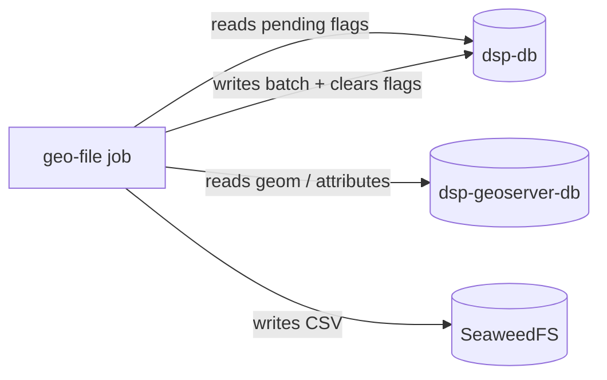

# rer-dsp-job-geo-file-generation — Overview

Batch job of the [DSP](../../index.md) that **pre-generates territorial download files** (levels 2 and 3) and publishes them to **SeaweedFS** (S3 API). The backend serves those bytes when they exist; otherwise it uses WFS on GeoServer Download. Orchestration: [rer-dsp-core](../core.md) (profile `object-storage`). In [local demo](../../guides/quick-start.md) this job is usually off.

## Summary

- [Role in the DSP](#role-in-the-dsp)
- [When it applies](#when-it-applies)
- [Flow of one run](#flow-of-one-run)
- [Coordination with migration](#coordination-with-migration)
- [Objects in the bucket](#objects-in-the-bucket)
- [Formats and themes](#formats-and-themes)
- [Orphan cleanup](#orphan-cleanup)
- [Databases and configuration](#databases-and-configuration)
- [Execution in core](#execution-in-core)
- [Run without core](#run-without-core)
- [Where to go deeper](#where-to-go-deeper)

---

## Role in the DSP

| Input | Output |
|-------|--------|
| Flags on `dsp.territory_level_2` / `_3` | CSV (v1) in S3 bucket |
| Features in `dsp-geoserver-db` (same base as WFS) | `generated-at` metadata on object |
| `downloadThemesConfig.json` | Flags cleared + `last_generated_s3_file_at` per territory |

Reduces load on GeoServer Download for high-volume public queries (e.g. [CAR consultation](https://consulta.car.gov.br/) scale).

---

## When it applies

| Scenario | Geo-file job |
|----------|----------------|
| Demo / quickstart without JDBC | Usually **off** (downloads via WFS) |
| Real adopter | **On** with `DSP_OBJECT_STORAGE_ENDPOINT` and schedule from `./setup.sh` |

---

## Flow of one run



1. Lists territories with `requires_s3_file_regeneration = true` (level 2 before 3).
2. For each territory, walks themes enabled in `downloadThemesConfig.json` and each theme’s `formats[]`.
3. Exports by reading **`dsp-geoserver-db`** (parity with WFS).
4. Publishes to the bucket; user-metadata `generated-at` (UTC ISO) — the backend uses this as `lastFileGenerated`.
5. Clears the flag and writes `last_generated_s3_file_at` only when **all** enabled formats for the territory were published. Partial failure keeps pending for the next run.

If the bucket does not exist, the job logs an error, does not publish, and exits without crashing the process — flags remain for the next attempt.

---

## Coordination with migration

Geo-file does **not** read `BATCH_JOB_EXECUTION_SYNC_STATE`.

| Step | Who |
|------|-----|
| Delta at source | [Migration job](../job-data-migration/overview.md#only-what-changed-since-last-time) (watermark) |
| Mark territories | Migration, on `COMPLETED`, in the same time window |
| Generate files | This job, on schedule `DSP_GEO_FILE_GENERATION_CRON` |

Columns on `dsp-db` (levels 2 and 3 only): `requires_s3_file_regeneration`, `last_generated_s3_file_at`. Detail: [Databases — Download pendencies](../../architecture/databases.md#territorial-download-pending-work).

---

## Objects in the bucket

| Level | S3 key (default) |
|-------|------------------|
| 2 | `{format}/level-2/{level2Slug}_{themeCode}.{ext}` |
| 3 | `{format}/level-3/{level2Slug}_{level3Slug}_{themeCode}.{ext}` |

Slug from `name` (lowercase, no accents, hyphens). Level 3 includes parent slug (homonyms). API and flags use territorial `id`.

The filename citizens download in the UI is **not** the object key — the backend builds `{theme}_{level2}.{ext}` in the HTTP response.

---

## Formats and themes

- **v1:** CSV in the same layout as WFS (`FID`, attributes in table order, geometry as WKT).
- New format: implement `GeoFileExporter` and declare in theme `formats[]` — backend keys and endpoints stay the same.

Themes and codes come from `downloadThemesConfig.json` (generated by `./config.sh` from the adopter).

---

## Orphan cleanup

At the end of a run, the job lists `{format}/level-2/` and `{format}/level-3/` in the bucket and removes objects that do not match any valid (territory, theme, format) — for example after renaming a territory.

---

## Databases and configuration

| Datasource | Target |
|------------|--------|
| `batch` | `dsp-db` · schema **`geo_file_generation`** (isolated from migration) |
| `target` | `dsp-db` · schema `dsp` (territory flags) |
| `geo-target` | `dsp-geoserver-db` · schema `dsp` |

Object storage (not JDBC):

```yaml
dsp:
  object-storage:
    endpoint: http://dsp-object-storage:8333
    region: us-east-1
    bucket: dsp-geo-files
    access-key: ...
    secret-key: ...
    path-style-access: true
```

Runtime file: `config/Job-Geo-File-Generation/application/application.yaml` (generated by `./config.sh` from `environment.object_storage` in `adopter-config.yaml`). The bucket must **exist** — the job does not create it.

| Stack | Java 21, Spring Boot 3.4.2, Spring Batch, PostGIS, AWS SDK v2 (S3), Maven |

---

## Execution in core

| Variable / mode | Effect |
|-----------------|--------|
| `DSP_OBJECT_STORAGE_ENDPOINT` | Enables profile `object-storage` (SeaweedFS + job) |
| `DSP_GEO_FILE_GENERATION_CRON` | Schedule on supercronic — set in **`./setup.sh`**, not the wizard |
| `DSP_GEO_FILE_GENERATION_EXECUTION_MODE` | `continuous` (default) or `once` |

Container `dsp-job-geo-file-generation`: no HTTP port; starts with `dsp-object-storage` for a real adopter.

---

## Run without core

```bash
./mvnw spring-boot:run
```

Requires `application.yaml` with three datasources, accessible bucket, and `dsp-geoserver-db` already populated by migration. Typical use: via core `./setup.sh`.

---

## Where to go deeper

| Topic | Page |
|-------|------|
| Download flow (backend / S3 / WFS) | [Data flow](../../architecture/data-flow.md) |
| Database roles | [Databases](../../architecture/databases.md) |
| Migration and flags | [Job data-migration](../job-data-migration/overview.md) |
| `.env` and Compose variables | [rer-dsp-core](../core.md) |
| Downloads API | [rer-dsp-backend](../backend.md) |
