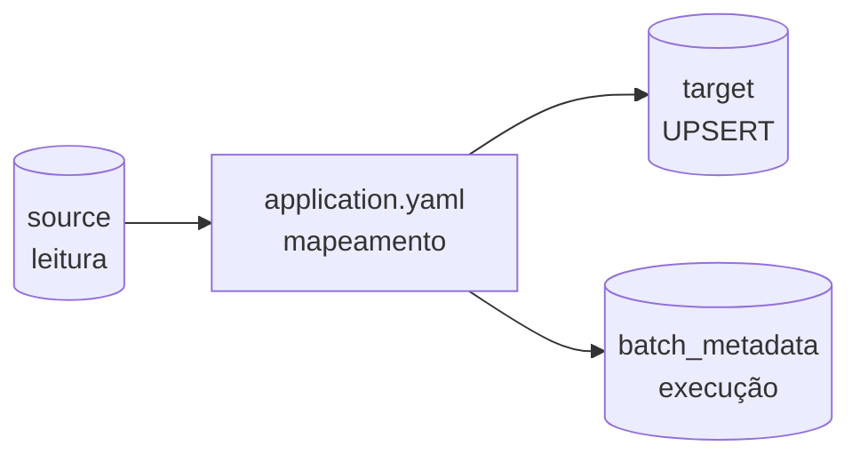
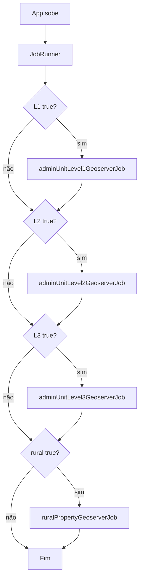

# Começando

Guia de onboarding do **RER DSP**. O primeiro passo é executar a **migração inicial de dados** com o repositório `rer-dsp-job-data-migration`.

## Sumário

- [Objetivo](#objetivo)
- [Pré-requisitos](#pre-requisitos)
- [Checklist rápido](#checklist-rapido)
- [Passo 1 — Clonar o job de migração](#passo-1-clonar-o-job-de-migracao)
- [Passo 2 — Ambiente de banco](#passo-2-ambiente-de-banco)
- [Passo 3 — Schema de metadados do Spring Batch](#passo-3-schema-de-metadados-do-spring-batch)
- [Passo 4 — Configurar application.yaml](#passo-4-configurar-applicationyaml)
  - [Exemplo completo](#41-exemplo-completo--level-1--2--3)
  - [Os três bancos envolvidos](#42-os-tres-bancos-envolvidos)
  - [Estrutura do banco de origem](#43-estrutura-do-banco-de-origem-exemplos)
  - [Estrutura do banco de destino](#44-estrutura-do-banco-de-destino)
  - [Diferenças origem × destino](#45-diferencas-origem--destino-level-1)
  - [Como cada coluna vira YAML](#46-como-cada-coluna-vira-yaml-level-1)
  - [Level 2 e Level 3](#47-level-2-e-level-3)
  - [Mapa das seções do YAML](#48-mapa-das-secoes-do-yaml)
  - [Conexões dos três bancos](#49-conexoes-dos-tres-bancos)
  - [Quais jobs rodar](#410-quais-jobs-rodar-na-subida)
  - [Checklist coluna → YAML](#411-checklist-coluna--yaml)
- [Passo 5 — Executar a migração inicial](#passo-5-executar-a-migracao-inicial)
- [Passo 6 — Validar](#passo-6-validar)
- [Próximos passos](#proximos-passos)
- [Problemas comuns](#problemas-comuns)

---

## Objetivo

Ao final deste guia você terá:

1. Ambiente local com Java 21 e PostgreSQL/PostGIS
2. Schema `BATCH_*` criado
3. Jobs de unidades administrativas (ou demo) executados
4. Dados no banco de destino conferidos

!!! tip "Fluxo principal"
    Tudo começa pelo job [`rer-dsp-job-data-migration`](migration/rer-dsp-job-data-migration.md). Sem a migração inicial, as demais camadas do DSP não têm base geoespacial.

---

## Pré-requisitos

| Ferramenta | Versão / observação |
|------------|---------------------|
| Java | **21** |
| Maven | Wrapper `./mvnw` incluso no projeto |
| Docker / Docker Compose | Opcional, para Postgres local |
| PostgreSQL + PostGIS | Obrigatório (origem, destino e metadados) |
| Acesso Git | Clone do repositório do job |

---

## Checklist rápido

- [ ] Java 21 instalado (`java -version`)
- [ ] Repositório `rer-dsp-job-data-migration` clonado
- [ ] Postgres/PostGIS acessível
- [ ] Scripts de `batch_metadata` aplicados
- [ ] `application.yaml` apontando para os três datasources
- [ ] Flags `execution-jobs` configuradas (começar pelo level-1)
- [ ] Job executado com status `COMPLETED`
- [ ] Contagens origem × destino conferidas ([Validação](migration/validation.md))

---

## Passo 1 — Clonar o job de migração

```bash
git clone https://github.com/Rural-Environmental-Registry/rer-dsp-job-data-migration.git
cd rer-dsp-job-data-migration
```

---

## Passo 2 — Ambiente de banco

O job usa **três datasources**: origem (`source`), destino (`target`) e metadados do Batch (`batch`). Neste passo prepare origem e destino; o schema de metadados fica no [Passo 3](#passo-3-schema-de-metadados-do-spring-batch).

### 1. Banco de origem (sua organização)

Reúna as credenciais do banco PostgreSQL/PostGIS da sua organização — é a fonte que será migrada:

| Dado | Exemplo |
|------|---------|
| URL JDBC | `jdbc:postgresql://localhost:6666/seu_banco_geo` |
| Usuário | `postgres` |
| Senha | `sua_senha` |

### 2. Banco de destino (DSP)

Crie um banco PostgreSQL com extensão PostGIS para receber os dados migrados:

```bash
# Exemplo: Postgres na porta 6666
psql -h localhost -p 6666 -U postgres -c "CREATE DATABASE dsp_target;"
psql -h localhost -p 6666 -U postgres -d dsp_target -c "CREATE EXTENSION IF NOT EXISTS postgis;"
```

Conferir:

```bash
psql -h localhost -p 6666 -U postgres -d dsp_target -c "SELECT PostGIS_Version();"
```

!!! tip "Mínimo necessário"
    Ao final do Passo 3 você precisa de **pelo menos dois bancos** prontos: o de **origem** (sua organização) e o de **destino** (DSP), além do `batch_metadata` para o Spring Batch.

---

## Passo 3 — Schema de metadados do Spring Batch

A aplicação **não** cria o schema automaticamente (`spring.batch.jdbc.initialize-schema: never`).

Scripts oficiais:

1. `src/main/resources/db/batch_metadata/01_create_database.sql`
2. `src/main/resources/db/batch_metadata/02_spring_batch_schema.sql`

Exemplo:

```bash
psql -h localhost -p 6666 -U postgres \
  -f src/main/resources/db/batch_metadata/01_create_database.sql

psql -h localhost -p 6666 -U postgres -d batch_metadata \
  -f src/main/resources/db/batch_metadata/02_spring_batch_schema.sql
```

Conferir:

```bash
psql -h localhost -p 6666 -U postgres -d batch_metadata -c '\dt BATCH*'
```

!!! todo "Script 01"
    Validar se o `01_create_database.sql` do repositório cria de fato `batch_metadata` e o role necessário. Em caso de lacuna, criar o database manualmente antes do script `02`.

---

## Passo 4 — Configurar application.yaml

Arquivo: `src/main/resources/application.yaml`

Nesse passo vamos trabalhar com um exemplo (continente → país → área administrativa). O objetivo é você conseguir: olhar uma coluna na origem → achar a correspondente no destino → localizar o trecho do YAML que faz esse mapeamento.



---

### 4.1 Exemplo completo — Level 1 + 2 + 3

Comece pelo YAML pronto. Nas seções seguintes, cada propriedade e mapeamento é explicado com a estrutura dos bancos e dados de exemplo.

```yaml
batch:
  admin-unit:
    level-1:
      source-table: source_admin_units.source_l1_continents
      target-table: target_admin_units.target_l1_continent
      primary-key: source_continent_pk
      geometry-column: source_continent_geom
      where-clause: "1=1"
      comparison-columns:
        - source_continent_name
      persist-columns:
        - source_continent_pk
        - source_continent_name
      column-mapping:
        source_continent_pk: target_continent_id
        source_continent_name: target_continent_label
        source_continent_geom: target_continent_geometry
      layer-name: source-continents-geoserver-layer
      srid: 4326
      change-detection-strategy: DEFAULT
    level-2:
      source-table: source_admin_units.source_l2_countries
      target-table: target_admin_units.target_l2_country
      primary-key: source_country_pk
      partition-column: source_continent_fk
      geometry-column: source_country_geom
      where-clause: "1=1"
      comparison-columns:
        - source_country_name
        - source_continent_fk
      persist-columns:
        - source_country_pk
        - source_country_name
        - source_continent_fk
      column-mapping:
        source_country_pk: target_country_id
        source_country_name: target_country_label
        source_continent_fk: target_continent_ref
        source_country_geom: target_country_geometry
      layer-name: source-countries-geoserver-layer
      srid: 4326
      change-detection-strategy: DEFAULT
    level-3:
      source-table: source_admin_units.source_l3_admin_areas
      target-table: target_admin_units.target_l3_admin_division
      primary-key: source_area_pk
      partition-column: source_country_fk
      geometry-column: source_area_geom
      where-clause: "1=1"
      comparison-columns:
        - source_area_name
        - source_country_fk
      persist-columns:
        - source_area_pk
        - source_area_name
        - source_country_fk
      column-mapping:
        source_area_pk: target_division_id
        source_area_name: target_division_label
        source_country_fk: target_country_ref
        source_area_geom: target_division_geometry
      layer-name: source-admin-areas-geoserver-layer
      srid: 4326
      change-detection-strategy: DEFAULT
```

Significado rápido de cada propriedade:

| Propriedade | Função |
|-------------|--------|
| `source-table` / `target-table` | De onde lê / para onde grava (`schema.tabela`) |
| `primary-key` | PK **na origem** (base do `ON CONFLICT` no destino via mapping) |
| `geometry-column` | Coluna PostGIS **na origem** |
| `where-clause` | Filtro SQL extra na detecção/partição |
| `comparison-columns` | Colunas usadas para saber se o registro mudou |
| `persist-columns` | Colunas enviadas ao destino (PK + atributos + FKs) |
| `column-mapping` | Tradução `origem: destino` quando os nomes diferem |
| `partition-column` | Coluna numérica/categórica para fatiar a leitura |
| `srid` | SRID das geometrias (ex.: `4326`) |
| `layer-name` | Nome da layer no GeoServer |
| `change-detection-strategy` | `DEFAULT` (hash + órfãos) ou `DATE_RANGE` |

---

### 4.2 Os três bancos envolvidos

| Banco | Prefixo YAML | Papel |
|-------|--------------|--------|
| **Origem** (`source`) | `spring.datasource.source` | Onde o job **lê** geometrias e atributos |
| **Destino** (`target`) | `spring.datasource.target` | Onde o job **grava** (UPSERT / DELETE de órfãos) |
| **Metadados** (`batch`) | `spring.datasource.batch` | Tabelas `BATCH_*` — status da execução (não guarda geometrias) |

Hierarquia do exemplo:

```text
continente (L1)  →  país (L2)  →  área administrativa (L3)
```

---

### 4.3 Estrutura do banco de origem (exemplos)

Schema: `source_admin_units` · banco exemplo: `source_geo_import_db`

#### Level 1 — continentes

```sql
-- source_admin_units.source_l1_continents
source_continent_pk    varchar(32)  PRIMARY KEY
source_continent_name  varchar(120) NOT NULL
source_continent_geom  geometry(MultiPolygon, 4326)
```

| source_continent_pk | source_continent_name | geometria (resumo) |
|---------------------|-----------------------|--------------------|
| `CONT-SA` | South America | MultiPolygon SRID 4326 |
| `CONT-NA` | North America | MultiPolygon SRID 4326 |

#### Level 2 e Level 3

Seguem o **mesmo padrão** do Level 1 (PK + nome + geometria), com uma FK para o nível pai:

- **L2** (`source_l2_countries`) — países, FK `source_continent_fk` → continente
- **L3** (`source_l3_admin_areas`) — áreas admin, FK `source_country_fk` → país

Exemplos: `CTRY-BR` / Brazil → `CONT-SA`; `AREA-BR-SP` / Sao Paulo → `CTRY-BR`.

---

### 4.4 Estrutura do banco de destino

Schema: `target_admin_units` · banco exemplo: `target_geo_import_db`

Os nomes **diferem de propósito** da origem: o job usa `column-mapping` para traduzir. Toda tabela de destino **precisa de PRIMARY KEY** (o UPSERT usa `ON CONFLICT`).

| Level | Tabela destino | Colunas (mesma ideia do L1) |
|-------|----------------|------------------------------|
| L1 | `target_l1_continent` | `target_continent_id` (PK), `target_continent_label`, `target_continent_geometry` |
| L2 | `target_l2_country` | Igual ao L1 + FK `target_continent_ref` → continente |
| L3 | `target_l3_admin_division` | Igual ao L1 + FK `target_country_ref` → país |

Relacionamentos no destino (mesma hierarquia, nomes novos):

```text
target_l1_continent.target_continent_id
        ↑
target_l2_country.target_continent_ref
        ↑
target_l3_admin_division.target_country_ref
```

---

### 4.5 Diferenças origem × destino (Level 1)

Use esta tabela como “dicionário” ao ler o exemplo do [4.1](#41-exemplo-completo--level-1--2--3):

| Papel | Coluna origem | Tipo | Coluna destino | Tipo | Por que mudou o nome? |
|-------|---------------|------|----------------|------|------------------------|
| PK | `source_continent_pk` | varchar(32) | `target_continent_id` | varchar(32) | Destino usa sufixo `_id` |
| Nome/rótulo | `source_continent_name` | varchar(120) | `target_continent_label` | varchar(120) | Destino chama de `label` |
| Geometria | `source_continent_geom` | geometry 4326 | `target_continent_geometry` | geometry 4326 | Destino usa nome completo `_geometry` |
| Tabela | `source_l1_continents` | — | `target_l1_continent` | — | Singular no destino + prefixo `target_` |
| Schema | `source_admin_units` | — | `target_admin_units` | — | Schemas separados por papel |

Exemplo do registro `CONT-SA` depois da migração:

| Origem | → | Destino |
|--------|---|---------|
| `source_continent_pk = CONT-SA` | → | `target_continent_id = CONT-SA` |
| `source_continent_name = South America` | → | `target_continent_label = South America` |
| `source_continent_geom = …` | → | `target_continent_geometry = …` |

---

### 4.6 Como cada coluna vira YAML (Level 1)

Fluxo mental: **coluna origem → `column-mapping` → coluna destino**.

| Coluna origem | Onde entra no YAML | Valor / mapeamento |
|---------------|--------------------|--------------------|
| (tabela) | `source-table` | `source_admin_units.source_l1_continents` |
| (tabela) | `target-table` | `target_admin_units.target_l1_continent` |
| `source_continent_pk` | `primary-key` | `source_continent_pk` (sempre o nome **na origem**) |
| `source_continent_pk` | `persist-columns` | lista para gravar |
| `source_continent_pk` | `column-mapping` | `source_continent_pk: target_continent_id` |
| `source_continent_name` | `comparison-columns` | detecta mudança de nome |
| `source_continent_name` | `persist-columns` | lista para gravar |
| `source_continent_name` | `column-mapping` | `source_continent_name: target_continent_label` |
| `source_continent_geom` | `geometry-column` | `source_continent_geom` (nome **na origem**) |
| `source_continent_geom` | `column-mapping` | `source_continent_geom: target_continent_geometry` |

Isso corresponde ao bloco `batch.admin-unit.level-1` do [exemplo completo](#41-exemplo-completo--level-1--2--3).

!!! tip "Como ler o mapping"
    Em `column-mapping`, a chave é **sempre o nome na origem** e o valor é **o nome no destino**. A PK do destino (`target_continent_id`) precisa existir como PRIMARY KEY — o job resolve o nome via mapping a partir de `primary-key`.

---

### 4.7 Level 2 e Level 3

O mapeamento YAML dos Levels 2 e 3 é **semelhante ao Level 1**: mesmas propriedades (`source-table`, `target-table`, `primary-key`, `geometry-column`, `comparison-columns`, `persist-columns`, `column-mapping`).

A única diferença prática é a **FK do nível pai**, que também entra no `column-mapping` e em `persist-columns` / `comparison-columns` (ex.: `source_continent_fk` → `target_continent_ref`). Veja os blocos `level-2` e `level-3` no [exemplo completo](#41-exemplo-completo--level-1--2--3).

---

### 4.8 Mapa das seções do YAML

```text
application.yaml
├── spring.datasource.*     → conexões (batch / source / target)
├── batch.admin-unit.*      → o que ler, comparar, mapear e gravar
├── batch.rural-property.*  → job de propriedades (estratégia DATE_RANGE)
├── parallelization.jobs.*  → threads, chunk, page size
├── execution-jobs.*        → quais jobs ligar na subida
└── server / logging        → porta e logs
```

| Etapa do fluxo | O que configura | Seção YAML |
|----------------|-----------------|------------|
| **Conexão** | URL, usuário, senha dos 3 bancos | `spring.datasource.batch` / `.source` / `.target` |
| **Consulta (leitura)** | Tabela, filtro, PK, geometria | `source-table`, `where-clause`, `primary-key`, `geometry-column` |
| **Detecção de mudança** | Quais colunas comparar | `comparison-columns`, `change-detection-strategy` |
| **Mapeamento** | Origem → destino (renomear) | `column-mapping` |
| **Carga (gravação)** | O que persistir + tabela destino | `persist-columns`, `target-table` |
| **Geo / layer** | SRID e nome no GeoServer | `srid`, `layer-name` |
| **Disparo** | Quais jobs rodar | `execution-jobs` |

---

### 4.9 Conexões dos três bancos

Ajuste host, porta e nomes aos bancos que você criou nos Passos 2 e 3:

```yaml
spring:
  datasource:
    batch:
      url: jdbc:postgresql://localhost:6666/batch_metadata
      username: postgres
      password: postgres
      driver-class-name: org.postgresql.Driver
    source:
      url: jdbc:postgresql://localhost:6666/source_geo_import_db
      username: postgres
      password: postgres
      driver-class-name: org.postgresql.Driver
    target:
      url: jdbc:postgresql://localhost:6666/target_geo_import_db
      username: postgres
      password: postgres
      driver-class-name: org.postgresql.Driver
  batch:
    job:
      enabled: false
    jdbc:
      initialize-schema: never

server:
  port: 8086
```

| Prefixo | Banco | Uso |
|---------|-------|-----|
| `spring.datasource.batch` | `batch_metadata` | JobRepository (`BATCH_*`) |
| `spring.datasource.source` | `source_geo_import_db` | SELECT / change detection / partição |
| `spring.datasource.target` | `target_geo_import_db` | UPSERT / DELETE |

---

### 4.10 Quais jobs rodar na subida

Comece pelo **level-1** e avance (respeite FKs):

```yaml
execution-jobs:
  admin-unit-level-1-geoserver-job: true
  admin-unit-level-2-geoserver-job: false
  admin-unit-level-3-geoserver-job: false
  rural-property-geoserver-job: false
```

Overrides sem editar o arquivo:

```bash
./mvnw spring-boot:run -Dspring-boot.run.arguments="\
--execution-jobs.admin-unit-level-1-geoserver-job=true \
--execution-jobs.admin-unit-level-2-geoserver-job=false \
--execution-jobs.admin-unit-level-3-geoserver-job=false \
--execution-jobs.rural-property-geoserver-job=false"
```

---

### 4.11 Checklist “coluna → YAML”

Para qualquer coluna da sua organização:

1. Ache a coluna na **origem** (nome e tipo).
2. Ache a coluna correspondente no **destino**.
3. Se os nomes forem diferentes, registre em `column-mapping`.
4. Se for PK → `primary-key` + `persist-columns`.
5. Se for geometria → `geometry-column` + `column-mapping` + `srid`.
6. Se for atributo comparado → `comparison-columns` + `persist-columns`.
7. Se for FK → `persist-columns` (e em geral `comparison-columns`).
8. Confirme que a PK mapeada no destino é PRIMARY KEY.

Detalhe completo das propriedades e paralelização: [Job de migração](migration/rer-dsp-job-data-migration.md).

---

## Passo 5 — Executar a migração inicial

```bash
./mvnw spring-boot:run
```

Ou:

```bash
./mvnw clean package
java -jar target/dsp-batch-0.0.1-SNAPSHOT.jar
```

- A aplicação sobe na porta **8086**
- `spring.batch.job.enabled: false` — o Boot não auto-starta jobs; o `JobRunner` dispara conforme `execution-jobs`
- Ordem no `JobRunner`: L1 → L2 → L3 → rural-property



---

## Passo 6 — Validar

1. Status no banco de metadados (`COMPLETED`)
2. Contagens origem × destino
3. Amostra de geometrias válidas

Comandos e checklist: [Validação](migration/validation.md).

Exemplo rápido:

```bash
psql -h localhost -p 6666 -U postgres -d batch_metadata -c "
SELECT i.job_name, e.status, e.start_time, e.end_time
FROM batch_job_execution e
JOIN batch_job_instance i ON e.job_instance_id = i.job_instance_id
ORDER BY e.job_execution_id DESC
LIMIT 10;"
```

---

## Próximos passos

| Depois da primeira migração | Documento |
|-----------------------------|-----------|
| Entender arquitetura multi-camada | [Arquitetura](architecture/overview.md) |
| Aprofundar YAML, partição e change detection | [Job data-migration](migration/rer-dsp-job-data-migration.md) |
| Checklist operacional de qualidade | [Validação](migration/validation.md) |

---

## Problemas comuns

| Sintoma | Causa provável | Ação |
|---------|----------------|------|
| `batch_job_instance does not exist` | Schema `BATCH_*` ausente | Rodar script `02_spring_batch_schema.sql` |
| `no unique or exclusion constraint matching the ON CONFLICT` | Destino sem PK na coluna de conflito | Criar PRIMARY KEY (ou unique) no destino |
| Job sobe e “não faz nada” | Flags `execution-jobs` todas `false` ou sem mudanças | Habilitar job; conferir change detection |
| Erro de conexão JDBC | Host/porta/database errados | Conferir `spring.datasource.*` |
| Geometrias não aparecem | Coluna/SRID/mapping incorretos | Revisar `geometry-column`, `srid`, `column-mapping` |
