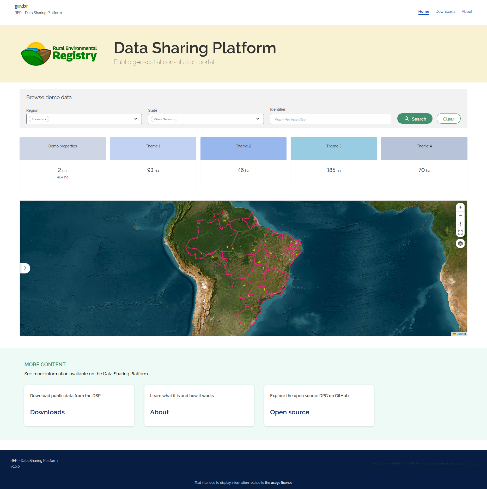

# Começando rápido (demo local)

## Como testar o sistema rapidamente?

Este guia sobe uma **demo local completa** do DSP usando um seed sintético do Brasil, sem precisar de nenhum banco de dados externo. É a forma mais rápida de conhecer o sistema funcionando.

Para uma instalação com dados reais de uma organização, veja [Instalação completa](guides/full-installation.md).

## Pré-requisito

| Ferramenta | Versão             |
|------------|--------------------|
| Docker     | 24+ com Compose v2 |
| Python     | 3                  |

Nenhum outro pré-requisito é necessário — o `rer-dsp-core` orquestra o build dos demais módulos via Docker.

## Passo 1 — Organizar os repositórios

Clone os quatro repositórios de aplicação como pastas irmãs, por exemplo dentro de uma pasta `DSP/`:

```bash
mkdir DSP && cd DSP
git clone https://github.com/Rural-Environmental-Registry/rer-dsp-core.git
git clone https://github.com/Rural-Environmental-Registry/rer-dsp-backend.git
git clone https://github.com/Rural-Environmental-Registry/rer-dsp-frontend.git
git clone https://github.com/Rural-Environmental-Registry/rer-dsp-job-data-migration.git
```
Resultado:

```text
DSP/
├── rer-dsp-core/
├── rer-dsp-backend/
├── rer-dsp-frontend/
└── rer-dsp-job-data-migration/
```
## Passo 2 — Configurar o core

```bash
cd rer-dsp-core
cp .env.example .env
```

O `.env` referencia os caminhos dos módulos irmãos (`DSP_BACKEND_PATH`, `DSP_FRONTEND_PATH`, `DSP_JOB_MIGRATION_PATH`) — os defaults já assumem a estrutura de pastas do Passo 1.

## Passo 3 — Rodar o setup em modo demo

```bash
./setup.sh
```

Escolha a **opção 1** no menu: demo com seed sintético do Brasil, sem precisar de banco externo. Essa opção prepara os três bancos (dsp-db, dsp-geoserver-exhibition-db, dsp-job-migration-db) e popula os dados de demonstração.

Esse passo cria os containers Docker, sobe os bancos(dsp-db, dsp-geoserver-exhibition-db) e o GeoServer, e executa o job de migração para popular os bancos com os dados de demonstração.

## Passo 4 — Subir os demais componentes

```bash
./start.sh
```

Sobe backend, frontend sem remigrar os dados.

## Passo 5 — Acessar o sistema

Com todos os componentes no ar, acesse o frontend para ver a demo funcionando:



## URLs da demo

| Serviço | URL |
|---------|-----|
| Frontend | http://localhost:22667/dsp/ |
| Backend API (Swagger UI) | http://localhost:22666/dsp-backend/swagger-ui.html |
| GeoServer | http://localhost:22668/geoserver/web/ |

## Próximos passos

| Quero... | Página |
|----------|--------|
| Entender a arquitetura completa | [Arquitetura — Visão geral](architecture/overview.md) |
| Instalar com dados reais de uma organização | [Instalação completa](guides/full-installation.md) |
| Integrar apenas um módulo a um ambiente existente | [Integrar apenas um módulo](guides/single-module-integration.md) |
| Detalhar o job de migração | [rer-dsp-job-data-migration — Visão geral](modules/job-data-migration/overview.md) |
