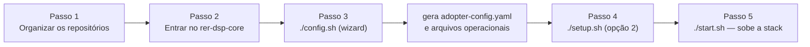

# Instalação completa

## Como executar uma instalação completa em uma infraestrutura própria?

Este guia é voltado a um **administrador de infraestrutura** responsável por colocar o DSP em produção, migrando dados reais de uma organização (o "adotante").

## Requisitos de infraestrutura

| Requisito     | Detalhe                                                                                                                         |
|---------------|---------------------------------------------------------------------------------------------------------------------------------|
| Shell Bash    | Os scripts do core são `bash` puro — nativo em Linux e macOS; no Windows requer WSL2 (sem suporte nativo via PowerShell/cmd)    |
| Git           | se os repositórios irmãos ainda não estiverem clonados; os scripts podem cloná-los automaticamente                       |
| Docker        | 24+ com Compose v2                                                                                                              |
| Python        | Python 3 (usado pelo wizard `./config.sh`)                                                                                     |
| Porta principal | Gateway **`8026`** — única entrada HTTP (frontend, API, GeoServers). Bancos no host, só para admin: `20654` (`dsp-db`), `20656` (`dsp-geoserver-db`); com object storage, `8333` (SeaweedFS) |
| Armazenamento | Volumes persistentes para os 2 bancos Postgres/PostGIS (`dsp-db`, `dsp-geoserver-db`); metadados Spring Batch nos schemas `data_migration` e `geo_file_generation` dentro do `dsp-db` |

## Fluxo de instalação



### Passo 1 — Organizar os repositórios

O DSP é dividido em **repositórios irmãos** no GitHub. Recomendamos criar uma pasta `rer-dsp` e clonar tudo **no mesmo nível** — o `rer-dsp-core` espera os outros módulos em `../rer-dsp-backend`, `../rer-dsp-frontend`, etc.

#### Opção A — fluxo mais simples (recomendado)

Crie a pasta, clone só o core e entre nele. Os scripts `./config.sh`, `./setup.sh` e `./start.sh` detectam repositórios irmãos ausentes e oferecem cloná-los automaticamente ao lado do core:

```bash
mkdir rer-dsp && cd rer-dsp
git clone https://github.com/Rural-Environmental-Registry/rer-dsp-core.git
cd rer-dsp-core
```

Depois que você aceitar o clone automático nos scripts, a árvore típica fica assim:

```text
rer-dsp/
├── rer-dsp-core/          ← você trabalha aqui (config.sh, setup.sh, start.sh)
├── rer-dsp-backend/
├── rer-dsp-frontend/
├── rer-dsp-job-data-migration/
└── rer-dsp-job-geo-file-generation/
```

#### Opção B — clone manual

Clone todos os repositórios de aplicação como pastas irmãs dentro de `rer-dsp`:

```bash
mkdir rer-dsp && cd rer-dsp
git clone https://github.com/Rural-Environmental-Registry/rer-dsp-core.git
git clone https://github.com/Rural-Environmental-Registry/rer-dsp-backend.git
git clone https://github.com/Rural-Environmental-Registry/rer-dsp-frontend.git
git clone https://github.com/Rural-Environmental-Registry/rer-dsp-job-data-migration.git
git clone https://github.com/Rural-Environmental-Registry/rer-dsp-job-geo-file-generation.git
```

Resultado:

```text
rer-dsp/
├── rer-dsp-core/
├── rer-dsp-backend/
├── rer-dsp-frontend/
├── rer-dsp-job-data-migration/
└── rer-dsp-job-geo-file-generation/
```

### Passo 2 — Entrar no core

Se você ainda não estiver dentro do core:

```bash
cd rer-dsp/rer-dsp-core
```

Não é necessário criar nem copiar o `.env` manualmente. O arquivo é gerado automaticamente na primeira execução de `./config.sh` ou `./setup.sh`, a partir de `.env.example`, quando ainda não existir.

### Passo 3 — `./config.sh`

A pessoa que executa o script será **guiada por perguntas no terminal**: em cada estágio o wizard explica o campo, onde o valor é usado e mostra o padrão ou o valor já salvo (Enter mantém o que está entre colchetes). Assim é possível configurar **tudo o que o adotante precisa** — origem dos dados, ETL, textos, mapa, KPIs e **personalizar** a interface sem editar JSON/YAML à mão.

O fluxo tem **6 etapas** guiadas (a última, About, é opcional):

| Etapa | Conteúdo |
|-------|----------|
| **1** | Banco de origem (JDBC) |
| **2** | Tabelas, colunas, SRID e camadas genéricas |
| **3** | Textos de aplicação, formatos de data |
| **4** | Interface: hierarquia, telas, mapa, estilos das camadas fixas |
| **5** | KPIs (cores, unidade de área, temas 0–4) |
| **6** | About opcional (abas em Markdown) |

O `./config.sh` grava a **fonte de verdade do adotante** em `config/adopter/adopter-config.yaml` — **este** é o arquivo pensado para edição manual ou importação de YAML pronto. Na reaplicação (wizard ou opção **1 — Reaplicar**), o `./config.sh` **gera os arquivos operacionais** consumidos pelo backend, GeoServers e jobs. **Não edite esses operacionais à mão:** eles são sobrescritos a cada `./config.sh`.

**Sem o wizard:** copie um `adopter-config.yaml` pronto para `config/adopter/` (use o `.example` como referência) ou edite **somente** esse YAML. O DSP **não** lê o adotante na runtime — backend, GeoServers e jobs usam os JSON/YAML gerados.

!!! warning "Edição manual: só `adopter-config.yaml` + reaplicar"
    Alterações de configuração devem ir em `config/adopter/adopter-config.yaml`. Os demais arquivos em `config/` gerados pelo `./config.sh` **não** devem ser editados à mão — serão **substituídos** ao rodar `./config.sh` (opção **1 — Reaplicar** ou **2 — Editar**).

    Depois de mudar o YAML do adotante, rode `./config.sh` para regenerar os operacionais. Em seguida, faça rebuild da stack (`./setup.sh` / `./start.sh`) para as imagens Docker incorporarem os arquivos novos.

!!! tip "Rebuild após configurar"
    Os arquivos gerados são copiados para as imagens Docker no build. Depois de `./config.sh`, rode `./setup.sh` ou `./start.sh` para que backend, GeoServers e job usem a configuração nova.

### Passo 4 — `./setup.sh`

No **Step 3 — Setup mode**, escolha:

- **Opção 1 — Demonstração** (veja também [Começando rápido](quick-start.md)):
  - Carrega dados de exemplo (mapa do Brasil simplificado) nos bancos locais.
  - Sobe os bancos, aplica o seed e **publica as camadas do mapa** nos dois GeoServers.
  - **Não** conecta ao banco da sua organização e **não** liga os jobs de importação em segundo plano.
  - Ao final, indica rodar `./start.sh` para abrir o site e a API.

- **Opção 2 — Adotante real (dados da organização)**: exige `./config.sh` antes. O script confere se a configuração de importação está pronta e pergunta **como os dados da fonte vão mudar ao longo do tempo** (texto em inglês no terminal: *How will your source data be updated over time?*):

| Escolha no script | Comportamento |
|-------------------|---------------|
| **1 — One-time load** | Importa os dados **agora**, durante este `./setup.sh`, do banco de origem para os bancos do DSP. Publica as camadas do mapa ao terminar. O job de importação **desliga** depois — não há sincronização automática com a fonte. |
| **2 — Living source** | Faz a **primeira importação** como no item 1 e publica o mapa. Depois pergunta **de quanto em quanto tempo** buscar dados novos na fonte (por exemplo todo dia, a cada poucas horas ou minutos) e **de quanto em quanto tempo** gerar arquivos prontos para download, se você usa armazenamento de objetos. Mantém os jobs rodando em segundo plano conforme essas agendas. |
| **3 — Deferred first load** | Você informa **dia e hora** da primeira importação (e o fuso horário). Os bancos ficam vazios até lá; os GeoServers sobem **sem** camadas no mapa até o job rodar. O job de importação fica aguardando. Em seguida o script pergunta: **(a)** depois dessa carga os dados **não mudam mais** — importa uma vez no horário, publica o mapa e pode gerar downloads prontos **uma vez** após essa importação; **(b)** depois da primeira carga a fonte **continua mudando** — no horário escolhido começa a importar e, a partir daí, o mesmo tipo de agenda do item 2 (sincronização e geração de downloads). |

Ao final do fluxo real, o setup **salva as agendas** escolhidas no arquivo `.env`. Rodar `./setup.sh` de novo com opção **2** repete as perguntas, usando o que já estiver salvo como padrão.

- **Opção 3 — Stack status / cleanup / exit**:
  - Lista status dos containers do projeto e URLs conhecidas.
  - Opcionalmente remove containers, volumes e imagens **deste** projeto (confirmação explícita).
  - **Não** executa seed, migração nem sobe backend/frontend.

### Passo 5 — `./start.sh`

Usado **depois** do `./setup.sh`, com bancos, GeoServers e jobs (quando existirem) **já rodando**. O `./start.sh` sobe **somente** o site, a API e o ponto de entrada HTTP — **não** importa dados de novo nem republica camadas. Importação e demo ficam no `./setup.sh` ou nas agendas salvas no setup.

Ao final, abra no navegador **http://localhost:8026/dsp/** (ou a URL que o próprio `./start.sh` mostrar se você mudou porta ou endereço no `.env`).

Detalhamento completo de cada opção e sub-fluxo: [rer-dsp-core](../modules/core.md#os-tres-scripts).

## Próximos passos

| Quero... | Página |
|----------|--------|
| Entender o fluxo de dados detalhado | [Fluxo de dados](../architecture/data-flow.md) |
| Ver todas as variáveis de ambiente do core | [rer-dsp-core](../modules/core.md) |
