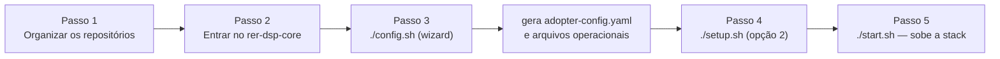

# Instalação completa

## Como executar uma instalação completa em uma infraestrutura própria?

Este guia é voltado a um **administrador de infraestrutura** responsável por colocar o DSP em produção, migrando dados reais de uma organização (o "adotante").

## Requisitos de infraestrutura

| Requisito     | Detalhe                                                                                                                         |
|---------------|---------------------------------------------------------------------------------------------------------------------------------|
| Shell Bash    | Os scripts do core são `bash` puro — nativo em Linux e macOS; no Windows requer WSL2 (sem suporte nativo via PowerShell/cmd)    |
| Git           | se os repositórios irmãos ainda não estiverem clonados; os scripts podem cloná-los automaticamente                       |
| Docker        | 24+ com Compose v2                                                                                                              |
| Python        | Python 3 (usado pelo wizard `./config.sh`)                                                                                     |
| Portas usadas | Gateway `8026` (todo o tráfego HTTP), DSP DB `20654`, GeoServer DB `20656` |
| Armazenamento | Volumes persistentes para os 2 bancos Postgres/PostGIS (`dsp-db`, `dsp-geoserver-db`); metadados Spring Batch nos schemas `data_migration` e `geo_file_generation` dentro do `dsp-db` |

## Fluxo de instalação



### Passo 1 — Organizar os repositórios

#### Opção A — fluxo mais simples (recomendado)

Clone apenas o core. Os scripts `./config.sh`, `./setup.sh` e `./start.sh` detectam repositórios irmãos ausentes, exibem a estrutura de pastas que será criada e oferecem cloná-los automaticamente:

```bash
git clone https://github.com/Rural-Environmental-Registry/rer-dsp-core.git
cd rer-dsp-core
```

#### Opção B — clone manual

Clone os 4 repositórios (core, backend, frontend, job-data-migration) como pastas **irmãs**, dentro de um mesmo diretório pai (por exemplo `DSP/`):

```bash
mkdir DSP && cd DSP
git clone https://github.com/Rural-Environmental-Registry/rer-dsp-core.git
git clone https://github.com/Rural-Environmental-Registry/rer-dsp-backend.git
git clone https://github.com/Rural-Environmental-Registry/rer-dsp-frontend.git
git clone https://github.com/Rural-Environmental-Registry/rer-dsp-job-data-migration.git
```

Resultado:

```text
DSP/
├── rer-dsp-core/
├── rer-dsp-backend/
├── rer-dsp-frontend/
└── rer-dsp-job-data-migration/
```

Esse layout é o esperado por padrão pelos scripts do core (`../rer-dsp-backend`, `../rer-dsp-frontend`, `../rer-dsp-job-data-migration`). Se preferir outra organização de pastas, ajuste os paths no `.env` depois que ele for criado (`DSP_BACKEND_PATH`, `DSP_FRONTEND_PATH`, `DSP_JOB_MIGRATION_PATH`).

### Passo 2 — Entrar no core

```bash
cd rer-dsp-core
```

Não é necessário criar nem copiar o `.env` manualmente. O arquivo é gerado automaticamente na primeira execução de `./config.sh` ou `./setup.sh`, a partir de `.env.example`, quando ainda não existir.

Se precisar personalizar portas, credenciais dos 2 bancos ou paths dos repositórios irmãos antes de subir a stack, edite o `.env` **depois** que um desses scripts o criar. As variáveis do adotante (fonte JDBC, SRID) são preenchidas no Passo 3 pelo wizard; o modo de migração é escolhido no Passo 4 (`./setup.sh`).

### Passo 3 — `./config.sh`

Wizard interativo em **5 estágios** (+ About opcional) que gera `config/adopter/adopter-config.yaml` e, a partir dele, os arquivos operacionais JSON/YAML (instalação do backend, camadas de mapa, temas de download, bloco `kpis` e `application.yaml` do job). Você também pode trazer um YAML pronto ou editá-lo manualmente e **reaplicar**. Detalhamento: [rer-dsp-core](../modules/core.md#configsh).

Depois dos 5 estágios (+ About opcional), o wizard pode habilitar a página About — título do banner, abas e Markdown (o wizard copia arquivos de qualquer pasta para `config/about/`).

!!! tip "Rebuild após configurar"
    Os arquivos gerados são copiados para as imagens Docker no build. Depois de `./config.sh`, rode `./setup.sh` ou `./start.sh` para que backend, GeoServers e job usem a configuração nova.

### Passo 4 — `./setup.sh`

Escolha a opção adequada:

- **Opção 1 — Demonstração**: seed sintético, sem JDBC (veja [Começando rápido](../getting-started.md)).
- **Opção 2 — Adotante real (ETL)**: requer `./config.sh`. O script pergunta em sequência:
    1. **Run now** ou **Schedule for later** (quando roda a carga inicial)
    2. **One-time** ou **Continuous** (comportamento depois da primeira carga)

Combinações típicas:

| Escolhas | Modo | Resumo |
|----------|------|--------|
| Run now + One-time | `once` | Migra no setup; job desliga |
| Schedule + One-time | `scheduled-once` | Espera data/hora; migra uma vez; publica GeoServers |
| Run now + Continuous | `continuous` | Migra no setup; supercronic nos ciclos seguintes |
| Schedule + Continuous | `continuous` + agenda | Primeira carga na data; depois supercronic |

No **Continuous**, o setup pergunta a frequência (diária, a cada N horas ou N minutos) e grava `DSP_MIGRATION_CRON`. Fuso: `DSP_MIGRATION_TZ`.

- **Opção 3 — status/cleanup**: inspeciona ou remove recursos Docker; não migra.

### Passo 5 — `./start.sh`

Usado após a instalação inicial. Verifica repositórios irmãos, garante configs, sobe bancos (mantendo o serviço de migração se `continuous` ou `scheduled-once` pendente), builda/sobe backend, frontend e gateway. **Nunca** dispara carga imediata — migração fica no `./setup.sh` ou no cron do job.

Ao final, a stack fica acessível em uma única porta:

| Serviço | URL |
|---------|-----|
| Frontend | `http://localhost:8026/dsp/` |
| Backend API | `http://localhost:8026/dsp-backend` |
| GeoServer Exhibition | `http://localhost:8026/geoserver-exhibition/web/` |
| GeoServer Download | `http://localhost:8026/geoserver-download/web/` |
| Health do gateway | `http://localhost:8026/gateway/health` |

Detalhamento completo de cada opção e sub-fluxo: [rer-dsp-core](../modules/core.md#os-tres-scripts).

## O que não está incluído

!!! warning "HTTPS / TLS"
    Não há terminação TLS embutida na stack do core. O gateway responde em HTTP. A responsabilidade de expor os serviços via HTTPS (certificados, renovação, etc.) é do adotante — o gateway é o ponto natural para fazer isso, seja configurando TLS nele ou colocando um balanceador de carga na frente.

!!! warning "Balanceamento e alta disponibilidade"
    O gateway é um container único, sem réplicas. Distribuir carga entre múltiplas instâncias da stack fica a cargo do adotante.


## Variáveis de ambiente

Lista completa das variáveis relevantes do `.env` do core: [rer-dsp-core — Variáveis de ambiente](../modules/core.md#variaveis-de-ambiente-relevantes-env-do-core).

## Próximos passos

| Quero... | Página |
|----------|--------|
| Entender o fluxo de dados detalhado | [Fluxo de dados](../architecture/data-flow.md) |
| Ver todas as variáveis de ambiente do core | [rer-dsp-core](../modules/core.md) |
| Configurar apenas um módulo | [Integrar apenas um módulo](single-module-integration.md) |
