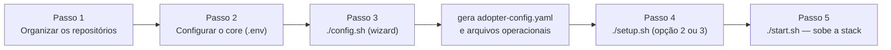

# Instalação completa

## Como executar uma instalação completa em uma infraestrutura própria?

Este guia é voltado a um **administrador de infraestrutura** responsável por colocar o DSP em produção, migrando dados reais de uma organização (o "adotante").

## Requisitos de infraestrutura

| Requisito     | Detalhe                                                                                                                         |
|---------------|---------------------------------------------------------------------------------------------------------------------------------|
| Shell Bash    | Os scripts do core são `bash` puro — nativo em Linux e macOS; no Windows requer WSL2 (sem suporte nativo via PowerShell/cmd)    |
| Docker        | 24+ com Compose v2                                                                                                              |
| Python        | Python 3 (usado pelo wizard `./config.sh`)                                                                                     |
| Portas usadas | Frontend `22667`, Backend `22666`, GeoServer `22668`, DSP DB `20654`, Job migration DB `20655`, GeoServer Exhibition DB `20656` |
| Armazenamento | Volumes persistentes para os 3 bancos Postgres/PostGIS (dsp-db, dsp-geoserver-exhibition-db, dsp-job-migration-db)              |

## Fluxo de instalação



### Passo 1 — Organizar os repositórios

Clone os 4 repositórios (core, backend, frontend, job-data-migration) como pastas **irmãs**, dentro de um mesmo diretório pai (por exemplo `DSP/`):

```bash
mkdir DSP && cd DSP
git clone https://github.com/Rural-Environmental-Registry/rer-dsp-core.git
git clone https://github.com/Rural-Environmental-Registry/rer-dsp-backend.git
git clone https://github.com/Rural-Environmental-Registry/rer-dsp-frontend.git
git clone https://github.com/Rural-Environmental-Registry/rer-dsp-job-data-migration.git
```

Resultado:

```text
DSP/
├── rer-dsp-core/
├── rer-dsp-backend/
├── rer-dsp-frontend/
└── rer-dsp-job-data-migration/
```

Esse layout é o esperado por padrão pelos scripts do core (`../rer-dsp-backend`, `../rer-dsp-frontend`, `../rer-dsp-job-data-migration`). Se preferir outra organização de pastas, ajuste os paths no Passo 2 (`DSP_BACKEND_PATH`, `DSP_FRONTEND_PATH`, `DSP_JOB_MIGRATION_PATH`).

### Passo 2 — Configurar o core

Dentro de `rer-dsp-core`, copie o arquivo de exemplo e ajuste o `.env` para o seu ambiente:

```bash
cd rer-dsp-core
cp .env.example .env
```

Nesse momento vale revisar pelo menos: portas que serão expostas no host (se as [padrão](#requisitos-de-infraestrutura) colidirem com algo já em uso), credenciais dos 3 bancos, e os paths dos repositórios irmãos caso não tenha seguido o layout do Passo 1. As demais variáveis relacionadas ao adotante (fonte JDBC, modo de migração, CORS) são preenchidas no Passo 3 pelo wizard — não é necessário editá-las manualmente aqui.

### Passo 3 — `./config.sh`

Wizard interativo em 5 estágios que gera `config/adopter/adopter-config.yaml` e, a partir dele, os arquivos operacionais JSON/YAML consumidos pelos demais módulos (configuração de instalação do backend, camadas de mapa, `application.yaml` do job de migração). Cada pergunta explica o campo e seu impacto antes de pedir o valor; você também pode editar o `adopter-config.yaml` diretamente, sem passar pelo wizard. Se um `adopter-config.yaml` já existir, o script oferece reaplicar, editar (reabre o wizard com os valores atuais) ou recomeçar do template. Detalhamento estágio a estágio: [rer-dsp-core](../modules/core.md#configsh).

### Passo 4 — `./setup.sh`

Escolha a opção adequada ao seu momento:

- **Opção 2 — migração real via JDBC**: copia os dados da sua fonte para os bancos do DSP. Em seguida pergunta como isso deve se comportar depois da primeira vez:
    - **`once`** (execução única): a cópia roda uma vez, e o container que fez a migração é **desligado e removido** ao terminar. Se os dados de origem mudarem depois, ninguém copia essas mudanças automaticamente — é preciso rodar a migração de novo manualmente.
    - **`continuous`**: realiza a migração inicial normalmente, porém o container do job **permanece em execução** em vez de ser encerrado. A partir desse momento, ele executa sincronizações periódicas conforme configurado, identificando e migrando automaticamente os dados da origem que foram criados, alterados ou removidos após a primeira execução.
- **Opção 3 — sem migração**: sobe a stack (sem job e seu banco) e aplica a configuração do adotante (labels, camadas, SRIDs) mas mantém os bancos vazios. Útil para testar a instalação sem migrar dados reais, ou caso o adotante queira migrar e/ou desenvolver sua própria rotina de migração fora do DSP.
- **Opção 4 — status/cleanup**: mostra status dos containers e URLs, ou remove os recursos Docker do projeto; não sobe nem migra nada.

### Passo 5 — `./start.sh`

Usado após a instalação inicial. Verifica os repositórios irmãos, garante as configurações de instalação/mapa, sobe os bancos (mantendo a stack de migração ativa se o modo for `continuous`), builda e sobe backend + frontend + GeoServer. **Nunca** roda migração — isso é sempre feito pelo `./setup.sh`.

Detalhamento completo de cada opção e sub-fluxo: [rer-dsp-core](../modules/core.md#os-tres-scripts).

## O que não está incluído

!!! warning "Reverse proxy / gateway"
    O core **não** inclui um reverse proxy ou API gateway na frente dos serviços. Isso fica a cargo do adotante — normalmente um Nginx, Traefik ou balanceador de carga apontando para as portas do frontend, backend e GeoServer.

!!! warning "HTTPS / TLS"
    Não há terminação TLS embutida na stack do core. A responsabilidade de expor os serviços via HTTPS (certificados, renovação, etc.) é do adotante, tipicamente no mesmo componente de reverse proxy.


## Variáveis de ambiente

Lista completa das variáveis relevantes do `.env` do core: [rer-dsp-core — Variáveis de ambiente](../modules/core.md#variaveis-de-ambiente-relevantes-env-do-core).

## Próximos passos

| Quero... | Página |
|----------|--------|
| Entender o fluxo de dados detalhado | [Fluxo de dados](../architecture/data-flow.md) |
| Ver todas as variáveis de ambiente do core | [rer-dsp-core](../modules/core.md) |
| Configurar apenas um módulo | [Integrar apenas um módulo](single-module-integration.md) |
