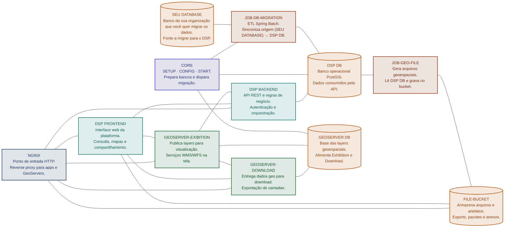
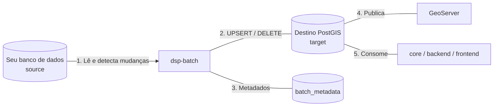

# RER DSP — Documentação

Portal de documentação da **Data Sharing Platform (DSP)** do ecossistema **RER** (*Rural Environmental Registry*).

## Sumário

- [Visão geral](#visao-geral)
- [Arquitetura](#arquitetura)
- [Jornada de onboarding](#jornada-de-onboarding)
- [Fluxo de migração](#fluxo-de-migracao)
- [Mapa da documentação](#mapa-da-documentacao)
- [Componentes do DSP](#componentes-do-dsp)

---

## Visão geral

O **RER** (*Rural Environmental Registry*) é uma solução para gerenciar informações ambientais geoespaciais declaradas em propriedades rurais — bem público digital ([DPG](https://www.digitalpublicgoods.net/r/rural-environmental-registry-registration-module)). Serve como base para controle, monitoramento e planejamento ambiental e econômico.

O **DSP** (*Data Sharing Platform*) é a plataforma de **compartilhamento, visualização e acesso** a esses dados ambientais entre instituições parceiras. Ele combina APIs, frontend, domínio (`core`), bancos PostgreSQL/PostGIS, GeoServer, file buckets e **jobs de migração de dados**.

| Conceito | Papel |
|----------|--------|
| **Rural Environmental Registry (RER)** | Cadastro ambiental (DPG): coleta e mantém as declarações geoespaciais das propriedades rurais |
| **Data Sharing Platform (DSP)** | Plataforma de compartilhamento: sincroniza, publica e expõe esses dados para parceiros e aplicações |

!!! tip "Por onde começar"
    A primeira atividade de onboarding é popular o banco de destino com o job [`rer-dsp-job-data-migration`](migration/rer-dsp-job-data-migration.md). Sem essa base, as demais camadas do DSP não têm dados geoespaciais.

---

## Arquitetura

| Componente | Responsabilidade | Repositório |
|------------|------------------|-------------|
| **NGINX** | Gateway / reverse proxy de entrada | — |
| **DSP Frontend** | Interface web (Platform Services) | [rer-dsp-frontend](https://github.com/Rural-Environmental-Registry/rer-dsp-frontend) |
| **DSP Backend** | API e lógica de negócio | [rer-dsp-backend](https://github.com/Rural-Environmental-Registry/rer-dsp-backend) |
| **DSP DB** | Banco operacional da plataforma | — |
| **GEOSERVER DB** | Banco das layers geoespaciais | — |
| **GEOSERVER-EXIBITION** | Publicação / exibição de maps (WMS/WFS) | — |
| **GEOSERVER-DOWNLOAD** | Download de dados geoespaciais | — |
| **JOB-DB-MIGRATION** | ETL: migra dados da origem (`SEU DATABASE`) → DSP DB | [rer-dsp-job-data-migration](https://github.com/Rural-Environmental-Registry/rer-dsp-job-data-migration) |
| **JOB-GEO-FILE** | Gera arquivos geo a partir do DSP DB → FILE-BUCKET | [rer-dsp-job-geo-file-generation](https://github.com/Rural-Environmental-Registry/rer-dsp-job-geo-file-generation) |
| **FILE-BUCKET** | Armazenamento de arquivos e artefatos | — |
| **CORE** | SETUP, CONFIG e START dos bancos e do job de migração | [rer-dsp-core](https://github.com/Rural-Environmental-Registry/rer-dsp-core) |
| **Docs** | Documentação transversal de onboarding e padrões | [rer-dsp-docs](https://github.com/Rural-Environmental-Registry/rer-dsp-docs) |

Detalhes em [Arquitetura](architecture/overview.md).

---

## Jornada de onboarding

| Passo | O que fazer | Onde |
|-------|-------------|------|
| 1 | Entender propósito do DSP e da migração | Esta página |
| 2 | Preparar máquina (Java 21, Maven, Docker) | [Começando](getting-started.md) |
| 3 | Clonar e configurar `rer-dsp-job-data-migration` | [Job de migração](migration/rer-dsp-job-data-migration.md) |
| 4 | Rodar a migração inicial | [Começando](getting-started.md#passo-5-executar-a-migracao-inicial) |
| 5 | Conferir contagens, status do Batch e tabelas | [Validação](migration/validation.md) |

!!! warning "Ordem dos jobs"
    Execute sempre na ordem **level-1 → level-2 → level-3 → rural-property** quando houver dependência de chave estrangeira no destino.

---

## Fluxo de migração

A migração inicial é o coração do onboarding. O banco de **origem** (`source`) é o banco da sua organização (legado, cadastro ou outro módulo) que você pretende trazer para as aplicações RER/DSP. O job Spring Batch:

1. Lê geometrias e atributos do **banco de origem** (`source`)
2. Detecta mudanças em relação ao **destino** (`target` — base PostGIS do DSP)
3. Faz UPSERT (e, na estratégia `DEFAULT`, remove órfãos)
4. Registra a execução em **metadados** (`batch_metadata`)
5. Deixa o destino pronto para consumo por core, backend, frontend e GeoServer

Visão completa: [Migração — visão geral](migration/overview.md).

---

## Mapa da documentação

| Documento | Conteúdo |
|-----------|----------|
| [Começando](getting-started.md) | Passo a passo do primeiro run local |
| [Arquitetura](architecture/overview.md) | Camadas, containers e fluxo de dados |
| [Migração — visão geral](migration/overview.md) | Conceitos, ordem e estratégias |
| [Job data-migration](migration/rer-dsp-job-data-migration.md) | YAML, datasources, comandos e pipeline |
| [Validação](migration/validation.md) | Checklist e queries pós-migração |

---

## Componentes do DSP

| Repositório / componente | Papel |
|--------------------------|--------|
| [rer-dsp-docs](https://github.com/Rural-Environmental-Registry/rer-dsp-docs) | Esta wiki — fonte transversal de onboarding e padrões |
| [rer-dsp-job-data-migration](https://github.com/Rural-Environmental-Registry/rer-dsp-job-data-migration) | ETL geoespacial (Spring Batch / `dsp-batch`) |
| [rer-dsp-job-geo-file-generation](https://github.com/Rural-Environmental-Registry/rer-dsp-job-geo-file-generation) | Geração de arquivos geoespaciais |
| [rer-dsp-core](https://github.com/Rural-Environmental-Registry/rer-dsp-core) | Domínio e serviços compartilhados |
| [rer-dsp-backend](https://github.com/Rural-Environmental-Registry/rer-dsp-backend) | API REST da plataforma |
| [rer-dsp-frontend](https://github.com/Rural-Environmental-Registry/rer-dsp-frontend) | Interface web |
| PostgreSQL / PostGIS | Persistência operacional e geometrias |
| GeoServer | Layers WMS/WFS |
| Buckets S3 | Arquivos, exports e artefatos |
