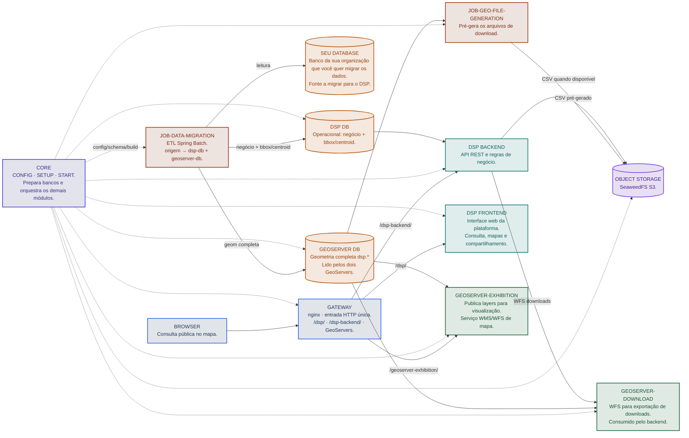

# [RER](https://www.digitalpublicgoods.net/r/rural-environmental-registry-registration-module) DSP — Documentação

Portal de documentação da **Data Sharing Platform (DSP)** do ecossistema [**RER**](https://www.digitalpublicgoods.net/r/rural-environmental-registry-registration-module) (*Rural Environmental Registry*).

## [RER](https://www.digitalpublicgoods.net/r/rural-environmental-registry-registration-module) e DSP em uma frase cada

O [**RER**](https://www.digitalpublicgoods.net/r/rural-environmental-registry-registration-module) (*Rural Environmental Registry*) é um bem público digital (DPG) para o cadastro de informações ambientais geoespaciais declaradas em propriedades rurais. O sistema do Cadastro Ambiental Rural (CAR), aprimorado em parceria com a Dataprev, foi [lançado na COP30 pelo MGI sob essa nomenclatura como o primeiro bem público digital do governo brasileiro](https://www.dataprev.gov.br/noticias/na-cop30-mgi-lanca-car-como-primeiro-bem-publico-digital-do-governo-brasileiro) no catálogo internacional da Digital Public Goods Alliance (DPGA).

No **contexto brasileiro**, o módulo de cadastro do [RER](https://www.digitalpublicgoods.net/r/rural-environmental-registry-registration-module) equivale ao **Módulo de Cadastro Pré-Preenchido** do [SICAR](https://www.car.gov.br/): é por ele que proprietários e responsáveis cadastram e atualizam imóveis rurais de forma facilitada, com dados pré-preenchidos e integração entre bases públicas.

*Legenda: interface do módulo de cadastro do [RER](https://www.digitalpublicgoods.net/r/rural-environmental-registry-registration-module) (cadastro pré-preenchido), com mapa para localizar e registrar o imóvel rural.*

O **DSP** (*Data Sharing Platform*) é a plataforma que **compartilha, visualiza e publica** esses dados ambientais para o público geral. Embora atenda ao [RER](https://www.digitalpublicgoods.net/r/rural-environmental-registry-registration-module), sua aplicação não se limita a ele, podendo ser utilizada em outros contextos de forma simples e sem complicações. Para isso, sua arquitetura combina uma API REST, um frontend web, bancos PostgreSQL/PostGIS, GeoServer e rotinas de migração e sincronização de dados.

No **contexto brasileiro**, o DSP equivale à [consulta pública do CAR](https://consulta.car.gov.br/): interface em que qualquer pessoa consulta no mapa os dados ambientais declarados nos imóveis rurais cadastrados, com filtros, indicadores e camadas geográficas.

*Legenda: tela inicial da consulta pública do DSP — mapa, hierarquia territorial e busca de imóveis (equivalente à consulta pública do CAR no contexto brasileiro).*

## Arquitetura em alto nível

```mermaid
flowchart LR
  browser["BROWSER<br/>Consulta pública no mapa."]
  gw["GATEWAY<br/>nginx · entrada HTTP única.<br/>/dsp/ · /dsp-backend/ · GeoServers."]

  srcDb[("SEU DATABASE<br/>Banco da sua organização que você quer migrar os dados.<br/>Fonte a migrar para o DSP.")]
  jobMig["JOB-DATA-MIGRATION<br/>ETL Spring Batch.<br/>origem → dsp-db + geoserver-db."]
  jobGeo["JOB-GEO-FILE-GENERATION<br/>Pré-gera os arquivos de download.<br/>"]
  core["CORE<br/>CONFIG · SETUP · START.<br/>Prepara bancos e orquestra os demais módulos."]

  dspDb[("DSP DB<br/>Operacional: negócio + bbox/centroid.")]
  gsDb[("GEOSERVER DB<br/>Geometria completa dsp.*<br/>Lido pelos dois GeoServers.")]
  objStor[("OBJECT STORAGE<br/>SeaweedFS S3.<br/>")]

  be["DSP BACKEND<br/>API REST e regras de negócio."]
  fe["DSP FRONTEND<br/>Interface web da plataforma.<br/>Consulta, mapas e compartilhamento."]

  gsEx["GEOSERVER-EXHIBITION<br/>Publica layers para visualização.<br/>Serviço WMS/WFS de mapa."]
  gsDl["GEOSERVER-DOWNLOAD<br/>WFS para exportação de downloads.<br/>Consumido pelo backend."]

  browser --> gw
  gw -->|/dsp/| fe
  gw -->|/dsp-backend/| be
  gw -->|/geoserver-exhibition/| gsEx

  jobMig -->|leitura| srcDb
  jobMig -->|"negócio + bbox/centroid"| dspDb
  jobMig -->|"geom completa"| gsDb
  core -.config/schema/build.-> jobMig
  core -.-> jobGeo
  core -.-> dspDb
  core -.-> gsDb
  core -.-> objStor
  core -.-> gw
  core -.-> be
  core -.-> fe
  core -.-> gsEx
  core -.-> gsDl

  dspDb --> be
  gsDb --> gsEx
  gsDb --> gsDl
  gsDb --> jobGeo
  jobGeo -->|"CSV pré-gerado"| objStor
  be -->|WFS downloads| gsDl
  be -->|CSV quando disponível| objStor

  classDef app fill:#0f766e22,color:#115e59,stroke:#0f766e,stroke-width:2px
  classDef geoCls fill:#16653422,color:#14532d,stroke:#166534,stroke-width:2px
  classDef db fill:#b4530922,color:#92400e,stroke:#b45309,stroke-width:2px
  classDef job fill:#7c2d1222,color:#7c2d12,stroke:#9a3412,stroke-width:2px
  classDef coreCls fill:#312e8122,color:#312e81,stroke:#4338ca,stroke-width:2px
  classDef entryCls fill:#1e3a5f22,color:#1e3a5f,stroke:#2563eb,stroke-width:2px
  classDef storageCls fill:#4c1d9522,color:#4c1d95,stroke:#7c3aed,stroke-width:2px

  class fe,be app
  class gsEx,gsDl geoCls
  class dspDb,gsDb,srcDb db
  class jobMig,jobGeo job
  class core coreCls
  class browser,gw entryCls
  class objStor storageCls
```

!!! tip "Por onde começar"
    O ponto de entrada operacional é o repositório `rer-dsp-core`: use `./config.sh`, `./setup.sh` e `./start.sh` para subir a stack com Docker Compose (bancos PostgreSQL/PostGIS, gateway nginx, GeoServers Exhibition e Download, backend, frontend e job de migração).

    Na instalação com fonte JDBC real, o core também sobe object storage (SeaweedFS) e o job geo-file (CSV de download pré-gerado), via profile Compose `object-storage`. No [Começando rápido](guides/quick-start.md) (demo com seed sintético) esses dois serviços não entram — os downloads usam o GeoServer Download.

## Por onde começar

| Objetivo | Página |
|----------|--------|
| Entender o que é o DSP e se ele serve para sua organização | [O que é o DSP](what-is-the-dsp.md) |
| Conhecer os 6 módulos e como se conectam | [Módulos do DSP](dsp-modules.md) |
| Testar o DSP: rodar uma demo local em poucos minutos (seed sintético, só para avaliação) | [Começando rápido](guides/quick-start.md) |
| Instalar tudo em infraestrutura própria | [Instalação completa](guides/full-installation.md) |

## Mapa da documentação

| Seção | Conteúdo |
|-------|----------|
| [O que é o DSP](what-is-the-dsp.md) | Propósito, problema resolvido, cenários de uso |
| [Módulos do DSP](dsp-modules.md) | Responsabilidade e tecnologia de cada módulo |
| [Começando rápido](guides/quick-start.md) | Demo local para testes — seed sintético, sem banco externo |
| [Guias de instalação](guides/full-installation.md) | Instalação completa com fonte JDBC real |
| [Arquitetura](architecture/overview.md) | Camadas, fluxo de dados, bancos |
| [Referência dos módulos](modules/core.md) | Detalhe técnico de cada repositório |

---

Esta documentação (`rer-dsp-docs`) é a **única fonte de documentação técnica** do ecossistema DSP — os demais repositórios não mantêm pastas `docs/` próprias.
