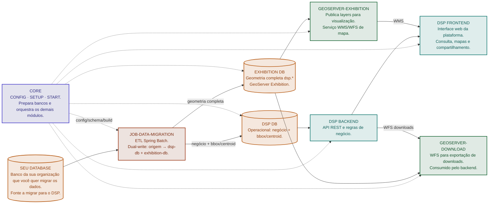

# RER DSP — Documentação

Portal de documentação da **Data Sharing Platform (DSP)** do ecossistema **RER** (*Rural Environmental Registry*).

## RER e DSP em uma frase cada

O **RER** (*Rural Environmental Registry*) é um bem público digital ([DPG](https://www.digitalpublicgoods.net/r/rural-environmental-registry-registration-module)) para o cadastro de informações ambientais geoespaciais declaradas em propriedades rurais.

O **DSP** (*Data Sharing Platform*) é a plataforma que **compartilha, visualiza e publica** esses dados ambientais para o público geral. Embora atenda ao RER, sua aplicação não se limita a ele, podendo ser utilizada em outros contextos de forma simples e sem complicações. Para isso, sua arquitetura combina uma API REST, um frontend web, bancos PostgreSQL/PostGIS, GeoServer e rotinas de migração e sincronização de dados.

## Arquitetura em alto nível

```mermaid
flowchart LR
  srcDb[("SEU DATABASE<br/>Banco da sua organização que você quer migrar os dados.<br/>Fonte a migrar para o DSP.")]
  jobMig["JOB-DATA-MIGRATION<br/>ETL Spring Batch.<br/>Dual-write: origem → dsp-db + exhibition-db."]
  core["CORE<br/>CONFIG · SETUP · START.<br/>Prepara bancos e orquestra os demais módulos."]

  dspDb[("DSP DB<br/>Operacional: negócio + bbox/centroid.")]
  gsDb[("EXHIBITION DB<br/>Geometria completa dsp.*<br/>GeoServer Exhibition.")]

  be["DSP BACKEND<br/>API REST e regras de negócio."]
  fe["DSP FRONTEND<br/>Interface web da plataforma.<br/>Consulta, mapas e compartilhamento."]

  gsEx["GEOSERVER-EXHIBITION<br/>Publica layers para visualização.<br/>Serviço WMS/WFS de mapa."]
  gsDl["GEOSERVER-DOWNLOAD<br/>WFS para exportação de downloads.<br/>Consumido pelo backend."]

  srcDb --> jobMig
  jobMig -->|"negócio + bbox/centroid"| dspDb
  jobMig -->|"geometria completa"| gsDb
  core -.config/schema/build.-> jobMig
  core -.-> dspDb
  core -.-> gsDb
  core -.-> be
  core -.-> fe
  core -.-> gsEx
  core -.-> gsDl

  dspDb --> be
  gsDb --> gsEx
  gsDb --> gsDl

  be --> fe
  be -->|WFS downloads| gsDl
  gsEx -->|WMS| fe

  classDef app fill:#0f766e22,color:#115e59,stroke:#0f766e,stroke-width:2px
  classDef geoCls fill:#16653422,color:#14532d,stroke:#166534,stroke-width:2px
  classDef db fill:#b4530922,color:#92400e,stroke:#b45309,stroke-width:2px
  classDef job fill:#7c2d1222,color:#7c2d12,stroke:#9a3412,stroke-width:2px
  classDef coreCls fill:#312e8122,color:#312e81,stroke:#4338ca,stroke-width:2px

  class fe,be app
  class gsEx,gsDl geoCls
  class dspDb,gsDb,srcDb db
  class jobMig job
  class core coreCls
```

!!! tip "Por onde começar"
    O `rer-dsp-core` é o ponto de entrada operacional: ele sobe os bancos, os GeoServers (Exhibition + Download) e orquestra os demais módulos via Docker Compose.

## Por onde começar

| Objetivo | Página |
|----------|--------|
| Entender o que é o DSP e se ele serve para sua organização | [O que é o DSP](o-que-e-o-dsp.md) |
| Conhecer os 5 módulos e como se conectam | [Módulos do DSP](modulos.md) |
| Rodar uma demo local em poucos minutos | [Começando rápido](getting-started.md) |
| Instalar tudo em infraestrutura própria | [Instalação completa](guides/full-installation.md) |
| Integrar apenas um módulo a um ambiente existente | [Integrar apenas um módulo](guides/single-module-integration.md) |

## Mapa da documentação

| Seção | Conteúdo |
|-------|----------|
| [O que é o DSP](o-que-e-o-dsp.md) | Propósito, problema resolvido, cenários de uso |
| [Módulos do DSP](modulos.md) | Responsabilidade e tecnologia de cada módulo |
| [Começando rápido](getting-started.md) | Demo local com seed sintético, sem banco externo |
| [Guias de instalação](guides/full-installation.md) | Instalação completa e integração parcial |
| [Arquitetura](architecture/overview.md) | Camadas, fluxo de dados, dependências, bancos |
| [Referência dos módulos](modules/core.md) | Detalhe técnico de cada repositório |

---

Esta documentação (`rer-dsp-docs`) é a **única fonte de documentação técnica** do ecossistema DSP — os demais repositórios não mantêm pastas `docs/` próprias.
