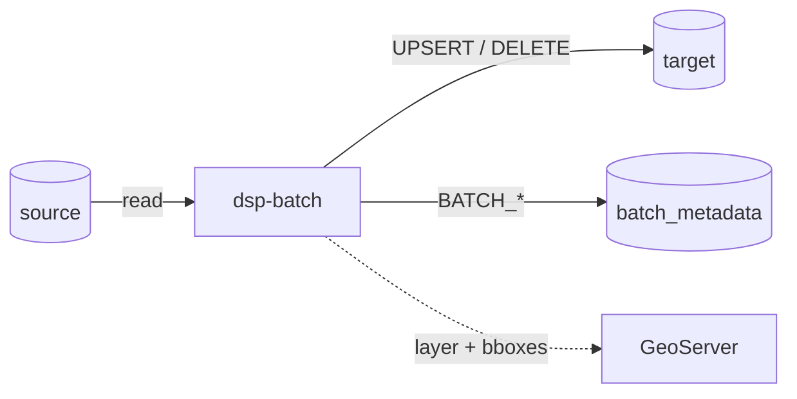
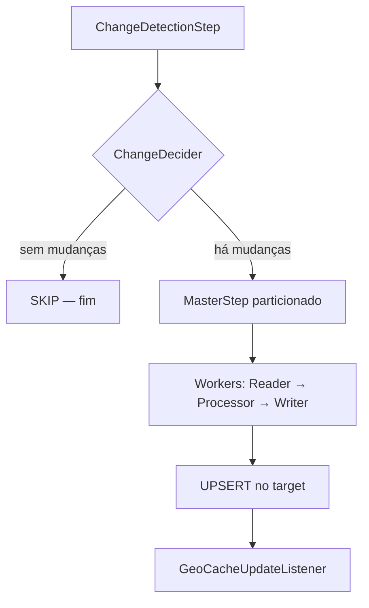

# Migração de dados — visão geral

Repositório: [rer-dsp-job-data-migration](https://github.com/Rural-Environmental-Registry/rer-dsp-job-data-migration) · documentação do job: [Job data-migration](rer-dsp-job-data-migration.md)

Conceitos, ordem de execução e pré-requisitos da migração geoespacial no RER DSP. A implementação atual está no artefato Maven `dsp-batch`.

## Sumário

- [Por que migrar](#por-que-migrar)
- [Escopo da migração inicial](#escopo-da-migracao-inicial)
- [Atores do fluxo](#atores-do-fluxo)
- [Pipeline de um job](#pipeline-de-um-job)
- [Ordem recomendada](#ordem-recomendada)
- [Estratégias de change detection](#estrategias-de-change-detection)
- [Pré-requisitos](#pre-requisitos)
- [Caminhos de ambiente](#caminhos-de-ambiente)
- [Onde aprofundar](#onde-aprofundar)

---

## Por que migrar

O DSP pode trabalhar com uma **base PostGIS de destino** alinhada à origem (legado ou outro módulo) mantendo essa sincronização:

---

## Escopo da migração inicial

| Domínio | Jobs | Observação |
|---------|------|------------|
| Unidades administrativas | level-1, level-2, level-3 | Hierarquia configurável via YAML |
| Propriedades rurais | `rural-property-geoserver-job` | Tipicamente `DATE_RANGE` |

O significado de cada level **não está fixo no código** — vem das tabelas e colunas configuradas no YAML. Exemplos de hierarquias possíveis:

| Exemplo | Level 1 | Level 2 | Level 3 |
|---------|---------|---------|---------|
| Mundial | Continente | País | Área administrativa |
| Brasil | Estado | Município | Distrito / setor |
| Urbano | Região metropolitana | Município | Bairro |

---

## Atores do fluxo



| Componente | Responsabilidade |
|------------|------------------|
| Banco **source** | Fonte da verdade a ser lida |
| Banco **target** | Base DSP atualizada pelo job |
| Banco **batch_metadata** | Histórico e controle Spring Batch |
| **dsp-batch** | Orquestra detecção, partição, UPSERT |
| **GeoServer** | Consome destino; |

---

## Pipeline de um job

Todos os quatro jobs seguem o mesmo pipeline:



| Etapa | O que faz |
|-------|-----------|
| Change detection | Compara origem × destino (ou filtra por data) |
| Decider | `PROCESS` ou `SKIP` |
| Partitioner | Fatia por `partition-column` (se numérica) |
| Reader | Páginas com geometria em GeoJSON (`ST_AsGeoJSON`) |
| Processor | Pass-through (sem transformação de negócio) |
| Writer / service | UPSERT `ON CONFLICT` + `ST_GeomFromGeoJSON` |
| Listener | Log de pedido de refresh de cache |

Detalhe de configuração: [rer-dsp-job-data-migration](rer-dsp-job-data-migration.md).

---

## Ordem recomendada

```text
admin-unit level-1
    → admin-unit level-2
        → admin-unit level-3
            → rural-property
```

| Motivo | Detalhe |
|--------|---------|
| FKs no destino | Filhos referenciam pais já migrados |
| Validação incremental | Facilita achar erro no level certo |
| Carga | Levels menores primeiro reduzem retrabalho |

O `JobRunner` já executa nessa ordem quando várias flags estão `true`.

---

## Estratégias de change detection

| Estratégia | Uso típico | Comportamento |
|------------|------------|---------------|
| `DEFAULT` | Unidades administrativas | Hash de atributos + geometria; DELETE de órfãos no target; coleta bboxes |
| `DATE_RANGE` | Propriedades rurais | Filtra origem por `start-date` / `end-date` em `comparison-columns`; **não** faz hash nem delete de órfãos |

---

## Pré-requisitos

- [ ] Java 21 e Maven Wrapper
- [ ] Três datasources acessíveis (ou schemas equivalentes)
- [ ] Extensão PostGIS na origem e no destino
- [ ] Schema `BATCH_*` aplicado
- [ ] PRIMARY KEY (ou unique) nas colunas de conflito do destino
- [ ] YAML com `source-table`, `target-table`, mapping e `layer-name`
- [ ] Flags `execution-jobs` coerentes com a etapa

---