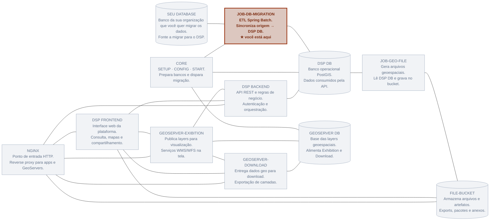
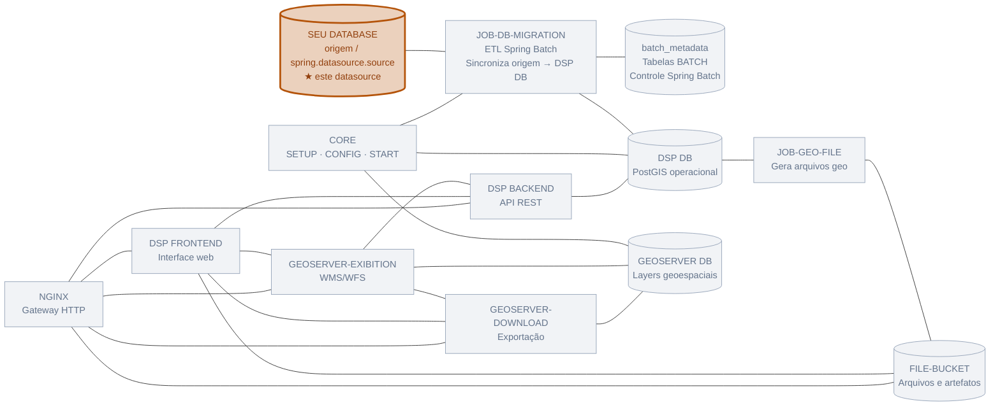
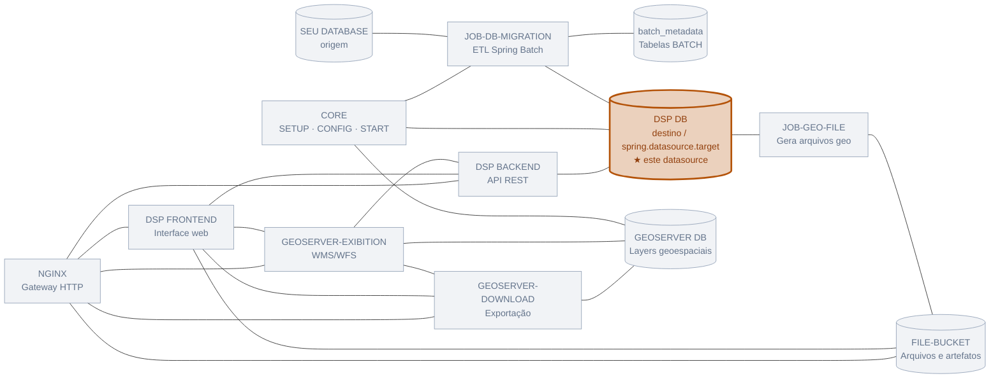
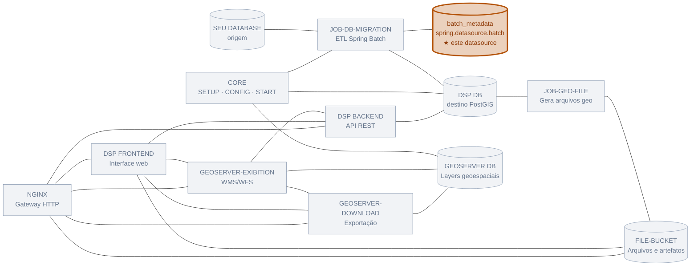
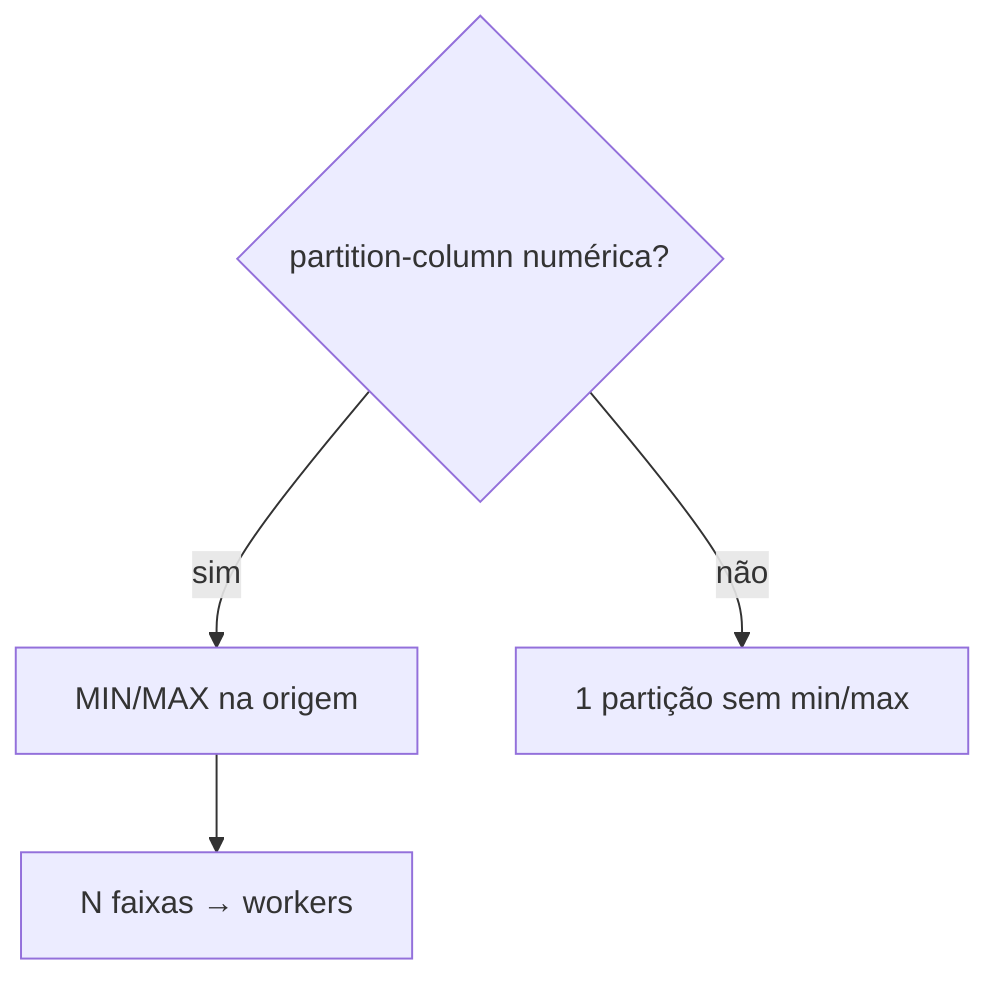
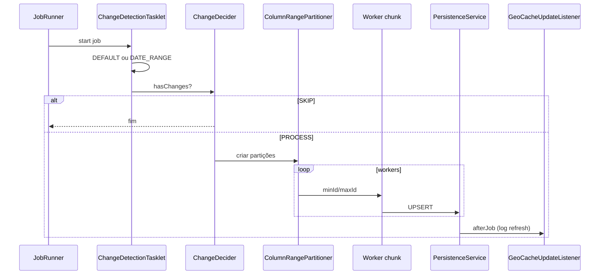

# Job: rer-dsp-job-data-migration

Documentação do repositório de ETL geoespacial do DSP (`br.car:dsp-batch`). É o ponto de partida do onboarding — ver também [Começando](../getting-started.md) e [Visão da migração](overview.md).

## Sumário

- [Stack](#stack)
- [Propósito](#proposito)
  - [Onde este job se encaixa](#onde-este-job-se-encaixa)
- [Jobs disponíveis](#jobs-disponiveis)
- [DataSources](#datasources)
  - [Source — SEU DATABASE](#source--seu-database)
  - [Target — DSP DB](#target--dsp-db)
  - [Batch — batch_metadata](#batch--batch_metadata)
  - [Exemplo local](#exemplo-ambiente-local-na-porta-6666)
- [Configuração YAML](#configuracao-yaml)
- [Paralelização e partição](#paralelizacao-e-particao)
- [Fluxo interno](#fluxo-interno)
- [Comandos de execução](#comandos-de-execucao)
- [Docker Compose local](#docker-compose-local)
- [Responsabilidades dos componentes Java](#responsabilidades-dos-componentes-java)

---

## Stack

| Tecnologia | Versão / detalhe |
|------------|------------------|
| Java | 21 |
| Spring Boot | 3.4.2 |
| Spring Batch | via `spring-boot-starter-batch` |
| PostgreSQL + PostGIS | JDBC; funções `ST_*` |
| HikariCP | Pool por datasource |
| Lombok | Annotation processing |
| Maven Wrapper | `./mvnw` |

---

## Propósito

Migrar e sincronizar **atributos + geometrias** de um banco **origem** para um banco **destino**, com:

- Detecção de mudanças
- Leitura particionada e paralela
- UPSERT no destino
- Remoção de órfãos (estratégia `DEFAULT`)
- Registro de execução em `batch_metadata`

### Onde este job se encaixa

No mapa da arquitetura DSP, **este repositório é o `JOB-DB-MIGRATION`** — destaque abaixo.



Diagrama completo da plataforma: [Arquitetura](../architecture/overview.md#diagrama-de-componentes).

---

## Jobs disponíveis

| Flag `execution-jobs` | Bean Job | Bloco YAML |
|-----------------------|----------|------------|
| `admin-unit-level-1-geoserver-job` | `adminUnitLevel1GeoserverJob` | `batch.admin-unit.level-1` |
| `admin-unit-level-2-geoserver-job` | `adminUnitLevel2GeoserverJob` | `batch.admin-unit.level-2` |
| `admin-unit-level-3-geoserver-job` | `adminUnitLevel3GeoserverJob` | `batch.admin-unit.level-3` |
| `rural-property-geoserver-job` | `ruralPropertyGeoserverJob` | `batch.rural-property` |

Ordem no `JobRunner`: **L1 → L2 → L3 → rural-property**.

```yaml
execution-jobs:
  admin-unit-level-1-geoserver-job: true
  admin-unit-level-2-geoserver-job: false
  admin-unit-level-3-geoserver-job: false
  rural-property-geoserver-job: false
```

---

## DataSources

A auto-configuração JDBC do Boot é **excluída**. Três beans manuais — cada um aponta para um banco diferente:

| Bean | Qualifier | Prefixo YAML | Banco no mapa | Uso |
|------|-----------|--------------|---------------|-----|
| `dataSource` | `@Primary` | `spring.datasource.batch` | `batch_metadata` | JobRepository (`BATCH_*`) |
| `sourceDataSource` | `sourceDataSource` | `spring.datasource.source` | **SEU DATABASE** | Leitura / change detection / partição |
| `targetDataSource` | `targetDataSource` | `spring.datasource.target` | **DSP DB** | UPSERT / DELETE |

Abaixo, o mesmo mapa da arquitetura com **um banco em destaque** por vez (os demais em cinza).

### Source — SEU DATABASE

`spring.datasource.source` → leitura da origem (ex: `source_geo_import_db`).



### Target — DSP DB

`spring.datasource.target` → gravação no destino (ex: `target_geo_import_db`).



### Batch — batch_metadata

`spring.datasource.batch` → metadados do Spring Batch (não guarda geometrias).



---

## Configuração YAML

### Unidades administrativas (exemplo level-1)

```yaml
batch:
  admin-unit:
    level-1:
      source-table: source_admin_units.source_l1_continents
      target-table: target_admin_units.target_l1_continent
      primary-key: source_continent_pk
      geometry-column: source_continent_geom
      where-clause: "1=1"
      comparison-columns:
        - source_continent_name
      persist-columns:
        - source_continent_pk
        - source_continent_name
      column-mapping:
        source_continent_pk: target_continent_id
        source_continent_name: target_continent_label
        source_continent_geom: target_continent_geometry
      layer-name: source-continents-geoserver-layer
      srid: 4326
      change-detection-strategy: DEFAULT
```

### Propriedades das tabelas

| Propriedade | Obrigatória | Descrição |
|-------------|-------------|-----------|
| `source-table` | sim | Tabela/schema de origem |
| `target-table` | sim | Tabela/schema de destino |
| `primary-key` | sim | PK na **origem** (base do `ON CONFLICT` no destino) |
| `geometry-column` | sim | Coluna PostGIS na origem |
| `persist-columns` | sim | Colunas gravadas (incluir PK e FKs) |
| `comparison-columns` | sim | Colunas da **origem** usadas na change detection (ver abaixo) |
| `column-mapping` | não | Mapa `origem: destino` quando nomes diferem |
| `partition-column` | não | Coluna de fatiamento (default = PK) |
| `where-clause` | não | Filtro SQL adicional |
| `layer-name` | sim* | Nome da layer no GeoServer |
| `srid` | sim | SRID das geometrias |
| `change-detection-strategy` | sim | `DEFAULT` ou `DATE_RANGE` |
| `start-date` / `end-date` | se DATE_RANGE | Intervalo inclusivo |

#### O que é `comparison-columns`

Lista de colunas **na origem** que o job olha **antes** de processar os registros, para decidir se há algo a migrar. O papel muda conforme a estratégia:

| Estratégia | Papel de `comparison-columns` |
|------------|-------------------------------|
| `DEFAULT` | Entram no **hash** (junto com a geometria). Se o hash origem ≠ destino → registro **modificado**. Se a PK só existe na origem → **novo**. Se a PK só existe no destino → **órfão** (candidato a DELETE). |
| `DATE_RANGE` | São as colunas de **data** filtradas por `start-date` / `end-date` (ex.: `created_date`). Não calcula hash nem remove órfãos. |

Exemplos:

```yaml
# DEFAULT — detecta mudança de nome (e, no L2/L3, de vínculo com o pai)
comparison-columns:
  - source_continent_name

# Level 2 — nome ou FK do continente mudou?
comparison-columns:
  - source_country_name
  - source_continent_fk

# DATE_RANGE — filtra propriedades pela data de criação
comparison-columns:
  - created_date
```

!!! tip "comparison-columns × persist-columns"
    - `comparison-columns` → decide **se** o registro mudou (ou se entra no intervalo de datas).
    - `persist-columns` → define **o que** será gravado no destino.
    - Uma coluna pode estar nas duas (ex.: nome e FK). A geometria é tratada à parte via `geometry-column` (no `DEFAULT`, também entra no hash).

### Rural property (DATE_RANGE)

```yaml
batch:
  rural-property:
    source-table: property
    target-table: property
    primary-key: id
    geometry-column: geometry
    where-clause: "1=1"
    comparison-columns:
      - created_date
    persist-columns:
      - id
      - property_name
    layer-name: property
    srid: 4326
    change-detection-strategy: DATE_RANGE
    start-date: 2024-01-01
    end-date: 2024-12-31
```

!!! warning "PRIMARY KEY no destino"
    A coluna mapeada da PK **deve** ser PRIMARY KEY (ou unique) no target. Caso contrário: *no unique or exclusion constraint matching the ON CONFLICT specification*.

!!! warning "where-clause no Reader"
    O `where-clause` é usado na change detection e no partitioner. No reader de páginas, o filtro efetivo atual concentra-se em geometria válida e faixa de partição — confirme o comportamento antes de depender só do `where-clause` para reduzir volume.

---

## Paralelização e partição

Chaves em `parallelization.jobs` usam o **nome do bean Job** (camelCase), não a flag kebab-case:

```yaml
parallelization:
  jobs:
    adminUnitLevel1GeoserverJob:
      enabled: true
      thread-pool-size: 1
      chunk-size: 1
      page-size: 1000
      queue-capacity: 100
    adminUnitLevel2GeoserverJob:
      enabled: true
      thread-pool-size: 4
      chunk-size: 1
      page-size: 1000
      queue-capacity: 100
    adminUnitLevel3GeoserverJob:
      enabled: true
      thread-pool-size: 4
      chunk-size: 100
      page-size: 1000
      queue-capacity: 100
    ruralPropertyGeoserverJob:
      enabled: false
      thread-pool-size: 1
      chunk-size: 100
      page-size: 1000
      queue-capacity: 100
```

| Parâmetro | Efeito |
|-----------|--------|
| `enabled` | Liga o master/worker particionado |
| `thread-pool-size` | Workers em paralelo |
| `chunk-size` | Tamanho do chunk de escrita |
| `page-size` | Página do reader |
| `queue-capacity` | Fila do executor |



Regra: `hikari.maximum-pool-size` do source/target deve comportar o `thread-pool-size`.

---

## Fluxo interno



---

## Comandos de execução

Rode os comandos a partir da **raiz** do repositório `rer-dsp-job-data-migration`, com o `application.yaml` (datasources e `execution-jobs`) já configurado. Host/porta abaixo seguem o exemplo local que estamos usando(`localhost:6666`), mas pode ser que sem seu caso seja a porta padrão do postgres .

### 1. Preparar metadados do Spring Batch

A aplicação **não** cria as tabelas `BATCH_*` sozinha (`initialize-schema: never`). Faça isso uma vez (ou quando o banco de metadados for recriado):

```bash
# Cria o database batch_metadata (se o script fizer isso no seu ambiente)
psql -h localhost -p 6666 -U postgres \
  -f src/main/resources/db/batch_metadata/01_create_database.sql

# Cria as tabelas BATCH_* dentro de batch_metadata
psql -h localhost -p 6666 -U postgres -d batch_metadata \
  -f src/main/resources/db/batch_metadata/02_spring_batch_schema.sql
```

Conferir:

```bash
psql -h localhost -p 6666 -U postgres -d batch_metadata -c '\dt BATCH*'
```

A URL `spring.datasource.batch` precisa apontar para **esse** banco.

### 2. Subir a aplicação

Na subida, o `JobRunner` dispara só os jobs com flag `true` em `execution-jobs` (ordem L1 → L2 → L3 → rural-property). A API HTTP sobe na porta **8086**.

**Desenvolvimento** (recompila e sobe):

```bash
./mvnw spring-boot:run
```

**Pacote + JAR** (útil para CI ou ambiente sem Maven na máquina de execução):

```bash
./mvnw clean package -DskipTests
java -jar target/dsp-batch-0.0.1-SNAPSHOT.jar
```

Acompanhe os logs do pacote `br.car.dsp_batch`. Status da execução fica em `batch_metadata` (`BATCH_JOB_EXECUTION`).

### 3. Override de flags sem editar o YAML

Para testar um nível específico sem alterar `application.yaml`, passe as flags na linha de comando:

```bash
./mvnw spring-boot:run -Dspring-boot.run.arguments="\
--execution-jobs.admin-unit-level-1-geoserver-job=true \
--execution-jobs.admin-unit-level-2-geoserver-job=true \
--execution-jobs.admin-unit-level-3-geoserver-job=false \
--execution-jobs.rural-property-geoserver-job=false"
```

| Situação | Dica |
|----------|------|
| Primeira execução | Habilite só o **level-1**; valide; depois L2 e L3 |
| Job sobe e “não faz nada” | Flags todas `false`, ou change detection em `SKIP` (sem mudanças) |
| Erro de schema Batch | Refaça o passo 1 e confira a URL do datasource `batch` |

Passo a passo completo de onboarding: [Começando](../getting-started.md).

---
