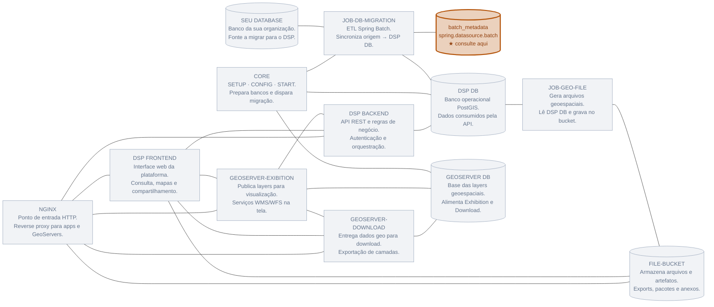

# Validação da migração

Checklist e consultas para confirmar que a migração via `rer-dsp-job-data-migration` concluiu com sucesso e que o destino está consistente.

## Sumário

- [Quando validar](#quando-validar)
- [Checklist rápido](#checklist-rapido)
- [1. Status do Spring Batch](#1-status-do-spring-batch)
- [2. Contagens origem × destino](#2-contagens-origem-destino)
- [3. Integridade de chave e órfãos](#3-integridade-de-chave-e-orfaos)
- [4. Geometrias](#4-geometrias)
- [5. Hierarquia entre levels](#5-hierarquia-entre-levels)
- [6. Paralelização e performance](#6-paralelizacao-e-performance)
- [7. GeoServer](#7-geoserver)
- [Sinais de falha frequentes](#sinais-de-falha-frequentes)
- [Registro do onboarding](#registro-do-onboarding)

---

## Quando validar

| Momento | Objetivo |
|---------|----------|
| Após cada job (L1, L2, L3, rural) | Isolar problemas por nível |
| Após a sequência completa | Confirmar base pronta para o DSP |
| Antes de liberar GeoServer/API | Evitar publicação de dados incompletos |

A validação fecha o ciclo iniciado em [Começando](../getting-started.md).

---

## Checklist rápido

- [ ] Última execução do job com `status = COMPLETED`
- [ ] Sem steps `FAILED` em `BATCH_STEP_EXECUTION`
- [ ] Contagem do destino coerente com a origem (respeitando `where-clause` / estratégia)
- [ ] PK/unique presentes nas colunas de conflito
- [ ] Amostra de geometrias com `ST_IsValid` e SRID esperado
- [ ] FKs de hierarquia resolvidas (se aplicável)
- [ ] Layer GeoServer aponta para a tabela/view correta (quando houver publicação)

---

## 1. Status do Spring Batch

Conecte no database de **metadados** (`spring.datasource.batch`):

!!! tip "Onde está a configuração?"
    Host, porta, usuário, senha e nome do banco estão em `src/main/resources/application.yaml`, no bloco `spring.datasource.batch`.



```bash
psql -h localhost -p 6666 -U postgres -d batch_metadata
```

### Últimas execuções

```sql
SELECT i.job_name,
       e.status,
       e.exit_code,
       e.start_time,
       e.end_time
FROM batch_job_execution e
JOIN batch_job_instance i
  ON e.job_instance_id = i.job_instance_id
ORDER BY e.job_execution_id DESC
LIMIT 20;
```

Exemplo de retorno:

| job_name | status | exit_code | start_time | end_time |
|----------|--------|-----------|------------|----------|
| `adminUnitLevel1GeoserverJob` | `COMPLETED` | `COMPLETED` | 2026-07-21 00:23:25.827237 | 2026-07-21 00:23:26.726373 |
| `adminUnitLevel1GeoserverJob` | `FAILED` | `FAILED` | 2026-07-21 00:16:15.270548 | 2026-07-21 00:16:16.294671 |

A linha mais recente deve estar `COMPLETED`. Se aparecer `FAILED`, use a consulta de steps abaixo e os logs da aplicação para achar a causa.

### Steps da última execução de um job

```sql
SELECT se.step_name,
       se.status,
       se.read_count,
       se.write_count,
       se.skip_count,
       se.exit_message
FROM batch_step_execution se
JOIN batch_job_execution je
  ON se.job_execution_id = je.job_execution_id
JOIN batch_job_instance ji
  ON je.job_instance_id = ji.job_instance_id
WHERE ji.job_name = 'adminUnitLevel1GeoserverJob'
ORDER BY se.step_execution_id DESC
LIMIT 20;
```

!!! tip "Nomes dos jobs"
    Use o nome do **bean** (`adminUnitLevel1GeoserverJob`, etc.), não a flag `execution-jobs` em kebab-case.

| Status esperado | Ação se diferente |
|-----------------|-------------------|
| `COMPLETED` | Seguir para contagens |
| `FAILED` | Ler `exit_message` / logs da app |
| `STOPPED` / incompleto | Reexecutar após corrigir causa |

---

## 2. Contagens origem × destino

Adapte schema/tabela ao seu YAML. Exemplo alinhado ao demo continente (level-1):

```sql
-- Origem
SELECT COUNT(*) AS source_count
FROM source_admin_units.source_l1_continents
WHERE source_continent_geom IS NOT NULL;

-- Destino
SELECT COUNT(*) AS target_count
FROM target_admin_units.target_l1_continent
WHERE target_continent_geometry IS NOT NULL;
```

| Estratégia | Expectativa |
|------------|-------------|
| `DEFAULT` | Destino reflete origem filtrada; órfãos removidos |
| `DATE_RANGE` | Destino pode ter histórico fora do intervalo; valide o recorte de negócio |

---

## 3. Integridade de chave e órfãos

### PK no destino

```sql
SELECT
  tc.constraint_type,
  kcu.column_name
FROM information_schema.table_constraints tc
JOIN information_schema.key_column_usage kcu
  ON tc.constraint_name = kcu.constraint_name
 AND tc.table_schema = kcu.table_schema
WHERE tc.table_schema = 'target_admin_units'
  AND tc.table_name = 'target_l1_continent'
  AND tc.constraint_type IN ('PRIMARY KEY', 'UNIQUE');
```

### IDs na origem sem correspondente no destino (após DEFAULT bem-sucedido)

```sql
SELECT s.source_continent_pk
FROM source_admin_units.source_l1_continents s
LEFT JOIN target_admin_units.target_l1_continent t
  ON t.target_continent_id = s.source_continent_pk
WHERE t.target_continent_id IS NULL
  AND s.source_continent_geom IS NOT NULL
LIMIT 50;
```

### Órfãos no destino (não deveriam existir após DEFAULT)

```sql
SELECT t.target_continent_id
FROM target_admin_units.target_l1_continent t
LEFT JOIN source_admin_units.source_l1_continents s
  ON s.source_continent_pk = t.target_continent_id
WHERE s.source_continent_pk IS NULL
LIMIT 50;
```

---

## 4. Geometrias

```sql
SELECT
  COUNT(*) AS total,
  COUNT(*) FILTER (WHERE NOT ST_IsValid(target_continent_geometry)) AS invalidas,
  COUNT(*) FILTER (WHERE ST_SRID(target_continent_geometry) <> 4326) AS srid_diferente,
  COUNT(*) FILTER (WHERE target_continent_geometry IS NULL) AS nulas
FROM target_admin_units.target_l1_continent;
```

Amostra visual / bbox:

```sql
SELECT target_continent_id,
       target_continent_label,
       ST_AsText(ST_Envelope(target_continent_geometry)) AS envelope
FROM target_admin_units.target_l1_continent
LIMIT 10;
```

| Verificação | Critério de aceite |
|-------------|--------------------|
| `invalidas` | 0 (ou lista conhecida tratada à parte) |
| `srid_diferente` | 0 em relação ao `srid` do YAML |
| `nulas` | Compatível com regras de negócio |

---

## 5. Hierarquia entre levels

Se level-2 referencia level-1 no destino:

```sql
-- Exemplo: países sem continente pai
SELECT c.target_country_id, c.target_continent_ref
FROM target_admin_units.target_l2_country c
LEFT JOIN target_admin_units.target_l1_continent p
  ON p.target_continent_id = c.target_continent_ref
WHERE p.target_continent_id IS NULL
LIMIT 50;
```

Repita o padrão para level-3 → level-2.

| Level | Depende de |
|-------|------------|
| L1 | — |
| L2 | L1 migrado e validado |
| L3 | L2 migrado e validado |
| Rural property | Regras do domínio (TODO) |

---

## 6. Paralelização e performance

| Sinal | Interpretação |
|-------|---------------|
| `write_count` muito menor que esperado | Filtros de geometria / skips no writer |
| Muitos erros de conexão | `thread-pool-size` > pool Hikari |
| Job lento com `thread-pool-size: 1` | Esperado em tabelas grandes — ajustar com cuidado |
| `SKIP` imediato | Change detection sem mudanças — confirme se a origem realmente mudou |

Logs úteis (pacote da aplicação):

```yaml
logging:
  level:
    br.car.dsp_batch: INFO
    br.car.dsp_batch.batch.strategy: INFO
```

---

## 7. GeoServer

| Checagem | Como |
|----------|------|
| Layer existe | UI / REST do GeoServer com o mesmo `layer-name` do YAML |
| Store aponta para o target | Conferir datastore JDBC/PostGIS |
| Preview WMS | Bounding box coerente com a amostra SQL |
| Cache | Hoje o job **só loga** o pedido de refresh — invalidar manualmente se necessário |

!!! todo "Script de smoke GeoServer"
    Adicionar comandos `curl` autenticados para GetCapabilities / truncate GWC quando o cliente estiver implementado.

---

## Sinais de falha frequentes

| Sintoma | Causa provável | Correção |
|---------|----------------|----------|
| `batch_job_instance does not exist` | Schema BATCH ausente | Rodar `02_spring_batch_schema.sql` |
| Erro `ON CONFLICT` | Sem PK/unique no destino | Criar constraint |
| Contagem destino = 0 | Job em SKIP, flags false, ou JDBC errado | Revisar `execution-jobs` e URLs |
| Geometrias nulas | Mapping da coluna geom incorreto | Revisar `column-mapping` / `geometry-column` |
| FK quebrada entre levels | Ordem invertida ou L1 incompleto | Reexecutar L1→L2→L3 |
| App sobe e encerra “ok” sem dados | Nenhuma flag `true` | Habilitar ao menos um job |

---

## Registro do onboarding

Sugestão de evidência mínima para o novo membro anexar (issue/MR):

1. Trecho de `SELECT` com `COMPLETED` do job executado
2. Contagens source/target
3. Resultado de `ST_IsValid` / SRID
4. (Opcional) print ou URL do preview GeoServer

!!! todo "Template de evidência"
    Padronizar issue/template de onboarding no GitLab com esses quatro itens.
