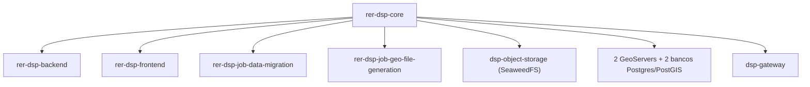
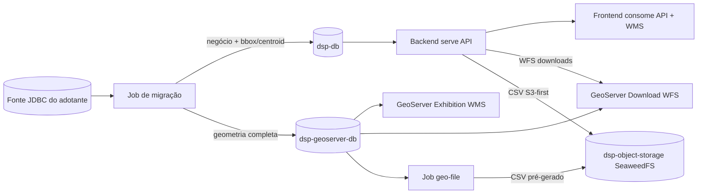
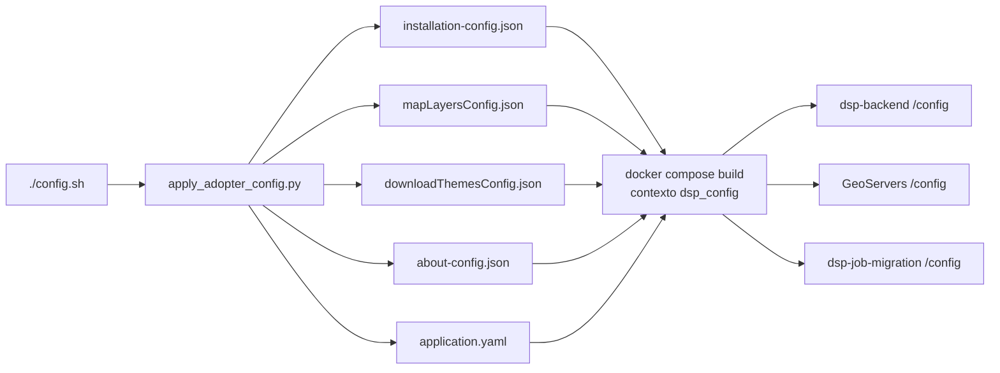

# rer-dsp-core

Este módulo é parte do [DSP](../index.md) — veja a documentação completa em [rer-dsp-docs](../index.md). As informações abaixo tratam apenas deste módulo.

## Objetivo

O `rer-dsp-core` é o hub de orquestração Docker Compose do DSP. Ele **não contém código de aplicação/domínio** — sua responsabilidade é preparar e subir a infraestrutura (bancos, GeoServers, gateway, jobs de migração e geo-file) e orquestrar o build dos demais módulos.



## Responsabilidades

- Configuração de exemplo do adotante.
- Conteúdo de exemplo da página About (`config/about/`).
- SQL de inicialização dos bancos.
- GeoServer Exhibition (mapa) e GeoServer Download (WFS de exportação).
- Gateway nginx (`dsp-gateway`) como porta de entrada única da stack.
- Object storage SeaweedFS (`dsp-object-storage`, profile `object-storage`) e job geo-file (`dsp-job-geo-file-generation`, mesmo profile) — obrigatórios no adotante real; a Demo Brasil não sobe esses serviços.
- Job de migração (`dsp-job-migration`, profile `migration`).
- Três scripts operacionais: `./config.sh`, `./setup.sh`, `./start.sh`.
- Clone automático dos repositórios irmãos quando ausentes (com preview da estrutura de pastas antes da confirmação). `./config.sh` também clona o job se faltar.

## Pré-requisitos

| Requisito | Detalhe |
|-----------|---------|
| Shell Bash | Os scripts (`config.sh`, `setup.sh`, `start.sh`) são `bash` puro. Nativo em Linux e macOS; no Windows requer WSL2 (não há suporte nativo via PowerShell/cmd). |
| Git | Clonar repositórios irmãos ausentes (automático via scripts ou manual); necessário apenas se os repos ainda não existirem |
| Docker 24+ com Compose v2 | Usado para subir bancos, GeoServer e os demais módulos |
| Python 3 | Usado pelo wizard `./config.sh` (`scripts/apply_adopter_config.py`) |

## Os três scripts

### `./config.sh`

Wizard interativo (`scripts/apply_adopter_config.py`) que gera `config/adopter/adopter-config.yaml` e, a partir dele, os arquivos operacionais consumidos pelos demais módulos:

- Configuração de instalação do backend (`installationConfig.json`) — labels de hierarquia, telas, KPIs, `map.initialView`, painel de detalhe da AOI.
- Camadas de mapa (`mapLayersConfig.json`) — grupos WMS, SRIDs.
- About opcional (`config/about/`).
- `application.yaml` do job de migração — datasources e mapeamento ETL (watermark).

Rodar sem argumentos (`./config.sh`). Antes do wizard, o script confere os repositórios irmãos (`rer-dsp-backend`, `rer-dsp-frontend`, `rer-dsp-job-data-migration`, `rer-dsp-job-geo-file-generation`) e oferece clonar o que faltar.

**Primeira execução** (sem `adopter-config.yaml` ainda): o script pergunta como configurar:

| Opção | Ação |
|-------|------|
| 1 | **Configuração guiada** — wizard passo a passo |
| 2 | **Configuração existente** — coloque seu `adopter-config.yaml` no caminho indicado e reaplique depois (opção 1 do menu abaixo) |

**Execuções seguintes** (quando o YAML já existe):

| Opção | Ação |
|-------|------|
| 1 | Reaplicar a configuração existente sem passar pelo wizard novamente |
| 2 | Editar a configuração existente (reabre o wizard já preenchido com os valores atuais) |
| 3 | Recomeçar do zero a partir do template (`adopter-config.yaml.example`), descartando o arquivo atual |

!!! tip "Duas formas de configurar"
    Você pode seguir o **wizard passo a passo** (recomendado — cada pergunta explica o campo e onde o valor é usado, mostrando o valor atual/padrão entre colchetes e mantendo-o se você só apertar Enter), **ou editar diretamente** o arquivo `config/adopter/adopter-config.yaml` num editor de texto, usando `config/adopter/adopter-config.yaml.example` como referência de estrutura. Depois de editar manualmente, rode `./config.sh` e escolha **1 — Reaplicar**. As duas formas produzem o mesmo arquivo; o wizard só existe para reduzir o risco de erro de digitação/formatação em campos técnicos (SRID, cores, nomes de coluna).

!!! warning "Rebuild após alterar a configuração"
    Os arquivos operacionais gerados em `config/` são **copiados para dentro das imagens Docker no build** (`select-runtime-config.sh` + contexto `dsp_config`). Depois de `./config.sh`, rode `./setup.sh` ou `./start.sh` para rebuildar os containers que consomem essa configuração (backend, GeoServers, job de migração).

O wizard é dividido em **5 estágios** (+ About opcional), cada um cobrindo um grupo de decisões e explicando o impacto de cada campo antes de perguntar o valor:

| Estágio | O que é configurado | Impacto |
|---------|----------------------|---------|
| **1/5 — Banco de origem e referência espacial** | URL JDBC da fonte, usuário/senha de leitura (`DSP_SOURCE_DB_USER` / `DSP_SOURCE_DB_PASSWORD`), SRID de cada nível territorial (L1/L2/L3) e da área de interesse | Usado pelo job de migração (ETL, inclusive `ST_Transform` em UA/AOI/camadas) e gravado no `.env` |
| **2/5 — Tabelas, colunas e camadas** | Para L1/L2/L3/AOI: tabela, PK (**uma** coluna; composta não suportada), `parent_key` (L2/L3), nome, geometria, `created_at_column` (obrigatório), `updated_at_column` (opcional), `where-clause`. Na AOI: `territory_level_3_column`, `additional_columns`. Camadas genéricas em `etl.layers[]` (ETL + mapa + downloads num único bloco) | Plano ETL, `mapLayersConfig.json` e `downloadThemesConfig.json`. Contrato de colunas: [Contrato de colunas](job-data-migration/configuration.md#contrato-de-colunas) |
| **3/5 — Textos da aplicação** | Label do card da AOI, formatos de data e data-hora, object storage opcional | Cards de KPI (rótulos), detalhe e downloads |
| **4/5 — Interface** | Labels da hierarquia, títulos das telas, campos do painel de detalhe da AOI, `map.initialView` (`territorial_bbox` / `manual` / `planet`), grupos e estilos das camadas fixas de mapa | Frontend, seletor de camadas e estilos publicados no GeoServer |
| **5/5 — KPI configuration** | `theme_count` (0 até o mínimo entre 4 e o número de camadas), seleção de `layer` por tema, unidade de área da AOI (`optional_label`), cores dos cards | Bloco `kpis` no `application.yaml`, cards `THEME_*` no `installation-config.json` e job `kpi-job` |
| **Opcional — About** | Página About customizada (tabs em Markdown) | Gera `config/about/about-config.json` + arquivos em `config/about/` |

Se nenhum nível territorial (L1/L2/L3) estiver **configurado no ETL** e o modo escolhido for `territorial_bbox`, o wizard grava `map.initialView.mode: planet` automaticamente.

O `./config.sh` (opção **2 — editar**) reabre esse mesmo wizard de 5 estágios com os valores atuais preenchidos.

#### Jobs gerados automaticamente

O wizard **não** pergunta quais jobs fixos ligar. O `application.yaml` gerado habilita sempre L1, L2, L3, área de interesse e `kpi-job`. A flag `layer-jobs` fica `true` automaticamente quando há entradas em `etl.layers[]`; caso contrário, `false`.

A área exibida nos KPIs **não** vem da origem: o `kpiCalculationJob` calcula `dsp.area_of_interest.area` e grava temas em `dsp.kpi_measure` após a migração. Detalhes: [Job de cálculo de KPIs](job-data-migration/configuration.md#job-de-calculo-de-kpis).

Para desligar um job fixo ou uma camada específica, edite manualmente `config/Job-Data-Migration/application/application.yaml` (no job, camadas aceitam `enabled: false`; no `adopter-config.yaml` do wizard, remova a camada de `etl.layers[]` — o campo `enabled` **não** é suportado lá).

#### SQL avançado em `source_table` (níveis fixos)

No wizard, `source_table` deve ser `schema.tabela`. Para subconsultas SQL (JOINs, aliases), edite diretamente o `adopter-config.yaml` com bloco YAML dobrado (`>-`), conforme o exemplo em `adopter-config.yaml.example`. Os nomes das colunas abaixo devem bater com os aliases do `SELECT`. Depois, `./config.sh` → **Reaplicar**.

#### Camadas genéricas unificadas (`etl.layers[]`)

Cada item alimenta **três destinos** a partir de uma única configuração:

| Campo no `adopter-config.yaml` | Onde é usado |
|----------------------------------|--------------|
| `source_table`, colunas de papel, `where_clause`, `srid` | `application.yaml` → job de migração |
| `layer_name`, `display_name`, `group_key`, `active_default`, `color`, `fill_color` | `mapLayersConfig.json` → mapa e GeoServer |
| (derivado de `layer_name` + `display_name`) | `downloadThemesConfig.json` → tela Downloads (`strategy: aoi_linked`) |

A mesma `source_table` pode aparecer **mais de uma vez** se `layer_name` (e portanto a tabela destino `dsp.<nome>`) for distinto. Ao adicionar outra camada com a mesma origem no wizard, os campos de estrutura (PK, FK, geometria, datas, SRID) são **reutilizados** como padrão.

Para **não** migrar ou exibir uma camada, remova-a de `etl.layers[]` e reaplique — não use `enabled: false` no YAML do adotante.

Depois dos 5 estágios, o wizard pergunta se o adotante quer habilitar a página **About** customizada. Se sim, pergunta o título do banner, quantas abas terá (mínimo 1) e, para cada aba, o **label** e o caminho de um `.md` ou `.markdown` em qualquer pasta do computador. Arquivos fora de `config/about/` são copiados para lá (nome slugificado a partir do label); arquivos já na pasta são reutilizados. Os ids (`tab-1`, `tab-2`, …) são gerados em `about-config.json`; a primeira aba abre por padrão. Se o arquivo não existir ou a extensão for inválida, o wizard repergunta. Se o adotante optar por não habilitar, a página About fica desabilitada.

!!! tip "Contrato protegido"
    O arquivo gerado contém apenas os campos editáveis pelo adotante. Chaves de contrato internas do DSP (IDs de camada WMS, nomes de tabela alvo, códigos de KPI) permanecem fixas nos templates do core e não são expostas no wizard.

#### Página About (`config/about/`)

A pasta `config/about/` traz o conteúdo de exemplo da página About do frontend: `about-config.json.example` (índice de exemplo) e os Markdown de demonstração (`*.quickstart.md.example`, copiados no modo Demonstração). O fluxo normal do wizard é informar um Markdown de qualquer pasta do computador, que é copiado para `config/about/`.

O YAML do adotante (`config/adopter/adopter-config.yaml` / `.yaml.example`) tem uma seção `about` com os campos:

| Campo | Função |
|-------|--------|
| `enabled` | Habilita/desabilita a página About customizada |
| `banner_title` | Título exibido no banner da página |
| `tabs` | Lista de `{label, file}` — no wizard, `file` pode ser de qualquer pasta (copiado para `config/about/`); na edição manual do YAML, só o nome do arquivo já presente em `config/about/` (caminhos absolutos ou fora da pasta são recusados no apply) |

`apply_config()` gera `config/about/about-config.json` com ids automáticos (`tab-1`, `tab-2`, …) a partir da ordem das abas. O backend lê esses arquivos em `/config/about/` **dentro da imagem** (copiados no build). Variáveis: `DSP_ABOUT_CONFIG_FILE` e `DSP_ABOUT_CONTENT_DIR` (`.env.example`).

### `./setup.sh`

Prepara bancos, GeoServer e (no fluxo real) a primeira migração. Roda sem argumentos e apresenta um menu com **três opções**:

| Opção | Ação |
|-------|------|
| **1 — Demonstração** | Seed sintético do Brasil, **sem** fonte JDBC nem job de migração. Indicada para explorar a UI ou avaliar a stack. |
| **2 — Adotante real (ETL via JDBC)** | Requer `./config.sh` antes. Pergunta **quando** e **como** a migração deve rodar (submenu abaixo). Grava em `dsp-db` + `dsp-geoserver-db`. |
| **3 — Status / cleanup / sair** | Status dos containers e URLs; opcionalmente remove recursos Docker do projeto. Não sobe nem migra. |

#### Submenu da opção 2 — plano de migração

**1. Quando deve rodar a carga inicial?**

| Escolha | Efeito |
|---------|--------|
| **Run now** | Primeira migração **durante** este `./setup.sh` |
| **Schedule for later** | Bancos ficam vazios no setup; primeira carga em `DSP_MIGRATION_SCHEDULED_AT` |

**2. Como a migração deve se comportar depois?**

| Escolha | Run now | Schedule for later |
|---------|---------|-------------------|
| **One-time** | `once`: migra no setup e **desliga** o container do job | `scheduled-once`: espera a data/hora, migra uma vez, publica GeoServers e sai |
| **Continuous (periodic re-sync)** | `continuous`: migra no setup e mantém o container com **supercronic** em `DSP_MIGRATION_CRON` | `continuous` + `DSP_MIGRATION_SCHEDULED_AT`: primeira carga na data escolhida, depois cron |

No modo **Continuous**, o script pergunta **How often should the data be synchronized after the initial migration?**: todo dia num horário; a cada N horas; ou a cada N minutos (1–59, útil para teste local). O horário de *Schedule for later* é reutilizado se a escolha for “todo dia”.

O adotante não digita a expressão cron manualmente. Fuso: `DSP_MIGRATION_TZ` no `.env` (veja `.env.example`).

| Combinação | `DSP_MIGRATION_EXECUTION_MODE` | Container do job após o setup |
|------------|-------------------------------|------------------------------|
| Run now + One-time | `once` | Desligado |
| Schedule + One-time | `scheduled-once` | Ativo até a carga; depois sai |
| Run now + Continuous | `continuous` | Ativo (supercronic) |
| Schedule + Continuous | `continuous` + `DSP_MIGRATION_SCHEDULED_AT` | Ativo (espera, depois supercronic) |

Se `config/Job-Data-Migration/application/application.yaml` ainda for idêntico ao template (`.example`), o `setup.sh` interrompe com erro — rode `./config.sh` ou edite o arquivo antes.

#### Bancos e publicação de camadas

Antes de migrar, o script **espera a inicialização completa do PostgreSQL** (`pg_isready` + schemas `dsp` e `data_migration` criados pelo SQL de init).

| Carga inicial | GeoServers no fim do setup |
|---------------|----------------------------|
| **Run now** (migração no setup) | `populate_geoserver.sh` publica camadas nos dois GeoServers (REST) |
| **Schedule for later** | GeoServers sobem **sem** camadas; `publish_geoservers.sh` no entrypoint do job roda após a **primeira carga agendada** com sucesso |

AOI e camadas genéricas só existem nos GeoServers depois que o job populou o `geoserver-db`.

### `./start.sh`

**Depois** da instalação inicial feita pelo `./setup.sh`. Não dispara carga imediata — apenas sobe/atualiza os serviços de aplicação:

1. Verifica os repositórios irmãos `rer-dsp-backend` e `rer-dsp-frontend` (paths via `DSP_BACKEND_PATH`/`DSP_FRONTEND_PATH`, default `../rer-dsp-backend` e `../rer-dsp-frontend`).
2. Garante a configuração de instalação (`installationConfig.json`) e de camadas de mapa.
3. Sobe os bancos (sem migrar agora) e, se o modo for `continuous` ou `scheduled-once` ainda pendente, mantém a stack de migração ativa. No adotante real, sobe também `dsp-object-storage` e o job geo-file (`profile=object-storage`). A Demo Brasil não sobe object storage.
4. Garante os GeoServers no ar (rebuild atualiza o JSON de mapa na imagem) e builda/sobe `dsp-backend`, `dsp-frontend` e o `dsp-gateway`. Se a carga inicial foi **Run now**, as camadas já foram publicadas no `./setup.sh`; se foi **Schedule for later**, o populate roda depois da primeira migração agendada (entrypoint do job).
5. Imprime um resumo da stack e as URLs de cada serviço.

## Bancos e GeoServer

Só os bancos publicam porta no host. Os serviços HTTP ficam acessíveis apenas pelo gateway. Os dois jobs não expõem HTTP — sobem por profile do Compose.

| Serviço | Acesso | Papel |
|---------|--------------|-------|
| dsp-db | porta 20654 | Banco operacional — negócio + bbox/centroid. Metadados Spring Batch: schema `data_migration` (job de migração) e schema `geo_file_generation` (job geo-file) |
| GeoServer DB (dsp-geoserver-db) | porta 20656 | Geometria completa `dsp.*` |
| Job de migração (`dsp-job-migration`) | profile `migration`, sem porta HTTP | ETL da origem JDBC para dsp-db e geoserver-db |
| Object storage (`dsp-object-storage`) | profile `object-storage`, porta host `8333` (opcional) | SeaweedFS (`weed mini`) — API S3 do DSP. Obrigatório no adotante real |
| Job geo-file (`dsp-job-geo-file-generation`) | profile `object-storage`, sem porta HTTP | Pré-gera CSV de download no SeaweedFS. Obrigatório no adotante real |
| GeoServer Exhibition | via gateway, `/geoserver-exhibition/` | WMS/WFS de mapa a partir do geoserver-db |
| GeoServer Download | via gateway, `/geoserver-download/` | WFS de downloads (consumido pelo backend) |

## Fluxo dual-write



## Gateway (`dsp-gateway`)

Container nginx que é a porta de entrada única da stack. Frontend, backend e os dois GeoServers não
publicam porta no host — tudo entra por `DSP_GATEWAY_HOST_PORT` (default `8026`).

A configuração fica em `config/Gateway/nginx/default.conf.template`, é **copiada para a imagem** no `docker compose build` (`/etc/nginx/templates/`) e processada por `envsubst` quando o container sobe, substituindo apenas as variáveis `DSP_*`. O volume `dsp_gateway_cache` guarda só o cache, não os templates.

| Rota externa | Destino interno |
|--------------|-----------------|
| `/` | redireciona para `/dsp/` |
| `/dsp/` | `dsp-frontend:8080` |
| `/dsp-backend/` | `dsp-backend:8080` (acompanha `DSP_BACKEND_CONTEXT_PATH`) |
| `/geoserver-exhibition/` | `dsp-geoserver-exhibition:8080/geoserver/` |
| `/geoserver-download/` | `dsp-geoserver-download:8080/geoserver/` |
| `/gateway/health` | resposta local do nginx |

Os dois GeoServers respondem em `/geoserver` internamente, então cada um recebe um prefixo externo
próprio e um `rewrite`. Cada um também recebe `PROXY_BASE_URL` com a sua URL pública, para que os
links do GetCapabilities e da interface web saiam corretos.

Como o gateway resolve os upstreams em runtime pelo DNS do Docker, ele sobe mesmo com algum serviço
parado — responde `502` em vez de falhar no boot. Isso é o que permite usar o modo demo do
`./setup.sh`, que não sobe backend nem frontend.

### Cache

O cache já está configurado, mas vem **desligado**. Ele cobre apenas os endpoints WMS/WFS
(`/geoserver-exhibition/<workspace>/wms`, `/wfs` e os equivalentes em `/geoserver-download/`), que não têm
sessão — a UI web e a REST do GeoServer ficam de fora para não quebrar o login do admin.

Para ligar, deixe `DSP_GATEWAY_CACHE_BYPASS` vazio no `.env` e recrie o container:

```bash
# .env
DSP_GATEWAY_CACHE_BYPASS=
DSP_GATEWAY_CACHE_TTL=10m

docker compose --env-file .env up -d --force-recreate dsp-gateway
```

O header `X-Cache-Status` (`HIT`, `MISS`, `BYPASS`) sai em toda resposta dos GeoServers e serve para
conferir o comportamento. Para limpar o cache, remova o volume `dsp_gateway_cache`.

## URLs padrão

| Serviço | URL |
|---------|-----|
| Frontend | http://localhost:8026/dsp/ |
| Backend API | http://localhost:8026/dsp-backend |
| GeoServer Exhibition | http://localhost:8026/geoserver-exhibition/web/ |
| GeoServer Download | http://localhost:8026/geoserver-download/web/ |
| Health do gateway | http://localhost:8026/gateway/health |

## Variáveis de ambiente relevantes (`.env` do core)

O `.env` é criado automaticamente na primeira execução de `./config.sh`, `./setup.sh` ou `./start.sh` (a partir de `.env.example`). Não é necessário copiá-lo manualmente.

Embora o assistente de configuração `./config.sh` elimine a necessidade de editar manualmente o `.env` na maioria dos casos, compreender as principais variáveis pode ser útil para personalizar a instalação, solucionar problemas ou entender como o processo de implantação e migração é configurado.

| Variável | Função |
|----------|--------|
| `DSP_SOURCE_JDBC_URL` | URL JDBC da fonte de dados do adotante (banco a migrar) |
| `DSP_SOURCE_DB_USER` / `DSP_SOURCE_DB_PASSWORD` | Credenciais da fonte JDBC |
| `DSP_MIGRATION_EXECUTION_MODE` | `once`: carga no setup e desliga o job. `continuous`: supercronic em `DSP_MIGRATION_CRON`. `scheduled-once`: uma carga em `DSP_MIGRATION_SCHEDULED_AT` |
| `DSP_MIGRATION_CRON` | Cron Unix de 5 campos gerado pelo setup (ex.: `0 */6 * * *` ou `*/2 * * * *`). Só `continuous` |
| `DSP_MIGRATION_SCHEDULED_AT` | Data/hora da primeira carga quando o setup escolhe **Schedule for later** |
| `DSP_MIGRATION_TZ` | Fuso IANA do relógio (`.env.example`) |
| Credenciais dos 2 bancos do core | Usuário/senha de dsp-db e dsp-geoserver-db |
| `DSP_GEOSERVER_WFS_BASE_URL` | URL WFS do GeoServer Download na rede Docker (backend → download) |
| `DSP_PUBLIC_BASE_URL` | URL pública da stack (`http://localhost:8026`). Alimenta URLs WMS/WFS do `./config.sh` e `PROXY_BASE_URL` dos GeoServers |
| `DSP_GATEWAY_HOST_PORT` | Porta HTTP do gateway (default `8026`) |
| `DSP_GATEWAY_CACHE_BYPASS` / `DSP_GATEWAY_CACHE_TTL` | Liga/desliga o cache do nginx e define o TTL |
| `DSP_CORS_ALLOWED_ORIGINS` | Origens permitidas no CORS do backend |
| `DSP_ABOUT_CONFIG_FILE` / `DSP_ABOUT_CONTENT_DIR` | Índice About e pasta Markdown (default `file:/config/about/…`) |
| `DSP_OBJECT_STORAGE_ENDPOINT` | Quando definido, habilita o job geo-file (`profile=geo-file`) |
| Build args do frontend | `VITE_BASE_URL`, `VITE_DSP_API_URL` — definem base path e URL da API usadas no build da imagem |
| `DSP_OBJECT_STORAGE_*` / `DSP_OBJECT_STORAGE_HOST_PORT` | Endpoint interno do SeaweedFS (`http://dsp-object-storage:8333`), bucket, credenciais e porta no host para diagnóstico. Demo Brasil deixa o endpoint vazio |
| `DSP_BACKEND_PATH` / `DSP_FRONTEND_PATH` / `DSP_JOB_MIGRATION_PATH` / `DSP_JOB_GEO_FILE_GENERATION_PATH` | Paths dos repositórios irmãos usados na orquestração de build |

Variáveis antigas `DSP_RUN_MIGRATION` / `DSP_SKIP_MIGRATION` são rejeitadas. `DSP_MIGRATION_SYNC_INTERVAL` não é mais usado.

Veja também: [Instalação completa](../guides/full-installation.md), [Bancos de dados](../architecture/databases.md).

## Estrutura de configuração gerada

`config/adopter/adopter-config.yaml` é o arquivo central produzido pelo wizard `./config.sh`. A partir dele são derivados os arquivos operacionais consumidos por backend (`installationConfig.json`, `mapLayersConfig.json`, `downloadThemesConfig.json`, `about-config.json`) e pelo job de migração (`application.yaml`), evitando que cada módulo precise ser configurado manualmente e de forma isolada.

O wizard `./config.sh` produz um único `adopter-config.yaml` e, a partir dele, deriva todos os artefatos operacionais consumidos pelos demais módulos. O `downloadThemesConfig.json` entra nesse pipeline como catálogo de temas para a tela de Downloads e para o proxy WFS do backend. O `about-config.json` entra nesse pipeline como índice de conteúdo (banner + abas) da página About do frontend.



- **`./config.sh`** — ponto de entrada do adotante; reaplica, edita ou recria o `adopter-config.yaml` e dispara a geração dos JSON/YAML.
- **`apply_adopter_config.py`** — traduz o YAML do adotante para os formatos consumidos por backend, frontend (via API), job de migração e GeoServers.
- **`select-runtime-config.sh`** — no build Docker, escolhe o arquivo ativo ou o `.example` e copia para `/config` dentro da imagem.
- **`installation-config.json`** — labels, hierarquia, telas, KPIs e `screens.home.detail.fields` (`DSP_INSTALLATION_CONFIG_FILE`). Esse array **não** vai para o `application.yaml` do job.
- **`mapLayersConfig.json`** — grupos e camadas WMS; publicadas nos GeoServers pelo `populate_geoserver.sh`.
- **`downloadThemesConfig.json`** — temas de download (AOI + `etl.layers[]`); `wfsBaseUrl` em `${DSP_PUBLIC_BASE_URL}/geoserver-download/dsp/wfs`.
- **`about-config.json`** — índice About (`enabled`, `bannerTitle`, `tabs` com ids `tab-1`, `tab-2`, …).
- **`application.yaml`** — plano ETL. Copiado para a imagem do job no build (com entrypoint e scripts de publicação GeoServer).
- **Imagens `dsp-backend`, GeoServers, `dsp-job-migration`, bancos e `dsp-gateway`** — configs e SQL de init copiados no build via `dsp_config`; volumes guardam só dados (e cache do gateway).
- **Imagem `dsp-object-storage`** — SeaweedFS (`weed mini`) com credenciais em `s3.json` na imagem. Volume `dsp_object_storage_data` guarda os objetos. Capacidade total depende do disco do host; `-master.volumeSizeLimitMB` controla o tamanho de cada volume interno, não uma quota fixa.
- **Imagem `dsp-object-storage`** — SeaweedFS (`weed mini`) com credenciais em `s3.json` na imagem. Volume `dsp_object_storage_data` guarda os objetos. Capacidade total depende do disco do host; `-master.volumeSizeLimitMB` controla o tamanho de cada volume interno, não uma quota fixa.

Veja também: [Fluxo de dados](../architecture/data-flow.md) (runtime) e [rer-dsp-backend](backend.md) (variáveis de ambiente de downloads).
