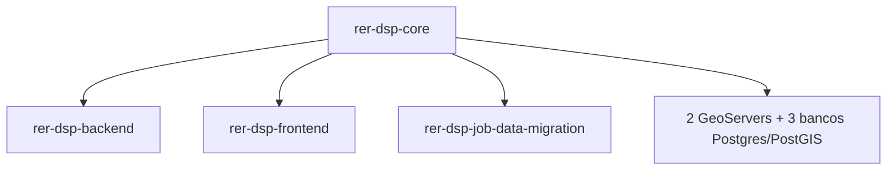
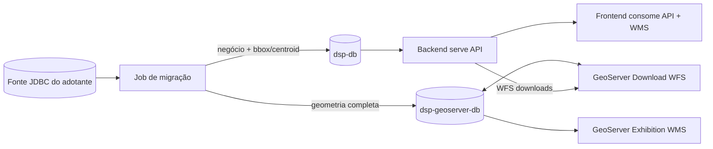
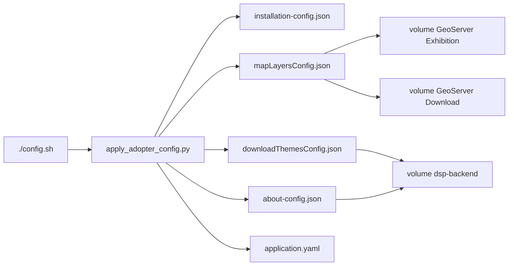

# rer-dsp-core

Este módulo é parte do [DSP](../index.md) — veja a documentação completa em [rer-dsp-docs](../index.md). As informações abaixo tratam apenas deste módulo.

## Objetivo

O `rer-dsp-core` é o hub de orquestração Docker Compose do DSP. Ele **não contém código de aplicação/domínio** — sua responsabilidade é preparar e subir a infraestrutura (bancos, GeoServer) e orquestrar o build dos demais módulos.

## Responsabilidades

- Configuração de exemplo do adotante.
- Conteúdo de exemplo da página About (`config/about/`).
- SQL de inicialização dos bancos.
- GeoServer Exhibition (mapa) e GeoServer Download (WFS de exportação).
- Três scripts operacionais: `./config.sh`, `./setup.sh`, `./start.sh`.
- Clone automático dos repositórios irmãos quando ausentes (com preview da estrutura de pastas antes da confirmação).

## Pré-requisitos

| Requisito | Detalhe |
|-----------|---------|
| Shell Bash | Os scripts (`config.sh`, `setup.sh`, `start.sh`) são `bash` puro. Nativo em Linux e macOS; no Windows requer WSL2 (não há suporte nativo via PowerShell/cmd). |
| Git | Clonar repositórios irmãos ausentes (automático via scripts ou manual); necessário apenas se os repos ainda não existirem |
| Docker 24+ com Compose v2 | Usado para subir bancos, GeoServer e os demais módulos |
| Python 3 | Usado pelo wizard `./config.sh` (`scripts/apply_adopter_config.py`) |

## Os três scripts

### `./config.sh`

Wizard interativo (`scripts/apply_adopter_config.py`) que gera `config/adopter/adopter-config.yaml` e, a partir dele, os arquivos operacionais consumidos pelos demais módulos:

- Configuração de instalação do backend (`installationConfig.json`) — labels de hierarquia, telas, KPIs.
- Camadas de mapa (`mapLayersConfig.json`) — grupos WMS, SRIDs.
- `application.yaml` do job de migração — datasources e mapeamento ETL.

Rodar sem argumentos (`./config.sh`). Se já existir `config/adopter/adopter-config.yaml` de uma execução anterior, o script pergunta o que fazer antes de continuar:

!!! tip "Duas formas de configurar"
    Você pode seguir o **wizard passo a passo** (recomendado — cada pergunta explica o campo e onde o valor é usado, mostrando o valor atual/padrão entre colchetes e mantendo-o se você só apertar Enter), **ou editar diretamente** o arquivo `config/adopter/adopter-config.yaml` num editor de texto, usando `config/adopter/adopter-config.yaml.example` como referência de estrutura. As duas formas produzem o mesmo arquivo; o wizard só existe para reduzir o risco de erro de digitação/formatação em campos técnicos (SRID, cores, nomes de coluna).

Antes dos 5 estágios, o wizard pergunta o fluxo de preparação de dados. A numeração é a **mesma** do `./setup.sh`: **1** demonstração, **2** adotante real com JDBC/ETL (continua o wizard), **3** adotante real sem migração (sai e indica o `./setup.sh`).

O wizard é dividido em 5 estágios, cada um cobrindo um grupo de decisões e explicando o impacto de cada campo antes de perguntar o valor:

| Estágio | O que é configurado | Impacto                                                                                                                     |
|---------|----------------------|-----------------------------------------------------------------------------------------------------------------------------|
| **1/5 — Banco de origem e referência espacial** | URL JDBC da fonte, usuário/senha de leitura, SRID de cada nível territorial (L1/L2/L3) e da área de interesse | Usado pelo job de migração (ETL) e gravado no `.env`                                                                        |
| **2/5 — Textos da aplicação e KPIs** | Nome exibido e texto de placeholder de cada nível hierárquico, títulos das telas Home/Downloads, textos de busca, quantidade de KPIs de tema (0 a 4) e label/unidade de cada KPI, unidade de área, formato de data e data-hora | Aparece diretamente na interface do frontend (filtros, telas de detalhe, cards de KPI, downloads)                           |
| **3/5 — Cores de KPI e camadas de mapa** | Cor de destaque de cada KPI, nome dos grupos de camada no seletor de mapa, e para cada camada: se inicia ativada, cor do contorno e cor de preenchimento | Controla a aparência do seletor de camadas e do estilo publicado no GeoServer, ou seja as cores que serão exibidas no mapa. |
| **4/5 — Tabelas e colunas de origem** | Para cada entidade (level1, level2, level3, área de interesse): tabela de origem, chave primária, chave estrangeira do nível pai, coluna de nome, coluna de geometria, colunas de data de criação/atualização, colunas de tema, e uma cláusula `where` opcional. Na AOI, após `persist_columns` (colunas extras da **migração da AOI**), o wizard pede os campos da ficha, na ordem desejada: colunas canônicas (`id`, `registration_date`, `updated_at`, `area`), extras persistidas, e chaves `calculated.*` (latitude/longitude do centróide e nomes L2/L3 — calculadas na aplicação, não são coluna de origem). | Define o que o job de migração lê e a lista exclusiva `screens.home.detail.fields` |
| **5/5 — Jobs de migração** | Quais jobs rodar (level1, level2, level3, área de interesse, camadas genéricas) e, se camadas genéricas forem habilitadas, os dados de cada camada extra | Define o plano de execução do `rer-dsp-job-data-migration`                                                                  |

O modo `./config.sh` (opção **2 — editar**) reabre esse mesmo wizard de 5 estágios com os valores atuais preenchidos, permitindo revisar/alterar campo a campo sem perder o que já foi configurado.

Depois dos 5 estágios, o wizard pergunta se o adotante quer habilitar a página **About** customizada (função `ask_about_page` em `scripts/apply_adopter_config.py`). Se sim, pergunta o título do banner, quantas abas terá e, para cada aba, o título (label) e o caminho do arquivo `.md` (relativo a `config/about/`), validando que o arquivo existe — se não existir, repergunta em loop até um caminho válido ser informado. Também valida que não há ids de aba duplicados e que `default_tab_id` corresponde a uma das abas informadas. Se o adotante optar por não habilitar, a página About do frontend fica desabilitada (nenhuma aba é exibida).

| Opção | Ação |
|-------|------|
| 1 | Reaplicar a configuração existente sem passar pelo wizard novamente |
| 2 | Editar a configuração existente (reabre o wizard já preenchido com os valores atuais) |
| 3 | Recomeçar do zero a partir do template (`adopter-config.yaml.example`), descartando o arquivo atual |

!!! tip "Contrato protegido"
    O arquivo gerado contém apenas os campos editáveis pelo adotante. Chaves de contrato internas do DSP (IDs de camada WMS, nomes de tabela alvo, códigos de KPI) permanecem fixas nos templates do core e não são expostas no wizard.

#### Página About (`config/about/`)

A pasta `config/about/` traz o conteúdo de exemplo da página About do frontend: `about-config.json.example` (índice de exemplo) e arquivos `.md.example` de exemplo (ex.: `overview.md.example`, `how-to-use.md.example`).

O YAML do adotante (`config/adopter/adopter-config.yaml` / `.yaml.example`) tem uma seção `about` com os campos:

| Campo | Função |
|-------|--------|
| `enabled` | Habilita/desabilita a página About customizada |
| `banner_title` | Título exibido no banner da página |
| `default_tab_id` | Id da aba selecionada por padrão |
| `tabs` | Lista de `{id, label, file}` — `file` é o caminho do Markdown, relativo a `config/about/` |

`apply_config()` gera `config/about/about-config.json` a partir dessas respostas, no mesmo padrão (`json.dumps(..., ensure_ascii=False, indent=2)`) usado para os demais arquivos operacionais.

O `docker-compose.yml` monta `./config/about:/config/about:ro` no serviço `dsp-backend`, que também recebe as variáveis `DSP_ABOUT_CONFIG_FILE` (default `file:/config/about/about-config.json`) e `DSP_ABOUT_CONTENT_DIR` (default `file:/config/about/`) — ambas documentadas em `.env.example` no mesmo padrão de `DSP_INSTALLATION_CONFIG_FILE`.

### `./setup.sh`

Prepara os bancos de dados e o GeoServer. Roda sem argumentos e apresenta um menu com quatro opções:

| Opção | Ação |
|-------|------|
| **1 — Demonstração** | Seed sintético do Brasil embutido no core, **sem** precisar de fonte JDBC nem do job de migração. Indicada para explorar a UI ou avaliar a stack sem dados próprios. |
| **2 — Adotante real, com migração (ETL)** | Requer ter rodado `./config.sh` antes. Executa o `rer-dsp-job-data-migration` a partir da sua fonte JDBC e grava em `dsp-db` + `dsp-geoserver-db`. Pergunta em seguida o modo de execução (ver abaixo). Indicada para um setup produtivo, com a fonte já pronta para importar. |
| **3 — Adotante real, sem migração** | Aplica a configuração do adotante (labels, camadas de mapa, SRIDs) mas mantém os bancos vazios — nenhum dado é migrado. Útil para preparar a stack antes dos dados estarem disponíveis, ou quando a migração será rodada depois via opção 2. |
| **4 — Status / cleanup / sair** | Mostra o status dos containers e as URLs dos serviços; opcionalmente remove os recursos Docker deste projeto (containers e volumes) e encerra. Não sobe nem migra nada. |

Ao escolher a **opção 2**, o script pergunta ainda o modo de execução da migração (grava em `DSP_MIGRATION_EXECUTION_MODE` no `.env`):

| Modo | Comportamento |
|------|---------------|
| **`once`** | A migração roda uma única vez durante o `setup.sh` e o container do job é **desligado e removido** ao terminar. Recomendado para a primeira importação. Se a origem mudar depois, é preciso rodar a migração de novo manualmente. |
| **`continuous`** | A migração inicial roda normalmente, mas o container do job **permanece ativo** em vez de ser removido. A partir daí, ele executa sincronizações periódicas, identificando e migrando automaticamente os dados da origem que foram criados, alterados ou removidos desde a última execução. |

Se a **opção 2** for escolhida mas `config/Job-Data-Migration/application/application.yaml` ainda for idêntico ao template de exemplo (`.example`), o `setup.sh` interrompe com erro, pedindo para rodar `./config.sh` (ou editar o arquivo manualmente) antes de tentar novamente.

Ao final de qualquer opção real (2 ou 3), o script também publica as camadas no GeoServer Exhibition e no GeoServer Download a partir da configuração de mapa.

### `./start.sh`

**Depois** da instalação inicial feita pelo `./setup.sh`. Não roda migração — apenas sobe/atualiza os serviços de aplicação:

1. Verifica os repositórios irmãos `rer-dsp-backend` e `rer-dsp-frontend` (paths via `DSP_BACKEND_PATH`/`DSP_FRONTEND_PATH`, default `../rer-dsp-backend` e `../rer-dsp-frontend`).
2. Garante a configuração de instalação (`installationConfig.json`) e de camadas de mapa.
3. Sobe os bancos (sem migração) e, se `DSP_MIGRATION_EXECUTION_MODE=continuous`, mantém também a stack de migração ativa.
4. Garante o GeoServer Exhibition e o GeoServer Download no ar (sem rebuild forçado nem republicação de camadas — isso fica no `./setup.sh`) e builda/sobe os containers `dsp-backend` e `dsp-frontend`.
5. Imprime um resumo da stack e as URLs de cada serviço.

## Bancos e GeoServer

| Serviço | Porta local | Papel |
|---------|--------------|-------|
| dsp-db | 20654 | Banco operacional — negócio + bbox/centroid |
| Job migration DB (dsp-job-migration-db) | 20655 | Metadados Spring Batch (`BATCH_*`) |
| GeoServer DB (dsp-geoserver-db) | 20656 | Geometria completa `dsp.*` |
| GeoServer Exhibition | 22668 | WMS/WFS de mapa a partir do geoserver-db |
| GeoServer Download | 22669 | WFS de downloads (consumido pelo backend) |

## Fluxo dual-write

## URLs padrão

| Serviço | URL |
|---------|-----|
| Frontend | http://localhost:22667/dsp/ |
| Backend API | http://localhost:22666/dsp-backend |
| GeoServer Exhibition | http://localhost:22668/geoserver/web/ |
| GeoServer Download | http://localhost:22669/geoserver/web/ |

## Variáveis de ambiente relevantes (`.env` do core)

O `.env` é criado automaticamente na primeira execução de `./config.sh`, `./setup.sh` ou `./start.sh` (a partir de `.env.example`). Não é necessário copiá-lo manualmente.

Embora o assistente de configuração `./config.sh` elimine a necessidade de editar manualmente o `.env` na maioria dos casos, compreender as principais variáveis pode ser útil para personalizar a instalação, solucionar problemas ou entender como o processo de implantação e migração é configurado.

| Variável | Função |
|----------|--------|
| `DSP_SOURCE_JDBC_URL` | URL JDBC da fonte de dados do adotante (banco a migrar) |
| `DSP_SOURCE_JDBC_USER` / `DSP_SOURCE_JDBC_PASSWORD` | Credenciais da fonte JDBC |
| `DSP_MIGRATION_EXECUTION_MODE` | `once`: migra uma vez e desliga o container do job. `continuous`: mantém o container ativo e sincroniza automaticamente as mudanças da origem periodicamente |
| Credenciais dos 3 bancos do core | Usuário/senha de dsp-db, dsp-geoserver-db e dsp-job-migration-db |
| `DSP_GEOSERVER_WFS_BASE_URL` / `DSP_GEOSERVER_DOWNLOAD_HOST_PORT` | URL WFS do GeoServer Download (backend) e porta host `22669` |
| `DSP_GEOSERVER_HOST_PORT` | Porta host do GeoServer Exhibition (`22668`) |
| `DSP_CORS_ALLOWED_ORIGINS` | Origens permitidas no CORS do backend |
| `DSP_ABOUT_CONFIG_FILE` / `DSP_ABOUT_CONTENT_DIR` | Caminho do índice `about-config.json` e da pasta com os Markdown das abas da página About (default `file:/config/about/about-config.json` e `file:/config/about/`) |
| Build args do frontend | `VITE_BASE_URL`, `VITE_DSP_API_URL` — definem base path e URL da API usadas no build da imagem |
| `DSP_BACKEND_PATH` / `DSP_FRONTEND_PATH` / `DSP_JOB_MIGRATION_PATH` | Paths dos repositórios irmãos usados na orquestração de build |

Veja também: [Instalação completa](../guides/full-installation.md), [Bancos de dados](../architecture/databases.md).

## Estrutura de configuração gerada

`config/adopter/adopter-config.yaml` é o arquivo central produzido pelo wizard `./config.sh`. A partir dele são derivados os arquivos operacionais consumidos por backend (`installationConfig.json`, `mapLayersConfig.json`, `downloadThemesConfig.json`, `about-config.json`) e pelo job de migração (`application.yaml`), evitando que cada módulo precise ser configurado manualmente e de forma isolada.

O wizard `./config.sh` produz um único `adopter-config.yaml` e, a partir dele, deriva todos os artefatos operacionais consumidos pelos demais módulos. O `downloadThemesConfig.json` entra nesse pipeline como catálogo de temas para a tela de Downloads e para o proxy WFS do backend. O `about-config.json` entra nesse pipeline como índice de conteúdo (banner + abas) da página About do frontend.

- **`./config.sh`** — ponto de entrada do adotante; reaplica, edita ou recria o `adopter-config.yaml` e dispara a geração dos JSON/YAML.
- **`apply_adopter_config.py`** — traduz o YAML do adotante para os formatos consumidos por backend, frontend (via API), job de migração e GeoServers.
- **`installation-config.json`** — labels, hierarquia, telas, KPIs e `screens.home.detail.fields` (lista exclusiva da ficha da AOI: colunas da **migração da AOI** e/ou `calculated.*`) (`DSP_INSTALLATION_CONFIG_FILE` no backend). Lista vazia ou omitida = fallback da ficha atual (8 campos do DTO). Esse array **não** é copiado para o `application.yaml` do job.
- **`mapLayersConfig.json`** — grupos e camadas WMS do mapa (`DSP_MAP_LAYERS_FILE`); publicadas nos dois GeoServers pelo `populate_geoserver.sh`.
- **`downloadThemesConfig.json`** — catálogo de temas de download derivado de `area_of_interest` + `etl.layers[]` (`DSP_DOWNLOAD_THEMES_FILE` no backend); `typeName`s alinhados às camadas do GeoServer Download (`wfsBaseUrl` em `localhost:22669`).
- **`about-config.json`** — índice da página About: `enabled`, `banner_title`, `default_tab_id` e `tabs` (lista de `{id, label, file}`, cada `file` um Markdown em `config/about/`) (`DSP_ABOUT_CONFIG_FILE` no backend).
- **`application.yaml`** — plano de migração ETL (tabelas, colunas, camadas genéricas).
- **Volume `dsp-backend`** — monta `installation-config.json`, `mapLayersConfig.json`, `downloadThemesConfig.json` e a pasta `config/about/` (índice + Markdown das abas) no container da API.
- **Volumes GeoServer Exhibition e Download** — montam o mesmo `mapLayersConfig.json` para publicação a partir do `geoserver-db`.

Veja também: [Fluxo de dados](../architecture/data-flow.md) (runtime) e [rer-dsp-backend](backend.md) (variáveis de ambiente de downloads).
