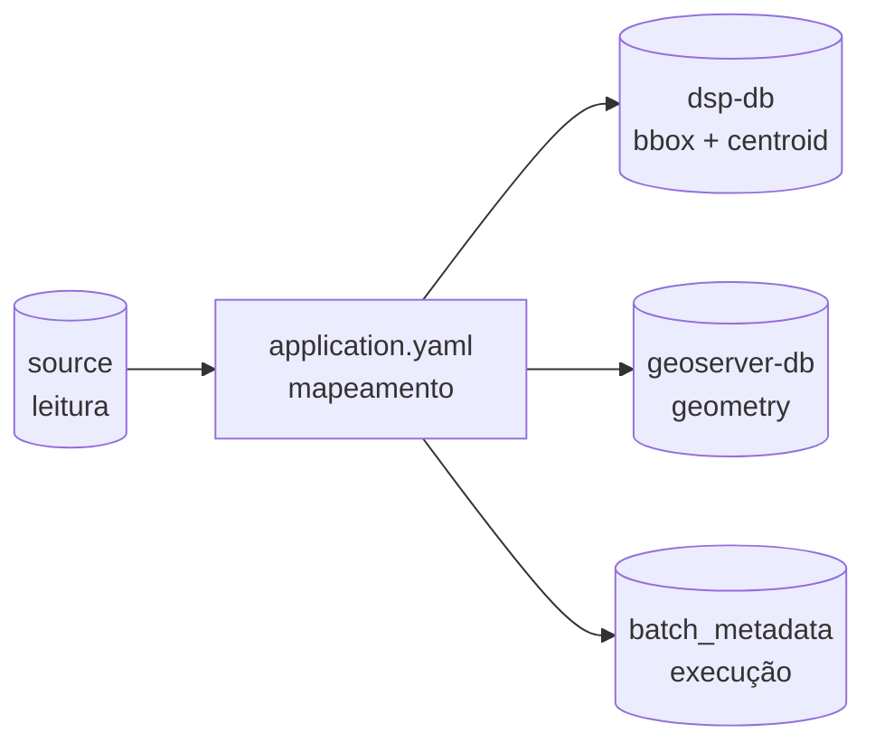
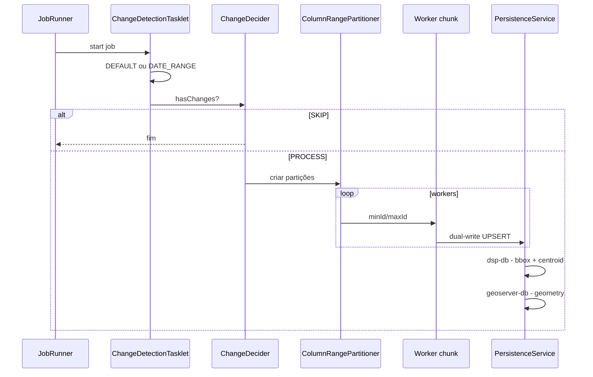

# rer-dsp-job-data-migration — Configuração e execução

Detalhe operacional do repositório de ETL geoespacial do DSP (`br.car:dsp-batch`). Visão conceitual em [Visão geral](overview.md).

## Sumário

- [Stack](#stack)
- [Jobs disponíveis](#jobs-disponiveis)
- [DataSources](#datasources)
- [Preparar o ambiente](#preparar-o-ambiente-para-executar-o-job-isolado-sem-o-rer-dsp-core)
- [Configuração YAML](#configuracao-yaml)
- [Paralelização e partição](#paralelizacao-e-particao)
- [Fluxo interno](#fluxo-interno)
- [Comandos de execução](#comandos-de-execucao)
- [Problemas comuns](#problemas-comuns)

---

## Stack

| Tecnologia | Versão / detalhe |
|------------|-------------------|
| Java | 21 |
| Spring Boot | 3.4.2 |
| Spring Batch | via `spring-boot-starter-batch` |
| PostgreSQL + PostGIS | JDBC; funções `ST_*` |
| Maven Wrapper | `./mvnw` |
| Tipo de aplicação | Não-web (`SPRING_MAIN_WEB_APPLICATION_TYPE=none`), porta interna 8086 não exposta como HTTP |

---

## Jobs disponíveis

| Flag `execution-jobs` | Bean Job | Bloco YAML |
|-------------------------|----------|------------|
| `admin-unit-level-1-geoserver-job` | `adminUnitLevel1GeoserverJob` | `batch.admin-unit.level-1` |
| `admin-unit-level-2-geoserver-job` | `adminUnitLevel2GeoserverJob` | `batch.admin-unit.level-2` |
| `admin-unit-level-3-geoserver-job` | `adminUnitLevel3GeoserverJob` | `batch.admin-unit.level-3` |
| `area-of-interest-geoserver-job` | `areaOfInterestGeoserverJob` | `batch.area-of-interest` |

Ordem obrigatória: **L1 → L2 → L3 → area-of-interest** (por causa de FKs).

```yaml
execution-jobs:
  admin-unit-level-1-geoserver-job: true
  admin-unit-level-2-geoserver-job: false
  admin-unit-level-3-geoserver-job: false
  area-of-interest-geoserver-job: false
```

---

## DataSources

A auto-configuração JDBC do Boot é excluída. Quatro beans manuais — cada um aponta para um banco diferente:

| Bean | Prefixo YAML | Banco | Uso |
|------|--------------|-------|-----|
| `dataSource` (`@Primary`) | `spring.datasource.batch` | `batch_metadata` | JobRepository (`BATCH_*`) |
| `sourceDataSource` | `spring.datasource.source` | Fonte JDBC do adotante | Leitura / change detection / partição |
| `targetDataSource` | `spring.datasource.target` | `dsp-db` | UPSERT negócio + `boundary_box` + `centroid_coordinates` |
| `geoTargetDataSource` | `spring.datasource.geo-target` | `geoserver-db` | UPSERT `geometry` completa + bbox/centroid |

Contrato completo dos papéis: [Bancos de dados](../../architecture/databases.md).

---

## Preparar o ambiente para executar o job isolado sem o `rer-dsp-core`:

### 1. Bancos de destino

Se você não está usando o `rer-dsp-core` para provisionar os bancos, crie manualmente `dsp-db` e `geoserver-db` com a extensão PostGIS:

```bash
psql -h localhost -p 6666 -U postgres -c "CREATE DATABASE dsp_db;"
psql -h localhost -p 6666 -U postgres -d dsp_db -c "CREATE EXTENSION IF NOT EXISTS postgis;"

psql -h localhost -p 6666 -U postgres -c "CREATE DATABASE dsp_geoserver_db;"
psql -h localhost -p 6666 -U postgres -d dsp_geoserver_db -c "CREATE EXTENSION IF NOT EXISTS postgis;"
```

### 2. Schema de metadados do Spring Batch

A aplicação **não** cria o schema automaticamente (`spring.batch.jdbc.initialize-schema: never`) — o banco de metadados e o schema `BATCH_*` precisam ser criados manualmente uma vez (ou quando o banco de metadados for recriado):

```bash
psql -h localhost -p 6666 -U postgres -c "CREATE DATABASE batch_metadata;"

psql -h localhost -p 6666 -U postgres -d batch_metadata \
  -f src/main/resources/db/batch_metadata/01_spring_batch_schema.sql
```

!!! note "Duas cópias do mesmo schema"
    O `rer-dsp-core` também mantém uma cópia deste schema (`config/db/dsp-job-migration-db/01_spring_batch_schema.sql`), usada para inicializar o banco automaticamente no fluxo orquestrado via Docker. As duas cópias existem porque servem consumidores diferentes — orquestrado (core) vs. standalone (este módulo) — e precisam ser mantidas em sincronia manualmente se eventualmente o schema do Spring Batch mudar.

Conferir:

```bash
psql -h localhost -p 6666 -U postgres -d batch_metadata -c '\dt BATCH*'
```

---

## Configuração YAML

Arquivo: `src/main/resources/application.yaml`.



### Exemplo completo — Level 1 + 2 + 3

```yaml
batch:
  admin-unit:
    level-1:
      source-table: source_admin_units.source_l1_continents
      target-table: target_admin_units.target_l1_continent
      primary-key: source_continent_pk
      geometry-column: source_continent_geom
      where-clause: "1=1"
      comparison-columns:
        - source_continent_name
      persist-columns:
        - source_continent_pk
        - source_continent_name
      column-mapping:
        source_continent_pk: target_continent_id
        source_continent_name: target_continent_label
        source_continent_geom: target_continent_geometry
      layer-name: source-continents-geoserver-layer
      srid: 4326
      change-detection-strategy: DEFAULT
    level-2:
      source-table: source_admin_units.source_l2_countries
      target-table: target_admin_units.target_l2_country
      primary-key: source_country_pk
      partition-column: source_continent_fk
      geometry-column: source_country_geom
      where-clause: "1=1"
      comparison-columns:
        - source_country_name
        - source_continent_fk
      persist-columns:
        - source_country_pk
        - source_country_name
        - source_continent_fk
      column-mapping:
        source_country_pk: target_country_id
        source_country_name: target_country_label
        source_continent_fk: target_continent_ref
        source_country_geom: target_country_geometry
      layer-name: source-countries-geoserver-layer
      srid: 4326
      change-detection-strategy: DEFAULT
    level-3:
      source-table: source_admin_units.source_l3_admin_areas
      target-table: target_admin_units.target_l3_admin_division
      primary-key: source_area_pk
      partition-column: source_country_fk
      geometry-column: source_area_geom
      where-clause: "1=1"
      comparison-columns:
        - source_area_name
        - source_country_fk
      persist-columns:
        - source_area_pk
        - source_area_name
        - source_country_fk
      column-mapping:
        source_area_pk: target_division_id
        source_area_name: target_division_label
        source_country_fk: target_country_ref
        source_area_geom: target_division_geometry
      layer-name: source-admin-areas-geoserver-layer
      srid: 4326
      change-detection-strategy: DEFAULT
```

### Propriedades das tabelas

| Propriedade | Obrigatória | Descrição |
|-------------|-------------|-----------|
| `source-table` | sim | Tabela/schema de origem |
| `target-table` | sim | Tabela/schema de destino |
| `primary-key` | sim | PK **na origem** (base do `ON CONFLICT` no destino via mapping) |
| `geometry-column` | sim | Coluna PostGIS **na origem** |
| `where-clause` | não | Filtro SQL extra na detecção/partição |
| `comparison-columns` | sim | Colunas usadas para saber se o registro mudou (ou intervalo de datas em `DATE_RANGE`) |
| `persist-columns` | sim | Colunas enviadas ao destino (PK + atributos + FKs) |
| `column-mapping` | não | Tradução `origem: destino` quando os nomes diferem |
| `partition-column` | não | Coluna numérica/categórica para fatiar a leitura (default = PK) |
| `srid` | sim | SRID aplicado na escrita (por job no YAML; DDL sem typmod de SRID) |
| `layer-name` | sim* | Nome da layer no GeoServer — precisa estar alinhado ao usado na publicação feita pelo core |
| `change-detection-strategy` | sim | `DEFAULT` (hash + órfãos) ou `DATE_RANGE` |
| `start-date` / `end-date` | se `DATE_RANGE` | Intervalo inclusivo |

!!! tip "comparison-columns × persist-columns"
    - `comparison-columns` → decide **se** o registro mudou (ou se entra no intervalo de datas).
    - `persist-columns` → define **o que** será gravado no destino.
    - Uma coluna pode estar nas duas. A geometria é tratada à parte via `geometry-column` (no `DEFAULT`, também entra no hash).

    **Exemplo — level-1 do YAML acima:**

    ```yaml
    comparison-columns:
      - source_continent_name
    persist-columns:
      - source_continent_pk
      - source_continent_name
    ```

    - `source_continent_name` está nas **duas** listas: se o nome do continente mudar na origem, o hash muda (entra em `comparison-columns`) **e** o novo valor precisa ser gravado no destino (entra em `persist-columns`).
    - `source_continent_pk` está só em `persist-columns`: a PK não precisa ser comparada para saber se o registro mudou (ela é a chave, não um atributo), mas precisa ser gravada — é a base do `ON CONFLICT`.
    - Se uma coluna existisse só em `comparison-columns` (sem estar em `persist-columns`), ela seria usada para detectar mudança mas **não** apareceria no destino — útil para campos de controle da origem (ex.: um `hash` ou `updated_by` interno) que você não quer replicar.

    !!! warning "Limitação do wizard `./config.sh`"
        O wizard do `rer-dsp-core` só preenche automaticamente as colunas de papel fixo (PK, nome, geometria, FK do nível pai) nessas duas listas — ele não permite adicionar colunas de negócio extras a `comparison-columns`/`persist-columns` pelas perguntas guiadas. Se você precisa que outra coluna (além das de papel fixo) também dispare detecção de mudança ou seja persistida, é preciso **editar `application.yaml` diretamente** (ou o `adopter-config.yaml`, e depois reaplicar), fora do fluxo guiado do wizard.

### Exemplo — área de interesse (DATE_RANGE)

```yaml
batch:
  area-of-interest:
    source-table: property
    target-table: property
    primary-key: id
    geometry-column: geometry
    where-clause: "1=1"
    comparison-columns:
      - created_date
    persist-columns:
      - id
      - property_name
    layer-name: property
    srid: 4326
    change-detection-strategy: DATE_RANGE
    start-date: 2024-01-01
    end-date: 2024-12-31
```

!!! warning "PRIMARY KEY no destino"
    A coluna mapeada da PK **deve** ser PRIMARY KEY (ou unique) no target. Caso contrário: *no unique or exclusion constraint matching the ON CONFLICT specification*.

### Camadas genéricas (além de L1/L2/L3/AOI)

Além dos quatro jobs fixos (unidades administrativas L1/L2/L3 e área de interesse), o job aceita uma lista de **camadas genéricas** em `batch.layers` — qualquer tabela PostGIS adicional do adotante que precise ser publicada como layer WMS, sem virar um job dedicado nem exigir mapeamento coluna a coluna (o job introspecciona o schema sozinho).

```yaml
batch:
  layers:
    - source-table: conservation.rivers
      area-of-interest-id-column: conservation_unit_id
```

Só grava no banco **geo-target** (não toca no `dsp-db` operacional) e só roda se `execution-jobs.layer-jobs: true`.

Guia completo (propriedades, introspecção automática, limitações, erros comuns): [Migração de camadas genéricas](layer-migration.md).

### Conexões dos quatro bancos

```yaml
spring:
  datasource:
    batch:
      url: jdbc:postgresql://localhost:6666/batch_metadata
      username: postgres
      password: postgres
      driver-class-name: org.postgresql.Driver
    source:
      url: jdbc:postgresql://localhost:6666/source_geo_import_db
      username: postgres
      password: postgres
      driver-class-name: org.postgresql.Driver
    target:
      url: jdbc:postgresql://localhost:6666/dsp_db
      username: postgres
      password: postgres
      driver-class-name: org.postgresql.Driver
    geo-target:
      url: jdbc:postgresql://localhost:6666/dsp_geoserver_db
      username: postgres
      password: postgres
      driver-class-name: org.postgresql.Driver
  batch:
    job:
      enabled: false
    jdbc:
      initialize-schema: never

server:
  port: 8086
```

---

## Paralelização e partição

Chaves em `parallelization.jobs` usam o **nome do bean Job** (camelCase), não a flag kebab-case:

```yaml
parallelization:
  jobs:
    adminUnitLevel1GeoserverJob:
      enabled: true
      thread-pool-size: 1
      chunk-size: 1
      page-size: 1000
      queue-capacity: 100
    adminUnitLevel2GeoserverJob:
      enabled: true
      thread-pool-size: 4
      chunk-size: 1
      page-size: 1000
      queue-capacity: 100
    adminUnitLevel3GeoserverJob:
      enabled: true
      thread-pool-size: 4
      chunk-size: 100
      page-size: 1000
      queue-capacity: 100
    areaOfInterestGeoserverJob:
      enabled: false
      thread-pool-size: 1
      chunk-size: 100
      page-size: 1000
      queue-capacity: 100
```

| Parâmetro | Efeito |
|-----------|--------|
| `enabled` | Liga o master/worker particionado |
| `thread-pool-size` | Workers em paralelo |
| `chunk-size` | Tamanho do chunk de escrita |
| `page-size` | Página do reader |
| `queue-capacity` | Fila do executor |

Regra: `hikari.maximum-pool-size` do source/target deve comportar o `thread-pool-size`.

---

## Fluxo interno



---

## Comandos de execução

Rode a partir da raiz do repositório, com `application.yaml` já configurado.

**Desenvolvimento** (recompila e sobe):

```bash
./mvnw spring-boot:run
```

**Pacote + JAR:**

```bash
./mvnw clean package -DskipTests
java -jar target/dsp-batch-0.0.1-SNAPSHOT.jar
```

Status da execução fica registrado em `batch_metadata` (`BATCH_JOB_EXECUTION`).

**Override de flags sem editar o YAML:**

```bash
./mvnw spring-boot:run -Dspring-boot.run.arguments="\
--execution-jobs.admin-unit-level-1-geoserver-job=true \
--execution-jobs.admin-unit-level-2-geoserver-job=false \
--execution-jobs.admin-unit-level-3-geoserver-job=false \
--execution-jobs.area-of-interest-geoserver-job=false"
```

---

## Problemas comuns

| Sintoma | Causa provável | Ação |
|---------|----------------|------|
| `batch_job_instance does not exist` | Schema `BATCH_*` ausente | Rodar `01_spring_batch_schema.sql` |
| `no unique or exclusion constraint matching the ON CONFLICT` | Destino sem PK na coluna de conflito | Criar PRIMARY KEY (ou unique) no destino |
| Job sobe e "não faz nada" | Flags `execution-jobs` todas `false` ou sem mudanças | Habilitar job; conferir change detection |
| Erro de conexão JDBC | Host/porta/database errados | Conferir `spring.datasource.*` |
| Geometrias não aparecem | Coluna/SRID/mapping incorretos | Revisar `geometry-column`, `srid`, `column-mapping` |

Validação pós-execução: [Validação pós-migração](validation.md).
