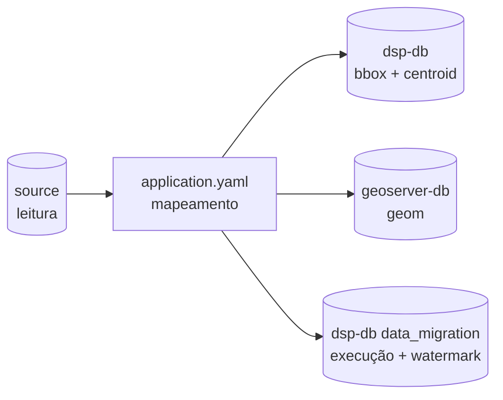
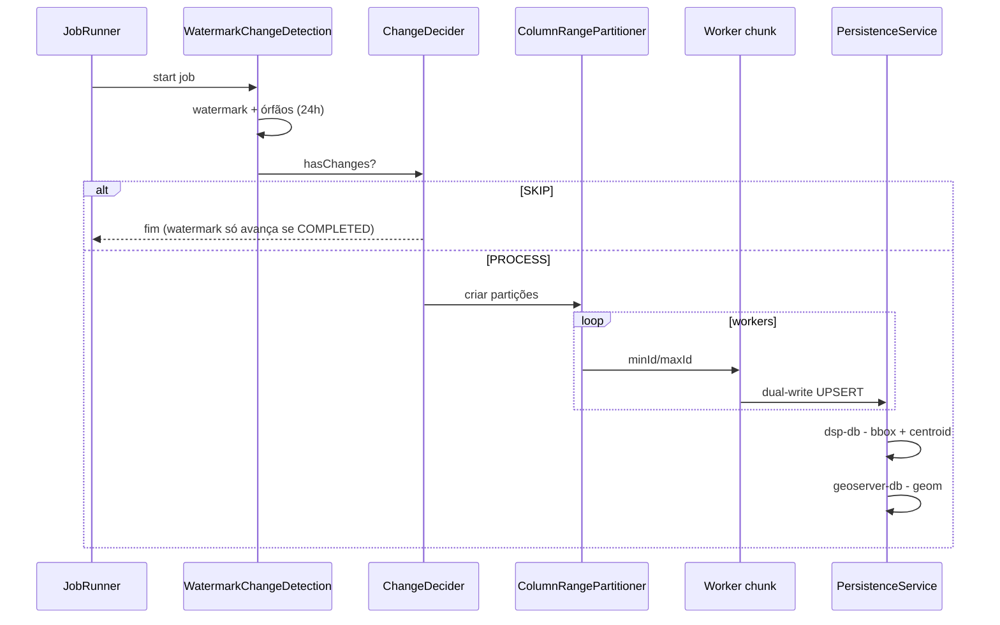

# rer-dsp-job-data-migration — Configuração e execução

Detalhe operacional do repositório de ETL geoespacial do DSP (`br.car:dsp-batch`). Visão conceitual em [Visão geral](overview.md).

## Sumário

- [Stack](#stack)
- [Jobs disponíveis](#jobs-disponiveis)
- [Contrato de colunas](#contrato-de-colunas)
- [DataSources](#datasources)
- [Preparar o ambiente](#preparar-o-ambiente-para-executar-o-job-isolado-sem-o-rer-dsp-core)
- [Configuração YAML](#configuracao-yaml)
- [Paralelização e partição](#paralelizacao-e-particao)
- [Fluxo interno](#fluxo-interno)
- [Comandos de execução](#comandos-de-execucao)
- [Docker no core (`dsp_config`)](#docker-no-core-dsp_config)
- [Problemas comuns](#problemas-comuns)

---

## Stack

| Tecnologia | Versão / detalhe |
|------------|-------------------|
| Java | 21 |
| Spring Boot | 3.4.2 |
| Spring Batch | via `spring-boot-starter-batch` |
| PostgreSQL + PostGIS | JDBC; funções `ST_*` |
| Maven Wrapper | `./mvnw` |
| Tipo de aplicação | Não-web (`SPRING_MAIN_WEB_APPLICATION_TYPE=none`), porta interna 8086 não exposta como HTTP |

---

## Jobs disponíveis

| Flag `execution-jobs` | Bean Job | Bloco YAML |
|-------------------------|----------|------------|
| `admin-unit-level-1-geoserver-job` | `adminUnitLevel1GeoserverJob` | `batch.admin-unit.level-1` |
| `admin-unit-level-2-geoserver-job` | `adminUnitLevel2GeoserverJob` | `batch.admin-unit.level-2` |
| `admin-unit-level-3-geoserver-job` | `adminUnitLevel3GeoserverJob` | `batch.admin-unit.level-3` |
| `area-of-interest-geoserver-job` | `areaOfInterestGeoserverJob` | `batch.area-of-interest` |
| `layer-jobs` | `layerMigrationJob_<chave>` | `batch.layers[]` |

Ordem obrigatória: **L1 → L2 → L3 → area-of-interest → camadas**.

Quando o `application.yaml` é gerado pelo `./config.sh`, os jobs fixos (L1–L3 + AOI) ficam **sempre** `true`. `layer-jobs` vira `true` automaticamente se houver entradas em `etl.layers[]`. Para desligar um job fixo ou uma camada, edite o YAML manualmente (`enabled: false` só vale em `batch.layers[]` do job — não no `adopter-config.yaml`).

```yaml
execution-jobs:
  admin-unit-level-1-geoserver-job: true
  admin-unit-level-2-geoserver-job: false
  admin-unit-level-3-geoserver-job: false
  area-of-interest-geoserver-job: false
  layer-jobs: false
```

---

## Contrato de colunas

Você aponta **qual coluna da origem** cumpre cada papel. No destino oficial do DSP o **nome é fixo**. O nome na origem pode ser qualquer um.

No wizard (`./config.sh`, estágio 2/4) o campo do `adopter-config.yaml` é o da coluna da esquerda. No YAML do job, o da direita.

### Unidades administrativas (L1 / L2 / L3)

Tabela destino: `dsp.territory_level_1`, `_2` ou `_3` (nos dois bancos).

| Papel | Wizard | YAML do job | Obrigatório | Nome no destino | Onde grava |
|-------|--------|-------------|-------------|-----------------|------------|
| Chave | `primary_key` | `primary-key` | sim | `id` | os dois bancos |
| Nome exibido | `name_column` | entra em `persist-columns` + `column-mapping` | sim | `name` | os dois bancos |
| Pai (só L2 e L3) | `parent_key` | `partition-column` + mapping para `parent_id` | sim em L2/L3 | `parent_id` | os dois bancos |
| Geometria | `geometry_column` | `geometry-column` | sim | `geom` no geo-target; no `dsp-db` vira `boundary_box` + `centroid_coordinates` | os dois bancos (formas diferentes) |
| Criação | `created_at_column` | `creation-date-column` | sim | `created_at` | os dois bancos |
| Atualização | `updated_at_column` | `updated-at-column` | não | `updated_at` | os dois bancos |

Não há lista de colunas extras no wizard para L1/L2/L3. Para gravar outra coluna de negócio, edite o `application.yaml`: coloque-a em `persist-columns` e em `column-mapping`. `business-only-persist-columns` grava **só** no `dsp-db`.

### Área de interesse

Tabela destino: `dsp.area_of_interest` (nos dois bancos). Sem `column-mapping`: cada papel vira um nome canônico.

| Papel | Wizard | YAML do job | Obrigatório | Nome no destino | Onde grava |
|-------|--------|-------------|-------------|-----------------|------------|
| Chave | `primary_key` | `primary-key` | sim | `id` | os dois bancos |
| Criação | `created_at_column` | `creation-date-column` | sim | `created_at` | os dois bancos |
| Atualização | `updated_at_column` | `updated-at-column` | não | `updated_at` | os dois bancos |
| Nível 3 | `territory_level_3_column` | `territory-level-3-column` | sim | `territory_level_3_id` | os dois bancos |
| Área | `area_column` | `total-area-column` | sim | `area` | os dois bancos |
| Geometria | `geometry_column` | `geometry-column` | sim | `geom` no geo-target; no `dsp-db` vira bbox + centroid | os dois bancos (formas diferentes) |

#### Colunas adicionais da AOI

Duas listas, escolhidas no wizard (estágio 2/4) ou no YAML:

| Lista | Wizard | YAML | Nome no destino | Onde grava | Uso |
|-------|--------|------|-----------------|------------|-----|
| Extras de negócio/mapa | `additional_columns` | `additional-columns` | **o mesmo da origem** | `dsp-db` **e** geo-target | Qualquer atributo que você queira no detalhe da AOI e no mapa (ex.: `owner_name`, `registry_code`) |
| KPIs de tema | `business_only_persist_columns` | `business-only-persist-columns` | **o mesmo da origem** (em geral `theme_1`…`theme_4`) | **só** `dsp-db` | Cards de KPI. Não vão para o GeoServer |

Regras:

- Informe o **nome da coluna na origem**. Se o nome na origem for outro, use um alias no `source-table` (SQL) para o destino ficar `theme_1`, etc.
- Não use um nome reservado: `id`, `created_at`, `updated_at`, `territory_level_3_id`, `area`, `geom`.
- O painel de detalhe da AOI (wizard, estágio 4/4) só oferece extras que estejam em `additional_columns`.
- O DDL do `dsp-db` cria `theme_1`…`theme_4` mesmo se você não mapear nenhum KPI.

```yaml
batch:
  area-of-interest:
    additional-columns:
      - owner_name          # chega como owner_name nos dois destinos
      - registry_code
    business-only-persist-columns:
      - theme_1             # só dsp-db, card de KPI
      - theme_2
```

### Camadas genéricas

Tabela destino: `dsp.<layer_name>` (hífen → underscore) **só no geo-target**. Não grava no `dsp-db`. Várias entradas podem repetir a `source-table` se o `layer-name` resolvido for distinto.

| Papel | Wizard | YAML do job | Obrigatório | Nome no destino |
|-------|--------|-------------|-------------|-----------------|
| Chave | `primary_key` | `primary-key` | sim | `id` |
| Vínculo com a AOI | `parent_key` | `area-of-interest-id-column` | sim | `area_of_interest_id` |
| Criação | `created_at_column` | `creation-date-column` | sim | `created_at` |
| Atualização | `updated_at_column` | `updated-at-column` | não | `updated_at` |
| Rótulo da feição | `label_column` | `label-column` | não | `label` |
| Geometria | `geometry_column` | `geometry-column` | sim | `geom` |

#### Apresentação no wizard (`etl.layers[]` — não vão para o job)

Estes campos existem só no `adopter-config.yaml` e alimentam `mapLayersConfig.json` / `downloadThemesConfig.json`:

| Campo wizard | Função |
|--------------|--------|
| `layer_name` | Id WMS (`dsp:<nome>`) e tabela destino |
| `display_name` | Rótulo no mapa e na tela Downloads |
| `group_key` | Grupo no seletor de camadas |
| `active_default` | Camada ligada por padrão |
| `color` / `fill_color` | Estilo WMS |

A mesma `source_table` pode repetir com `layer_name` distinto. Para omitir uma camada no fluxo do wizard, remova-a de `etl.layers[]`.

#### Colunas adicionais das layers

| Lista | Wizard | YAML | Nome no destino | Onde grava |
|-------|--------|------|-----------------|------------|
| Extras | `additional_columns` | `additional-columns` | **o mesmo da origem** | só geo-target |

Regras:

- Só entra o que você listar. O job **não** copia o resto da tabela automaticamente.
- Não use um nome reservado: `id`, `area_of_interest_id`, `created_at`, `updated_at`, `label`, `geom`.
- `label-column` é o jeito certo de trazer o nome da feição (vira `label`). Não coloque essa mesma coluna em `additional-columns`.

```yaml
batch:
  layers:
    - source-table: conservation.rivers
      primary-key: feature_id
      area-of-interest-id-column: conservation_unit_id
      creation-date-column: created_at
      geometry-column: boundary
      label-column: river_name          # vira label
      additional-columns:
        - length_km                     # chega como length_km
        - basin_code
```

---

## DataSources

A auto-configuração JDBC do Boot é excluída. Quatro beans manuais — `batch` e `target` apontam para o **mesmo** banco de destino:

| Bean | Prefixo YAML | Banco | Uso |
|------|--------------|-------|-----|
| `dataSource` (`@Primary`) | `spring.datasource.batch` | mesmo DB que `target`, schema `data_migration` | JobRepository (`BATCH_*`) e watermark |
| `sourceDataSource` | `spring.datasource.source` | Fonte JDBC do adotante | Leitura / change detection / partição |
| `targetDataSource` | `spring.datasource.target` | `dsp-db` | UPSERT negócio + `boundary_box` + `centroid_coordinates` |
| `geoTargetDataSource` | `spring.datasource.geo-target` | `geoserver-db` | UPSERT `geom` completa (sem bbox/centroid) |

Contrato completo dos papéis: [Bancos de dados](../../architecture/databases.md).

---

## Preparar o ambiente para executar o job isolado sem o `rer-dsp-core`:

### 1. Bancos de destino

Se você não está usando o `rer-dsp-core` para provisionar os bancos, crie manualmente `dsp-db` e `geoserver-db` com a extensão PostGIS:

```bash
psql -h localhost -p 6666 -U postgres -c "CREATE DATABASE dsp_db;"
psql -h localhost -p 6666 -U postgres -d dsp_db -c "CREATE EXTENSION IF NOT EXISTS postgis;"

psql -h localhost -p 6666 -U postgres -c "CREATE DATABASE dsp_geoserver_db;"
psql -h localhost -p 6666 -U postgres -d dsp_geoserver_db -c "CREATE EXTENSION IF NOT EXISTS postgis;"
```

### 2. Schema de metadados do Spring Batch

A aplicação **não** cria o schema automaticamente (`spring.batch.jdbc.initialize-schema: never`) — o schema `data_migration` (tabelas `BATCH_*` e `BATCH_JOB_EXECUTION_SYNC_STATE`) precisa ser criado no **banco de destino** uma vez (ou quando o banco for recriado):

```bash
psql -h localhost -p 6666 -U postgres -d dsp_db \
  -f src/main/resources/db/batch_metadata/01_spring_batch_schema.sql
```

!!! note "Duas cópias do mesmo schema"
    O `rer-dsp-core` também mantém uma cópia (`config/db/dsp-db/02_data_migration_batch.sql`), usada na inicialização Docker do `dsp-db`. As duas cópias precisam ficar iguais se o schema do Spring Batch mudar.

Conferir:

```bash
psql -h localhost -p 6666 -U postgres -d dsp_db -c '\dt data_migration.*'
```

---

## Configuração YAML

Arquivo: `src/main/resources/application.yaml` (standalone) ou o gerado pelo `./config.sh` do core (`config/Job-Data-Migration/application/application.yaml`).



Fuso das colunas temporais sem offset (`timestamp` / `date`):

```yaml
batch:
  source-timezone: America/Sao_Paulo
```

Ignorado quando a origem já é `timestamptz`. Pode ser sobrescrito por job com `source-timezone`.

### Exemplo — unidades administrativas (L1 + L2 + L3)

Contrato oficial do DSP (`dsp.territory_level_*`). O YAML de demonstração do repositório do job usa outros nomes de tabela — o mapeamento é o mesmo.

```yaml
batch:
  admin-unit:
    level-1:
      source-table: source_admin_units.source_l1_continents
      target-table: dsp.territory_level_1
      primary-key: source_continent_pk
      geometry-column: source_continent_geom
      creation-date-column: source_created_at
      updated-at-column: source_updated_at
      where-clause: "1=1"
      persist-columns:
        - source_continent_pk
        - source_continent_name
        - source_created_at
      column-mapping:
        source_continent_pk: id
        source_continent_name: name
        source_continent_geom: geom
        source_created_at: created_at
        source_updated_at: updated_at
      layer-name: territory-level-1
      srid: 4326
    level-2:
      source-table: source_admin_units.source_l2_countries
      target-table: dsp.territory_level_2
      primary-key: source_country_pk
      partition-column: source_continent_fk
      geometry-column: source_country_geom
      creation-date-column: source_created_at
      updated-at-column: source_updated_at
      persist-columns:
        - source_country_pk
        - source_country_name
        - source_continent_fk
        - source_created_at
      column-mapping:
        source_country_pk: id
        source_country_name: name
        source_continent_fk: parent_id
        source_country_geom: geom
        source_created_at: created_at
        source_updated_at: updated_at
      layer-name: territory-level-2
      srid: 4326
    level-3:
      source-table: source_admin_units.source_l3_admin_areas
      target-table: dsp.territory_level_3
      primary-key: source_area_pk
      partition-column: source_country_fk
      geometry-column: source_area_geom
      creation-date-column: source_created_at
      persist-columns:
        - source_area_pk
        - source_area_name
        - source_country_fk
        - source_created_at
      column-mapping:
        source_area_pk: id
        source_area_name: name
        source_country_fk: parent_id
        source_area_geom: geom
        source_created_at: created_at
      layer-name: territory-level-3
      srid: 4326
```

### Propriedades das unidades administrativas

| Propriedade | Obrigatória | Descrição |
|-------------|-------------|-----------|
| `source-table` | sim | Tabela/schema de origem |
| `target-table` | sim | Tabela/schema de destino |
| `primary-key` | sim | PK **na origem** (base do `ON CONFLICT` no destino via mapping) |
| `geometry-column` | sim | Coluna PostGIS **na origem** |
| `creation-date-column` | sim | Coluna de criação na origem — base do watermark |
| `updated-at-column` | não | Coluna de atualização na origem; se omitida, o incremental usa só a criação |
| `where-clause` | não | Filtro SQL na detecção, no scan de órfãos **e** na leitura de escrita (default `1=1`) |
| `persist-columns` | sim | Colunas gravadas nos **dois** destinos (PK + atributos + FKs + datas) |
| `business-only-persist-columns` | não | Colunas gravadas **só** no `dsp-db` (ex.: KPIs). Não vão para o geo-target |
| `column-mapping` | não | Tradução `origem: destino` quando os nomes diferem |
| `partition-column` | não | Coluna para fatiar a leitura (default = PK). Aceita VARCHAR com valor numérico (`CAST … AS BIGINT`) |
| `srid` | sim | SRID do destino. Na leitura, UA, AOI e camadas usam `ST_Transform` |
| `layer-name` | sim | Nome da layer no GeoServer — alinhado à publicação feita pelo core |
| `source-timezone` | não | Override de `batch.source-timezone` |
| `sync-key` | não | Chave do watermark (default `admin_unit_level_1` / `_2` / `_3`) |

!!! tip "persist-columns × business-only-persist-columns"
    - `persist-columns` → o que vai para `dsp-db` **e** `geoserver-db`.
    - `business-only-persist-columns` → só `dsp-db` (não entra no geo-target nem na detecção geo).
    - A geometria é tratada à parte via `geometry-column`. No geo-target a coluna canônica é `geom`.
    - A detecção de mudança **não** compara atributos: ela usa só as colunas temporais do watermark.

    O wizard do `rer-dsp-core` preenche as colunas de papel fixo (PK, nome, geometria, FK do nível pai, `created_at`). Colunas extras de negócio exigem editar `adopter-config.yaml` / `application.yaml` e reaplicar.

### Exemplo — área de interesse

AOI **não** usa `persist-columns` nem `column-mapping`. O job mapeia para colunas canônicas e cria as tabelas nos dois destinos se ainda não existirem.

```yaml
batch:
  area-of-interest:
    source-table: property
    target-table: dsp.area_of_interest
    primary-key: id
    creation-date-column: created_date
    updated-at-column: updated_at
    territory-level-3-column: city_id
    total-area-column: area_ha
    geometry-column: geometry
    where-clause: "1=1"
    additional-columns: []
    business-only-persist-columns:
      - theme_1
      - theme_2
    layer-name: area-of-interest
    srid: 4326
```

| Propriedade YAML | Obrigatória | Destino canônico |
|------------------|-------------|------------------|
| `source-table` | sim | — |
| `target-table` | não (default `dsp.area_of_interest`) | — |
| `primary-key` | sim | `id` (`varchar`) |
| `creation-date-column` | sim | `created_at` (`timestamptz`) |
| `updated-at-column` | não | `updated_at` (`timestamptz`) |
| `territory-level-3-column` | sim | `territory_level_3_id` |
| `total-area-column` | sim | `area` |
| `geometry-column` | sim | `geom` |
| `additional-columns` | não | mesmo nome nos dois destinos |
| `business-only-persist-columns` | não | só `dsp-db` (KPIs `theme_1`…`theme_4`) |
| `where-clause` | não | default `1=1` |
| `srid` | sim | — |
| `layer-name` | não | — |
| `sync-key` | não (default `area_of_interest`) | — |

O DDL de negócio cria sempre `theme_1`…`theme_4` (`numeric`) e `updated_at` (`timestamptz`), mesmo sem coluna correspondente na origem.

!!! warning "PRIMARY KEY no destino"
    A coluna mapeada da PK **deve** ser PRIMARY KEY (ou unique) no target. Caso contrário: *no unique or exclusion constraint matching the ON CONFLICT specification*.

### Camadas genéricas (além de L1/L2/L3/AOI)

Lista em `batch.layers` — qualquer tabela PostGIS adicional. O job introspecciona o schema, cria `dsp.<layer_name>` (hífen → underscore) no **geo-target** e grava só lá.

```yaml
batch:
  layers:
    - source-table: conservation.rivers
      primary-key: feature_id
      area-of-interest-id-column: conservation_unit_id
      creation-date-column: created_at
      geometry-column: boundary
      layer-name: rivers
      srid: 4674
```

Obrigatórias: `source-table`, `primary-key`, `area-of-interest-id-column`, `creation-date-column`, `geometry-column`. Só roda se `execution-jobs.layer-jobs: true`.

No wizard do core, a coluna de vínculo com a AOI se chama `parent_key` no `adopter-config.yaml` e vira `area-of-interest-id-column` neste YAML. Camadas declaradas no wizard também viram temas de download (`territoryFilter.strategy: aoi_linked`).

Guia completo: [Migração de camadas genéricas](layer-migration.md).

### Conexões (origem, dois destinos, batch no destino)

No fluxo do core, as credenciais da origem vêm de `DSP_SOURCE_JDBC_URL`, `DSP_SOURCE_DB_USER` e `DSP_SOURCE_DB_PASSWORD`.

```yaml
spring:
  datasource:
    batch:
      url: jdbc:postgresql://localhost:6666/dsp_db?currentSchema=data_migration
      username: postgres
      password: postgres
      driver-class-name: org.postgresql.Driver
    source:
      url: jdbc:postgresql://localhost:6666/source_geo_import_db
      username: postgres
      password: postgres
      driver-class-name: org.postgresql.Driver
    target:
      url: jdbc:postgresql://localhost:6666/dsp_db
      username: postgres
      password: postgres
      driver-class-name: org.postgresql.Driver
    geo-target:
      url: jdbc:postgresql://localhost:6666/dsp_geoserver_db
      username: postgres
      password: postgres
      driver-class-name: org.postgresql.Driver
  batch:
    job:
      enabled: false
    jdbc:
      initialize-schema: never

server:
  port: 8086
```

---

## Paralelização e partição

Chaves em `parallelization.jobs` usam o **nome do bean Job** (camelCase), não a flag kebab-case:

```yaml
parallelization:
  jobs:
    adminUnitLevel1GeoserverJob:
      enabled: true
      thread-pool-size: 1
      chunk-size: 1
      page-size: 1000
      queue-capacity: 100
    adminUnitLevel2GeoserverJob:
      enabled: true
      thread-pool-size: 4
      chunk-size: 1
      page-size: 1000
      queue-capacity: 100
    adminUnitLevel3GeoserverJob:
      enabled: true
      thread-pool-size: 4
      chunk-size: 100
      page-size: 1000
      queue-capacity: 100
    areaOfInterestGeoserverJob:
      enabled: false
      thread-pool-size: 1
      chunk-size: 100
      page-size: 1000
      queue-capacity: 100
```

| Parâmetro | Efeito |
|-----------|--------|
| `enabled` | Liga o master/worker particionado |
| `thread-pool-size` | Workers em paralelo |
| `chunk-size` | Tamanho do chunk de escrita |
| `page-size` | Página do reader |
| `queue-capacity` | Fila do executor |

Regra: `hikari.maximum-pool-size` do source/target deve comportar o `thread-pool-size`.

---

## Fluxo interno



Na leitura, unidades administrativas, AOI e camadas aplicam `ST_Transform(geom_origem, srid_yaml)` antes do GeoJSON. Na escrita, `ST_SetSRID` grava o SRID no destino. Geometrias com Z/M são achatadas (`ST_Force2D`).

---

## Docker no core (`dsp_config`)

No `docker-compose.yml` do core, o serviço `dsp-job-migration` usa:

- `build.context`: repositório `rer-dsp-job-data-migration`
- `additional_contexts.dsp_config`: pasta `rer-dsp-core/config`

No build da imagem (`Dockerfile` do job), o script `select-runtime-config.sh` copia para `/config/`:

- `application.yaml` (ativo ou `.example`)
- `mapLayersConfig.json` (usado pelo `populate_geoserver.sh` embutido)

Também entram no build: `entrypoint.sh`, `publish_geoservers.sh` e `populate_geoserver.sh`.

Variáveis relevantes no container:

| Variável | Função |
|----------|--------|
| `SPRING_CONFIG_LOCATION` | `file:/config/application.yaml` |
| `DSP_MIGRATION_EXECUTION_MODE` | `once` / `continuous` / `scheduled-once` |
| `DSP_MIGRATION_CRON` | Cron do supercronic (modo `continuous`) |
| `DSP_MIGRATION_SCHEDULED_AT` | Primeira carga agendada |
| `DSP_SOURCE_JDBC_URL` (+ user/password) | Sobrescrevem a origem do YAML |

Depois de alterar arquivos em `config/`, rebuild: `docker compose --profile migration up -d --build dsp-job-migration` (ou `./setup.sh` / `./start.sh`).

---

## Comandos de execução

Rode a partir da raiz do repositório, com `application.yaml` já configurado.

**Desenvolvimento** (recompila e sobe):

```bash
./mvnw spring-boot:run
```

**Pacote + JAR:**

```bash
./mvnw clean package -DskipTests
java -jar target/dsp-batch-0.0.1-SNAPSHOT.jar
```

Status da execução fica em `data_migration` (`BATCH_JOB_EXECUTION` e `BATCH_JOB_EXECUTION_SYNC_STATE`) no banco de destino.

**Override de flags sem editar o YAML:**

```bash
./mvnw spring-boot:run -Dspring-boot.run.arguments="\
--execution-jobs.admin-unit-level-1-geoserver-job=true \
--execution-jobs.admin-unit-level-2-geoserver-job=false \
--execution-jobs.admin-unit-level-3-geoserver-job=false \
--execution-jobs.area-of-interest-geoserver-job=false"
```

---

## Problemas comuns

| Sintoma | Causa provável | Ação |
|---------|----------------|------|
| `batch_job_instance does not exist` | Schema `data_migration` ausente no banco de destino | Rodar `01_spring_batch_schema.sql` no `dsp-db` / target; conferir `currentSchema=data_migration` na URL de `batch` |
| `no unique or exclusion constraint matching the ON CONFLICT` | Destino sem PK na coluna de conflito | Criar PRIMARY KEY (ou unique) no destino |
| Job sobe e "não faz nada" | Flags `execution-jobs` todas `false`, sem watermark delta, ou só órfãos | Habilitar job; conferir `BATCH_JOB_EXECUTION_SYNC_STATE` e as colunas temporais da origem |
| Falha na subida com datasource UNAVAILABLE | Um dos 4 bancos não respondeu ao `SELECT 1` | Conferir `spring.datasource.*` e se os bancos estão no ar |
| Erro de conexão JDBC | Host/porta/database errados | Conferir `spring.datasource.*` |
| Geometrias não aparecem | Coluna/SRID/mapping incorretos | Revisar `geometry-column`, `srid`, `column-mapping` (destino canônico: `geom`) |
| Incremental não pega atualizações | `updated-at-column` ausente ou nula na origem | Preencher a coluna ou reprocessar (apagar a linha do `sync-key` em `BATCH_JOB_EXECUTION_SYNC_STATE`) |

Validação pós-execução: [Validação pós-migração](validation.md).
