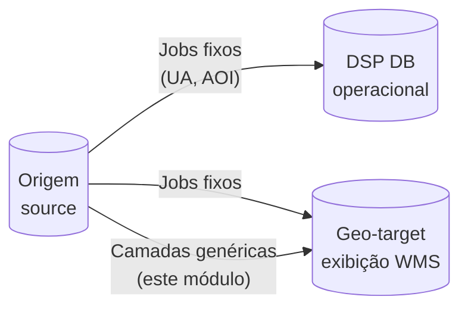
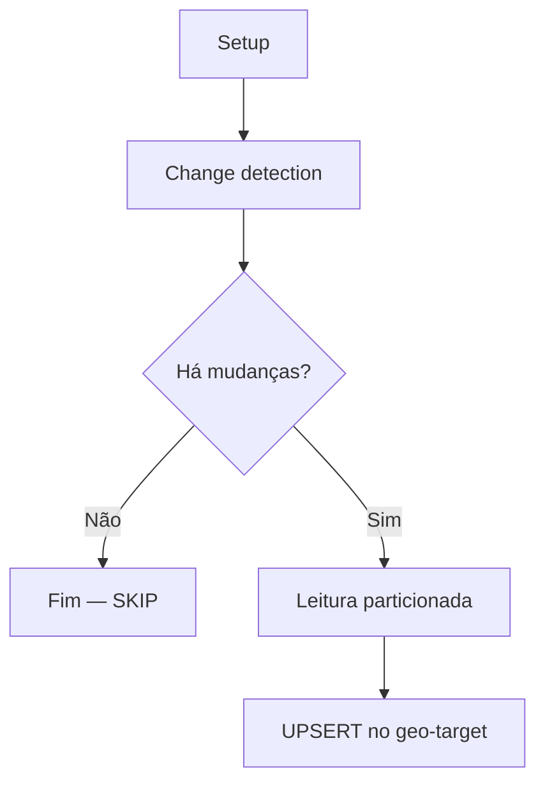

# rer-dsp-job-data-migration — Migração de camadas genéricas

Guia didático do módulo de **camadas geográficas** (`batch.layers`) do job [`rer-dsp-job-data-migration`](overview.md). Documentação geral do job (stack, datasources, jobs fixos, comandos): [Configuração e execução](configuration.md).

---

## O que este módulo faz

O job lê **tabelas PostGIS desconhecidas** no banco de origem e replica suas feições no banco **geo-target** (exibição / WMS).

Você **não** precisa descrever coluna por coluna no YAML, ao contrário dos jobs fixos (L1/L2/L3/AOI). O job descobre a estrutura sozinho e cria a tabela de destino.

| Você informa no YAML | O job descobre sozinho |
|----------------------|------------------------|
| Nome da tabela de origem | Colunas e tipos |
| Coluna que liga à área de interesse | Chave primária |
| (Opcional) SRID, filtros, nomes | Coluna de geometria e índices |

---

## Conceitos importantes

Antes de configurar, vale alinhar a nomenclatura:

| Termo | Significado | Exemplo |
|-------|-------------|---------|
| **Camada (layer)** | Uma tabela geográfica inteira | `conservation.rivers` |
| **Feição (feature)** | Uma linha (registro) dentro da camada | Um trecho de rio |
| **Área de interesse (AOI)** | Entidade canônica no DSP | `dsp.area_of_interest` |

**Premissa:** cada feição pertence a **uma** área de interesse. A coluna que faz essa ligação na origem é declarada no YAML; no destino ela vira sempre `area_of_interest_id`.

---

## Onde os dados vão parar



| Destino | Quem escreve | Observação |
|---------|--------------|------------|
| **DSP DB** (`target`) | Jobs fixos (unidades administrativas, AOI) | Dados de negócio da API |
| **Geo-target** (`geo-target`) | Jobs fixos **e** camadas genéricas | Geometrias para mapa |

As camadas genéricas **só** escrevem no geo-target. O schema e o nome da tabela de destino são fixos:

```text
geo-target → dsp.<nome_da_tabela_na_origem>
```

Exemplo: origem `conservation.rivers` → destino `dsp.rivers`.

---

## Ordem de execução

As camadas dependem de `area_of_interest_id` apontar para registros que já existem em `dsp.area_of_interest`.

```text
1. Unidades administrativas (level-1 → level-2 → level-3)
2. Área de interesse (area-of-interest)
3. Camadas genéricas (layer-jobs)   ← este módulo
```

Na prática, o `JobRunner` dos jobs fixos roda **antes** do runner de camadas (`@Order(1)` e `@Order(2)`).

---

## Pré-requisitos

- [ ] Banco de **origem** com PostGIS e tabelas a migrar
- [ ] Banco **geo-target** acessível (`spring.datasource.geo-target`)
- [ ] Cada tabela de origem com **PK simples** (uma coluna)
- [ ] Pelo menos **uma coluna de geometria**
- [ ] Coluna de vínculo com AOI preenchida nas feições
- [ ] Job de **área de interesse** já executado (valores de FK válidos)
- [ ] Schema Spring Batch criado no banco `batch`

---

## Configuração mínima

### 1. Datasource geo-target

Além de `batch`, `source` e `target`, configure:

```yaml
spring:
  datasource:
    geo-target:
      url: jdbc:postgresql://localhost:5432/dsp-geoserver-db
      username: dsp_geo
      password: dsp_geo
```

### 2. Declarar as camadas

```yaml
batch:
  layers:
    - source-table: conservation.rivers
      area-of-interest-id-column: conservation_unit_id
      layer-name: rivers
      srid: 4674
```

Só **duas** propriedades são obrigatórias:

| Propriedade | Obrigatória | Descrição |
|-------------|-------------|-----------|
| `source-table` | sim | Tabela de origem no formato `schema.tabela` |
| `area-of-interest-id-column` | sim | Coluna na origem que identifica a AOI da feição |

### 3. Habilitar a execução

```yaml
execution-jobs:
  layer-jobs: true
```

### 4. Paralelização (opcional)

O nome do job segue o padrão `layerMigrationJob_` + chave da camada (`dsp_<tabela>`):

```yaml
parallelization:
  jobs:
    layerMigrationJob_dsp_rivers:
      enabled: true
      thread-pool-size: 2
      chunk-size: 100
      page-size: 1000
      queue-capacity: 100
```

Se não houver entrada para uma camada, o job usa valores padrão.

---

## Propriedades opcionais

| Propriedade | Default | Quando usar |
|-------------|---------|-------------|
| `layer-name` | nome da tabela | Nome amigável nos logs (não altera o destino) |
| `srid` | descoberto na origem | Forçar SRID quando a introspecção não encontrar |
| `primary-key` | PK do banco | Tabela sem PK declarada no PostgreSQL |
| `geometry-column` | via `geometry_columns` | Tabela com mais de uma geometria |
| `where-clause` | `1=1` | Migrar só um subconjunto de feições |
| `enabled` | `true` | Desligar uma camada sem remover do YAML |

---

## O que acontece em cada execução

Cada camada gera **um job Spring Batch** independente.



### Passo 1 — Setup

1. Valida se a tabela existe na origem
2. Descobre colunas, PK, geometria, SRID e índices
3. Cria `CREATE SCHEMA IF NOT EXISTS dsp` no geo-target
4. Cria a tabela `dsp.<nome>` (se ainda não existir)
5. Cria índice GIST na geometria e índice em `area_of_interest_id`

### Passo 2 — Change detection

Compara origem × geo-target:

- **Novo** — PK existe só na origem
- **Modificado** — mesma PK, atributos ou geometria diferentes
- **Removido** — PK existe só no geo-target → **DELETE** no destino

Se nada mudou desde a última execução, o job **pula** a carga (economiza tempo).

!!! note "Escopo da change detection"
    A remoção de órfãos acontece **somente no geo-target**. O DSP DB não é afetado por este módulo.

### Passo 3 — Carga (UPSERT)

- Lê feições da origem em páginas (com particionamento quando a PK é numérica)
- Grava no geo-target com `INSERT ... ON CONFLICT DO UPDATE`
- Renomeia a coluna de vínculo: ex. `conservation_unit_id` → `area_of_interest_id`
- Geometrias com Z/M (Point Z) são achatadas para 2D (`ST_Force2D`) — adequado para WMS

---

## Exemplo com várias camadas

```yaml
batch:
  layers:
    - source-table: conservation.rivers
      area-of-interest-id-column: conservation_unit_id
      layer-name: rivers
      srid: 4674

    - source-table: conservation.lakes
      area-of-interest-id-column: conservation_unit_id
      layer-name: lakes
      srid: 4674

    - source-table: conservation.forest_areas
      area-of-interest-id-column: conservation_unit_id
      layer-name: forest-areas
      srid: 4674
      enabled: false   # declarada, mas não roda

execution-jobs:
  admin-unit-level-1-geoserver-job: true
  admin-unit-level-2-geoserver-job: true
  admin-unit-level-3-geoserver-job: true
  area-of-interest-geoserver-job: true
  layer-jobs: true

parallelization:
  jobs:
    layerMigrationJob_dsp_rivers:
      enabled: true
      thread-pool-size: 1
      chunk-size: 100
      page-size: 1000
    layerMigrationJob_dsp_lakes:
      enabled: true
      thread-pool-size: 1
      chunk-size: 100
      page-size: 1000
```

---

## Como executar

Na raiz do repositório `rer-dsp-job-data-migration`:

```bash
# 1. Metadados Spring Batch (uma vez)
psql -h localhost -U postgres -d batch_metadata \
  -f src/main/resources/db/batch_metadata/01_spring_batch_schema.sql

# 2. Subir o job
./mvnw spring-boot:run
```

Para rodar **só** as camadas (jobs fixos desligados):

```bash
./mvnw spring-boot:run -Dspring-boot.run.arguments="\
--execution-jobs.admin-unit-level-1-geoserver-job=false \
--execution-jobs.admin-unit-level-2-geoserver-job=false \
--execution-jobs.admin-unit-level-3-geoserver-job=false \
--execution-jobs.area-of-interest-geoserver-job=false \
--execution-jobs.layer-jobs=true"
```

---

## Como validar

No geo-target, confira se a tabela foi criada e populada:

```sql
-- Tabela existe?
SELECT COUNT(*) FROM dsp.rivers;

-- Feições ligadas a AOI?
SELECT area_of_interest_id, COUNT(*)
FROM dsp.rivers
GROUP BY area_of_interest_id;

-- Geometrias válidas?
SELECT COUNT(*) FROM dsp.rivers WHERE geom IS NOT NULL;
```

Logs úteis (pacote `br.car.dsp_batch`):

- `Introspection completed for ...` — estrutura descoberta
- `Target table ready: dsp.rivers` — DDL aplicado
- `Upserted N features into geo-target dsp.rivers` — carga concluída
- `No changes detected` — reexecução sem alterações (SKIP)

---

## Limitações da versão atual

| Situação | Comportamento |
|----------|---------------|
| PK composta | Erro — não suportado |
| PK UUID / texto não numérico | Migra em partição única (sem paralelismo por faixa) |
| Tabela ganha colunas novas depois | `CREATE TABLE IF NOT EXISTS` **não** altera tabela existente |
| Múltiplas geometrias | Usa a primeira encontrada (ou a declarada em `geometry-column`) |
| GeoServer / cache | Este módulo **não** dispara refresh de cache |

---

## Erros comuns

| Mensagem / sintoma | Causa provável | O que fazer |
|--------------------|----------------|-------------|
| `area-of-interest-id-column is required` | YAML incompleto | Informe a coluna de vínculo com AOI |
| `Source table not found` | Schema/tabela errados | Confira `source-table` e permissões |
| `has no PRIMARY KEY` | Tabela sem PK | Declare `primary-key` no YAML |
| `SRID not found` | Geometria vazia ou sem SRID | Informe `srid` explicitamente |
| Job sobe e não migra camadas | `layer-jobs: false` ou `enabled: false` | Confira flags |
| FK inválida no mapa | AOI não migrada antes | Rode o job de area-of-interest primeiro |
| `ON CONFLICT` falha | PK ausente no destino | Apague a tabela destino e rode Setup de novo |

---

## Diferença em relação aos jobs fixos

| | Jobs fixos (UA, AOI) | Camadas genéricas |
|--|----------------------|-------------------|
| Configuração | Coluna a coluna no YAML | Só tabela + coluna AOI |
| Destino | DSP DB **e** geo-target | **Só** geo-target |
| DDL | Manual / pré-existente | Criado automaticamente |
| Mapeamento de colunas | `column-mapping` explícito | Espelha origem (exceto AOI → `area_of_interest_id`) |

---

## No wizard do rer-dsp-core

No wizard `./config.sh` do `rer-dsp-core`, essas camadas são configuradas no estágio **5/5 — Jobs de migração** (seção `etl.layers` do `adopter-config.yaml`), que o core traduz para `batch.layers` neste arquivo. Detalhe do wizard: [rer-dsp-core](../core.md#configsh).

---

## Onde aprofundar

| Documento | Conteúdo |
|-----------|----------|
| [Configuração e execução](configuration.md) | Stack, datasources, jobs fixos, comandos |
| [Visão geral](overview.md) | Ordem e estratégias de change detection |
| [Validação pós-migração](validation.md) | Checklist pós-migração |
