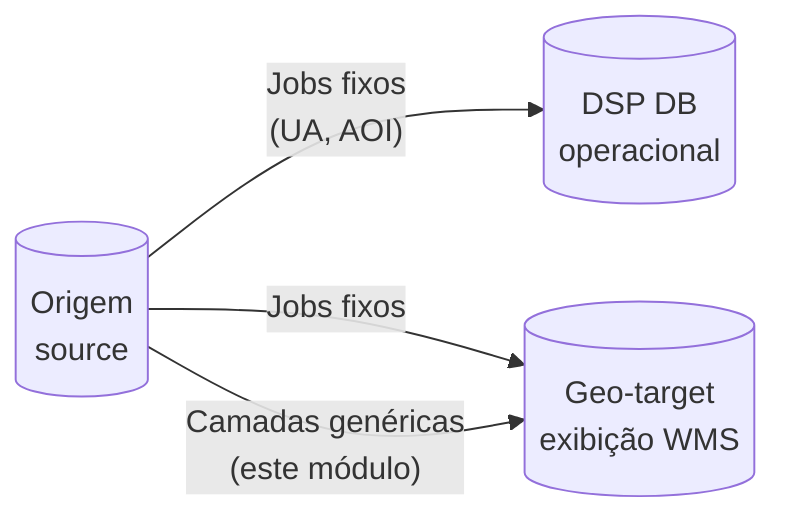
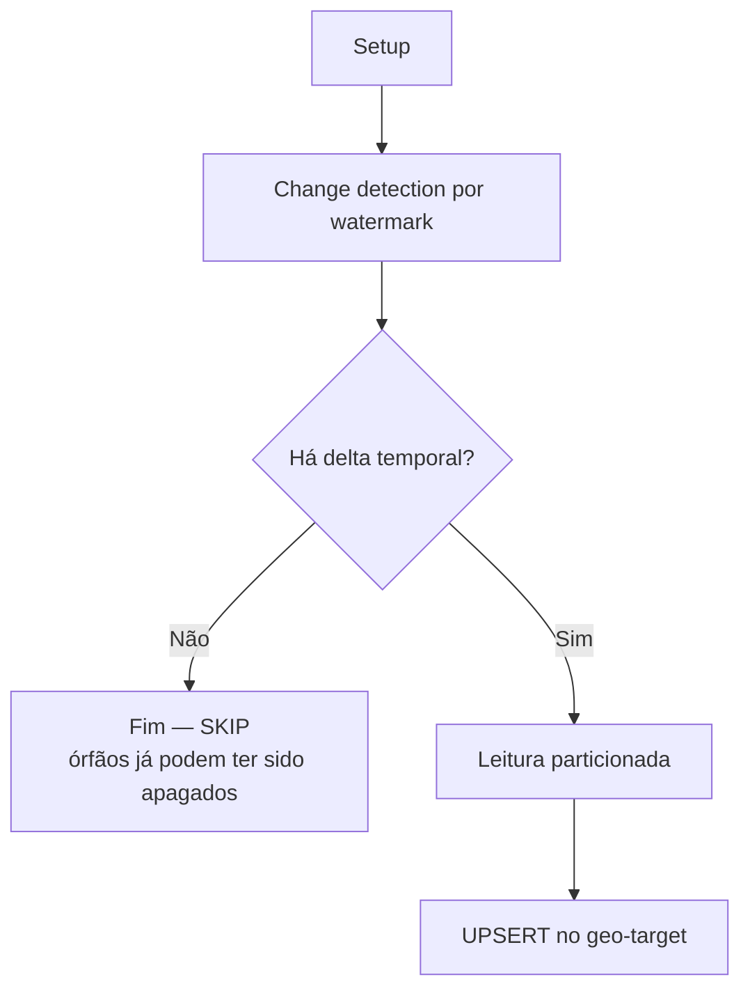

# rer-dsp-job-data-migration — Migração de camadas genéricas

Guia didático do módulo de **camadas geográficas** (`batch.layers`) do job [`rer-dsp-job-data-migration`](overview.md). Documentação geral do job (stack, datasources, jobs fixos, comandos): [Configuração e execução](configuration.md).

---

## O que este módulo faz

O job lê **tabelas PostGIS extras** no banco de origem e replica suas feições no banco **geo-target** (exibição / WMS).

Você informa as colunas de papel (PK, vínculo com AOI, data de criação, geometria). O job descobre o restante do schema e cria a tabela de destino.

| Você informa no YAML | O job descobre sozinho |
|----------------------|------------------------|
| Nome da tabela de origem | Demais colunas e tipos (via introspecção + `additional-columns`) |
| PK, vínculo com AOI, criação, geometria | Índices no destino |
| (Opcional) SRID, filtros, label, extras | — |

---

## Conceitos importantes

| Termo | Significado | Exemplo |
|-------|-------------|---------|
| **Camada (layer)** | Uma tabela geográfica inteira | `conservation.rivers` |
| **Feição (feature)** | Uma linha (registro) dentro da camada | Um trecho de rio |
| **Área de interesse (AOI)** | Entidade canônica no DSP | `dsp.area_of_interest` |

**Premissa:** cada feição pertence a **uma** área de interesse. A coluna que faz essa ligação na origem é declarada no YAML; no destino ela vira sempre `area_of_interest_id`.

No wizard do core (`adopter-config.yaml`), esse campo se chama `parent_key` e é traduzido para `area-of-interest-id-column`.

---

## Onde os dados vão parar



| Destino | Quem escreve | Observação |
|---------|--------------|------------|
| **DSP DB** (`target`) | Jobs fixos (unidades administrativas, AOI) | Dados de negócio da API |
| **Geo-target** (`geo-target`) | Jobs fixos **e** camadas genéricas | Geometrias para mapa |

As camadas genéricas **só** escrevem no geo-target. O destino vem do `layer-name` resolvido (se omitido, o nome da tabela de origem), com hífen virando underscore:

```text
geo-target → dsp.<layer_name_normalizado>
```

Exemplos: origem `conservation.rivers` sem `layer-name` → `dsp.rivers`; `layer-name: tipo-a` → `dsp.tipo_a`. A mesma `source-table` pode aparecer em mais de uma entrada se os destinos forem distintos.

Colunas canônicas no destino: `id` (`varchar(255)`), `area_of_interest_id` (`varchar(255)`), `created_at` (`timestamptz`), `updated_at` (se houver), `label` (se houver), `geom`. Só **uma** geometria é migrada — a informada em `geometry-column`.

---

## Ordem de execução

As camadas dependem de `area_of_interest_id` apontar para registros que já existem em `dsp.area_of_interest`.

```text
1. Unidades administrativas (level-1 → level-2 → level-3)
2. Área de interesse (area-of-interest)
3. Camadas genéricas (layer-jobs)   ← este módulo
```

Na prática, o `JobRunner` dos jobs fixos roda **antes** do runner de camadas (`@Order(1)` e `@Order(2)`).

---

## Pré-requisitos

- [ ] Banco de **origem** com PostGIS e tabelas a migrar
- [ ] Banco **geo-target** acessível (`spring.datasource.geo-target`)
- [ ] Cada tabela de origem com **PK simples** (uma coluna)
- [ ] Coluna de geometria informada no YAML
- [ ] Coluna de vínculo com AOI preenchida nas feições
- [ ] `creation-date-column` preenchida (watermark)
- [ ] Job de **área de interesse** já executado (valores de FK válidos)
- [ ] Schema Spring Batch criado no `dsp-db` (`data_migration`)

---

## Configuração mínima

### 1. Datasource geo-target

Além de `batch`, `source` e `target`, configure:

```yaml
spring:
  datasource:
    geo-target:
      url: jdbc:postgresql://localhost:5432/dsp-geoserver-db
      username: dsp_geo
      password: dsp_geo
```

### 2. Declarar as camadas

```yaml
batch:
  layers:
    - source-table: conservation.rivers
      primary-key: feature_id
      area-of-interest-id-column: conservation_unit_id
      creation-date-column: created_at
      geometry-column: geom
      layer-name: rivers
      srid: 4674
```

Quadro completo origem → destino (incluindo extras): [Contrato de colunas](configuration.md#contrato-de-colunas).

| Propriedade | Obrigatória | Descrição |
|-------------|-------------|-----------|
| `source-table` | sim | Tabela de origem no formato `schema.tabela` (exatamente um `.`) |
| `primary-key` | sim | PK simples na origem |
| `area-of-interest-id-column` | sim | Coluna na origem que identifica a AOI da feição |
| `creation-date-column` | sim | Coluna de criação — base do watermark |
| `geometry-column` | sim | Qual coluna da origem vira `geom` no destino |

### 3. Habilitar a execução

```yaml
execution-jobs:
  layer-jobs: true
```

### 4. Paralelização (opcional)

O nome do job segue o padrão `layerMigrationJob_` + chave da camada (`dsp_<nome_físico>`):

```yaml
parallelization:
  jobs:
    layerMigrationJob_dsp_rivers:
      enabled: true
      thread-pool-size: 2
      chunk-size: 100
      page-size: 1000
      queue-capacity: 100
```

Se não houver entrada para uma camada, o job usa valores padrão.

---

## Propriedades opcionais

| Propriedade | Default | Quando usar |
|-------------|---------|-------------|
| `layer-name` | nome da tabela | Identidade WMS (`dsp:<nome>`) e base do destino físico (`dsp.<nome>` com hífen → `_`) |
| `srid` | descoberto na origem | SRID do destino. Na leitura, `ST_Transform` reprojeta a geometria da origem para este valor (igual UA/AOI) |
| `updated-at-column` | — | Incremental também por atualização |
| `label-column` | — | Texto exibido (`label` no destino) |
| `additional-columns` | `[]` | Extras copiados com o mesmo nome |
| `where-clause` | `1=1` | Subconjunto de feições (detecção, órfãos e escrita) |
| `source-timezone` | `batch.source-timezone` | Colunas temporais sem offset |
| `enabled` | `true` | Só no `application.yaml` **editado manualmente**. No wizard/`adopter-config.yaml`, remova a camada de `etl.layers[]` em vez de usar `enabled` |

Se a tabela destino **já existir**, o job exige `created_at timestamptz` nela (`CREATE TABLE IF NOT EXISTS` **não** altera tabela existente).

---

## O que acontece em cada execução

Cada camada gera **um job Spring Batch** independente.



### Passo 1 — Setup

1. Valida se a tabela existe na origem
2. Descobre colunas, PK, geometria, SRID e índices
3. Cria `CREATE SCHEMA IF NOT EXISTS dsp` no geo-target
4. Cria a tabela `dsp.<nome_físico>` (se ainda não existir)
5. Cria índice GIST em `geom` e índice em `area_of_interest_id`

### Passo 2 — Change detection

Mesmo motor das unidades administrativas e da AOI:

- **Delta** — registros com criação (ou `updated_at`) depois do watermark gravado em `BATCH_JOB_EXECUTION_SYNC_STATE`
- **Órfãos** — PK só no geo-target → **DELETE** (scan a cada 24 h)
- Sem delta → **SKIP** (mesmo que órfãos tenham sido apagados)

!!! note "Escopo da change detection"
    A remoção de órfãos acontece **somente no geo-target**. O DSP DB não é afetado por este módulo.

### Passo 3 — Carga (UPSERT)

- Lê feições da origem em páginas (particionamento quando a PK é numérica ou VARCHAR numérico)
- Grava no geo-target com `INSERT ... ON CONFLICT DO UPDATE`
- Renomeia a coluna de vínculo: ex. `conservation_unit_id` → `area_of_interest_id`
- Geometrias com Z/M são achatadas para 2D (`ST_Force2D`)

---

## Exemplo com várias camadas

```yaml
batch:
  layers:
    - source-table: conservation.rivers
      primary-key: feature_id
      area-of-interest-id-column: conservation_unit_id
      creation-date-column: created_at
      geometry-column: geom
      layer-name: rivers
      srid: 4674

    - source-table: conservation.lakes
      primary-key: feature_id
      area-of-interest-id-column: conservation_unit_id
      creation-date-column: created_at
      geometry-column: geom
      layer-name: lakes
      srid: 4674

execution-jobs:
  admin-unit-level-1-geoserver-job: true
  admin-unit-level-2-geoserver-job: true
  admin-unit-level-3-geoserver-job: true
  area-of-interest-geoserver-job: true
  layer-jobs: true

parallelization:
  jobs:
    layerMigrationJob_dsp_rivers:
      enabled: true
      thread-pool-size: 1
      chunk-size: 100
      page-size: 1000
    layerMigrationJob_dsp_lakes:
      enabled: true
      thread-pool-size: 1
      chunk-size: 100
      page-size: 1000
```

---

## Como executar

Na raiz do repositório `rer-dsp-job-data-migration`:

```bash
# 1. Metadados Spring Batch no banco de destino (uma vez)
psql -h localhost -U postgres -d dsp_db \
  -f src/main/resources/db/batch_metadata/01_spring_batch_schema.sql

# 2. Subir o job
./mvnw spring-boot:run
```

Para rodar **só** as camadas (jobs fixos desligados):

```bash
./mvnw spring-boot:run -Dspring-boot.run.arguments="\
--execution-jobs.admin-unit-level-1-geoserver-job=false \
--execution-jobs.admin-unit-level-2-geoserver-job=false \
--execution-jobs.admin-unit-level-3-geoserver-job=false \
--execution-jobs.area-of-interest-geoserver-job=false \
--execution-jobs.layer-jobs=true"
```

---

## Como validar

No geo-target, confira se a tabela foi criada e populada:

```sql
SELECT COUNT(*) FROM dsp.rivers;

SELECT area_of_interest_id, COUNT(*)
FROM dsp.rivers
GROUP BY area_of_interest_id;

SELECT COUNT(*) FROM dsp.rivers WHERE geom IS NOT NULL;
```

Watermark da camada (no `dsp-db`):

```sql
SELECT sync_key, watermark_last_event_at, last_success_at, last_orphan_check_at
FROM data_migration.BATCH_JOB_EXECUTION_SYNC_STATE
WHERE source_table LIKE '%rivers%';
```

Logs úteis (pacote `br.car.dsp_batch`):

- `Introspection completed for ...` — estrutura descoberta
- `Target table ready: dsp.rivers` — DDL aplicado
- `Upserted N features into geo-target dsp.rivers` — carga concluída
- `No changes detected` — reexecução sem delta temporal (SKIP)

---

## Limitações da versão atual

| Situação | Comportamento |
|----------|---------------|
| PK composta | Erro — não suportado |
| PK UUID / texto não numérico | Migra em partição única (sem paralelismo por faixa) |
| Tabela ganha colunas novas depois | `CREATE TABLE IF NOT EXISTS` **não** altera tabela existente |
| Múltiplas geometrias na origem | Só a coluna de `geometry-column` é migrada; as demais são ignoradas |
| SRID origem ≠ YAML | `ST_Transform` na leitura para o `srid` do YAML (igual UA/AOI) |
| GeoServer / cache | Este módulo **não** dispara refresh de cache |

---

## Erros comuns

| Mensagem / sintoma | Causa provável | O que fazer |
|--------------------|----------------|-------------|
| `area-of-interest-id-column is required` | YAML incompleto | Informe a coluna de vínculo com AOI |
| `creation-date-column` ausente | YAML incompleto | Informe a coluna de criação |
| `Source table not found` | Schema/tabela errados | Confira `source-table` e permissões |
| `has no PRIMARY KEY` | Tabela sem PK | Declare `primary-key` no YAML |
| `SRID not found` | Geometria vazia ou sem SRID | Informe `srid` explicitamente |
| Job sobe e não migra camadas | `layer-jobs: false` ou camada com `enabled: false` no YAML manual | Confira flags; no wizard, remova a camada de `etl.layers[]` |
| FK inválida no mapa | AOI não migrada antes | Rode o job de area-of-interest primeiro |
| `ON CONFLICT` falha | PK ausente no destino | Apague a tabela destino e rode Setup de novo |
| Destino existente sem `created_at timestamptz` | Tabela antiga | Ajuste a coluna ou recrie a tabela |

---

## Diferença em relação aos jobs fixos

| | Jobs fixos (UA, AOI) | Camadas genéricas |
|--|----------------------|-------------------|
| Configuração | UA: coluna a coluna; AOI: papéis canônicos | Tabela + PK + AOI + criação + geometria |
| Destino | DSP DB **e** geo-target | **Só** geo-target |
| DDL | UA: SQL do core; AOI: automático | Criado automaticamente |
| Mapeamento | UA: `column-mapping`; AOI: canônico | Espelha origem (exceto papéis → `id` / `area_of_interest_id` / `geom`) |
| Change detection | Watermark temporal | Watermark temporal |

---

## No wizard do rer-dsp-core

No estágio **2/4** (`etl.layers[]` do `adopter-config.yaml`), cada camada é configurada **uma vez** e alimenta migração, mapa e downloads:

| Campo wizard / YAML | Uso |
|---------------------|-----|
| `source_table`, `primary_key`, `parent_key` (FK → AOI), colunas temporais, `geometry_column`, `where_clause`, `srid` | Job (`application.yaml`) |
| `layer_name` | Id técnico WMS (`dsp:<nome>`) e tabela destino `dsp.<nome>` |
| `display_name` | Rótulo humano no seletor de camadas e na tela Downloads |
| `group_key` | Grupo no mapa (existente ou novo) |
| `active_default`, `color`, `fill_color` | Camada ligada por padrão e estilo WMS |

A mesma `source_table` pode repetir com **`layer_name` diferente**; o wizard reaproveita o mapeamento de colunas da camada anterior com a mesma origem.

Para desligar uma camada no fluxo do wizard, **remova-a** de `etl.layers[]` e reaplique `./config.sh` — o campo `enabled` não é aceito no `adopter-config.yaml`.

Detalhe completo do wizard: [rer-dsp-core](../core.md#configsh).

---

## Onde aprofundar

| Documento | Conteúdo |
|-----------|----------|
| [Configuração e execução](configuration.md) | Stack, datasources, jobs fixos, comandos |
| [Visão geral](overview.md) | Ordem e watermark |
| [Validação pós-migração](validation.md) | Checklist pós-migração |
