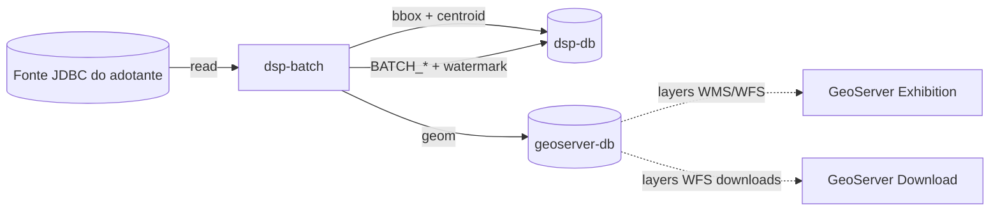
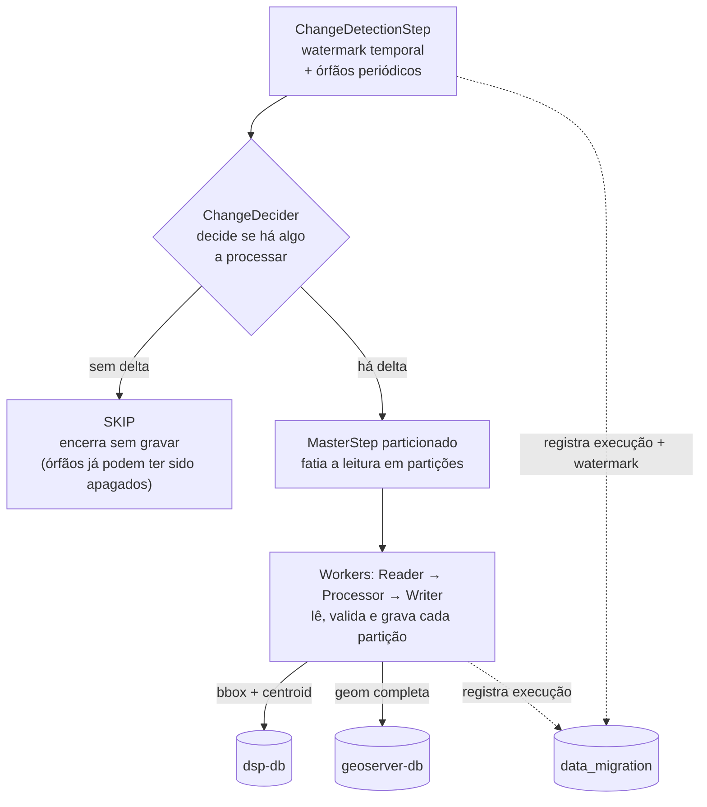

# rer-dsp-job-data-migration — Visão geral

Este módulo é parte do [DSP](../../index.md) — veja a documentação completa em [rer-dsp-docs](../../index.md). As informações abaixo tratam apenas deste módulo.

Conceitos, ordem de execução e pré-requisitos da migração geoespacial no RER DSP. A implementação é o artefato Maven `dsp-batch`.

## Por que migrar

O DSP trabalha com uma base PostGIS própria (dois destinos), sincronizada a partir do banco da organização adotante — sem expor a base de origem diretamente.

## Escopo da migração

| Domínio | Jobs | Observação |
|---------|------|------------|
| Unidades administrativas | level-1, level-2, level-3 | Hierarquia configurável via YAML — 3 níveis (ex.: continente → país → divisão administrativa) |
| Área de interesse | `area-of-interest-geoserver-job` | Ex.: imóveis rurais. DDL automático nos dois destinos; colunas canônicas (`id`, `geom`, `created_at`, …) |
| Camadas genéricas (opcional) | `layer-jobs` | Qualquer tabela PostGIS extra do adotante, publicada só como layer WMS (não vai para o `dsp-db` operacional). Pré-requisito: área de interesse já migrada. Guia: [Migração de camadas genéricas](layer-migration.md) |
| Cálculo de KPIs | `kpi-job` | Após AOI e camadas: calcula `area` na AOI e grava temas em `dsp.kpi_measure` no `dsp-db`. Guia: [Job de cálculo de KPIs](configuration.md#job-de-calculo-de-kpis) |

O significado de cada level não está fixo no código — vem das tabelas e colunas configuradas no YAML.

## Atores do fluxo



| Componente | Responsabilidade |
|------------|------------------|
| Fonte (`source`) | Banco JDBC do adotante — fonte da verdade a ser lida |
| `dsp-db` (`target`) | Base operacional — negócio + bbox/centroid |
| `geoserver-db` (`geo-target`) | Geometria completa (`geom`) para os GeoServers |
| `data_migration` (`batch`) | Histórico Spring Batch e watermark incremental — schema no mesmo `dsp-db` |
| `dsp-batch` | Orquestra detecção por watermark, partição, dual-write UPSERT |
| GeoServer Exhibition / Download | Consomem **somente** `geoserver-db` |

!!! tip "Publicação de camadas"
    O JAR **não** publica camadas nos GeoServers. No fluxo orquestrado, o `rer-dsp-core` faz isso via `populate_geoserver.sh` quando a carga inicial roda no `./setup.sh` (**Run now**), ou via `publish_geoservers.sh` no entrypoint do job após a **primeira carga agendada** (**Schedule for later**). O `layer-name` no YAML precisa estar alinhado ao `mapLayersConfig.json`.

## Pipeline de um job

Todos os jobs (unidades administrativas, AOI e camadas) seguem o mesmo pipeline:



| Etapa | O que faz |
|-------|-----------|
| Change detection | Compara origem × destino pelo **watermark** (`creation-date-column` + `updated-at-column` opcional) e, periodicamente, remove órfãos |
| Decider | `PROCESS` ou `SKIP` |
| Partitioner | Fatia por `partition-column` (se numérica ou VARCHAR com valor numérico) |
| Reader | Páginas com geometria em GeoJSON; UA, AOI e camadas aplicam `ST_Transform` para o `srid` do YAML |
| Processor | Pass-through (sem transformação de negócio) |
| Writer | UPSERT `ON CONFLICT` em dois destinos: `dsp-db` (bbox + centroid) e `geoserver-db` (`geom` completa). Camadas genéricas gravam só no geo-target |

## Ordem obrigatória

```text
admin-unit level-1
    → admin-unit level-2
        → admin-unit level-3
            → area-of-interest
                → camadas genéricas (layer-jobs)
                    → kpi-job (kpiCalculationJob)
```

Essa ordem é obrigatória por causa de FKs no destino: filhos referenciam pais já migrados; camadas genéricas dependem de `area_of_interest_id` já existir no geo-target; KPIs de tema dependem das geometrias das camadas no geo-target. O `JobRunner` dos jobs fixos roda antes do runner de camadas (`@Order(1)` e `@Order(2)`); o KPI job roda por último (`@Order(3)`).

## Sincronização incremental (watermark)

Não há mais hash de atributos nem intervalo fixo `DATE_RANGE`. Todos os jobs usam o mesmo motor (`WatermarkChangeDetectionEngine`).

| Situação | Comportamento |
|----------|---------------|
| Primeira carga (sem watermark) | Lê registros com `creation-date-column` preenchida |
| Cargas seguintes | Lê o que foi **criado** ou **atualizado** depois do watermark: `(criação > watermark) OR (updated_at IS NOT NULL AND updated_at > watermark)` |
| Sem `updated-at-column` | Só a coluna de criação entra no filtro incremental |
| Órfãos | Scan periódico (intervalo de 24 h). Remove no destino o que sumiu na origem. Se só houver órfãos, o job apaga e **pula o UPSERT** |
| Avanço do watermark | Só depois de job `COMPLETED`, em `data_migration.BATCH_JOB_EXECUTION_SYNC_STATE` |

`creation-date-column` é **obrigatório** em todos os jobs. Tipos aceitos na origem: `timestamptz`, `timestamp` e `date` (`date` tem granularidade diária). `time`/`timetz` são rejeitados.

O destino exige `created_at` / `updated_at` como `timestamptz`. Fuso das colunas sem offset: `batch.source-timezone` (default do produto `America/Sao_Paulo`), com override opcional `source-timezone` por job.

Cada job tem um `sync-key` (default: `admin_unit_level_1` / `_2` / `_3`, `area_of_interest`, ou a chave da camada).

## Pré-requisitos para executar o job sem o `rer-dsp-core`:

- [ ] Java 21 e Maven Wrapper (`./mvnw`)
- [ ] Quatro DataSources acessíveis (source, target, geo-target; batch no mesmo banco que target, schema `data_migration`)
- [ ] Extensão PostGIS na origem e no destino
- [ ] Schema `data_migration` aplicado no banco de destino (`db/batch_metadata/01_spring_batch_schema.sql`)
- [ ] PRIMARY KEY (ou unique) nas colunas de conflito do destino
- [ ] YAML com tabelas, colunas temporais e `srid`
- [ ] Flags `execution-jobs.*` coerentes com a etapa

Na subida, o `DatabaseConnectivityInitializer` testa `SELECT 1` nos quatro datasources (timeout 5 s) e falha se algum estiver indisponível.

O JAR é **one-shot**: sobe, roda os jobs habilitados e encerra (`System.exit`). No Docker do core, o modo contínuo é o **supercronic** no entrypoint — não há cron no YAML do job.

## Execução via Docker (core)

No Compose do `rer-dsp-core`, a imagem `dsp-job-migration` é construída com contexto extra `dsp_config` (`rer-dsp-core/config`). No build, entram:

- `application.yaml` e `mapLayersConfig.json` (via `select-runtime-config.sh`)
- `entrypoint.sh`, `publish_geoservers.sh` e `populate_geoserver.sh`

| `DSP_MIGRATION_EXECUTION_MODE` | Comportamento |
|--------------------------------|---------------|
| `once` | Um ciclo JAR e encerra (setup **Run now + One-time**) |
| `scheduled-once` | Espera `DSP_MIGRATION_SCHEDULED_AT`, um ciclo, publica GeoServers, encerra |
| `continuous` | Primeira carga (no setup ou na data agendada), depois supercronic em `DSP_MIGRATION_CRON` |

No modo **continuous**, o wrapper do supercronic usa **`flock`** para não sobrepor ciclos. Falha do JAR **não** derruba o container — o próximo cron tenta de novo.

Quando a primeira carga é **agendada**, `publish_geoservers.sh` chama o mesmo `populate_geoserver.sh` do `./setup.sh` contra Exhibition e Download na rede Docker.

## Onde aprofundar

| Tema | Página |
|------|--------|
| Contrato dos bancos (4 papéis) | [Bancos de dados](../../architecture/databases.md) |
| YAML, datasources e comandos | [Configuração e execução](configuration.md) |
| Quais colunas são obrigatórias e o nome no destino | [Contrato de colunas](configuration.md#contrato-de-colunas) |
| Camadas genéricas (tabelas PostGIS extras) | [Migração de camadas genéricas](layer-migration.md) |
| Checklist e queries pós-migração | [Validação pós-migração](validation.md) |
