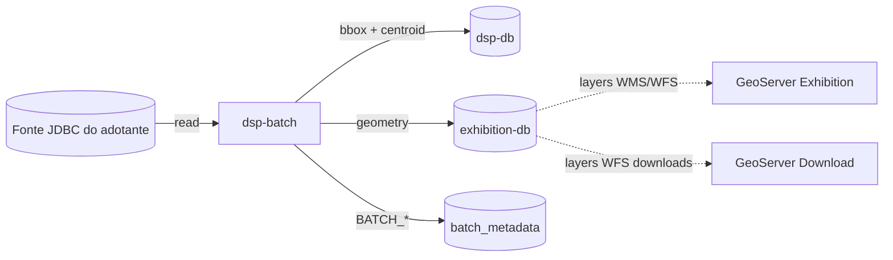
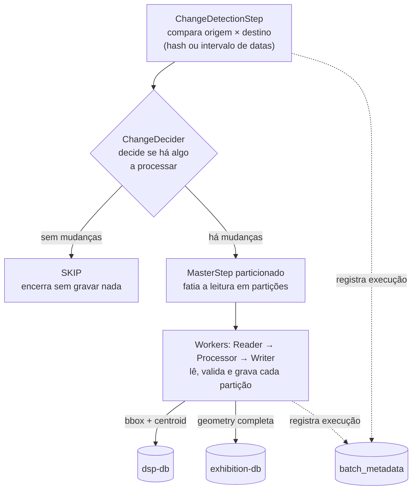

# rer-dsp-job-data-migration — Visão geral

Este módulo é parte do [DSP](../../index.md) — veja a documentação completa em [rer-dsp-docs](../../index.md). As informações abaixo tratam apenas deste módulo.

Conceitos, ordem de execução e pré-requisitos da migração geoespacial no RER DSP. A implementação é o artefato Maven `dsp-batch`.

## Por que migrar

O DSP trabalha com uma base PostGIS própria (dois destinos), sincronizada a partir do banco da organização adotante — sem expor a base de origem diretamente.

## Escopo da migração

| Domínio | Jobs | Observação                                                                                                                                                                                            |
|---------|------|-------------------------------------------------------------------------------------------------------------------------------------------------------------------------------------------------------|
| Unidades administrativas | level-1, level-2, level-3 | Hierarquia configurável via YAML — 3 níveis hierárquicos (ex.: continente → país → divisão administrativa)                                                                                            |
| Área de interesse | `area-of-interest-geoserver-job` | Ex.: imóveis rurais                                                                                                                                                                                   |
| Camadas genéricas (opcional) | `layer-jobs` | Qualquer tabela PostGIS extra do adotante, publicada só como layer WMS (não vai para o `dsp-db` operacional). Pré-requisito: área de interesse já migrada. Guia completo: [Migração de camadas genéricas](layer-migration.md) |

O significado de cada level não está fixo no código — vem das tabelas e colunas configuradas no YAML.

## Atores do fluxo



| Componente | Responsabilidade |
|------------|------------------|
| Fonte (`source`) | Banco JDBC do adotante — fonte da verdade a ser lida |
| `dsp-db` (`target`) | Base operacional — negócio + bbox/centroid |
| `exhibition-db` (`geo-target`) | Geometria completa para os GeoServers |
| `batch_metadata` (`batch`) | Histórico e controle Spring Batch |
| `dsp-batch` | Orquestra detecção, partição, dual-write UPSERT |
| GeoServer Exhibition / Download | Consomem **somente** `exhibition-db` |

!!! tip "Publicação de camadas"
    Este job **não** publica camadas nos GeoServers — isso é feito pelo `rer-dsp-core` via `./setup.sh`/`populate_geoserver.sh` (Exhibition e Download) a partir do `mapLayersConfig.json`. O `layer-name` no YAML do job só precisa estar alinhado ao nome usado nessa publicação.

## Pipeline de um job

Todos os quatro jobs seguem o mesmo pipeline:



| Etapa | O que faz |
|-------|-----------|
| Change detection | Compara origem × destino (ou filtra por data) |
| Decider | `PROCESS` ou `SKIP` |
| Partitioner | Fatia por `partition-column` (se numérica) |
| Reader | Páginas com geometria em GeoJSON |
| Processor | Pass-through (sem transformação de negócio) |
| Writer | UPSERT `ON CONFLICT` em dois destinos: `dsp-db` (bbox + centroid) e `exhibition-db` (geometry completa) |

## Ordem obrigatória

```text
admin-unit level-1
    → admin-unit level-2
        → admin-unit level-3
            → area-of-interest
                → camadas genéricas (layer-jobs)
```

Essa ordem é obrigatória por causa de FKs no destino: filhos referenciam pais já migrados; camadas genéricas dependem de `area_of_interest_id` já existir no geo-target. O `JobRunner` dos jobs fixos roda antes do runner de camadas (`@Order(1)` e `@Order(2)`).

## Estratégias de change detection

| Estratégia | Uso típico | Comportamento |
|------------|------------|----------------|
| `DEFAULT` | Unidades administrativas | Hash de atributos + geometria; remoção de órfãos no destino |
| `DATE_RANGE` | Área de interesse | Filtra origem por `start-date` / `end-date`; não faz hash nem remove órfãos |

## Pré-requisitos para executar o job sem o `rer-dsp-core`:

- [ ] Java 21 e Maven Wrapper (`./mvnw`)
- [ ] Quatro datasources acessíveis (source, target, geo-target, batch)
- [ ] Extensão PostGIS na origem e no destino
- [ ] Schema `BATCH_*` aplicado manualmente (`db/batch_metadata/01_spring_batch_schema.sql`)
- [ ] PRIMARY KEY (ou unique) nas colunas de conflito do destino
- [ ] YAML com `source-table`, `target-table`, mapping e `layer-name`
- [ ] Flags `execution-jobs.*` coerentes com a etapa

## Onde aprofundar

| Tema | Página |
|------|--------|
| Contrato dos bancos (4 papéis) | [Bancos de dados](../../architecture/databases.md) |
| YAML, datasources e comandos | [Configuração e execução](configuration.md) |
| Camadas genéricas (tabelas PostGIS extras) | [Migração de camadas genéricas](layer-migration.md) |
| Checklist e queries pós-migração | [Validação pós-migração](validation.md) |
