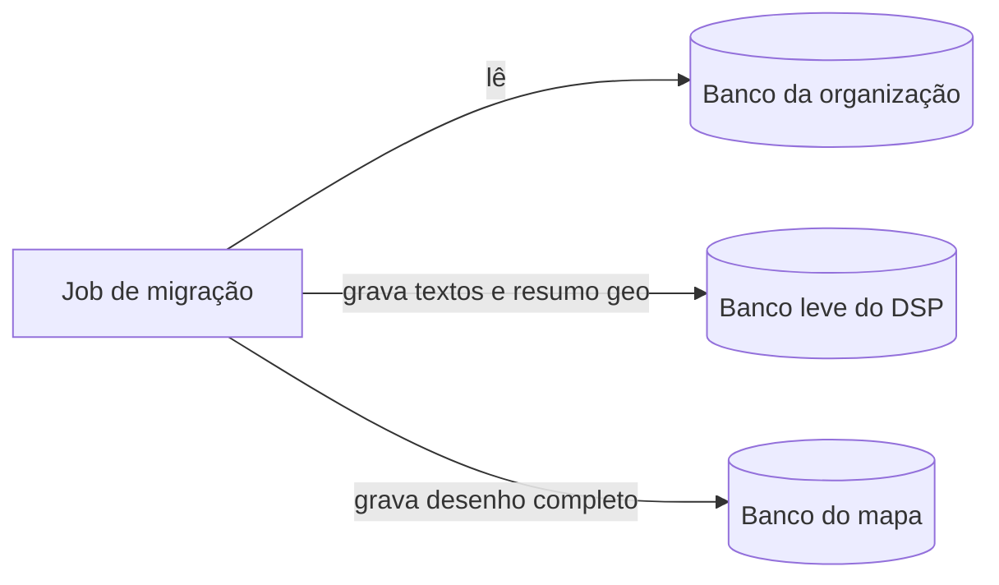
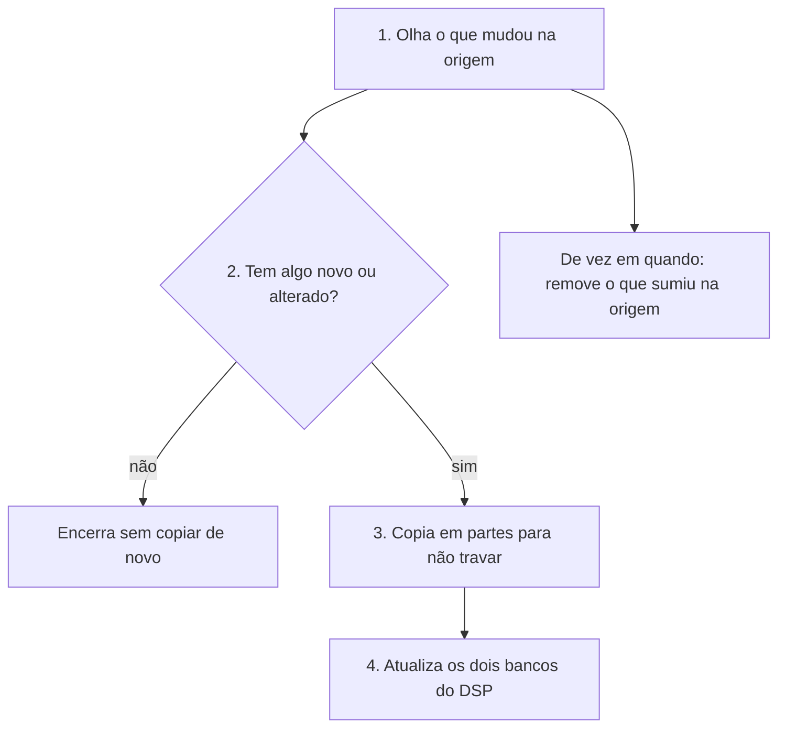

# rer-dsp-job-data-migration — Visão geral

Job que **copia os dados geográficos do banco da sua organização** para dentro do DSP, de forma automática e repetível. Orquestração pelo [rer-dsp-core](../core.md) (`./setup.sh`). Detalhe dos bancos: [Bancos de dados](../../architecture/databases.md).

## Sumário

- [Como funciona](#como-funciona-visao-simples)
- [O que é copiado](#o-que-e-copiado)
- [Fluxo em uma imagem](#fluxo-em-uma-imagem)
- [Ordem da cópia](#ordem-da-copia)
- [Só o que mudou desde a última vez](#so-o-que-mudou-desde-a-ultima-vez)
- [O que acontece em cada execução](#o-que-acontece-em-cada-execucao)
- [Mapa e downloads](#mapa-e-downloads)
- [Quando o job roda no dia a dia](#quando-o-job-roda-no-dia-a-dia)
- [Detalhe técnico (referência rápida)](#detalhe-tecnico-referencia-rapida)
- [Onde aprofundar](#onde-aprofundar)

---

## Como funciona

Imagine que o **banco da organização** é a pasta de trabalho onde os cadastros são atualizados, e o **DSP** precisa de uma **cópia própria** para o site público funcionar rápido e sem expor esse banco direto na internet.

O job de migração faz três coisas principais:

1. **Lê** o banco de origem (somente leitura — não altera nada lá).
2. **Grava em dois lugares dentro do DSP:**
   - Um banco **leve**, usado pela API e pelas telas (nomes, datas, um retângulo e um ponto no mapa por registro — não o polígono inteiro).
   - Outro banco **com o desenho completo** dos imóveis e territórios, usado para exibir o mapa e exportações pesadas.
3. **Na próxima execução, não copia tudo de novo** — só registros **novos ou alterados** desde a última cópia bem-sucedida (isso é o *watermark*, um “marca-página” guardado pelo próprio job).

Se um registro **sumiu** na origem, o job também pode **remover** a cópia no DSP (varredura periódica de “órfãos”).

Ele **não** é o programa que publica as camadas no mapa do site: isso o `./setup.sh` faz depois que os dados já estão nos bancos. Ele também **não** gera os arquivos grandes de download no armazenamento S3 — só **avisa** quais regiões precisam disso; o [job geo-file](../job-geo-file-generation/overview.md) gera os arquivos.

---

## O que é copiado

| Tipo de dado | Exemplo no CAR | Observação |
|--------------|----------------|------------|
| Três níveis de território | Estado → município → … | Hierarquia configurável no `./config.sh` |
| Área de interesse | Imóvel rural / polígono declarado | O que o cidadão busca no mapa |
| Camadas extras (opcional) | Outras tabelas com mapa | Só vão para o banco do mapa — [guia](generic-layers.md) |

Os nomes “nível 1, 2, 3” são genéricos: o que cada nível significa depende das tabelas que você configurou, não de um padrão fixo no código.

---

## Fluxo em uma imagem



No Compose, os bancos se chamam `dsp-db` (leve) e `dsp-geoserver-db` (mapa).

---

## Ordem da cópia

A cópia segue a **hierarquia**, como montar um quebra-cabeça de dentro para fora:

```text
nível 1 → nível 2 → nível 3 → imóveis (área de interesse) → camadas extras (se houver)
```

O pai precisa existir antes do filho (por exemplo, município antes do imóvel dentro dele). Por isso o job não mistura essa ordem.

---

## Só o que mudou desde a última vez

Na **primeira carga**, entram os registros que têm data de criação preenchida na origem (conforme configurado no `./config.sh`).

Nas **cargas seguintes**, o job compara com a data/hora da **última execução concluída com sucesso**:

- Copia o que foi **criado** depois dessa marca.
- Se a origem tem coluna de **atualização**, copia também o que foi **alterado** depois dessa marca.

Se **nada mudou**, a execução termina rápido (“não havia trabalho”). A marca só avança quando o job termina **sem erro** — assim o DSP não “pula” dados se algo falhou no meio.

Fuso horário das datas na origem: em geral `America/Sao_Paulo`, salvo configuração diferente no YAML.

---

## O que acontece em cada execução

Em termos simples, o job repete sempre o mesmo roteiro:



Tecnicamente isso é detecção por watermark, decisão de pular ou processar, leitura em partes e gravação com “atualiza se já existir, senão insere” (*UPSERT*).

---

## Mapa e downloads

| Etapa | Quem faz |
|-------|----------|
| Dados nos bancos | Job de migração |
| Camadas visíveis no GeoServer / mapa | `./setup.sh` (ou publicação automática após primeira carga agendada) |
| Arquivos CSV prontos no S3 | [Job geo-file](../job-geo-file-generation/overview.md), em horário definido no setup |

Quando uma migração **termina bem**, o job **marca** quais estados/municípios (níveis 2 e 3) precisam de **novo arquivo de download**. Se a migração **falha**, essas marcas **não mudam** — evita publicar download com dados incompletos.

---

## Quando o job roda no dia a dia

Quem define isso é o **`./setup.sh`**, não o wizard do `./config.sh`:

| Escolha no setup | Efeito prático |
|------------------|----------------|
| Carga única agora, sem repetir | Copia uma vez no setup e o container do job desliga |
| Carga única em data/hora | Espera e copia uma vez; pode publicar o mapa depois |
| Sincronização periódica | Copia no setup (ou na data agendada) e **volta a copiar** de tempos em tempos (cron no `.env`) |

Cada “volta” do job é um processo que **sobe, trabalha e desliga**; no modo contínuo, um agendador dentro do container dispara essas voltas.

---

## Detalhe técnico (referência rápida)

| Tópico | Referência |
|--------|------------|
| Artefato | Maven `dsp-batch`, Java 21, Spring Batch |
| Conexões | `source`, `target` (`dsp-db`), `geo-target` (`dsp-geoserver-db`), `batch` (schema `data_migration`) |
| Motor incremental | `WatermarkChangeDetectionEngine` · tabela `BATCH_JOB_EXECUTION_SYNC_STATE` |
| Modos no `.env` | `DSP_MIGRATION_EXECUTION_MODE`: `once`, `scheduled-once`, `continuous` |
| Flags de download | `requires_s3_file_regeneration` em `territory_level_2` / `_3` |

Rodar o JAR isolado (sem core): Java 21, `./mvnw`, quatro bancos acessíveis e `application.yaml` gerado pelo `./config.sh` (repositório `rer-dsp-core`).

!!! tip "Publicação de camadas"
    O nome da camada no YAML do job deve bater com `mapLayersConfig.json`. **Run now** publica ao fim do setup; **Schedule for later** publica após a primeira migração agendada.

---

## Onde aprofundar

| Tema | Página |
|------|--------|
| Bancos e dual-write | [Bancos de dados](../../architecture/databases.md) |
| Camadas genéricas | [Migração de camadas genéricas](generic-layers.md) |
| Wizard e `application.yaml` | [rer-dsp-core](../core.md) · `config/Job-Data-Migration/application/` |
| Checklist pós-carga | [Validação pós-migração](post-migration-validation.md) |
| Pré-geração de CSV | [rer-dsp-job-geo-file-generation](../job-geo-file-generation/overview.md) |
| Fluxo entre componentes | [Fluxo de dados](../../architecture/data-flow.md) |
