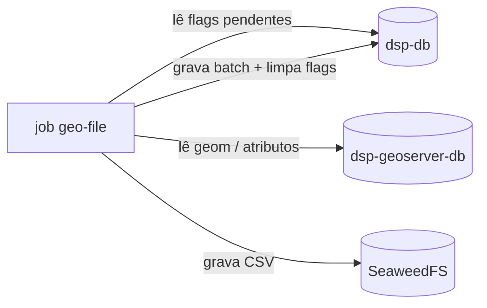

# rer-dsp-job-geo-file-generation — Visão geral

Job batch do [DSP](../../index.md) que **pré-gera arquivos de download territoriais** (níveis 2 e 3) e publica no **SeaweedFS** (API S3). O backend entrega esses bytes quando existem; senão usa WFS no GeoServer Download. Orquestração: [rer-dsp-core](../core.md) (profile `object-storage`). Na [demo local](../../guides/quick-start.md) este job costuma ficar desligado.

## Sumário

- [Papel no DSP](#papel-no-dsp)
- [Quando entra em cena](#quando-entra-em-cena)
- [Fluxo de uma execução](#fluxo-de-uma-execucao)
- [Coordenação com a migração](#coordenacao-com-a-migracao)
- [Objetos no bucket](#objetos-no-bucket)
- [Formatos e temas](#formatos-e-temas)
- [Limpeza de órfãos](#limpeza-de-orfaos)
- [Bancos e configuração](#bancos-e-configuracao)
- [Execução no core](#execucao-no-core)
- [Rodar sem o core](#rodar-sem-o-core)
- [Onde aprofundar](#onde-aprofundar)

---

## Papel no DSP

| Entrada | Saída |
|---------|--------|
| Flags em `dsp.territory_level_2` / `_3` | CSV (v1) no bucket S3 |
| Feições em `dsp-geoserver-db` (mesma base do WFS) | Metadados `generated-at` no objeto |
| `downloadThemesConfig.json` | Flags desligadas + `last_generated_s3_file_at` por território |

Reduz carga no GeoServer Download em consultas públicas de grande volume (ex.: escala [consulta CAR](https://consulta.car.gov.br/)).

---

## Quando entra em cena

| Cenário | Job geo-file |
|---------|----------------|
| Demo / quickstart sem JDBC | Normalmente **off** (downloads via WFS) |
| Adotante real | **On** com `DSP_OBJECT_STORAGE_ENDPOINT` e agenda do `./setup.sh` |

---

## Fluxo de uma execução



1. Lista territórios com `requires_s3_file_regeneration = true` (nível 2 antes do 3).
2. Para cada território, percorre temas habilitados em `downloadThemesConfig.json` e os `formats[]` de cada tema.
3. Exporta lendo **`dsp-geoserver-db`** (paridade com WFS).
4. Publica no bucket; user-metadata `generated-at` (ISO UTC) — o backend usa como `lastFileGenerated`.
5. Só desliga a flag e grava `last_generated_s3_file_at` quando **todos** os formatos habilitados do território foram publicados. Falha parcial mantém pendente para a próxima rodada.

Se o bucket não existir, o job registra erro, não publica e termina sem derrubar o processo — flags permanecem para a próxima tentativa.

---

## Coordenação com a migração

O geo-file **não** consulta `BATCH_JOB_EXECUTION_SYNC_STATE`.

| Etapa | Quem |
|-------|------|
| Delta na origem | [Job de migração](../job-data-migration/overview.md#watermark-incremental) (watermark) |
| Marcar territórios | Migração, ao terminar `COMPLETED`, na mesma janela temporal |
| Gerar arquivos | Este job, na agenda `DSP_GEO_FILE_GENERATION_CRON` |

Colunas no `dsp-db` (só níveis 2 e 3): `requires_s3_file_regeneration`, `last_generated_s3_file_at`. Detalhe: [Bancos de dados — Pendências](../../architecture/databases.md#pendencias-de-download-territorial).

---

## Objetos no bucket

| Nível | Chave S3 (padrão) |
|-------|-------------------|
| 2 | `{formato}/level-2/{slugNível2}_{codigoTema}.{ext}` |
| 3 | `{formato}/level-3/{slugNível2}_{slugNível3}_{codigoTema}.{ext}` |

Slug a partir de `name` (minúsculo, sem acento, hífens). Nível 3 inclui slug do pai (homônimos). API e flags usam `id` territorial.

O nome do arquivo que o cidadão baixa na UI **não** é a chave do objeto — o backend monta `{tema}_{nível2}.{ext}` na resposta HTTP.

---

## Formatos e temas

- **v1:** CSV no mesmo layout do WFS (`FID`, atributos na ordem da tabela, geometria em WKT).
- Novo formato: implementar `GeoFileExporter` e declarar em `formats[]` do tema — chaves e endpoints do backend permanecem.

Temas e códigos vêm de `downloadThemesConfig.json` (gerado pelo `./config.sh` a partir do adotante).

---

## Limpeza de órfãos

Ao final da execução, o job lista `{formato}/level-2/` e `{formato}/level-3/` no bucket e remove objetos que não correspondem a nenhum (território, tema, formato) válido — por exemplo após renomear um território.

---

## Bancos e configuração

| Datasource | Destino |
|------------|---------|
| `batch` | `dsp-db` · schema **`geo_file_generation`** (isolado da migração) |
| `target` | `dsp-db` · schema `dsp` (flags territoriais) |
| `geo-target` | `dsp-geoserver-db` · schema `dsp` |

Object storage (não é JDBC):

```yaml
dsp:
  object-storage:
    endpoint: http://dsp-object-storage:8333
    region: us-east-1
    bucket: dsp-geo-files
    access-key: ...
    secret-key: ...
    path-style-access: true
```

Arquivo de runtime: `config/Job-Geo-File-Generation/application/application.yaml` (gerado pelo `./config.sh` a partir de `environment.object_storage` no `adopter-config.yaml`). O bucket deve **existir** — o job não cria.

| Stack | Java 21, Spring Boot 3.4.2, Spring Batch, PostGIS, AWS SDK v2 (S3), Maven |

---

## Execução no core

| Variável / modo | Efeito |
|-----------------|--------|
| `DSP_OBJECT_STORAGE_ENDPOINT` | Liga profile `object-storage` (SeaweedFS + job) |
| `DSP_GEO_FILE_GENERATION_CRON` | Agenda no supercronic — definida no **`./setup.sh`**, não no wizard |
| `DSP_GEO_FILE_GENERATION_EXECUTION_MODE` | `continuous` (padrão) ou `once` |

Container `dsp-job-geo-file-generation`: sem porta HTTP; sobe junto com `dsp-object-storage` no adotante real.

---

## Rodar sem o core

```bash
./mvnw spring-boot:run
```

Exige `application.yaml` com os três datasources, bucket acessível e `dsp-geoserver-db` já populado pela migração. Uso típico: via `./setup.sh` do core.

---

## Onde aprofundar

| Tema | Página |
|------|--------|
| Fluxo download (backend / S3 / WFS) | [Fluxo de dados](../../architecture/data-flow.md) |
| Papéis de banco | [Bancos de dados](../../architecture/databases.md) |
| Migração e flags | [Job data-migration](../job-data-migration/overview.md) |
| Variáveis `.env` e Compose | [rer-dsp-core](../core.md) |
| API de downloads | [rer-dsp-backend](../backend.md) |
