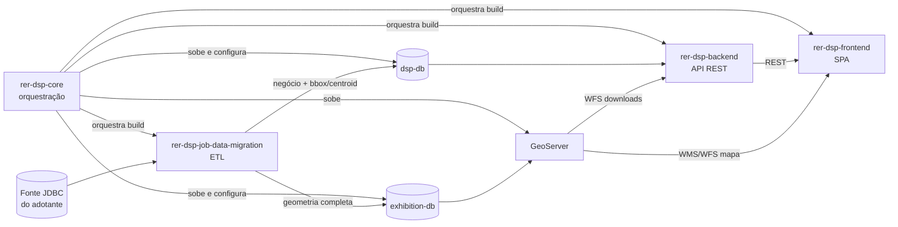

# Módulos do DSP

## Quais módulos existem e qual a responsabilidade de cada um?

O DSP é composto por 5 módulos, cada um em seu próprio repositório git.

| Módulo | Responsabilidade | Tecnologia principal | Referência | Repositório |
|--------|-------------------|-----------------------|------------|--------------|
| **rer-dsp-core** | Orquestração Docker Compose: bancos, GeoServer, scripts de config/setup/start | Docker Compose | [modules/core.md](modules/core.md) | rer-dsp-core |
| **rer-dsp-backend** | API REST — dados de negócio, territórios, downloads, mapas | Java 21 + Spring Boot 3.4.2 + PostGIS | [modules/backend.md](modules/backend.md) | rer-dsp-backend |
| **rer-dsp-frontend** | Interface web — busca, KPIs, mapa interativo | Vue 3 + Vite + TypeScript | [modules/frontend.md](modules/frontend.md) | rer-dsp-frontend |
| **rer-dsp-job-data-migration** | ETL geoespacial — sincroniza fonte do adotante com os bancos do DSP | Java 21 + Spring Batch | [modules/job-data-migration/overview.md](modules/job-data-migration/overview.md) | rer-dsp-job-data-migration |
| **rer-dsp-docs** (este repositório) | Documentação central do ecossistema | Zensical | — | rer-dsp-docs |

## Como os módulos se conectam

## Preciso executar todos os módulos?

Não necessariamente — depende do que você quer entregar. O `rer-dsp-core` é o denominador comum: mesmo em usos parciais, ele normalmente fornece os bancos e o schema que os outros módulos esperam.

## Posso utilizar apenas alguns módulos?

## Posso utilizar apenas alguns módulos?

**Sim, mas essa não é a forma recomendada e pensada de implantação.**

A arquitetura do DSP foi projetada para que módulos funcionem em conjunto. Utilizar apenas parte da stack significa abrir mão de componentes importantes e assumir a responsabilidade por integrações, configurações e manutenção que normalmente só foram pensadas na solução completa.

> **⚠️ Atenção:** utilize apenas um subconjunto dos módulos **somente se você compreender profundamente a arquitetura do DSP** e souber exatamente quais funcionalidades está descartando. Caso contrário, a implantação poderá apresentar comportamentos inesperados, funcionalidades indisponíveis e um processo de manutenção significativamente mais complexo.

| Cenário | Módulos necessários | Riscos e limitações |
|---------|----------------------|---------------------|
| Só publicar mapas (WMS) | core (bancos + GeoServer) + job-data-migration | Não haverá API REST nem interface web para gerenciamento e consulta. |
| Só expor a API REST | core (bancos) + backend | Sem GeoServer, recursos como WMS/WFS e publicação de mapas não estarão disponíveis. |
| Aplicação própria consumindo dados | core + job-data-migration + backend | Você será responsável por desenvolver e manter toda a interface da aplicação e suas integrações. |
| Stack completa (recomendado) | Todos os 5 módulos | Arquitetura oficialmente suportada e documentada em [Começando rápido](getting-started.md). |

**Salvo se houver uma necessidade técnica muito específica, utilize sempre a stack completa.** Ela representa o ambiente de referência do projeto, recebe maior cobertura de testes e possui toda a documentação e os exemplos de implantação voltados para esse cenário.
Veja o passo a passo prático em [Integrar apenas um módulo](guides/single-module-integration.md).

## Acoplamentos reais entre módulos

Seja honesto sobre estes pontos antes de decidir rodar módulos isoladamente:

- **backend depende do core** para o schema `dsp` no Postgres e para os arquivos externos `installationConfig.json` e `mapLayersConfig.json`, normalmente gerados pelo `./config.sh` do core.
- **frontend depende do backend** — precisa de uma URL de API válida (`VITE_DSP_API_URL` ou `public/config/env.json`); sem backend rodando, a maior parte da UI não funciona.
- **job-data-migration depende do core** para o schema dos bancos `dsp-db`, `exhibition-db` e `batch`, e depende de uma fonte JDBC externa (do adotante) que o core não fornece.
- **core não tem dependência de runtime** sobre os outros três — ele só precisa deles no momento do build/orquestração Docker (paths configurados via `DSP_BACKEND_PATH`, `DSP_FRONTEND_PATH`, `DSP_JOB_MIGRATION_PATH`).

## Quais tecnologias são utilizadas?

| Camada | Tecnologia                                                                                                          |
|--------|---------------------------------------------------------------------------------------------------------------------|
| Orquestração | Docker 24+, Docker Compose v2, Python 3                                                                             |
| Backend | Java 21, Spring Boot 3.4.2, Gradle, JPA/Hibernate + hibernate-spatial, springdoc-openapi                            |
| Frontend | Vue 3 (Composition API), TypeScript, Vite, Tailwind CSS, [`@rural-environmental-registry/map_component`](https://www.npmjs.com/package/@rural-environmental-registry/map_component) (Leaflet) |
| ETL | Java 21, Spring Boot 3.4.2, Spring Batch, Maven                                                                     |
| Bancos | PostgreSQL + PostGIS                                                                                                |
| Publicação de mapas | GeoServer 3.0.0                                                                                                     |
