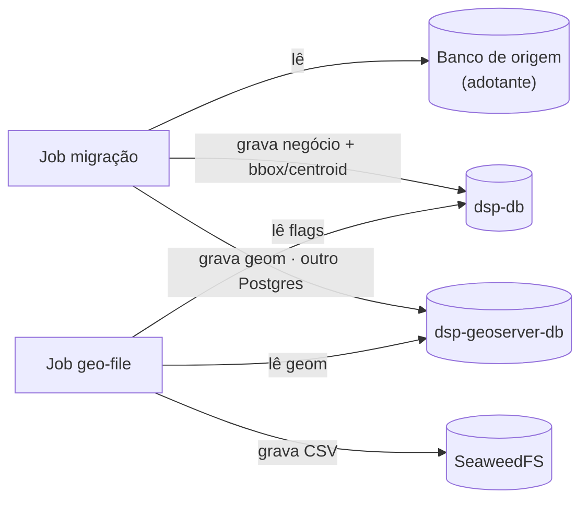
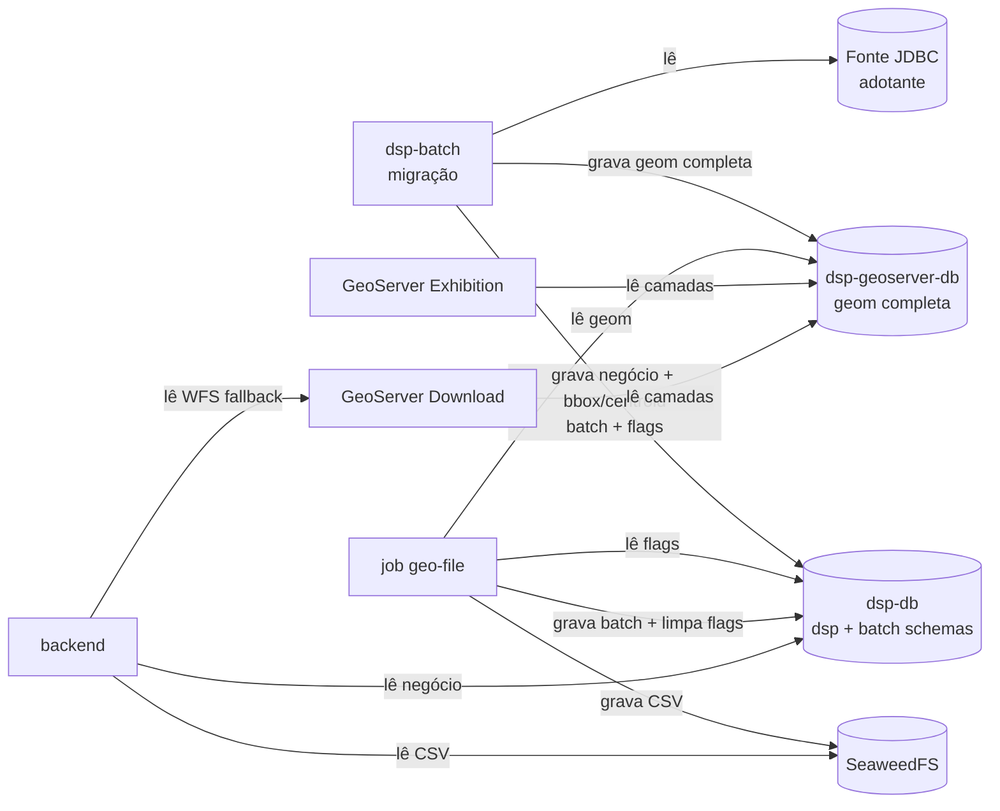
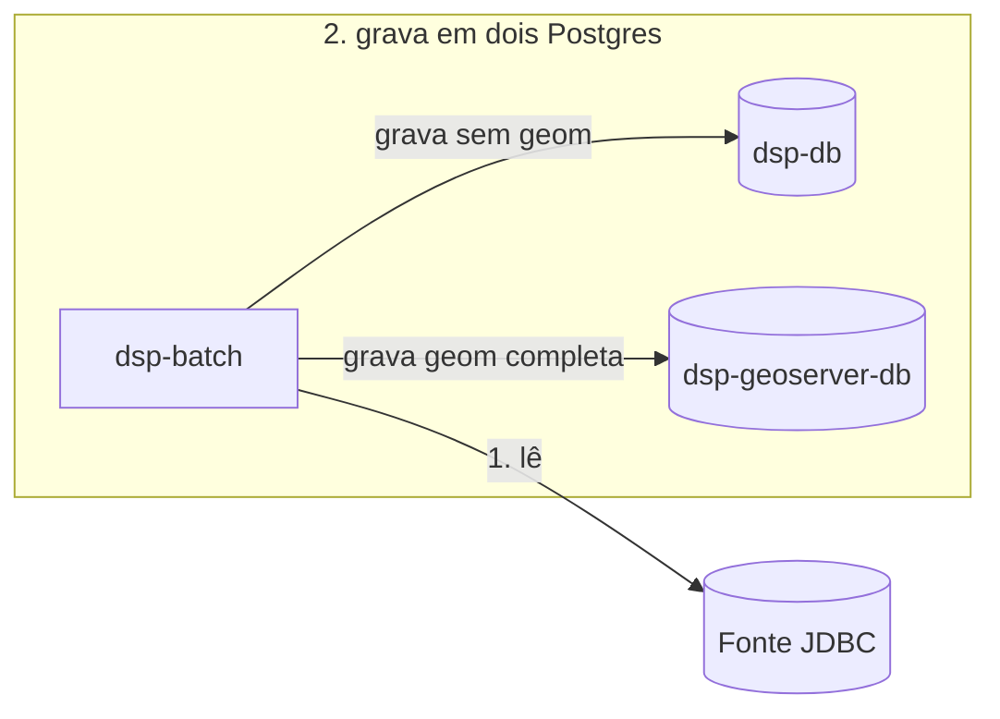

# Bancos de dados

Contrato de **onde** os dados ficam no DSP — da fonte do adotante até os arquivos de download. O passo a passo entre componentes está em [Fluxo de dados](data-flow.md); visão de camadas em [Arquitetura](overview.md).

## Sumário

- [Todos os bancos e repositórios](#todos-os-bancos-e-repositorios)
- [Detalhe dos Postgres do Compose](#detalhe-dos-postgres-do-compose)
- [Diagrama](#diagrama)
- [Papéis de conexão](#papeis-de-conexao)
- [Schema `dsp` — negócio e geo leve](#schema-dsp-negocio-e-geo-leve)
- [Schemas batch no `dsp-db`](#schemas-batch-no-dsp-db)
- [Pendências de download territorial](#pendencias-de-download-territorial)
- [Quem lê e quem escreve](#quem-le-e-quem-escreve)
- [Dual-write da migração](#dual-write-da-migracao)
- [SRID via YAML](#srid-via-yaml)
- [Prefixos Spring (jobs)](#prefixos-spring-jobs)

---

## Todos os bancos e repositórios

No fluxo completo do DSP (adotante real com fonte JDBC) entram **quatro** destinos de dados distintos, mais a origem:

| Repositório | Onde fica | Tecnologia | Papel |
|-------------|-----------|------------|--------|
| **Banco de origem** | Infraestrutura do adotante (fora do Compose) | PostgreSQL/PostGIS ou outro banco acessível por JDBC | Dados geoespaciais da organização que você quer compartilhar na plataforma — **somente leitura** pelo job de migração |
| **`dsp-db`** | Container `dsp-db` no Compose | PostgreSQL + PostGIS | Dados operacionais da plataforma (API, busca, KPIs), representações geo leves (bbox/centroide), flags de download territorial e schemas batch dos jobs |
| **`dsp-geoserver-db`** | Container **`dsp-geoserver-db`** no Compose (**outro** Postgres, não é o `dsp-db`) | PostgreSQL + PostGIS | Mesmas entidades lógicas, mas com **`geom` completa** — só a migração (ETL) e leitores geo (GeoServers, geo-file) usam este banco para polígonos inteiros |
| **Object storage** | Container `dsp-object-storage` no Compose (profile `object-storage`) | SeaweedFS (API compatível com S3) | Arquivos CSV de download **pré-gerados** por território; o backend lê daqui quando existem, em vez de montar tudo via WFS a cada pedido |

Cada execução da migração faz **dual-write**: um destino operacional (`dsp-db`, sem polígono completo) e **outro banco** (`dsp-geoserver-db`) só para a geometria integral.

Na **demo local** ([Começando rápido](../guides/quick-start.md)) não há banco de origem externo: o `setup.sh` aplica um seed sintético direto nos dois Postgres. Object storage e job geo-file costumam ficar desligados; downloads pequenos podem usar só o GeoServer Download.

---

## Detalhe dos Postgres do Compose

Os dois bancos SQL são **instâncias Postgres separadas** no Compose. Repetem as mesmas tabelas lógicas no schema `dsp`, mas a migração **não** grava `geom` no `dsp-db` — a geometria completa vai **somente** para o `dsp-geoserver-db` (detalhe na [seção seguinte](#schema-dsp-negocio-e-geo-leve)).

| Serviço Compose | Papel resumido |
|-----------------|----------------|
| **`dsp-db`** | Tudo que a API e os jobs batch precisam sem polígono completo |
| **`dsp-geoserver-db`** | Tudo que o mapa e a exportação geo pesada precisam com `geom` integral |

Dentro do **`dsp-db`** há **três schemas**:

| Schema | Conteúdo |
|--------|----------|
| `dsp` | Negócio: `territory_level_*`, `area_of_interest`, camadas genéricas, etc. |
| `data_migration` | Spring Batch da migração + **watermark** (`BATCH_*`, `BATCH_JOB_EXECUTION_SYNC_STATE`) |
| `geo_file_generation` | Spring Batch do geo-file (`BATCH_*` — **sem** watermark) |

Cada job batch usa **um schema próprio** no mesmo Postgres para não misturar histórico de execução.

---

## Diagrama

As setas seguem **quem faz a operação**: `lê` e `grava` saem do componente (job, backend, GeoServer) e apontam para o banco ou repositório.

---

## Papéis de conexão

São **papéis de datasource**, não bancos extras. O job de migração abre **quatro** conexões Java: `source`, `target`, `geo-target` e `batch` (este último no mesmo host que `target`, schema `data_migration`).

| Papel | Serviço / schema | Uso |
|-------|------------------|-----|
| **source** | JDBC externo | Origem — somente leitura |
| **target** | `dsp-db` · schema `dsp` | Escrita de negócio + bbox/centroid; leitura do backend |
| **geo-target** | `dsp-geoserver-db` · schema `dsp` | Escrita/leitura de `geom` completa; GeoServers e geo-file |
| **batch** (migração) | `dsp-db` · `data_migration` | Execução Spring Batch + watermark |
| **batch** (geo-file) | `dsp-db` · `geo_file_generation` | Execução Spring Batch do geo-file |

O job geo-file também usa **target** (flags territoriais) e **geo-target** (exportação), com batch em `geo_file_generation`.

Object storage (SeaweedFS) não é Postgres: o backend e o geo-file acessam via API S3 quando o profile `object-storage` está ativo.

---

## Schema `dsp` — negócio e geo leve

As mesmas tabelas lógicas existem nos **dois** Postgres (`territory_level_1`, `territory_level_2`, `territory_level_3`, `area_of_interest` e camadas configuradas). IDs territoriais são `VARCHAR(64)`; AOI/camadas usam `VARCHAR(255)` no `id`.

| Coluna | Tipo PostGIS | `dsp-db` | `dsp-geoserver-db` |
|--------|--------------|----------|---------------------|
| Atributos (`id`, `name`, FKs, …) | — | sim | sim |
| `created_at` / `updated_at` | `timestamptz` | sim | sim |
| `geom` | `geometry` | **não** | **sim** |
| `boundary_box` | `geometry(Polygon)` | **sim** | **não** |
| `centroid_coordinates` | `geometry(Point)` | **sim** | **não** |

O job deriva `boundary_box` e `centroid_coordinates` na origem e grava só no `dsp-db`. A geometria integral vai para `geom` no geoserver-db.

`created_at` no destino é obrigatório (base do watermark). `updated_at` é preenchido quando o YAML declara `updated-at-column`.

Por que não guardar o polígono inteiro no `dsp-db`? Ver o aviso em [Arquitetura — Fluxo de dados](overview.md#fluxo-de-dados).

---

## Schemas batch no `dsp-db`

| Schema | Job | O que persiste |
|--------|-----|----------------|
| `data_migration` | `rer-dsp-job-data-migration` | Histórico `BATCH_*` e watermark em `BATCH_JOB_EXECUTION_SYNC_STATE` (avança só após `COMPLETED`) |
| `geo_file_generation` | `rer-dsp-job-geo-file-generation` | Histórico `BATCH_*` das rodadas de pré-geração |

SQL de init desses schemas vem do `rer-dsp-core` (imagens `dsp-db` e jobs). Detalhe operacional: [rer-dsp-core](../modules/core.md).

---

## Pendências de download territorial

Colunas só em `territory_level_2` e `territory_level_3` no **`dsp-db`**:

| Coluna | Função |
|--------|--------|
| `requires_s3_file_regeneration` | `true` = geo-file deve gerar de novo os arquivos desse território |
| `last_generated_s3_file_at` | Última vez em que todos os formatos habilitados foram publicados no bucket |

Fluxo resumido:

1. A migração processa o delta definido pelo **watermark** (criação/atualização desde o último sucesso).
2. Se a execução termina **`COMPLETED`**, marca territórios afetados na mesma janela temporal (`requires_s3_file_regeneration = true`). Na primeira carga, marca o conjunto territorial relevante.
3. O geo-file, na agenda configurada no setup, processa só pendências, publica no SeaweedFS e desliga a flag por território quando termina todos os formatos.

Se a migração **falha**, as flags **não** mudam. Mais contexto: [rer-dsp-job-geo-file-generation](../modules/job-geo-file-generation/overview.md).

---

## Quem lê e quem escreve

| Componente | Fonte JDBC | `dsp-db` | `dsp-geoserver-db` | Outros |
|------------|------------|----------|---------------------|--------|
| Job migração | leitura | escrita `dsp` + `data_migration` | escrita `geom` | — |
| Job geo-file | — | **lê** flags · **grava** `geo_file_generation` e atualiza flags | **lê** `geom` | **grava** CSV no SeaweedFS |
| Backend | — | **lê** / **grava** negócio (`dsp`) | — | **lê** S3 · **lê** WFS no Download (via API) |
| GeoServer Exhibition | — | — | **lê** camadas (WMS/WFS) | — |
| GeoServer Download | — | — | **lê** camadas (WFS) | — |
| Core | — | init SQL | init SQL | sobe SeaweedFS no profile `object-storage` |

Os dois GeoServers usam **apenas** `dsp-geoserver-db` (processos separados, mesmo dataset).

---

## Dual-write da migração

Cada execução com delta faz **uma leitura na origem** e **duas escritas em bancos diferentes** (camadas genéricas podem gravar só no geo-target):

1. Lê atributos + geometria na fonte JDBC (watermark + `where-clause`).
2. UPSERT no **`dsp-db`**: atributos + `boundary_box` + `centroid_coordinates` — **sem** coluna `geom`.
3. UPSERT no **`dsp-geoserver-db`** (outro Postgres): mesmos atributos + **`geom` completa**.

Watermark incremental: [Visão geral do job](../modules/job-data-migration/overview.md#so-o-que-mudou-desde-a-ultima-vez).

---

## SRID via YAML

O SRID não é fixo no código. No DDL de unidades administrativas do core, `geom` pode ir sem typmod; AOI/camadas geradas automaticamente podem incluir SRID no `CREATE TABLE`.

| Etapa | Comportamento |
|-------|----------------|
| YAML | Cada bloco declara `srid` (ex.: `4674`, `4326`) |
| Leitura | `ST_Transform` para o SRID do bloco antes do GeoJSON |
| Escrita | `ST_SetSRID(ST_Force2D(ST_GeomFromGeoJSON(?)), srid)` |

Camadas distintas podem usar SRIDs diferentes se origem e YAML estiverem alinhados.

---

## Prefixos Spring (jobs)

| Papel | Propriedade | Destino típico no core |
|-------|-------------|-------------------------|
| source | `spring.datasource.source` | JDBC do adotante (variáveis `DSP_SOURCE_*` no `.env`) |
| target | `spring.datasource.target` | `dsp-db`, schema `dsp` |
| geo-target | `spring.datasource.geo-target` | `dsp-geoserver-db`, schema `dsp` |
| batch (migração) | `spring.datasource.batch` | `dsp-db`, `currentSchema=data_migration` |
| batch (geo-file) | `spring.datasource.batch` | `dsp-db`, `currentSchema=geo_file_generation` |

Visão do job de migração: [Visão geral](../modules/job-data-migration/overview.md). Checagens após carga: [Validação pós-migração](../modules/job-data-migration/post-migration-validation.md).
