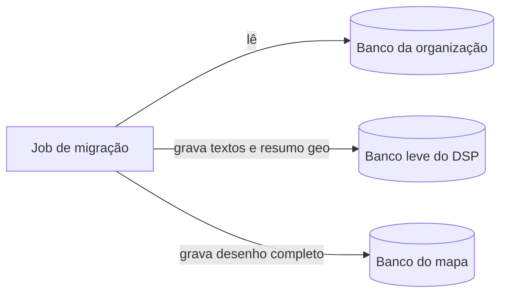
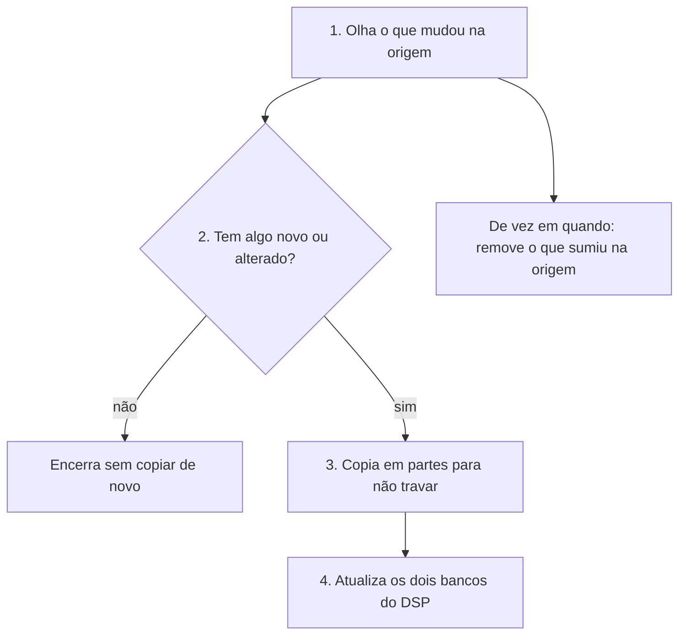
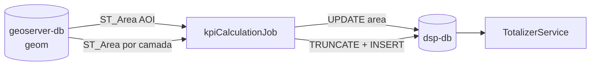

# dsp-job-data-migration — Visão geral

Job que **copia os dados geográficos do banco da sua organização** para dentro do DSP, de forma automática e repetível. Orquestração pelo [dsp-core](../core.md) (`./setup.sh`). Detalhe dos bancos: [Bancos de dados](../../architecture/databases.md).

## Sumário

- [Como funciona](#como-funciona)
- [O que é copiado](#o-que-e-copiado)
- [Fluxo em uma imagem](#fluxo-em-uma-imagem)
- [Ordem da cópia](#ordem-da-copia)
- [Cálculo de KPIs](#calculo-de-kpis)
- [Só o que mudou desde a última vez](#so-o-que-mudou-desde-a-ultima-vez)
- [O que acontece em cada execução](#o-que-acontece-em-cada-execucao)
- [Mapa e downloads](#mapa-e-downloads)
- [Quando o job roda no dia a dia](#quando-o-job-roda-no-dia-a-dia)
- [Detalhe técnico (referência rápida)](#detalhe-tecnico-referencia-rapida)
- [Onde aprofundar](#onde-aprofundar)

---

## Como funciona

Imagine que o **banco da organização** é a pasta de trabalho onde os cadastros são atualizados, e o **DSP** precisa de uma **cópia própria** para o site público funcionar rápido e sem expor esse banco direto na internet.

O job de migração faz quatro coisas principais:

1. **Lê** o banco de origem (somente leitura — não altera nada lá).
2. **Grava em dois lugares dentro do DSP:**
   - Um banco **leve**, usado pela API e pelas telas (nomes, datas, um retângulo e um ponto no mapa por registro — não o polígono inteiro).
   - Outro banco **com o desenho completo** dos imóveis e territórios, usado para exibir o mapa e exportações pesadas.
3. **Na próxima execução, não copia tudo de novo** — só registros **novos ou alterados** desde a última cópia bem-sucedida (isso é o *watermark*, um “marca-página” guardado pelo próprio job).
4. **Depois da cópia, calcula os KPIs da Home.** O `kpiCalculationJob` lê as geometrias no banco do mapa, grava a área de cada imóvel em `dsp.area_of_interest.area` e os indicadores por tema em `dsp.kpi_measure` — só no banco leve. Essa área **não** vem da origem.

Se um registro **sumiu** na origem, o job também pode **remover** a cópia no DSP (varredura periódica de “órfãos”).

Ele **não** é o programa que publica as camadas no mapa do site: isso o `./setup.sh` faz depois que os dados já estão nos bancos. Ele também **não** gera os arquivos grandes de download no armazenamento S3 — só **avisa** quais regiões precisam disso; o [job geo-file](../job-geo-file-generation/overview.md) gera os arquivos.

---

## O que é copiado

| Tipo de dado | Exemplo no CAR | Observação |
|--------------|----------------|------------|
| Três níveis de território | Estado → município → … | Hierarquia configurável no `./config.sh` |
| Área de interesse | Imóvel rural / polígono declarado | O que o cidadão busca no mapa |
| Camadas extras (opcional) | Outras tabelas com mapa | Só vão para o banco do mapa — [guia](generic-layers.md) |
| KPIs da Home | Área do imóvel e temas (0–4) | Calculados depois da cópia, só no `dsp-db` — [detalhe](#calculo-de-kpis) |

Os nomes “nível 1, 2, 3” são genéricos: o que cada nível significa depende das tabelas que você configurou, não de um padrão fixo no código.

---

## Fluxo em uma imagem



No Compose, os bancos se chamam `dsp-db` (leve) e `dsp-geoserver-db` (mapa).

---

## Ordem da cópia

A cópia segue a **hierarquia**, como montar um quebra-cabeça de dentro para fora:

```text
nível 1 → nível 2 → nível 3 → imóveis (área de interesse) → camadas extras (se houver) → cálculo de KPIs
```

O pai precisa existir antes do filho (por exemplo, município antes do imóvel dentro dele). KPIs de tema dependem das geometrias das camadas no banco do mapa. O `kpiCalculationJob` roda por último (`@Order(3)`).

---

## Só o que mudou desde a última vez

Na **primeira carga**, entram os registros que têm data de criação preenchida na origem (conforme configurado no `./config.sh`).

Nas **cargas seguintes**, o job compara com a data/hora da **última execução concluída com sucesso**:

- Copia o que foi **criado** depois dessa marca.
- Se a origem tem coluna de **atualização**, copia também o que foi **alterado** depois dessa marca.

Se **nada mudou**, a execução termina rápido (“não havia trabalho”). A marca só avança quando o job termina **sem erro** — assim o DSP não “pula” dados se algo falhou no meio.

Fuso horário das datas na origem: em geral `America/Sao_Paulo`, salvo configuração diferente no YAML.

---

## O que acontece em cada execução

Em termos simples, o job repete sempre o mesmo roteiro:



Tecnicamente isso é detecção por watermark, decisão de pular ou processar, leitura em partes e gravação com “atualiza se já existir, senão insere” (*UPSERT*).

---

## Mapa e downloads

| Etapa | Quem faz |
|-------|----------|
| Dados nos bancos | Job de migração |
| Camadas visíveis no GeoServer / mapa | `./setup.sh` (ou publicação automática após primeira carga agendada) |
| Arquivos CSV prontos no S3 | [Job geo-file](../job-geo-file-generation/overview.md), em horário definido no setup |

Quando uma migração **termina bem**, o job **marca** quais estados/municípios (níveis 2 e 3) precisam de **novo arquivo de download**. Se a migração **falha**, essas marcas **não mudam** — evita publicar download com dados incompletos.

---

## Quando o job roda no dia a dia

Quem define isso é o **`./setup.sh`**, não o wizard do `./config.sh`:

| Escolha no setup | Efeito prático |
|------------------|----------------|
| Carga única agora, sem repetir | Copia uma vez no setup e o container do job desliga |
| Carga única em data/hora | Espera e copia uma vez; pode publicar o mapa depois |
| Sincronização periódica | Copia no setup (ou na data agendada) e **volta a copiar** de tempos em tempos (cron no `.env`) |

Cada “volta” do job é um processo que **sobe, trabalha e desliga**; no modo contínuo, um agendador dentro do container dispara essas voltas.

---

## Detalhe técnico (referência rápida)

| Tópico | Referência |
|--------|------------|
| Artefato | Maven `dsp-batch`, Java 21, Spring Batch |
| Conexões | `source`, `target` (`dsp-db`), `geo-target` (`dsp-geoserver-db`), `batch` (schema `data_migration`) |
| Motor incremental | `WatermarkChangeDetectionEngine` · tabela `BATCH_JOB_EXECUTION_SYNC_STATE` |
| Modos no `.env` | `DSP_MIGRATION_EXECUTION_MODE`: `once`, `scheduled-once`, `continuous` |
| Flags de download | `requires_s3_file_regeneration` em `territory_level_2` / `_3` |
| Cálculo de KPIs | `kpiCalculationJob` · flag `execution-jobs.kpi-job` · [detalhe](#calculo-de-kpis) |

Rodar o JAR isolado (sem core): Java 21, `./mvnw`, quatro bancos acessíveis e `application.yaml` gerado pelo `./config.sh` (repositório `dsp-core`).

!!! tip "Publicação de camadas"
    O nome da camada no YAML do job deve bater com `mapLayersConfig.json`. **Run now** publica ao fim do setup; **Schedule for later** publica após a primeira migração agendada.

---

## Cálculo de KPIs

O `kpiCalculationJob` (`@Order(3)`) roda **depois** da migração de AOI e camadas. Lê geometrias do **geo-target**, grava resultados no **dsp-db** e não altera o geo-target. A coluna `area` existe no DDL da AOI no `dsp-db`, mas **não é migrada** da fonte: não há `area_column` nem `total-area-column` no contrato. O job de migração grava bbox, centroide e atributos; o KPI job calcula `ST_Area(geom::geography)` no geo-target e atualiza `dsp.area_of_interest.area`. A unidade exibida vem de `kpis.area-unit-of-measurement` (wizard, etapa 5).



### Pré-requisitos

- Job de AOI concluído com `geom` válida em `dsp.area_of_interest` no geo-target.
- Para cada tema em `kpis.themes[]`, a camada correspondente já migrada no geo-target (`dsp.<layer_name>`).
- `kpis.theme-count` igual ao número de entradas em `kpis.themes[]` com `layer-name` preenchido.

### O que o job grava

| Destino | Tabela/coluna | Comportamento |
|---------|---------------|---------------|
| `dsp-db` | `dsp.area_of_interest.area` | `UPDATE` por `id`: `ST_Area(geom::geography)` no geo-target, convertido para `area-unit-of-measurement` |
| `dsp-db` | `dsp.kpi_measure` | `TRUNCATE` + `INSERT` por execução: uma linha por AOI e por `kpi_name` |

Com `theme-count: 0`, o job ainda atualiza `area` na AOI e deixa `kpi_measure` vazio (após truncate).

### Schema `dsp.kpi_measure`

Criado no `dsp-db` se ainda não existir. Não existe no geo-target.

| Coluna | Tipo | Observação |
|--------|------|------------|
| `id` | `bigserial` | PK |
| `area_of_interest_id` | `varchar(255)` | FK para `dsp.area_of_interest(id)`, **sem** `ON DELETE CASCADE` |
| `value` | `numeric(18,3)` | Soma das áreas das feições da camada na AOI, na unidade do tema |
| `kpi_name` | `varchar(255)` | Nome da layer (`layer-name` do YAML / `card.layer` na instalação) |

Constraint `UNIQUE (area_of_interest_id, kpi_name)`.

Para cada tema, o job agrupa feições da camada por `area_of_interest_id` no geo-target e soma `ST_Area(geom::geography)` antes da conversão de unidade. KPIs de tema **não** são colunas da AOI (`theme_1`…`theme_4` / `business-only-persist-columns` não fazem esse papel).

### Contrato com a instalação

Três artefatos devem estar alinhados:

- `adopter-config.yaml`: `installation.kpis.theme_count`, `theme_1`…`theme_4.layer`, `area_of_interest.optional_label`
- `application.yaml`: bloco `kpis` + `execution-jobs.kpi-job: true` (gerado pelo `./config.sh`)
- `installation-config.json`: cards `AREA_OF_INTEREST` + `THEME_*` com campo `layer` nos temas

O `./config.sh` habilita sempre L1, L2, L3, área de interesse e `kpi-job`. Fora do core, habilite `execution-jobs.kpi-job` e configure o bloco `kpis` se a Home tiver cards de tema. O backend agrega os valores em `POST /totalizer/` — ver [dsp-backend](../backend.md#totalizerservice-post-totalizer).

### Bloco `kpis` no `application.yaml`

Gerado pelo `./config.sh` a partir de `installation.kpis` no `adopter-config.yaml`. Exemplo com dois temas:

```yaml
kpis:
  theme-count: 2
  area-unit-of-measurement: ha
  themes:
    - slot: 1
      layer-name: rivers
      unit-of-measurement: ha
    - slot: 2
      layer-name: conservation-units
      unit-of-measurement: m²
```

| Propriedade | Obrigatória | Descrição |
|-------------|-------------|-----------|
| `theme-count` | sim | Quantidade de KPIs de tema (0–4; no wizard, no máximo o número de camadas em `etl.layers[]`) |
| `area-unit-of-measurement` | não (padrão `m²`) | Unidade da área da AOI após conversão de m² |
| `themes[]` | sim se `theme-count` > 0 | Um item por tema habilitado |
| `themes[].layer-name` | sim | Nome da camada no geo-target (`dsp.<nome>`) — deve bater com `layer-name` da migração e com `card.layer` no `installation-config.json` |
| `themes[].unit-of-measurement` | sim | Unidade do KPI de tema após conversão de m² |

```yaml
execution-jobs:
  kpi-job: true
```

A ordem obrigatória no `application.yaml` é **L1 → L2 → L3 → area-of-interest → camadas → kpi-job**. O KPI job não participa do dual-write: é um tasklet que lê o geo-target e atualiza `area` + `kpi_measure` no `dsp-db` após os jobs `@Order(1)` e `@Order(2)`.

---

## Onde aprofundar

| Tema | Página |
|------|--------|
| Bancos e dual-write | [Bancos de dados](../../architecture/databases.md) |
| Camadas genéricas | [Migração de camadas genéricas](generic-layers.md) |
| Wizard e `application.yaml` | [dsp-core](../core.md) · `dsp-job-data-migration/config/application/` |
| Checklist pós-carga | [Validação pós-migração](post-migration-validation.md) |
| Pré-geração de CSV | [dsp-job-geo-file-generation](../job-geo-file-generation/overview.md) |
| Fluxo entre componentes | [Fluxo de dados](../../architecture/data-flow.md) |
